<!-- Bản tiện dụng ở thư mục gốc. Nguồn sinh là design/design.md; không sửa trực tiếp. -->
# Thiết kế UI/UX Twight Light

> **Trạng thái:** ĐÃ KHÓA ĐỂ TRIỂN KHAI FRONTEND  
> **Tệp:** `design.md`  
> **Ngày sinh:** 2026-09-07  
> **Phiên bản thiết kế:** 1.2 Final  
> **Nguồn nghiệp vụ:** Thiết kế hệ thống chi tiết v3.0  
> **Ngôn ngữ giao diện:** Tiếng Việt  
> **Gallery:** `design/review/FINAL_REVIEW_GALLERY_STANDALONE.html`

## Cách sử dụng tài liệu

- Tài liệu hệ thống/OpenAPI/AsyncAPI là nguồn chuẩn cho API, dữ liệu, quyền và sự kiện.
- Tài liệu này là nguồn chuẩn cho kiến trúc thông tin, luồng, màn hình, component, trạng thái, responsive và accessibility.
- Không suy ra endpoint hoặc quyền mới chỉ từ mockup.
- Khi hợp đồng và UI mâu thuẫn, dừng triển khai và tạo yêu cầu làm rõ hoặc ADR.
- PNG dùng để duyệt; SVG trong `design/assets/editable/` là nguồn hình có thể chỉnh sửa.

## Tóm tắt duyệt

| Trạng thái | Số màn hình |
|---|---:|
| Đã duyệt | 47 |
| Bản nháp | 0 |
| Cần chỉnh sửa | 0 |
| Hoãn | 0 |

## Danh mục màn hình

| Mã | Nhóm | Màn hình | Route | Ưu tiên | Trạng thái | Đặc tả |
|---|---|---|---|---|---|---|
| AUTH-01 | Xác thực | Chào mừng | `/` | P0 | Đã duyệt | [`design/screens/auth/auth-01-chao-mung.md`](design/screens/auth/auth-01-chao-mung.md) |
| AUTH-02 | Xác thực | Đăng nhập | `/dang-nhap` | P0 | Đã duyệt | [`design/screens/auth/auth-02-dang-nhap.md`](design/screens/auth/auth-02-dang-nhap.md) |
| AUTH-03 | Xác thực | Đăng ký | `/dang-ky` | P0 | Đã duyệt | [`design/screens/auth/auth-03-dang-ky.md`](design/screens/auth/auth-03-dang-ky.md) |
| AUTH-04 | Xác thực | Quên mật khẩu | `/quen-mat-khau` | P1 | Đã duyệt | [`design/screens/auth/auth-04-quen-mat-khau.md`](design/screens/auth/auth-04-quen-mat-khau.md) |
| AUTH-05 | Xác thực | Đặt lại mật khẩu | `/dat-lai-mat-khau` | P1 | Đã duyệt | [`design/screens/auth/auth-05-dat-lai-mat-khau.md`](design/screens/auth/auth-05-dat-lai-mat-khau.md) |
| FEED-01 | Bảng tin | Bảng tin | `/bang-tin` | P0 | Đã duyệt | [`design/screens/feed/feed-01-bang-tin.md`](design/screens/feed/feed-01-bang-tin.md) |
| FEED-02 | Bảng tin | Tạo bài viết | `/bai-viet/moi` | P0 | Đã duyệt | [`design/screens/feed/feed-02-tao-bai-viet.md`](design/screens/feed/feed-02-tao-bai-viet.md) |
| FEED-03 | Bảng tin | Chi tiết bài viết | `/bai-viet/:id` | P0 | Đã duyệt | [`design/screens/feed/feed-03-chi-tiet-bai-viet.md`](design/screens/feed/feed-03-chi-tiet-bai-viet.md) |
| FEED-04 | Bảng tin | Sửa bài viết | `/bai-viet/:id/sua` | P0 | Đã duyệt | [`design/screens/feed/feed-04-sua-bai-viet.md`](design/screens/feed/feed-04-sua-bai-viet.md) |
| FEED-05 | Bảng tin | Bài viết video đang xử lý | `/bai-viet/:id/xu-ly` | P1 | Đã duyệt | [`design/screens/feed/feed-05-bai-viet-video.md`](design/screens/feed/feed-05-bai-viet-video.md) |
| PROF-01 | Hồ sơ | Hồ sơ của tôi | `/toi` | P0 | Đã duyệt | [`design/screens/profile/prof-01-ho-so-cua-toi.md`](design/screens/profile/prof-01-ho-so-cua-toi.md) |
| PROF-02 | Hồ sơ | Hồ sơ người dùng | `/nguoi-dung/:id` | P0 | Đã duyệt | [`design/screens/profile/prof-02-ho-so-nguoi-khac.md`](design/screens/profile/prof-02-ho-so-nguoi-khac.md) |
| PROF-03 | Hồ sơ | Chỉnh sửa hồ sơ | `/toi/chinh-sua` | P1 | Đã duyệt | [`design/screens/profile/prof-03-chinh-sua-ho-so.md`](design/screens/profile/prof-03-chinh-sua-ho-so.md) |
| PROF-04 | Hồ sơ | Người theo dõi và đang theo dõi | `/nguoi-dung/:id/ket-noi` | P0 | Đã duyệt | [`design/screens/profile/prof-04-quan-he-xa-hoi.md`](design/screens/profile/prof-04-quan-he-xa-hoi.md) |
| SET-01 | Thiết lập | Quyền riêng tư | `/thiet-lap/quyen-rieng-tu` | P0 | Đã duyệt | [`design/screens/settings/set-01-quyen-rieng-tu.md`](design/screens/settings/set-01-quyen-rieng-tu.md) |
| SET-02 | Thiết lập | Bảo mật tài khoản | `/thiet-lap/bao-mat` | P0 | Đã duyệt | [`design/screens/settings/set-02-bao-mat-tai-khoan.md`](design/screens/settings/set-02-bao-mat-tai-khoan.md) |
| SET-03 | Thiết lập | Tài khoản đã chặn | `/thiet-lap/da-chan` | P0 | Đã duyệt | [`design/screens/settings/set-03-tai-khoan-bi-chan.md`](design/screens/settings/set-03-tai-khoan-bi-chan.md) |
| SET-04 | Thiết lập | Xóa tài khoản | `/thiet-lap/xoa-tai-khoan` | P1 | Đã duyệt | [`design/screens/settings/set-04-xoa-tai-khoan.md`](design/screens/settings/set-04-xoa-tai-khoan.md) |
| DISC-01 | Khám phá | Tìm kiếm | `/tim-kiem` | P2 | Đã duyệt | [`design/screens/discovery/disc-01-tim-kiem.md`](design/screens/discovery/disc-01-tim-kiem.md) |
| NOTI-01 | Thông báo | Thông báo | `/thong-bao` | P0 | Đã duyệt | [`design/screens/notifications/noti-01-thong-bao.md`](design/screens/notifications/noti-01-thong-bao.md) |
| COMM-01 | Cộng đồng | Khám phá cộng đồng | `/cong-dong` | P1 | Đã duyệt | [`design/screens/communities/comm-01-kham-pha-cong-dong.md`](design/screens/communities/comm-01-kham-pha-cong-dong.md) |
| COMM-02 | Cộng đồng | Tổng quan cộng đồng | `/cong-dong/:id` | P1 | Đã duyệt | [`design/screens/communities/comm-02-tong-quan-cong-dong.md`](design/screens/communities/comm-02-tong-quan-cong-dong.md) |
| COMM-03 | Cộng đồng | Mời và tham gia cộng đồng | `/loi-moi/:code` | P1 | Đã duyệt | [`design/screens/communities/comm-03-moi-va-tham-gia.md`](design/screens/communities/comm-03-moi-va-tham-gia.md) |
| COMM-04 | Cộng đồng | Vai trò và quyền | `/cong-dong/:id/vai-tro` | P1 | Đã duyệt | [`design/screens/communities/comm-04-vai-tro-va-quyen.md`](design/screens/communities/comm-04-vai-tro-va-quyen.md) |
| COMM-05 | Cộng đồng | Quản lý kênh | `/cong-dong/:id/kenh` | P1 | Đã duyệt | [`design/screens/communities/comm-05-quan-ly-kenh.md`](design/screens/communities/comm-05-quan-ly-kenh.md) |
| COMM-06 | Cộng đồng | Điều hành thành viên | `/cong-dong/:id/thanh-vien` | P1 | Đã duyệt | [`design/screens/communities/comm-06-dieu-hanh-thanh-vien.md`](design/screens/communities/comm-06-dieu-hanh-thanh-vien.md) |
| COMM-07 | Cộng đồng | Kênh văn bản | `/cong-dong/:id/kenh/:channelId` | P1 | Đã duyệt | [`design/screens/communities/comm-07-kenh-van-ban.md`](design/screens/communities/comm-07-kenh-van-ban.md) |
| CHAT-01 | Trò chuyện | Danh sách hội thoại | `/tin-nhan` | P0 | Đã duyệt | [`design/screens/chat/chat-01-danh-sach-hoi-thoai.md`](design/screens/chat/chat-01-danh-sach-hoi-thoai.md) |
| CHAT-02 | Trò chuyện | Hội thoại | `/tin-nhan/:id` | P0 | Đã duyệt | [`design/screens/chat/chat-02-hoi-thoai.md`](design/screens/chat/chat-02-hoi-thoai.md) |
| CHAT-03 | Trò chuyện | Tạo hội thoại | `/tin-nhan/moi` | P0 | Đã duyệt | [`design/screens/chat/chat-03-tao-hoi-thoai.md`](design/screens/chat/chat-03-tao-hoi-thoai.md) |
| CHAT-04 | Trò chuyện | Thiết lập hội thoại | `/tin-nhan/:id/thiet-lap` | P0 | Đã duyệt | [`design/screens/chat/chat-04-thiet-lap-hoi-thoai.md`](design/screens/chat/chat-04-thiet-lap-hoi-thoai.md) |
| RTC-01 | RTC | Lời mời cuộc gọi | `/cuoc-goi/:id` | P1 | Đã duyệt | [`design/screens/rtc/rtc-01-loi-moi-cuoc-goi.md`](design/screens/rtc/rtc-01-loi-moi-cuoc-goi.md) |
| RTC-02 | RTC | Phòng thoại và video | `/cong-dong/:id/phong/:roomId` | P1 | Đã duyệt | [`design/screens/rtc/rtc-02-phong-thoai-video.md`](design/screens/rtc/rtc-02-phong-thoai-video.md) |
| RTC-03 | RTC | Chia sẻ màn hình | `/cong-dong/:id/phong/:roomId/chia-se` | P1 | Đã duyệt | [`design/screens/rtc/rtc-03-chia-se-man-hinh.md`](design/screens/rtc/rtc-03-chia-se-man-hinh.md) |
| MEDIA-01 | Phương tiện | Tải phương tiện | `/phuong-tien/tai-len` | P1 | Đã duyệt | [`design/screens/media/media-01-tai-phuong-tien.md`](design/screens/media/media-01-tai-phuong-tien.md) |
| MKT-01 | Thương mại | Chợ | `/cho` | P2 | Đã duyệt | [`design/screens/marketplace/mkt-01-cho.md`](design/screens/marketplace/mkt-01-cho.md) |
| MKT-02 | Thương mại | Chi tiết tin đăng | `/cho/tin/:id` | P2 | Đã duyệt | [`design/screens/marketplace/mkt-02-chi-tiet-tin-dang.md`](design/screens/marketplace/mkt-02-chi-tiet-tin-dang.md) |
| MKT-03 | Thương mại | Tạo hoặc sửa tin đăng | `/cho/tin/moi` | P2 | Đã duyệt | [`design/screens/marketplace/mkt-03-tao-sua-tin-dang.md`](design/screens/marketplace/mkt-03-tao-sua-tin-dang.md) |
| MKT-04 | Thương mại | Xác nhận đơn hàng | `/cho/thanh-toan` | P2 | Đã duyệt | [`design/screens/marketplace/mkt-04-thanh-toan.md`](design/screens/marketplace/mkt-04-thanh-toan.md) |
| MKT-05 | Thương mại | Thanh toán trực tiếp với người bán | `/cho/don/:id/thanh-toan` | P2 | Đã duyệt | [`design/screens/marketplace/mkt-05-thanh-toan-truc-tiep.md`](design/screens/marketplace/mkt-05-thanh-toan-truc-tiep.md) |
| MKT-06 | Thương mại | Đơn hàng | `/cho/don-hang` | P2 | Đã duyệt | [`design/screens/marketplace/mkt-06-don-hang.md`](design/screens/marketplace/mkt-06-don-hang.md) |
| AI-01 | AI | Trợ lý AI | `/tro-ly` | P2 | Đã duyệt | [`design/screens/ai/ai-01-tro-ly-ai.md`](design/screens/ai/ai-01-tro-ly-ai.md) |
| AI-02 | AI | Tóm tắt hội thoại hoặc kênh | `/tro-ly/tom-tat` | P2 | Đã duyệt | [`design/screens/ai/ai-02-tom-tat.md`](design/screens/ai/ai-02-tom-tat.md) |
| MOD-01 | Điều hành | Báo cáo nội dung | `hộp thoại` | P1 | Đã duyệt | [`design/screens/moderation/mod-01-bao-cao-noi-dung.md`](design/screens/moderation/mod-01-bao-cao-noi-dung.md) |
| MOD-02 | Điều hành | Hàng đợi điều hành | `/dieu-hanh/bao-cao` | P1 | Đã duyệt | [`design/screens/moderation/mod-02-hang-doi-dieu-hanh.md`](design/screens/moderation/mod-02-hang-doi-dieu-hanh.md) |
| MOD-03 | Điều hành | Chi tiết điều hành | `/dieu-hanh/bao-cao/:id` | P1 | Đã duyệt | [`design/screens/moderation/mod-03-chi-tiet-dieu-hanh.md`](design/screens/moderation/mod-03-chi-tiet-dieu-hanh.md) |
| SYS-01 | Hệ thống | Trạng thái tải, rỗng, lỗi và ngoại tuyến | `toàn ứng dụng` | P0 | Đã duyệt | [`design/screens/system/sys-01-trang-thai-he-thong.md`](design/screens/system/sys-01-trang-thai-he-thong.md) |

## Phần I - Nền tảng thiết kế

### Mục tiêu sản phẩm

#### Thương hiệu

- Tên: **Twight Light**.
- Dòng mô tả: **Multi Social Comunity**.
- Slogan: **One human, boring!!! One million humans, Nice, very nice**.

#### Lời hứa trải nghiệm

Twight Light giúp người dùng kết nối cá tính, tham gia nhiều cộng đồng, trò chuyện theo thời gian thực, chia sẻ nội dung và giao dịch trực tiếp với người bán trong cùng một sản phẩm.

#### Nguyên tắc

1. Nội dung và cộng đồng là trung tâm.
2. Desktop thiết lập cấu trúc; mobile giữ nguyên mục tiêu nhưng ưu tiên hành động chính.
3. Quyền riêng tư, trạng thái lỗi và khả năng phục hồi phải nhìn thấy được.
4. Giao diện không được tự tạo hợp đồng backend chưa được khóa.

### 01. Người dùng, vai trò và nhu cầu

#### Khách

Nhu cầu chính:

- Hiểu sản phẩm.
- Đăng ký hoặc đăng nhập.
- Khôi phục mật khẩu.
- Xem nội dung công khai theo chính sách.

#### Người dùng

Nhu cầu chính:

- Tạo và quản lý hồ sơ.
- Theo dõi, chặn và tương tác.
- Đọc/tạo bài viết.
- Trò chuyện, nhận thông báo.
- Quản lý quyền riêng tư và tài khoản.

#### Thành viên cộng đồng

Nhu cầu chính:

- Tham gia/rời cộng đồng.
- Duyệt kênh.
- Trò chuyện văn bản.
- Tham gia thoại/video và chia sẻ màn hình khi có quyền.

#### Chủ sở hữu/Điều hành viên cộng đồng

Nhu cầu chính:

- Tạo/cập nhật cộng đồng.
- Quản lý vai trò, quyền, kênh và thành viên.
- Không được leo quyền vượt phân cấp hiện tại.
- Mọi hành động nhạy cảm có lý do và audit.

#### Người mua/Người bán

Nhu cầu chính:

- Duyệt tin đăng, xem tồn kho và tạo đơn.
- Người bán quản lý giá, phương tiện và tồn kho.
- Người mua theo dõi thanh toán giả lập và trạng thái đơn.

#### Điều hành viên hệ thống nội dung

Nhu cầu chính:

- Duyệt báo cáo được phân quyền.
- Xem bằng chứng tối thiểu.
- Áp dụng hoặc từ chối hành động.
- Ghi lý do và giữ nhật ký bất biến.

#### Nhu cầu dùng chung

- Biết hệ thống đang tải, mất mạng hay bị giới hạn.
- Biết thao tác đã thành công, đang chờ hay thất bại.
- Không bị mất nội dung đang nhập khi reconnect.
- Không bị tiết lộ dữ liệu riêng tư qua lỗi hoặc placeholder.

### Kiến trúc thông tin bản cuối

#### Điều hướng toàn cục desktop

- Thanh trên: Trang chủ, Video, Mua bán, Cộng đồng.
- Lối tắt trái: nhóm, bạn bè, bài đã lưu, nội dung ghim và tiện ích người dùng chọn.
- Góc phải: tìm kiếm, tin nhắn, thông báo, trợ lý và avatar mở menu cá nhân.
- Không đặt nút Tạo bài viết cố định ở thanh trái; composer dính phía trên bảng tin là điểm bắt đầu đăng bài.

#### Điều hướng mobile

- Thanh trên: thương hiệu, tìm kiếm và avatar.
- Thanh danh mục cuộn ngang: Trang chủ, Video, Mua bán, Cộng đồng.
- Điều hướng đáy: Nhà, Video, Đăng, Tin, Tôi.
- Các cột phụ desktop chuyển thành drawer, bottom sheet hoặc route con.

### Điều hướng

#### Menu avatar

Avatar ở góc phải chỉ hiển thị hình đại diện. Khi mở, menu gồm Trang cá nhân, Cài đặt, Ngôn ngữ, chế độ sáng/tối và Đăng xuất.

#### Lối tắt cá nhân

Người dùng có thể thêm, bỏ, sắp xếp hoặc ghim nhóm, bạn bè, cộng đồng và nội dung thường dùng.

#### Nguyên tắc responsive

Mobile không sao chép nguyên ba cột desktop. Nội dung chính ở trước; metadata và tác vụ phụ chuyển sang drawer hoặc sheet.

### 04. Luồng người dùng

Các sơ đồ chỉnh sửa được nằm trong `design/assets/editable/flows/`.

#### Luồng P0

- Đăng ký -> đăng nhập -> bảng tin.
- Tạo bài viết -> Outbox -> xuất hiện trên bảng tin.
- Theo dõi/chặn -> cập nhật UI và bản chiếu.
- Tạo hội thoại -> gửi tin -> nhận realtime -> đánh dấu đã đọc.
- Mở thông báo -> điều hướng đến tài nguyên hợp lệ.

#### Luồng P1

- Quên mật khẩu -> OTP -> đặt lại -> thu hồi phiên.
- Tạo cộng đồng -> vai trò/kênh mặc định -> mời/tham gia.
- Tải phương tiện -> xác minh -> xử lý -> gắn vào bài/tin nhắn.
- Tham gia phòng -> cấp token -> LiveKit -> fallback TURN.
- Báo cáo -> hàng đợi -> hành động -> đóng/audit.
- Yêu cầu xóa tài khoản -> ân hạn -> hủy hoặc hoàn tất.

#### Luồng P2

- Duyệt tin đăng -> tạo đơn -> giữ tồn kho -> thanh toán giả lập -> theo dõi trạng thái.
- Hỏi AI -> truy xuất theo quyền -> stream -> mở nguồn.
- Tóm tắt/phiên âm -> job -> kết quả hoặc fallback.

### Hệ thống thiết kế Twight Light

#### Bảng màu

- Twilight Navy `#07162B`: nền RTC và vùng thương hiệu.
- Twilight Violet `#6C5CE7`: hành động chính.
- Electric Blue `#496DFF`: gradient thương hiệu.
- Coral `#FF6B81`: điểm nhấn cảm xúc.
- Success `#10B981`, Warning `#F59E0B`, Danger `#EF4444`.
- Surface `#FFFFFF`, Canvas `#F6F8FC`, Ink `#0B1020`.

#### Typography

Ưu tiên Inter hoặc Be Vietnam Pro. Fallback DejaVu Sans/Arial. Tối thiểu 16px cho nội dung nhập trên mobile để tránh zoom không chủ đích.

#### Hình dạng

- Card 14-20px.
- Button/input 10-12px.
- Touch target tối thiểu 44x44px.
- Focus ring 2px, độ tương phản phù hợp WCAG AA.

### Thư viện component bản cuối

- `TwightAppShell`, `TopDomainTabs`, `PersonalShortcutRail`, `AvatarMenu`.
- `StickyPostComposer`, `RichPostEditor`, `PostCard`, `PostActionBar`, `CommentThread`.
- `ProfileHero`, `MoodBubble`, `SpotifyProfileCard`, `SellerStoreLink`.
- `PrivacySelector`, `SessionDeviceList`, `BlockedAccountRow`, `DeletionRecoveryPanel`.
- `CommunityCategoryWall`, `JoinRuleConsent`, `RolePermissionMatrix`, `MemberApprovalQueue`.
- `ConversationList`, `MessageBubble`, `MessageComposer`, `SharedMediaPanel`, `InlineTranscript`.
- `RtcRoom`, `DeviceSelector`, `LayoutSelector`, `RoomChatPanel`, `RecordingConsent`.
- `VariantEditor`, `SellerContactPanel`, `DirectPaymentQr`, `OrderStatusList`.
- `FloatingAssistant`, `SummaryBuilder`, `ModerationQueue`.

### Tương tác và chuyển động

- Vùng auth có avatar vector chuyển động ngang, chéo và theo đường cong; tôn trọng `prefers-reduced-motion`.
- Toast xuất hiện ở vị trí top-end trên cả desktop và mobile, có bù safe-area; không che tiêu đề, trường nhập hoặc CTA.
- Composer bảng tin dùng `position: sticky` nhưng không che nội dung khi bàn phím hoặc thanh trình duyệt mobile thay đổi.
- Tin nhắn đang gửi: chấm động; lỗi: nhãn “Gửi lỗi” kèm nút thử lại.
- Enter gửi, Shift+Enter xuống dòng; phải cấu hình được cho accessibility.
- Bài viết chi tiết mở ở layer trên desktop và route toàn màn hình trên mobile. Thích, Bình luận và Đăng lại luôn nằm dưới phương tiện.

### Responsive

#### Desktop

- Khung tham chiếu 1440x1024.
- Header 74px; rail 224px; nội dung chính 680-820px; panel phụ 260-400px.

#### Mobile

- Khung tham chiếu 390x844.
- Header 60px; danh mục 42px; bottom nav 62px.
- Chuyển cột phụ thành drawer/bottom sheet.
- Giữ CTA chính trong vùng ngón cái; không thu nhỏ text/table đến mức khó đọc.

#### Thứ tự suy ra

Desktop xác định hệ thống nội dung và quan hệ vùng. Mobile giữ thứ tự: hành động chính -> nội dung -> trạng thái -> metadata -> tác vụ phụ.

### 09. Accessibility

Mục tiêu tối thiểu: WCAG 2.2 AA cho luồng P0/P1.

#### Bàn phím

- Mọi chức năng dùng được bằng bàn phím.
- Focus order theo bố cục và không nhảy vào nội dung ẩn.
- Focus ring luôn nhìn thấy.
- Dialog giữ focus và trả focus sau khi đóng.
- Drag/drop có thao tác thay thế bằng nút.

#### Trình đọc màn hình

- Một H1 trên mỗi route.
- Landmark rõ: header, nav, main, complementary.
- Tin nhắn realtime dùng `role=log`; không đọc từng token AI.
- Thông báo trạng thái dùng live region phù hợp.
- Icon-only button có tên truy cập.

#### Hình ảnh và media

- Ảnh nội dung có alt hoặc cơ chế nhập alt khi phù hợp.
- Avatar có tên người dùng trong text lân cận.
- Video có điều khiển chuẩn.
- Live captions là phần tương lai; UI không tuyên bố đã hỗ trợ.
- Audio tin nhắn có transcript khi job thành công, nhưng audio vẫn là nguồn gốc.

#### Màu và tương phản

- Text thường tối thiểu 4.5:1.
- Text lớn tối thiểu 3:1.
- Focus/component boundary tối thiểu 3:1 khi áp dụng.
- Không dùng màu duy nhất để biểu đạt trạng thái.

#### Form

- Label luôn tồn tại.
- Error gắn trường.
- Error summary tập trung sau submit.
- Không xóa dữ liệu người dùng khi lỗi.

### Phong cách nội dung

- Tiếng Việt rõ ràng, thân thiện, có tính marketing nhưng không phóng đại.
- Dùng tên sản phẩm **Twight Light** và mô tả **Multi Social Comunity** đúng theo quyết định hiện tại.
- Thông báo thành công mô tả bước tiếp theo; lỗi nêu nguyên nhân có thể hành động.
- Không dùng “thanh toán trong ứng dụng” cho marketplace; dùng “thanh toán trực tiếp với người bán”.
- Với xóa tài khoản, nói rõ khóa truy cập, thời gian khôi phục và thời điểm xóa cứng.

### 11. Ma trận trạng thái

#### Trạng thái dùng chung

| Trạng thái | Thành phần | Hành vi |
|---|---|---|
| loading | Skeleton/Spinner | Không thay đổi layout lớn |
| empty | EmptyState | Giải thích + CTA hữu ích |
| error-retryable | InlineAlert/ErrorState | Giữ dữ liệu người dùng + Thử lại |
| forbidden | ErrorState | Không tiết lộ tài nguyên |
| not-found | ErrorState | Quay về nơi an toàn |
| offline | OfflineBanner | Cho biết thao tác nào vẫn dùng được |
| reconnecting | StatusChip | Không nhân đôi dữ liệu |
| rate-limited | InlineAlert | Đọc Retry-After nếu có |
| service-unavailable | ErrorState | Chỉ ảnh hưởng mô-đun tương ứng |
| stale-version | ConflictDialog | Tải bản mới/so sánh, không ghi đè |

#### Trạng thái theo miền

##### Bài viết video

`draft -> uploaded -> processing -> ready/published` hoặc `failed`.

##### Tin nhắn

`local-pending -> persisted -> delivered -> read`; có nhánh `failed`.

##### Đơn hàng

`Pending -> AwaitingPayment -> Paid -> Processing -> Completed` hoặc `Cancelled`.

##### Báo cáo

`Pending -> InReview -> ActionPending -> Actioned -> Closed`, hoặc `Rejected`.

##### Xóa tài khoản

`none -> requested/grace-period -> processing -> completed`; có nhánh `cancelled`.

#### Trạng thái xác thực bổ sung

| Trạng thái | Hiển thị | Hành động |
|---|---|---|
| `toast_success` | Toast top-end, không che form | Tự đóng hoặc mở đích an toàn |
| `password_criteria_invalid` | Dấu X + tiêu chí chưa đạt dưới trường mật khẩu | Giữ dữ liệu, focus tiêu chí đầu tiên chưa đạt |
| `verification_success` | Modal giữa màn hình, focus bị giữ trong modal | Chọn OK để chuyển sang form mật khẩu mới |
| `password_reset_ready` | Chỉ hiện mật khẩu mới và xác nhận; không hiện OTP | Đổi mật khẩu một lần, khóa gửi lặp |

#### Trạng thái bài viết bổ sung

- Media luôn dùng toàn bộ chiều rộng khả dụng của PostCard.
- Action bar nằm dưới media theo thứ tự: Thích, Bình luận, Đăng lại, Lưu, Chia sẻ.
- Khi video xử lý nền, toast top-end chỉ báo tiến trình; lỗi chi tiết nằm trong vùng có nút Thử lại hoặc Lưu bản nháp.

### Bàn giao Frontend bản cuối

1. Dùng SVG desktop làm nguồn bố cục chính.
2. Dùng SVG mobile để kiểm tra thứ tự ưu tiên và biến thể responsive.
3. Dùng `design/tokens/design-tokens.json` cho token; không hard-code lại màu ở component.
4. Dùng OpenAPI/AsyncAPI làm nguồn hợp đồng dữ liệu; mockup chỉ là yêu cầu giao diện.
5. Các gap trong `18-backend-contract-gaps.md` phải được quyết định trước khi code luồng tương ứng.
6. `design.md` đã được khóa; mọi thay đổi tiếp theo phải cập nhật changelog và chạy lại validator.

### 13. Bản đồ route

Bản đồ chi tiết máy đọc được: `data/routes.json`.

#### Route công khai

- `/`
- `/dang-nhap`
- `/dang-ky`
- `/quen-mat-khau`
- `/dat-lai-mat-khau`
- `/loi-moi/:code`

#### Route người dùng

- `/bang-tin`
- `/bai-viet/*`
- `/toi`
- `/nguoi-dung/:id`
- `/tim-kiem`
- `/thong-bao`
- `/tin-nhan/*`
- `/cong-dong/*`
- `/phuong-tien/*`
- `/thiet-lap/*`

#### Route P2 theo feature flag

- `/cho/*`
- `/tro-ly/*`

#### Route điều hành

- `/dieu-hanh/bao-cao`
- `/dieu-hanh/bao-cao/:id`

Route điều hành bắt buộc guard vai trò ở client để UX rõ, nhưng server vẫn là nơi quyết định quyền.

### 14. Sự kiện phân tích UX

Đây là sự kiện phân tích phía client, không thay thế Kafka domain event.

#### Quy tắc

- Không gửi nội dung bài viết/tin nhắn, OTP, token, email đầy đủ hoặc dữ liệu nhạy cảm.
- Dùng ID giả danh hoặc category khi cần.
- Tôn trọng consent/chính sách quyền riêng tư.
- Không dùng analytics làm nguồn nghiệp vụ.

#### Danh mục đề xuất

| Sự kiện | Thuộc tính an toàn |
|---|---|
| screen_view | screenId, routeTemplate |
| auth_submit | method, resultCategory |
| post_create_submit | mediaCount, visibility, resultCategory |
| reaction_toggle | reactionType, resultCategory |
| follow_toggle | resultCategory |
| message_send | type, resultCategory, latencyBucket |
| realtime_connection | state, transport, retryCountBucket |
| rtc_join | resultCategory, connectionMode |
| media_upload | purpose, sizeBucket, resultCategory |
| search_submit | scope, queryLengthBucket, fallbackUsed |
| order_create | itemCountBucket, resultCategory |
| ai_request | capability, resultCategory, latencyBucket |
| report_submit | targetType, reasonCode, resultCategory |

### 15. Bảo mật và quyền riêng tư trong UX

#### Xác thực

- Không để access/refresh token trong URL.
- Không hiển thị chi tiết issuer/audience/signature cho người dùng.
- Refresh thất bại: thử một lần theo interceptor; nếu vẫn thất bại, đưa về login và giữ deep link an toàn.
- Không tạo vòng lặp refresh.

#### Dữ liệu cá nhân

- Email/số điện thoại được che khi không phải chủ sở hữu.
- Không hiển thị OTP sau khi gửi.
- Không prefill mật khẩu.
- Tránh ghi dữ liệu nhạy cảm vào localStorage.
- Draft bài/tin nhắn riêng tư cần chính sách lưu cục bộ rõ.

#### Authorization

- Client guard chỉ hỗ trợ trải nghiệm; không thay server authorization.
- Menu/action ẩn khi chắc chắn không có quyền.
- Khi quyền có thể thay đổi realtime, xử lý 403 và cập nhật UI.

#### RAG/AI

- UI phải hiển thị nguồn mà người dùng có quyền.
- Không gửi context tùy ý từ client.
- Không render HTML do mô hình sinh nếu chưa sanitize.
- Citation link phải đi qua route kiểm tra quyền.

#### Điều hành

- Bằng chứng nhạy cảm không tự phát.
- Access vào case được audit.
- PII được che theo vai trò.
- Copy/download bằng chứng là quyền riêng, không mặc định.

### 16. Kiểm tra chất lượng thiết kế

#### Visual QA

- Không cắt text ở 320, 390, 768, 1024 và 1440 px.
- Không có hành động chính ngoài viewport mà không có chỉ dẫn cuộn.
- Nút/field cùng loại có cùng chiều cao.
- Modal không vượt 90vh; nội dung có scroll nội bộ hợp lý.
- Mobile keyboard không che composer/submit.

#### UX QA

- Mỗi thao tác có phản hồi.
- Lỗi giữ dữ liệu người dùng.
- Back/refresh/deep link không phá luồng.
- Double-click/retry không tạo side effect trùng.
- Stale data 412 có đường giải quyết.
- Offline/reconnect có hành vi xác định.
- Feature flag không để link chết.

#### Accessibility QA

- Keyboard-only pass.
- Screen-reader smoke pass cho auth/feed/chat.
- Contrast audit.
- Reduced motion.
- 200% zoom/reflow.
- Touch target.

#### Contract QA

- Route/API/function mapping đầy đủ.
- Không gọi API không có trong source mà không đánh dấu “cần khóa hợp đồng”.
- Mã lỗi và trạng thái UI phù hợp.

#### Kiểm tra được bổ sung ở vòng cuối

- Toast top-end không chồng tiêu đề, input, menu hoặc CTA ở 390 px và 1440 px.
- Checklist mật khẩu có cả biểu tượng, chữ và thông báo `aria-live`; không chỉ dựa vào màu.
- Modal OTP giữ focus, đóng bằng nút rõ ràng và không để OTP tiếp tục chỉnh sửa sau xác minh.
- Video không bị thu hẹp để dành action rail; action bar nằm dưới media trên desktop và mobile.
- Rich text toolbar có nhóm điều khiển, trạng thái active và tên truy cập; không dùng icon mơ hồ không có nhãn.
- Trạng thái xử lý video và trạng thái thất bại không xuất hiện mâu thuẫn trong cùng một thời điểm.

### 17. Truy vết nguồn

#### Nguồn nghiệp vụ

- Social Platform - Thiết kế hệ thống chi tiết, bản cuối v3.0.
- Các mã chức năng ACC, SOC, COM, RTC, CHT, FED, MED, MKT, AI và MOD.
- Danh mục API, Kafka, SignalR/LiveKit, P0/P1/P2, bảo mật và Definition of Done.

#### Quy tắc mở rộng UX

Những chi tiết sau là quyết định thiết kế giao diện, không phải hợp đồng backend:

- Bố cục ba cột desktop.
- Bottom navigation mobile.
- Palette, typography và spacing.
- Cách chia route UI.
- Tên component.
- Sự kiện analytics phía client.

Khi các quyết định này ảnh hưởng API, dữ liệu, quyền hoặc kiến trúc, phải quay lại khóa hợp đồng trước khi triển khai.

### Khoảng trống hợp đồng phát sinh từ vòng duyệt 2

Các mục dưới đây là yêu cầu UI/UX mới, chưa mặc nhiên được backend v3.0 hỗ trợ. Cần ADR hoặc cập nhật đặc tả trước khi triển khai.

#### Tài khoản và hồ sơ

- Biệt danh, ảnh bìa, tâm trạng, bài hát Spotify, thông tin chi tiết hồ sơ và cửa hàng người bán.
- Số điện thoại bắt buộc khi sửa hồ sơ; khả năng tìm bằng email/số điện thoại.
- Đăng xuất một thiết bị bằng OTP và danh sách phiên nhiều thiết bị.
- Lý do chặn; cảnh báo khi gặp người đã chặn trong cộng đồng chung.
- Dùng lại email trong thời gian chờ xóa và quy tắc hòa giải giữa tài khoản mới/cũ.

#### Bài viết, video và thông báo

- Định dạng rich text, font/kích thước/đậm nhạt, phạm vi hiển thị tùy chỉnh.
- Lưu bài viết, repost, bộ lọc/pagination bình luận, reaction/reply/report bình luận.
- Chọn thumbnail từ ảnh hoặc frame; bản nháp; lên lịch đăng; dashboard lượt xem/thích/chia sẻ.
- Tab đề cập và mute/unmute thông báo nhanh.

#### Cộng đồng và trò chuyện

- Taxonomy “tường”, “không quan tâm”, cài đặt ưu tiên/hạn chế cộng đồng.
- Form chấp thuận quy tắc, duyệt thành viên, danh sách cấm và quyền theo vai trò.
- Tin nhắn ghim, chủ đề chat, danh hiệu trong nhóm, rời trong im lặng.
- Upload tệp chat, nội dung đang gửi/thử lại, phân vùng media/file/friend detail.

#### RTC

- Mở cửa sổ/app riêng, mã phòng, lựa chọn layout và thiết bị mic/camera/loa.
- Chat riêng/toàn phòng, video bản thân và quy trình xin phép ghi hình.

#### Marketplace

- Phân loại/variant sản phẩm.
- Bỏ payment provider khỏi UX; hiển thị QR/số tiền người bán và liên hệ trực tiếp.
- Trạng thái hủy không có hoàn trả trong ứng dụng.

#### AI

- Trợ lý thu nhỏ nổi, hỏi lại khi yêu cầu thiếu.
- Tóm tắt tối đa 10.000 dòng và xuất PDF.
- Loại route AI-03; hiển thị phiên âm trực tiếp dưới video hoặc tin nhắn thoại.

### 19. Trạng thái sẵn sàng hợp đồng cho Frontend

Tài liệu UI/UX mô tả trải nghiệm đích, nhưng không tự tạo hợp đồng Backend. Khi triển khai, phân loại mỗi khả năng theo ba trạng thái dưới đây.

#### Sẵn sàng triển khai theo hợp đồng v3.0

- Đăng ký, đăng nhập, refresh token, đăng xuất, hồ sơ cơ sở và quyền riêng tư.
- Theo dõi, chặn, bài viết cơ sở, bình luận, tương tác, chia sẻ và bảng tin.
- Cộng đồng, kênh, vai trò, quyền, trò chuyện, thông báo và RTC cơ sở.
- Tải phương tiện, xử lý video cơ sở, báo cáo vi phạm và hàng đợi điều hành.
- Luồng thương mại và AI chỉ được bật theo mức ưu tiên/feature flag đã định nghĩa.

#### Chỉ triển khai giao diện có cờ tính năng hoặc dữ liệu giả ở môi trường phát triển

Các khả năng trong `18-backend-contract-gaps.md` có thể được dựng component và trạng thái giao diện, nhưng không được nối vào API tự suy đoán. Mỗi khả năng phải có:

1. Feature flag mặc định tắt ngoài môi trường phát triển.
2. Kiểu dữ liệu tạm đặt trong adapter/mock riêng, không trộn vào domain contract đã khóa.
3. Nhãn `contract-gap` trong issue hoặc pull request.
4. Quyết định ADR/OpenAPI/AsyncAPI trước khi bật trong bản phát hành.

#### Bị chặn cho đến khi hợp đồng được cập nhật

- Đăng xuất từng thiết bị bằng OTP.
- Rich text đầy đủ, lưu/repost bài viết và điều hành bình luận nâng cao.
- Draft/lịch đăng/dashboard video nếu Backend chưa có job và endpoint tương ứng.
- Duyệt thành viên, ghim/chủ đề chat và upload file chat nâng cao.
- QR thanh toán trực tiếp với người bán khi mô hình Commerce hiện tại chưa được đổi bằng ADR.
- Xuất PDF/tóm tắt 10.000 dòng nếu chưa có giới hạn, job và cơ chế tải kết quả.

#### Quy tắc dừng

Khi mockup, `design.md` và OpenAPI/AsyncAPI không khớp, dừng tại adapter. Không sửa tên field, status code, quyền hoặc hành vi Backend trong Frontend để “làm cho chạy”. Ghi khoảng trống vào `18-backend-contract-gaps.md` và mở nhiệm vụ hợp đồng riêng.

## Phần II - Đặc tả màn hình

---

> **Trạng thái duyệt AUTH-01:** Đã duyệt

### AUTH-01 - Chào mừng

#### Mục tiêu

Giới thiệu ngắn gọn giá trị sản phẩm và dẫn người dùng đến đăng nhập hoặc đăng ký.

#### Vai trò và ưu tiên

- Vai trò: Khách
- Mức ưu tiên: **P0**
- Mã chức năng: `ACC-01`, `ACC-02`
- Route dự kiến: `/`

#### Bố cục

- Khung hero hai cột trên desktop; một cột trên mobile.
- Bên trái là thông điệp giá trị và CTA; bên phải là minh họa mô-đun sản phẩm.
- Không hiển thị điều hướng ứng dụng khi chưa xác thực.

#### Hành động

##### Chính

- Đăng ký tài khoản
- Đăng nhập

##### Phụ

- Xem chính sách quyền riêng tư

#### Component

- `AppLogo`
- `Hero`
- `FeatureCard`
- `PrimaryButton`
- `SecondaryButton`

#### Dữ liệu và hợp đồng liên quan

- Không cần dữ liệu cá nhân.
- Có thể đọc trạng thái health công khai tối thiểu để hiển thị bảo trì.

Mọi endpoint chưa được khóa trong OpenAPI phải được đánh dấu là **cần khóa hợp đồng**, không tự tạo chỉ vì mockup cần dữ liệu.

#### Trạng thái bắt buộc

- Mặc định
- Mạng chậm
- Bảo trì có kiểm soát

Ngoài các trạng thái trên, áp dụng trạng thái dùng chung trong `design/sources/11-state-matrix.md`.

#### Tương tác và phản hồi

- Hành động có request phải có trạng thái `idle -> submitting -> success/error`.
- Double-click hoặc reconnect không được tạo side effect trùng.
- Dữ liệu nhập phải được giữ khi lỗi có thể thử lại.
- Khi route không còn quyền, điều hướng về vị trí an toàn và không tiết lộ nội dung.
- Mọi toast quan trọng phải có bản inline hoặc lịch sử phù hợp khi người dùng cần hành động.

#### Responsive

- Desktop dùng frame 1440 x 1024 trong mockup.
- Mobile dùng frame 390 x 844.
- Nội dung và hành động giữ cùng ý nghĩa; không chỉ thu nhỏ tỷ lệ.
- Bảng hoặc split view phải chuyển thành danh sách, drawer hoặc route con trên mobile.
- Touch target tối thiểu 44 x 44 px.

#### Accessibility

- Tiêu đề H1 duy nhất.
- CTA chính xuất hiện trước CTA phụ trong thứ tự bàn phím.

- Focus ring nhìn thấy.
- Icon-only button có tên truy cập.
- Trạng thái không truyền đạt bằng màu duy nhất.

#### Rủi ro cần kiểm soát

- Không tự suy đoán quyền từ trạng thái UI; server là nguồn quyết định.

#### Tiêu chí chấp nhận UI

- Với vai trò Khách, khi mở `/`, màn hình hiển thị đúng dữ liệu được phép hoặc trạng thái an toàn.
- Khi thực hiện hành động chính “Đăng ký tài khoản”, giao diện khóa gửi lặp không chủ đích và phản ánh kết quả server.
- Khi API trả 401/403/404/409/412/422/429/503 liên quan, giao diện dùng trạng thái đã định nghĩa và không làm mất dữ liệu nhập.
- Desktop và mobile giữ cùng mục tiêu, quyền và thứ tự ưu tiên hành động.
- Luồng bàn phím, focus và nhãn truy cập đạt yêu cầu trong tài liệu accessibility.

#### Hình chỉnh sửa

##### Desktop

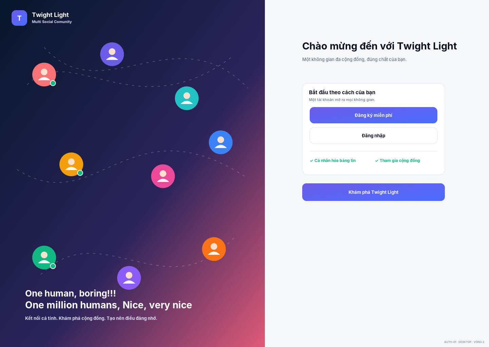

Nguồn SVG: `design/assets/editable/svg/desktop/auth-01-chao-mung.svg`

##### Mobile

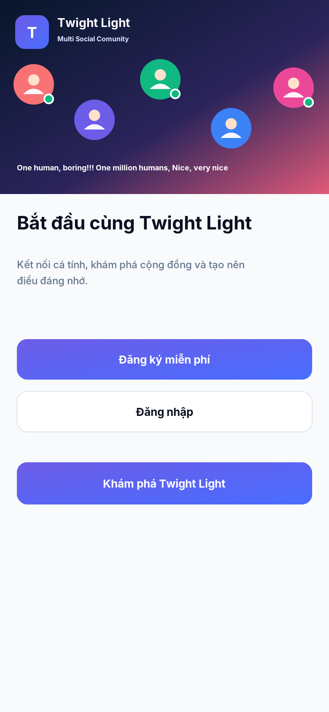

Nguồn SVG: `design/assets/editable/svg/mobile/auth-01-chao-mung.svg`

#### Quyết định cuối

- Trạng thái: **Đã duyệt để triển khai Frontend**.
- Phiên bản thiết kế: **1.2 Final**.
- Desktop và Mobile đã được đối chiếu về thứ tự ưu tiên, trạng thái, quyền và khả năng thao tác.
- SVG là nguồn hình chỉnh sửa; PNG chỉ dùng để duyệt.
- Các yêu cầu chưa có hợp đồng Backend phải tuân theo `design/sources/18-backend-contract-gaps.md`; không tự tạo API.

---

> **Trạng thái duyệt AUTH-02:** Đã duyệt

### AUTH-02 - Đăng nhập

#### Mục tiêu

Xác thực bằng email và mật khẩu, đồng thời cung cấp lối vào Google OAuth và khôi phục mật khẩu.

#### Vai trò và ưu tiên

- Vai trò: Khách
- Mức ưu tiên: **P0**
- Mã chức năng: `ACC-02`, `ACC-03`
- Route dự kiến: `/dang-nhap`

#### Bố cục

- Thẻ biểu mẫu rộng 420 px, tối đa 100% trừ khoảng đệm mobile.
- Email, mật khẩu, nút chính, phân cách OAuth và liên kết hỗ trợ.
- Thông báo lỗi đặt gần trường và có vùng tổng hợp lỗi.

#### Hành động

##### Chính

- Đăng nhập

##### Phụ

- Đăng nhập bằng Google
- Quên mật khẩu
- Tạo tài khoản

#### Component

- `AuthShell`
- `TextField`
- `PasswordField`
- `Button`
- `Divider`
- `InlineAlert`

#### Dữ liệu và hợp đồng liên quan

- POST /api/v1/auth/login
- POST /api/v1/auth/google
- Không lưu mật khẩu hoặc refresh token trong log/telemetry giao diện.

Mọi endpoint chưa được khóa trong OpenAPI phải được đánh dấu là **cần khóa hợp đồng**, không tự tạo chỉ vì mockup cần dữ liệu.

#### Trạng thái bắt buộc

- Rỗng
- Đang gửi
- Sai thông tin
- Tạm khóa do quá nhiều lần thử
- Dịch vụ tạm thời không khả dụng

Ngoài các trạng thái trên, áp dụng trạng thái dùng chung trong `design/sources/11-state-matrix.md`.

#### Tương tác và phản hồi

- Hành động có request phải có trạng thái `idle -> submitting -> success/error`.
- Double-click hoặc reconnect không được tạo side effect trùng.
- Dữ liệu nhập phải được giữ khi lỗi có thể thử lại.
- Khi route không còn quyền, điều hướng về vị trí an toàn và không tiết lộ nội dung.
- Mọi toast quan trọng phải có bản inline hoặc lịch sử phù hợp khi người dùng cần hành động.

#### Responsive

- Desktop dùng frame 1440 x 1024 trong mockup.
- Mobile dùng frame 390 x 844.
- Nội dung và hành động giữ cùng ý nghĩa; không chỉ thu nhỏ tỷ lệ.
- Bảng hoặc split view phải chuyển thành danh sách, drawer hoặc route con trên mobile.
- Touch target tối thiểu 44 x 44 px.

#### Accessibility

- Nhãn trường luôn hiển thị, không chỉ dùng placeholder.
- Nút hiện/ẩn mật khẩu có aria-label thay đổi theo trạng thái.

- Focus ring nhìn thấy.
- Icon-only button có tên truy cập.
- Trạng thái không truyền đạt bằng màu duy nhất.

#### Rủi ro cần kiểm soát

- Không tự suy đoán quyền từ trạng thái UI; server là nguồn quyết định.

#### Tiêu chí chấp nhận UI

- Với vai trò Khách, khi mở `/dang-nhap`, màn hình hiển thị đúng dữ liệu được phép hoặc trạng thái an toàn.
- Khi thực hiện hành động chính “Đăng nhập”, giao diện khóa gửi lặp không chủ đích và phản ánh kết quả server.
- Khi API trả 401/403/404/409/412/422/429/503 liên quan, giao diện dùng trạng thái đã định nghĩa và không làm mất dữ liệu nhập.
- Desktop và mobile giữ cùng mục tiêu, quyền và thứ tự ưu tiên hành động.
- Luồng bàn phím, focus và nhãn truy cập đạt yêu cầu trong tài liệu accessibility.

#### Hình chỉnh sửa

##### Desktop

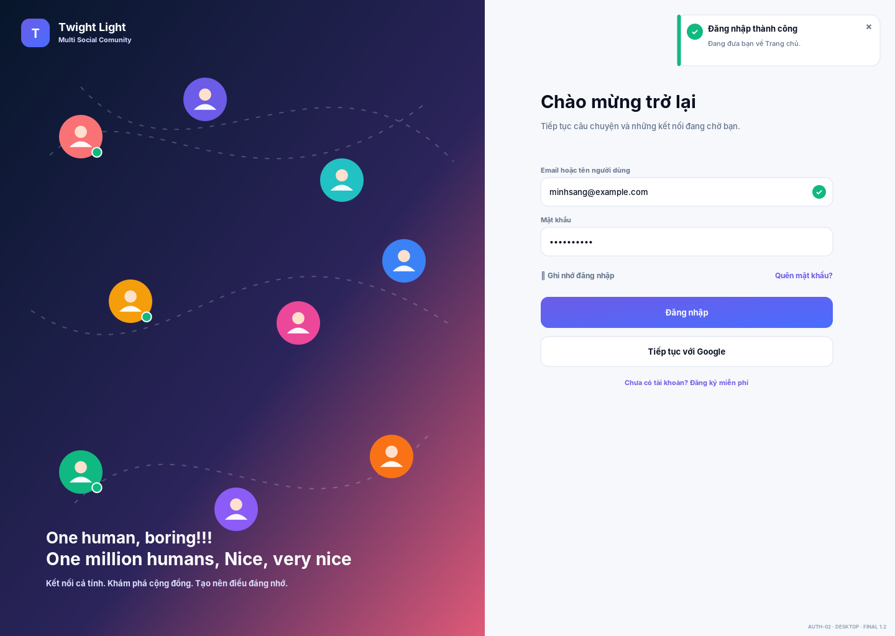

Nguồn SVG: `design/assets/editable/svg/desktop/auth-02-dang-nhap.svg`

##### Mobile

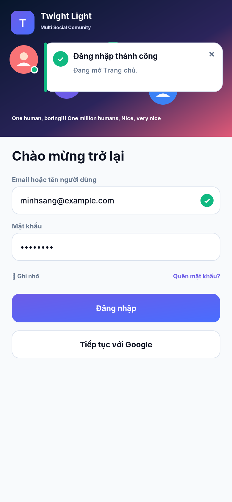

Nguồn SVG: `design/assets/editable/svg/mobile/auth-02-dang-nhap.svg`

#### Quyết định cuối

- Trạng thái: **Đã duyệt để triển khai Frontend**.
- Phiên bản thiết kế: **1.2 Final**.
- Desktop và Mobile đã được đối chiếu về thứ tự ưu tiên, trạng thái, quyền và khả năng thao tác.
- Toast thành công/thất bại neo ở góc trên phải và không che tiêu đề hoặc trường nhập.
- SVG là nguồn hình chỉnh sửa; PNG chỉ dùng để duyệt.
- Các yêu cầu chưa có hợp đồng Backend phải tuân theo `design/sources/18-backend-contract-gaps.md`; không tự tạo API.

---

> **Trạng thái duyệt AUTH-03:** Đã duyệt

### AUTH-03 - Đăng ký

#### Mục tiêu

Tạo tài khoản mới với email, tên người dùng và mật khẩu; cho phép chọn Google OAuth.

#### Vai trò và ưu tiên

- Vai trò: Khách
- Mức ưu tiên: **P0**
- Mã chức năng: `ACC-01`, `ACC-10`
- Route dự kiến: `/dang-ky`

#### Bố cục

- Biểu mẫu theo một cột; gợi ý quy tắc mật khẩu xuất hiện khi focus.
- Trạng thái kiểm tra tên người dùng hiển thị cạnh trường, không chặn nhập.
- Điều khoản là liên kết, không nhồi trong nhãn checkbox.

#### Hành động

##### Chính

- Tạo tài khoản

##### Phụ

- Đăng ký bằng Google
- Chuyển sang đăng nhập

#### Component

- `AuthShell`
- `TextField`
- `PasswordField`
- `PasswordCriteriaList`
- `PasswordPolicy`
- `Checkbox`
- `Button`
- `InlineAlert`

#### Dữ liệu và hợp đồng liên quan

- POST /api/v1/auth/register
- POST /api/v1/auth/google

Mọi endpoint chưa được khóa trong OpenAPI phải được đánh dấu là **cần khóa hợp đồng**, không tự tạo chỉ vì mockup cần dữ liệu.

#### Trạng thái bắt buộc

- Rỗng
- Kiểm tra tên người dùng
- Dữ liệu không hợp lệ
- Email hoặc tên đã tồn tại
- Thành công

Ngoài các trạng thái trên, áp dụng trạng thái dùng chung trong `design/sources/11-state-matrix.md`.

#### Tương tác và phản hồi

- Hành động có request phải có trạng thái `idle -> submitting -> success/error`.
- Double-click hoặc reconnect không được tạo side effect trùng.
- Dữ liệu nhập phải được giữ khi lỗi có thể thử lại.
- Khi route không còn quyền, điều hướng về vị trí an toàn và không tiết lộ nội dung.
- Mọi toast quan trọng phải có bản inline hoặc lịch sử phù hợp khi người dùng cần hành động.

#### Responsive

- Desktop dùng frame 1440 x 1024 trong mockup.
- Mobile dùng frame 390 x 844.
- Nội dung và hành động giữ cùng ý nghĩa; không chỉ thu nhỏ tỷ lệ.
- Bảng hoặc split view phải chuyển thành danh sách, drawer hoặc route con trên mobile.
- Touch target tối thiểu 44 x 44 px.

#### Accessibility

- Mỗi lỗi liên kết với trường bằng aria-describedby.
- Không dùng màu đơn độc để báo tên khả dụng.

- Focus ring nhìn thấy.
- Icon-only button có tên truy cập.
- Trạng thái không truyền đạt bằng màu duy nhất.

#### Rủi ro cần kiểm soát

- Không tự suy đoán quyền từ trạng thái UI; server là nguồn quyết định.

#### Tiêu chí chấp nhận UI

- Với vai trò Khách, khi mở `/dang-ky`, màn hình hiển thị đúng dữ liệu được phép hoặc trạng thái an toàn.
- Khi thực hiện hành động chính “Tạo tài khoản”, giao diện khóa gửi lặp không chủ đích và phản ánh kết quả server.
- Khi API trả 401/403/404/409/412/422/429/503 liên quan, giao diện dùng trạng thái đã định nghĩa và không làm mất dữ liệu nhập.
- Desktop và mobile giữ cùng mục tiêu, quyền và thứ tự ưu tiên hành động.
- Luồng bàn phím, focus và nhãn truy cập đạt yêu cầu trong tài liệu accessibility.

#### Hình chỉnh sửa

##### Desktop

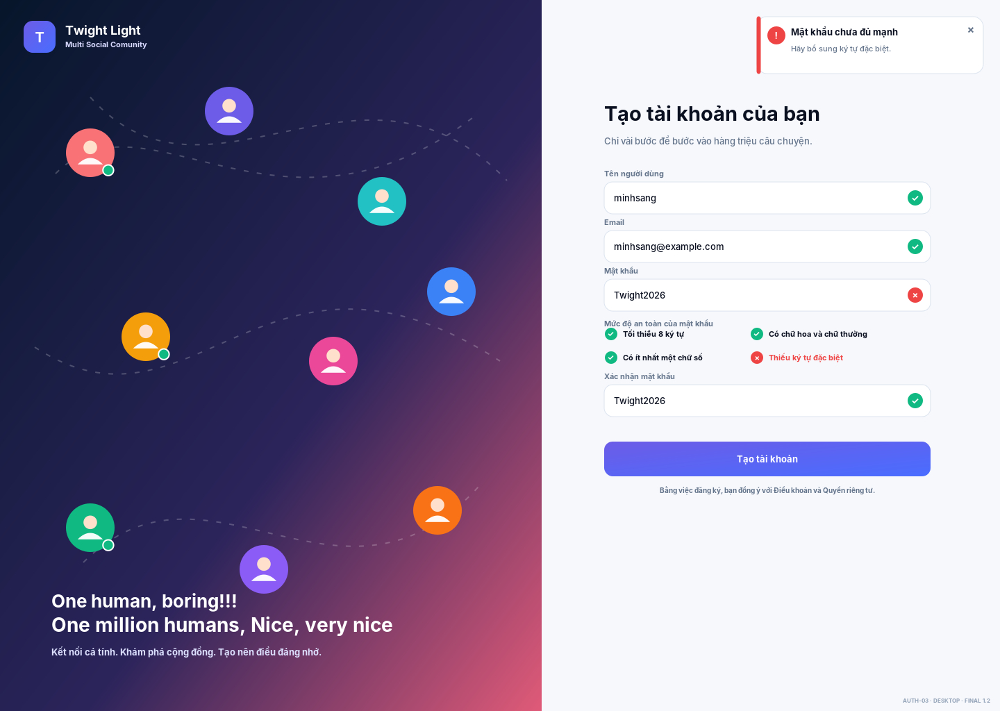

Nguồn SVG: `design/assets/editable/svg/desktop/auth-03-dang-ky.svg`

##### Mobile

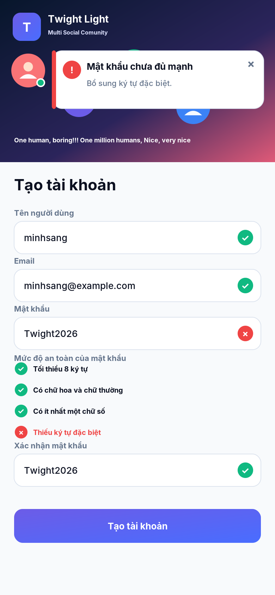

Nguồn SVG: `design/assets/editable/svg/mobile/auth-03-dang-ky.svg`

#### Quyết định cuối

- Trạng thái: **Đã duyệt để triển khai Frontend**.
- Phiên bản thiết kế: **1.2 Final**.
- Desktop và Mobile đã được đối chiếu về thứ tự ưu tiên, trạng thái, quyền và khả năng thao tác.
- Bổ sung checklist mật khẩu với dấu tích/dấu X cho từng tiêu chí.
- Toast top-end nêu đúng tiêu chí còn thiếu.
- SVG là nguồn hình chỉnh sửa; PNG chỉ dùng để duyệt.
- Các yêu cầu chưa có hợp đồng Backend phải tuân theo `design/sources/18-backend-contract-gaps.md`; không tự tạo API.

---

> **Trạng thái duyệt AUTH-04:** Đã duyệt

### AUTH-04 - Quên mật khẩu

#### Mục tiêu

Yêu cầu mã OTP mà không tiết lộ email có tồn tại trong hệ thống hay không.

#### Vai trò và ưu tiên

- Vai trò: Khách
- Mức ưu tiên: **P1**
- Mã chức năng: `ACC-08`
- Route dự kiến: `/quen-mat-khau`

#### Bố cục

- Một trường email và giải thích phản hồi chung.
- Sau khi gửi, thay biểu mẫu bằng trạng thái đã ghi nhận và đếm ngược gửi lại.

#### Hành động

##### Chính

- Gửi mã OTP

##### Phụ

- Quay lại đăng nhập

#### Component

- `AuthShell`
- `TextField`
- `Button`
- `StatusMessage`

#### Dữ liệu và hợp đồng liên quan

- POST /api/v1/auth/forgot-password
- Phản hồi UI giống nhau dù email tồn tại hay không.

Mọi endpoint chưa được khóa trong OpenAPI phải được đánh dấu là **cần khóa hợp đồng**, không tự tạo chỉ vì mockup cần dữ liệu.

#### Trạng thái bắt buộc

- Rỗng
- Đang gửi
- Phản hồi chung
- Giới hạn tần suất
- SMTP chậm nhưng yêu cầu đã được ghi nhận

Ngoài các trạng thái trên, áp dụng trạng thái dùng chung trong `design/sources/11-state-matrix.md`.

#### Tương tác và phản hồi

- Hành động có request phải có trạng thái `idle -> submitting -> success/error`.
- Double-click hoặc reconnect không được tạo side effect trùng.
- Dữ liệu nhập phải được giữ khi lỗi có thể thử lại.
- Khi route không còn quyền, điều hướng về vị trí an toàn và không tiết lộ nội dung.
- Mọi toast quan trọng phải có bản inline hoặc lịch sử phù hợp khi người dùng cần hành động.

#### Responsive

- Desktop dùng frame 1440 x 1024 trong mockup.
- Mobile dùng frame 390 x 844.
- Nội dung và hành động giữ cùng ý nghĩa; không chỉ thu nhỏ tỷ lệ.
- Bảng hoặc split view phải chuyển thành danh sách, drawer hoặc route con trên mobile.
- Touch target tối thiểu 44 x 44 px.

#### Accessibility

- Thông báo thành công dùng live region mức polite.
- Đếm ngược không cập nhật quá dày cho trình đọc màn hình.

- Focus ring nhìn thấy.
- Icon-only button có tên truy cập.
- Trạng thái không truyền đạt bằng màu duy nhất.

#### Rủi ro cần kiểm soát

- Không tự suy đoán quyền từ trạng thái UI; server là nguồn quyết định.

#### Tiêu chí chấp nhận UI

- Với vai trò Khách, khi mở `/quen-mat-khau`, màn hình hiển thị đúng dữ liệu được phép hoặc trạng thái an toàn.
- Khi thực hiện hành động chính “Gửi mã OTP”, giao diện khóa gửi lặp không chủ đích và phản ánh kết quả server.
- Khi API trả 401/403/404/409/412/422/429/503 liên quan, giao diện dùng trạng thái đã định nghĩa và không làm mất dữ liệu nhập.
- Desktop và mobile giữ cùng mục tiêu, quyền và thứ tự ưu tiên hành động.
- Luồng bàn phím, focus và nhãn truy cập đạt yêu cầu trong tài liệu accessibility.

#### Hình chỉnh sửa

##### Desktop

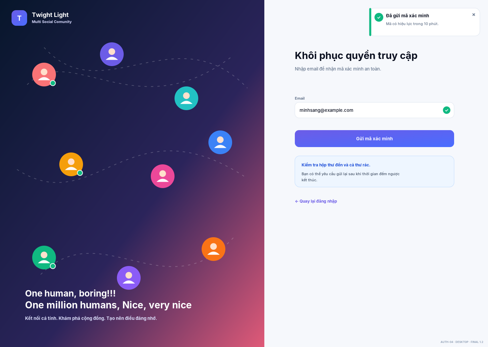

Nguồn SVG: `design/assets/editable/svg/desktop/auth-04-quen-mat-khau.svg`

##### Mobile

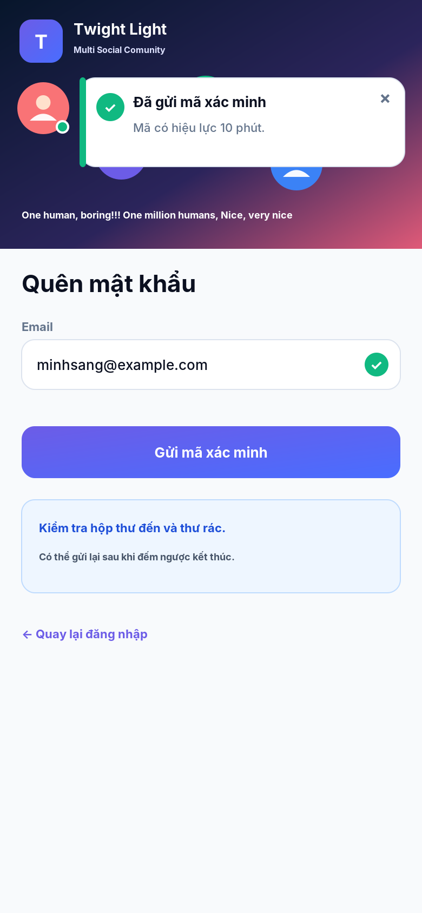

Nguồn SVG: `design/assets/editable/svg/mobile/auth-04-quen-mat-khau.svg`

#### Quyết định cuối

- Trạng thái: **Đã duyệt để triển khai Frontend**.
- Phiên bản thiết kế: **1.2 Final**.
- Desktop và Mobile đã được đối chiếu về thứ tự ưu tiên, trạng thái, quyền và khả năng thao tác.
- Toast gửi mã đặt ở góc trên phải, không nằm dưới form.
- SVG là nguồn hình chỉnh sửa; PNG chỉ dùng để duyệt.
- Các yêu cầu chưa có hợp đồng Backend phải tuân theo `design/sources/18-backend-contract-gaps.md`; không tự tạo API.

---

> **Trạng thái duyệt AUTH-05:** Đã duyệt

### AUTH-05 - Đặt lại mật khẩu

#### Mục tiêu

Xác minh OTP một lần và đặt mật khẩu mới; mọi phiên đang hoạt động sẽ bị thu hồi.

#### Vai trò và ưu tiên

- Vai trò: Khách
- Mức ưu tiên: **P1**
- Mã chức năng: `ACC-09`
- Route dự kiến: `/dat-lai-mat-khau`

#### Bố cục

- Trạng thái đầu tiên sau khi OTP hợp lệ là modal xác nhận giữa màn hình.
- Khi chọn **OK, nhập mật khẩu mới**, modal đóng, focus chuyển vào trường mật khẩu mới và OTP không còn hiển thị.
- Sau thành công, điều hướng về đăng nhập và thông báo mọi phiên đã bị thu hồi.

#### Hành động

##### Chính

- Đặt lại mật khẩu

##### Phụ

- Gửi lại mã
- Quay lại đăng nhập

#### Component

- `AuthShell`
- `VerificationSuccessModal`
- `PasswordField`
- `PasswordCriteriaList`
- `Button`
- `InlineAlert`

#### Dữ liệu và hợp đồng liên quan

- POST /api/v1/auth/reset-password

Mọi endpoint chưa được khóa trong OpenAPI phải được đánh dấu là **cần khóa hợp đồng**, không tự tạo chỉ vì mockup cần dữ liệu.

#### Trạng thái bắt buộc

- Nhập OTP
- OTP sai
- OTP hết hạn
- Quá số lần thử
- Thành công

Ngoài các trạng thái trên, áp dụng trạng thái dùng chung trong `design/sources/11-state-matrix.md`.

#### Tương tác và phản hồi

- Hành động có request phải có trạng thái `idle -> submitting -> success/error`.
- Double-click hoặc reconnect không được tạo side effect trùng.
- Dữ liệu nhập phải được giữ khi lỗi có thể thử lại.
- Khi route không còn quyền, điều hướng về vị trí an toàn và không tiết lộ nội dung.
- Mọi toast quan trọng phải có bản inline hoặc lịch sử phù hợp khi người dùng cần hành động.

#### Responsive

- Desktop dùng frame 1440 x 1024 trong mockup.
- Mobile dùng frame 390 x 844.
- Nội dung và hành động giữ cùng ý nghĩa; không chỉ thu nhỏ tỷ lệ.
- Bảng hoặc split view phải chuyển thành danh sách, drawer hoặc route con trên mobile.
- Touch target tối thiểu 44 x 44 px.

#### Accessibility

- OTP vẫn có một nhãn logic; hỗ trợ nhập/dán bằng bàn phím.
- Không tự động gửi ngay khi nhập đủ nếu có nguy cơ thao tác nhầm.

- Focus ring nhìn thấy.
- Icon-only button có tên truy cập.
- Trạng thái không truyền đạt bằng màu duy nhất.

#### Rủi ro cần kiểm soát

- Không tự suy đoán quyền từ trạng thái UI; server là nguồn quyết định.

#### Tiêu chí chấp nhận UI

- Với vai trò Khách, khi mở `/dat-lai-mat-khau`, màn hình hiển thị đúng dữ liệu được phép hoặc trạng thái an toàn.
- Khi thực hiện hành động chính “Đặt lại mật khẩu”, giao diện khóa gửi lặp không chủ đích và phản ánh kết quả server.
- Khi API trả 401/403/404/409/412/422/429/503 liên quan, giao diện dùng trạng thái đã định nghĩa và không làm mất dữ liệu nhập.
- Desktop và mobile giữ cùng mục tiêu, quyền và thứ tự ưu tiên hành động.
- Luồng bàn phím, focus và nhãn truy cập đạt yêu cầu trong tài liệu accessibility.

#### Hình chỉnh sửa

##### Desktop

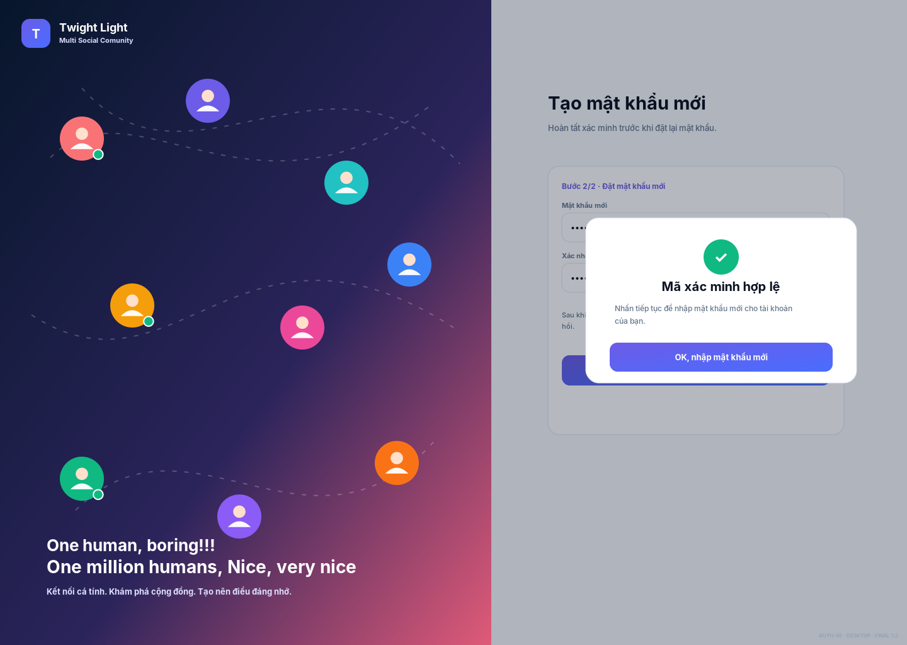

Nguồn SVG: `design/assets/editable/svg/desktop/auth-05-dat-lai-mat-khau.svg`

##### Mobile

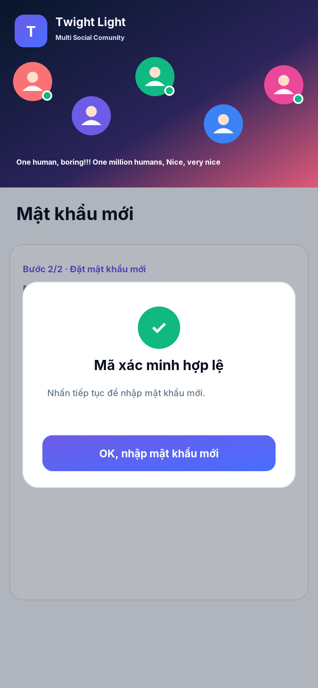

Nguồn SVG: `design/assets/editable/svg/mobile/auth-05-dat-lai-mat-khau.svg`

#### Quyết định cuối

- Trạng thái: **Đã duyệt để triển khai Frontend**.
- Phiên bản thiết kế: **1.2 Final**.
- Desktop và Mobile đã được đối chiếu về thứ tự ưu tiên, trạng thái, quyền và khả năng thao tác.
- Sau khi OTP hợp lệ, hiển thị modal giữa màn hình.
- Chỉ sau khi chọn OK mới mở form mật khẩu mới; OTP không còn xuất hiện.
- SVG là nguồn hình chỉnh sửa; PNG chỉ dùng để duyệt.
- Các yêu cầu chưa có hợp đồng Backend phải tuân theo `design/sources/18-backend-contract-gaps.md`; không tự tạo API.

---

> **Trạng thái duyệt FEED-01:** Đã duyệt

### FEED-01 - Bảng tin

#### Mục tiêu

Hiển thị bảng tin theo con trỏ, hỗ trợ tạo bài viết nhanh, tương tác và điều hướng đến chi tiết.

#### Vai trò và ưu tiên

- Vai trò: Người dùng
- Mức ưu tiên: **P0**
- Mã chức năng: `FED-02`, `SOC-03`, `SOC-08`, `CHT-08`
- Route dự kiến: `/bang-tin`

#### Bố cục

- Desktop ba vùng: điều hướng 240 px, nội dung 680-760 px, thanh phụ 300-340 px.
- Mobile dùng thanh trên và điều hướng đáy; nội dung toàn chiều rộng.
- Mỗi PostCard là một vùng độc lập với header, nội dung, media và action row.

#### Hành động

##### Chính

- Tạo bài viết
- Tương tác
- Bình luận

##### Phụ

- Lưu vị trí cuộn
- Ẩn gợi ý
- Báo cáo

#### Component

- `AppShell`
- `PostComposer`
- `PostCard`
- `PostActionBar`
- `RightRail`
- `Skeleton`

#### Dữ liệu và hợp đồng liên quan

- GET /api/v1/feed?cursor=&limit=
- POST /api/v1/posts
- PUT/DELETE reaction
- SignalR cho thông báo; không dùng để thay nguồn dữ liệu bảng tin.

Mọi endpoint chưa được khóa trong OpenAPI phải được đánh dấu là **cần khóa hợp đồng**, không tự tạo chỉ vì mockup cần dữ liệu.

#### Trạng thái bắt buộc

- Đang tải khung
- Có dữ liệu
- Hết dữ liệu
- Cache miss
- Ngoại tuyến
- Bài viết bị ẩn theo quyền

Ngoài các trạng thái trên, áp dụng trạng thái dùng chung trong `design/sources/11-state-matrix.md`.

#### Tương tác và phản hồi

- Hành động có request phải có trạng thái `idle -> submitting -> success/error`.
- Double-click hoặc reconnect không được tạo side effect trùng.
- Dữ liệu nhập phải được giữ khi lỗi có thể thử lại.
- Khi route không còn quyền, điều hướng về vị trí an toàn và không tiết lộ nội dung.
- Mọi toast quan trọng phải có bản inline hoặc lịch sử phù hợp khi người dùng cần hành động.

#### Responsive

- Desktop dùng frame 1440 x 1024 trong mockup.
- Mobile dùng frame 390 x 844.
- Nội dung và hành động giữ cùng ý nghĩa; không chỉ thu nhỏ tỷ lệ.
- Bảng hoặc split view phải chuyển thành danh sách, drawer hoặc route con trên mobile.
- Touch target tối thiểu 44 x 44 px.

#### Accessibility

- Nút tương tác có tên và trạng thái pressed.
- Tải thêm không làm mất focus; có lựa chọn nút 'Xem thêm' khi cần.

- Focus ring nhìn thấy.
- Icon-only button có tên truy cập.
- Trạng thái không truyền đạt bằng màu duy nhất.

#### Rủi ro cần kiểm soát

- Không tự suy đoán quyền từ trạng thái UI; server là nguồn quyết định.

#### Tiêu chí chấp nhận UI

- Với vai trò Người dùng, khi mở `/bang-tin`, màn hình hiển thị đúng dữ liệu được phép hoặc trạng thái an toàn.
- Khi thực hiện hành động chính “Tạo bài viết”, giao diện khóa gửi lặp không chủ đích và phản ánh kết quả server.
- Khi API trả 401/403/404/409/412/422/429/503 liên quan, giao diện dùng trạng thái đã định nghĩa và không làm mất dữ liệu nhập.
- Desktop và mobile giữ cùng mục tiêu, quyền và thứ tự ưu tiên hành động.
- Luồng bàn phím, focus và nhãn truy cập đạt yêu cầu trong tài liệu accessibility.

#### Hình chỉnh sửa

##### Desktop

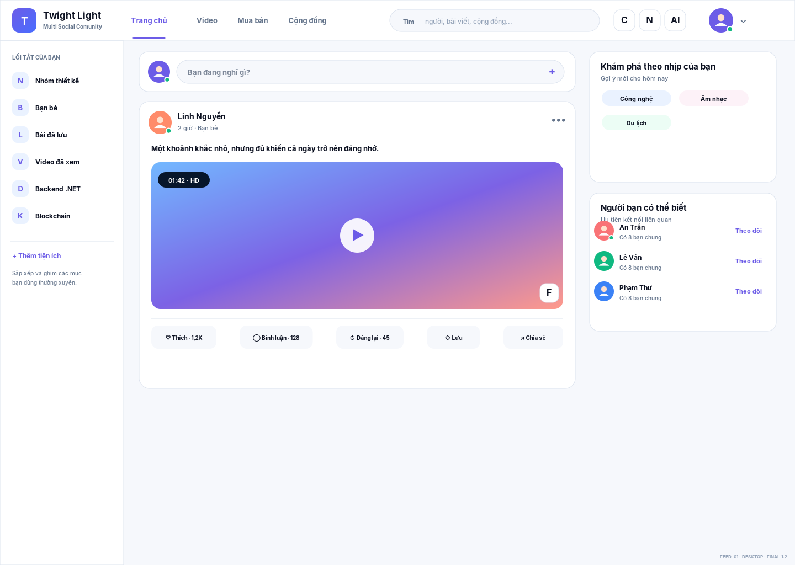

Nguồn SVG: `design/assets/editable/svg/desktop/feed-01-bang-tin.svg`

##### Mobile

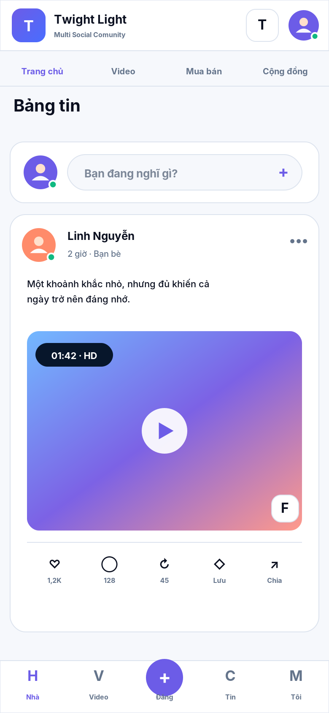

Nguồn SVG: `design/assets/editable/svg/mobile/feed-01-bang-tin.svg`

#### Quyết định cuối

- Trạng thái: **Đã duyệt để triển khai Frontend**.
- Phiên bản thiết kế: **1.2 Final**.
- Desktop và Mobile đã được đối chiếu về thứ tự ưu tiên, trạng thái, quyền và khả năng thao tác.
- Đưa Thích, Bình luận và Đăng lại xuống dưới video.
- Mở rộng video hết chiều ngang vùng nội dung; Lưu và Chia sẻ ở cùng action bar.
- SVG là nguồn hình chỉnh sửa; PNG chỉ dùng để duyệt.
- Các yêu cầu chưa có hợp đồng Backend phải tuân theo `design/sources/18-backend-contract-gaps.md`; không tự tạo API.

---

> **Trạng thái duyệt FEED-02:** Đã duyệt

### FEED-02 - Tạo bài viết

#### Mục tiêu

Soạn bài, chọn phạm vi hiển thị, đính kèm phương tiện và gửi yêu cầu lặp an toàn.

#### Vai trò và ưu tiên

- Vai trò: Người dùng
- Mức ưu tiên: **P0**
- Mã chức năng: `SOC-03`, `MED-01`, `MED-03`
- Route dự kiến: `/bai-viet/moi`

#### Bố cục

- Modal 640 px trên desktop; trang toàn màn hình trên mobile.
- Composer, bộ chọn phạm vi, media tray và thanh hành động cố định.
- Hiển thị kích thước/loại tệp và trạng thái từng upload.

#### Hành động

##### Chính

- Đăng bài

##### Phụ

- Thêm ảnh/video
- Chọn quyền riêng tư
- Lưu nháp cục bộ

#### Component

- `DialogOrPage`
- `PostComposer`
- `VisibilitySelect`
- `MediaUploadTray`
- `Progress`
- `Button`

#### Dữ liệu và hợp đồng liên quan

- POST /api/v1/media/uploads
- PUT URL ký trước
- POST /api/v1/media/uploads/{id}/complete
- POST /api/v1/posts với Idempotency-Key

Mọi endpoint chưa được khóa trong OpenAPI phải được đánh dấu là **cần khóa hợp đồng**, không tự tạo chỉ vì mockup cần dữ liệu.

#### Trạng thái bắt buộc

- Rỗng
- Đang tải phương tiện
- Phương tiện lỗi
- Đang đăng
- Đã đăng
- Yêu cầu trùng

Ngoài các trạng thái trên, áp dụng trạng thái dùng chung trong `design/sources/11-state-matrix.md`.

#### Tương tác và phản hồi

- Hành động có request phải có trạng thái `idle -> submitting -> success/error`.
- Double-click hoặc reconnect không được tạo side effect trùng.
- Dữ liệu nhập phải được giữ khi lỗi có thể thử lại.
- Khi route không còn quyền, điều hướng về vị trí an toàn và không tiết lộ nội dung.
- Mọi toast quan trọng phải có bản inline hoặc lịch sử phù hợp khi người dùng cần hành động.

#### Responsive

- Desktop dùng frame 1440 x 1024 trong mockup.
- Mobile dùng frame 390 x 844.
- Nội dung và hành động giữ cùng ý nghĩa; không chỉ thu nhỏ tỷ lệ.
- Bảng hoặc split view phải chuyển thành danh sách, drawer hoặc route con trên mobile.
- Touch target tối thiểu 44 x 44 px.

#### Accessibility

- Bẫy focus trong modal và trả focus đúng phần tử mở.
- Tiến trình upload có aria-valuenow và mô tả.

- Focus ring nhìn thấy.
- Icon-only button có tên truy cập.
- Trạng thái không truyền đạt bằng màu duy nhất.

#### Rủi ro cần kiểm soát

- Không tự suy đoán quyền từ trạng thái UI; server là nguồn quyết định.

#### Tiêu chí chấp nhận UI

- Với vai trò Người dùng, khi mở `/bai-viet/moi`, màn hình hiển thị đúng dữ liệu được phép hoặc trạng thái an toàn.
- Khi thực hiện hành động chính “Đăng bài”, giao diện khóa gửi lặp không chủ đích và phản ánh kết quả server.
- Khi API trả 401/403/404/409/412/422/429/503 liên quan, giao diện dùng trạng thái đã định nghĩa và không làm mất dữ liệu nhập.
- Desktop và mobile giữ cùng mục tiêu, quyền và thứ tự ưu tiên hành động.
- Luồng bàn phím, focus và nhãn truy cập đạt yêu cầu trong tài liệu accessibility.

#### Hình chỉnh sửa

##### Desktop

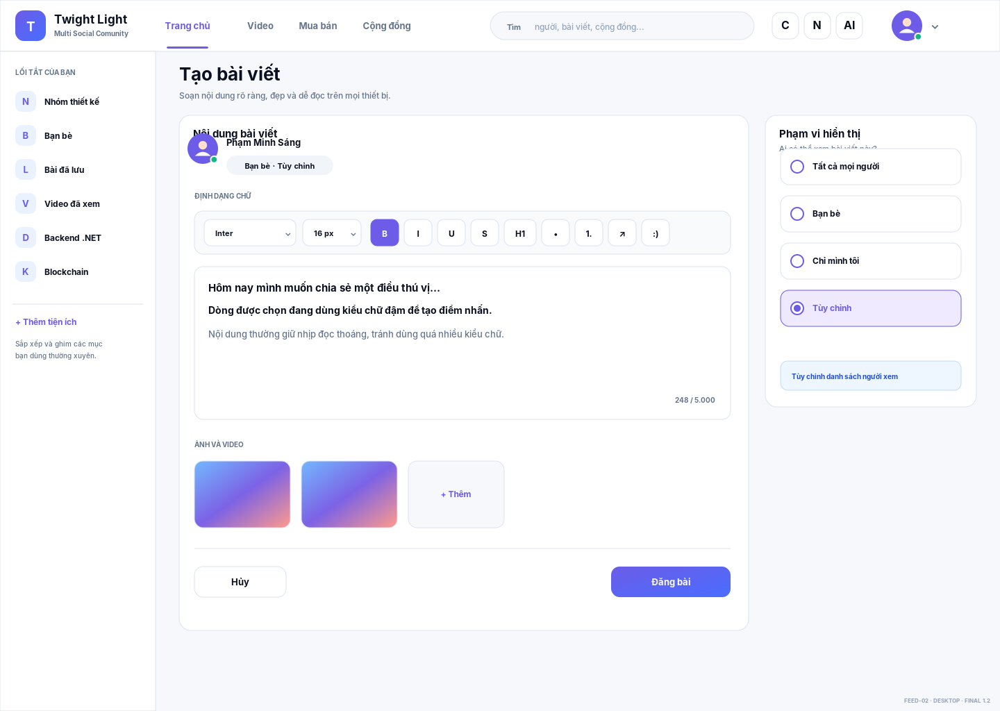

Nguồn SVG: `design/assets/editable/svg/desktop/feed-02-tao-bai-viet.svg`

##### Mobile

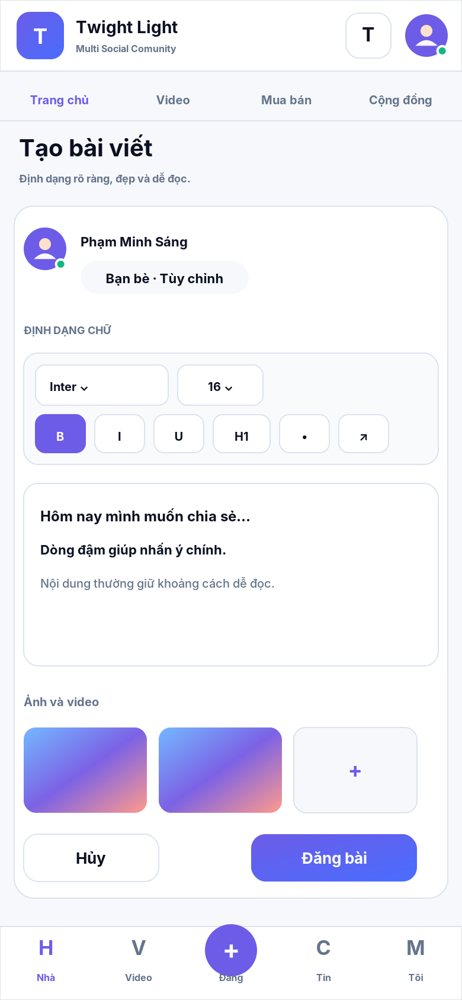

Nguồn SVG: `design/assets/editable/svg/mobile/feed-02-tao-bai-viet.svg`

#### Quyết định cuối

- Trạng thái: **Đã duyệt để triển khai Frontend**.
- Phiên bản thiết kế: **1.2 Final**.
- Desktop và Mobile đã được đối chiếu về thứ tự ưu tiên, trạng thái, quyền và khả năng thao tác.
- Thiết kế lại thanh rich text theo nhóm Font, Cỡ chữ và Định dạng.
- Trạng thái in đậm hiển thị rõ cả trên toolbar và nội dung mẫu.
- SVG là nguồn hình chỉnh sửa; PNG chỉ dùng để duyệt.
- Các yêu cầu chưa có hợp đồng Backend phải tuân theo `design/sources/18-backend-contract-gaps.md`; không tự tạo API.

---

> **Trạng thái duyệt FEED-03:** Đã duyệt

### FEED-03 - Chi tiết bài viết

#### Mục tiêu

Đọc bài viết, xem chuỗi bình luận, trả lời, tương tác, chia sẻ và báo cáo.

#### Vai trò và ưu tiên

- Vai trò: Người xem, Người dùng
- Mức ưu tiên: **P0**
- Mã chức năng: `SOC-06`, `SOC-07`, `SOC-08`, `SOC-10`, `MOD-01`
- Route dự kiến: `/bai-viet/:id`

#### Bố cục

- Bài viết ở đầu, danh sách bình luận phân cấp tối đa theo quy tắc hệ thống.
- Composer bình luận cố định gần cuối nội dung.
- Menu hành động thay đổi theo quyền.

#### Hành động

##### Chính

- Bình luận
- Tương tác

##### Phụ

- Chia sẻ
- Sửa hoặc xóa nếu có quyền
- Báo cáo

#### Component

- `AppShell`
- `PostCard`
- `CommentThread`
- `CommentComposer`
- `Menu`
- `ReportDialog`

#### Dữ liệu và hợp đồng liên quan

- GET /api/v1/posts/{id}
- POST /api/v1/posts/{id}/comments
- PUT/DELETE /reaction
- POST /api/v1/posts/{id}/share
- POST /api/v1/reports

Mọi endpoint chưa được khóa trong OpenAPI phải được đánh dấu là **cần khóa hợp đồng**, không tự tạo chỉ vì mockup cần dữ liệu.

#### Trạng thái bắt buộc

- Đang tải
- Có nội dung
- Bài viết riêng tư
- Đã xóa
- Bị chặn
- Lỗi bình luận

Ngoài các trạng thái trên, áp dụng trạng thái dùng chung trong `design/sources/11-state-matrix.md`.

#### Tương tác và phản hồi

- Hành động có request phải có trạng thái `idle -> submitting -> success/error`.
- Double-click hoặc reconnect không được tạo side effect trùng.
- Dữ liệu nhập phải được giữ khi lỗi có thể thử lại.
- Khi route không còn quyền, điều hướng về vị trí an toàn và không tiết lộ nội dung.
- Mọi toast quan trọng phải có bản inline hoặc lịch sử phù hợp khi người dùng cần hành động.

#### Responsive

- Desktop dùng frame 1440 x 1024 trong mockup.
- Mobile dùng frame 390 x 844.
- Nội dung và hành động giữ cùng ý nghĩa; không chỉ thu nhỏ tỷ lệ.
- Bảng hoặc split view phải chuyển thành danh sách, drawer hoặc route con trên mobile.
- Touch target tối thiểu 44 x 44 px.

#### Accessibility

- Bình luận lồng có aria-level hợp lý.
- Sau khi gửi bình luận, thông báo và đưa focus tới bình luận mới khi không gây giật.

- Focus ring nhìn thấy.
- Icon-only button có tên truy cập.
- Trạng thái không truyền đạt bằng màu duy nhất.

#### Rủi ro cần kiểm soát

- Không tự suy đoán quyền từ trạng thái UI; server là nguồn quyết định.

#### Tiêu chí chấp nhận UI

- Với vai trò Người xem, Người dùng, khi mở `/bai-viet/:id`, màn hình hiển thị đúng dữ liệu được phép hoặc trạng thái an toàn.
- Khi thực hiện hành động chính “Bình luận”, giao diện khóa gửi lặp không chủ đích và phản ánh kết quả server.
- Khi API trả 401/403/404/409/412/422/429/503 liên quan, giao diện dùng trạng thái đã định nghĩa và không làm mất dữ liệu nhập.
- Desktop và mobile giữ cùng mục tiêu, quyền và thứ tự ưu tiên hành động.
- Luồng bàn phím, focus và nhãn truy cập đạt yêu cầu trong tài liệu accessibility.

#### Hình chỉnh sửa

##### Desktop

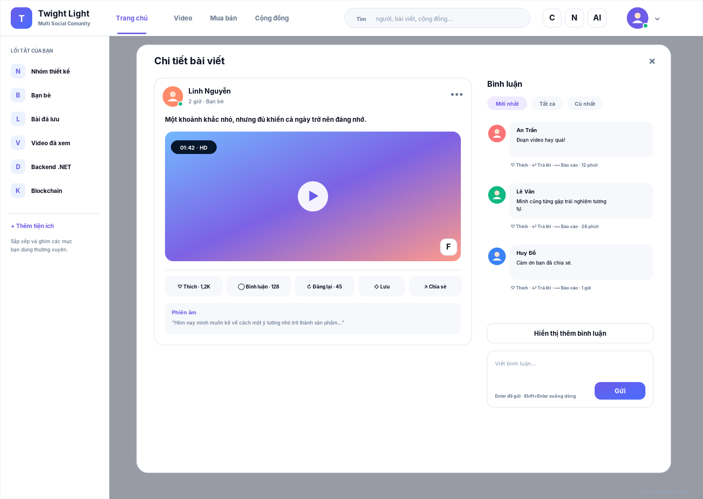

Nguồn SVG: `design/assets/editable/svg/desktop/feed-03-chi-tiet-bai-viet.svg`

##### Mobile

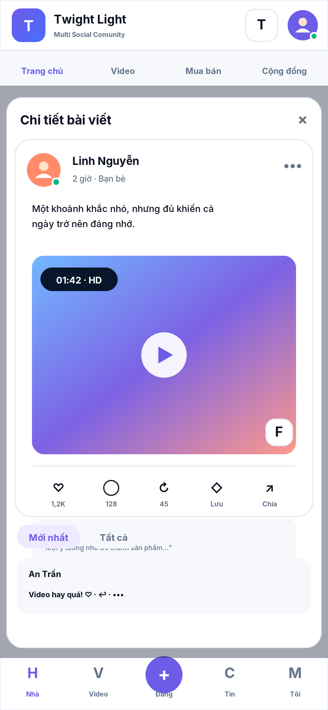

Nguồn SVG: `design/assets/editable/svg/mobile/feed-03-chi-tiet-bai-viet.svg`

#### Quyết định cuối

- Trạng thái: **Đã duyệt để triển khai Frontend**.
- Phiên bản thiết kế: **1.2 Final**.
- Desktop và Mobile đã được đối chiếu về thứ tự ưu tiên, trạng thái, quyền và khả năng thao tác.
- Đưa action bar xuống dưới video, mở rộng vùng media.
- Tăng chiều rộng cột bình luận và giữ lớp nổi desktop/route toàn màn hình mobile.
- SVG là nguồn hình chỉnh sửa; PNG chỉ dùng để duyệt.
- Các yêu cầu chưa có hợp đồng Backend phải tuân theo `design/sources/18-backend-contract-gaps.md`; không tự tạo API.

---

> **Trạng thái duyệt FEED-04:** Đã duyệt

### FEED-04 - Sửa bài viết

#### Mục tiêu

Cập nhật nội dung hoặc phạm vi hiển thị bằng If-Match để tránh ghi đè dữ liệu mới.

#### Vai trò và ưu tiên

- Vai trò: Chủ sở hữu
- Mức ưu tiên: **P0**
- Mã chức năng: `SOC-04`
- Route dự kiến: `/bai-viet/:id/sua`

#### Bố cục

- Dùng cùng composer với tạo bài nhưng có trạng thái phiên bản.
- Cảnh báo thay đổi chưa lưu khi rời màn hình.

#### Hành động

##### Chính

- Lưu thay đổi

##### Phụ

- Hủy
- Xem phiên bản hiện tại

#### Component

- `DialogOrPage`
- `PostComposer`
- `ConflictDialog`
- `Button`

#### Dữ liệu và hợp đồng liên quan

- PATCH /api/v1/posts/{id} với If-Match
- GET lại tài nguyên khi 412 để hỗ trợ so sánh.

Mọi endpoint chưa được khóa trong OpenAPI phải được đánh dấu là **cần khóa hợp đồng**, không tự tạo chỉ vì mockup cần dữ liệu.

#### Trạng thái bắt buộc

- Mặc định
- Đang lưu
- Xung đột phiên bản 412
- Không có quyền
- Bài viết đã xóa

Ngoài các trạng thái trên, áp dụng trạng thái dùng chung trong `design/sources/11-state-matrix.md`.

#### Tương tác và phản hồi

- Hành động có request phải có trạng thái `idle -> submitting -> success/error`.
- Double-click hoặc reconnect không được tạo side effect trùng.
- Dữ liệu nhập phải được giữ khi lỗi có thể thử lại.
- Khi route không còn quyền, điều hướng về vị trí an toàn và không tiết lộ nội dung.
- Mọi toast quan trọng phải có bản inline hoặc lịch sử phù hợp khi người dùng cần hành động.

#### Responsive

- Desktop dùng frame 1440 x 1024 trong mockup.
- Mobile dùng frame 390 x 844.
- Nội dung và hành động giữ cùng ý nghĩa; không chỉ thu nhỏ tỷ lệ.
- Bảng hoặc split view phải chuyển thành danh sách, drawer hoặc route con trên mobile.
- Touch target tối thiểu 44 x 44 px.

#### Accessibility

- Hộp thoại xung đột mô tả rõ lựa chọn tải bản mới hoặc sao chép nội dung đang sửa.

- Focus ring nhìn thấy.
- Icon-only button có tên truy cập.
- Trạng thái không truyền đạt bằng màu duy nhất.

#### Rủi ro cần kiểm soát

- Không tự suy đoán quyền từ trạng thái UI; server là nguồn quyết định.

#### Tiêu chí chấp nhận UI

- Với vai trò Chủ sở hữu, khi mở `/bai-viet/:id/sua`, màn hình hiển thị đúng dữ liệu được phép hoặc trạng thái an toàn.
- Khi thực hiện hành động chính “Lưu thay đổi”, giao diện khóa gửi lặp không chủ đích và phản ánh kết quả server.
- Khi API trả 401/403/404/409/412/422/429/503 liên quan, giao diện dùng trạng thái đã định nghĩa và không làm mất dữ liệu nhập.
- Desktop và mobile giữ cùng mục tiêu, quyền và thứ tự ưu tiên hành động.
- Luồng bàn phím, focus và nhãn truy cập đạt yêu cầu trong tài liệu accessibility.

#### Hình chỉnh sửa

##### Desktop

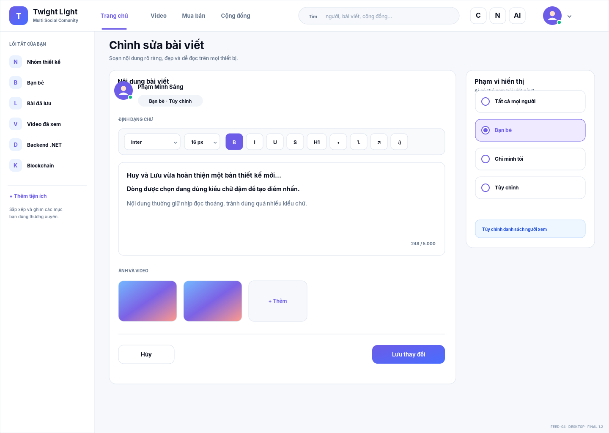

Nguồn SVG: `design/assets/editable/svg/desktop/feed-04-sua-bai-viet.svg`

##### Mobile

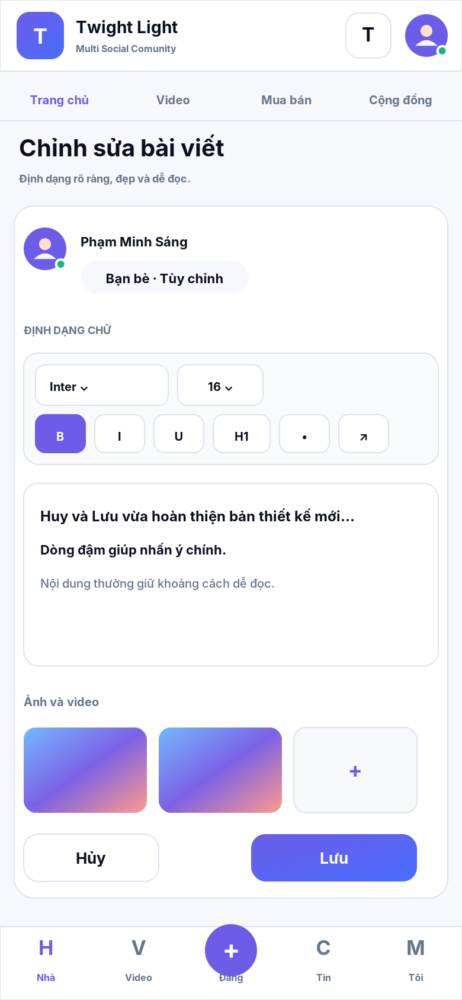

Nguồn SVG: `design/assets/editable/svg/mobile/feed-04-sua-bai-viet.svg`

#### Quyết định cuối

- Trạng thái: **Đã duyệt để triển khai Frontend**.
- Phiên bản thiết kế: **1.2 Final**.
- Desktop và Mobile đã được đối chiếu về thứ tự ưu tiên, trạng thái, quyền và khả năng thao tác.
- Đồng bộ editor với FEED-02; nội dung sửa đổi có typography đậm và dễ nhận biết.
- SVG là nguồn hình chỉnh sửa; PNG chỉ dùng để duyệt.
- Các yêu cầu chưa có hợp đồng Backend phải tuân theo `design/sources/18-backend-contract-gaps.md`; không tự tạo API.

---

> **Trạng thái duyệt FEED-05:** Đã duyệt

### FEED-05 - Bài viết video đang xử lý

#### Mục tiêu

Cho chủ sở hữu theo dõi tải lên, xử lý video, ảnh thu nhỏ và trạng thái thất bại trước khi xuất bản.

#### Vai trò và ưu tiên

- Vai trò: Chủ sở hữu
- Mức ưu tiên: **P1**
- Mã chức năng: `SOC-09`, `MED-04`
- Route dự kiến: `/bai-viet/:id/xu-ly`

#### Bố cục

- Thẻ tiến trình gồm tải lên, xác minh, xử lý, tạo thumbnail và xuất bản.
- Chỉ chủ sở hữu thấy nội dung khi processing/failed.

#### Hành động

##### Chính

- Xem tiến trình

##### Phụ

- Thử lại
- Xóa bản nháp

#### Component

- `AppShell`
- `ProcessingTimeline`
- `VideoPreview`
- `InlineAlert`
- `Button`

#### Dữ liệu và hợp đồng liên quan

- GET trạng thái MediaAsset/Post
- Nhận MediaReady/Failed qua polling hoặc thông báo ứng dụng theo triển khai.

Mọi endpoint chưa được khóa trong OpenAPI phải được đánh dấu là **cần khóa hợp đồng**, không tự tạo chỉ vì mockup cần dữ liệu.

#### Trạng thái bắt buộc

- Tải lên
- Đang xử lý
- Sẵn sàng
- Thất bại
- Đã hủy

Ngoài các trạng thái trên, áp dụng trạng thái dùng chung trong `design/sources/11-state-matrix.md`.

#### Tương tác và phản hồi

- Hành động có request phải có trạng thái `idle -> submitting -> success/error`.
- Double-click hoặc reconnect không được tạo side effect trùng.
- Dữ liệu nhập phải được giữ khi lỗi có thể thử lại.
- Khi route không còn quyền, điều hướng về vị trí an toàn và không tiết lộ nội dung.
- Mọi toast quan trọng phải có bản inline hoặc lịch sử phù hợp khi người dùng cần hành động.

#### Responsive

- Desktop dùng frame 1440 x 1024 trong mockup.
- Mobile dùng frame 390 x 844.
- Nội dung và hành động giữ cùng ý nghĩa; không chỉ thu nhỏ tỷ lệ.
- Bảng hoặc split view phải chuyển thành danh sách, drawer hoặc route con trên mobile.
- Touch target tối thiểu 44 x 44 px.

#### Accessibility

- Không chỉ dùng animation; luôn có nhãn trạng thái văn bản.
- Tôn trọng prefers-reduced-motion.

- Focus ring nhìn thấy.
- Icon-only button có tên truy cập.
- Trạng thái không truyền đạt bằng màu duy nhất.

#### Rủi ro cần kiểm soát

- Không tự suy đoán quyền từ trạng thái UI; server là nguồn quyết định.

#### Tiêu chí chấp nhận UI

- Với vai trò Chủ sở hữu, khi mở `/bai-viet/:id/xu-ly`, màn hình hiển thị đúng dữ liệu được phép hoặc trạng thái an toàn.
- Khi thực hiện hành động chính “Xem tiến trình”, giao diện khóa gửi lặp không chủ đích và phản ánh kết quả server.
- Khi API trả 401/403/404/409/412/422/429/503 liên quan, giao diện dùng trạng thái đã định nghĩa và không làm mất dữ liệu nhập.
- Desktop và mobile giữ cùng mục tiêu, quyền và thứ tự ưu tiên hành động.
- Luồng bàn phím, focus và nhãn truy cập đạt yêu cầu trong tài liệu accessibility.

#### Hình chỉnh sửa

##### Desktop

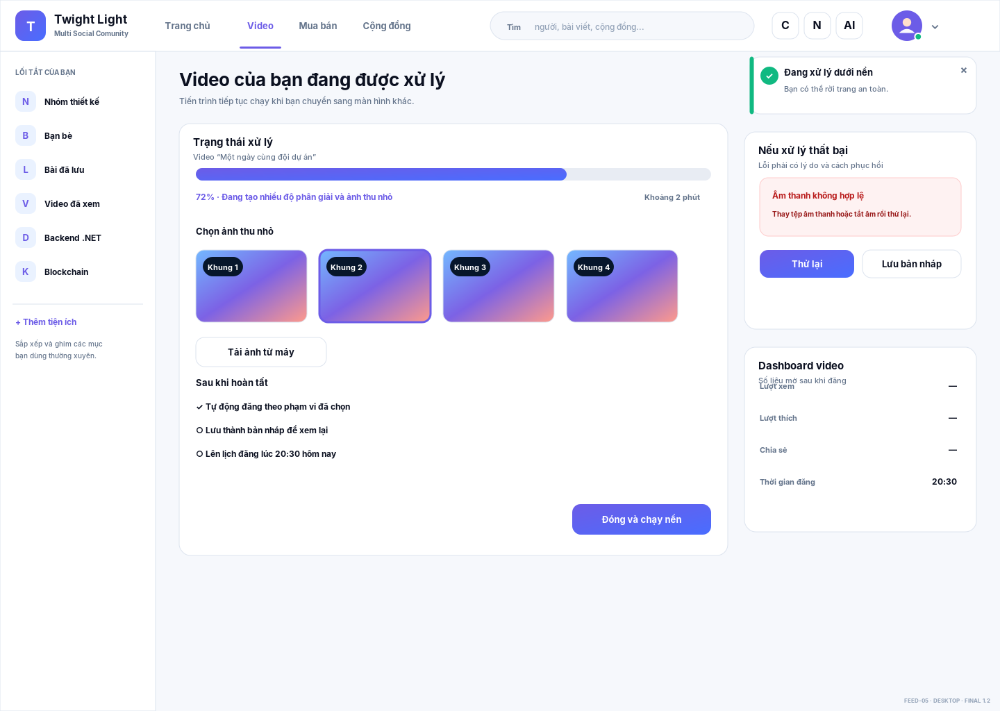

Nguồn SVG: `design/assets/editable/svg/desktop/feed-05-bai-viet-video.svg`

##### Mobile

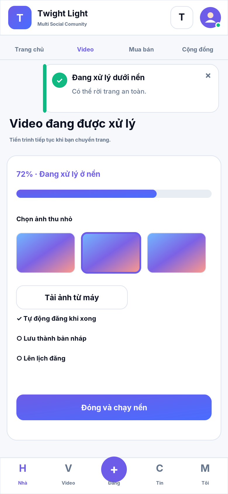

Nguồn SVG: `design/assets/editable/svg/mobile/feed-05-bai-viet-video.svg`

#### Quyết định cuối

- Trạng thái: **Đã duyệt để triển khai Frontend**.
- Phiên bản thiết kế: **1.2 Final**.
- Desktop và Mobile đã được đối chiếu về thứ tự ưu tiên, trạng thái, quyền và khả năng thao tác.
- Toast xử lý nền đặt top-end.
- Tách trạng thái đang xử lý khỏi hướng dẫn phục hồi khi thất bại để tránh mâu thuẫn.
- SVG là nguồn hình chỉnh sửa; PNG chỉ dùng để duyệt.
- Các yêu cầu chưa có hợp đồng Backend phải tuân theo `design/sources/18-backend-contract-gaps.md`; không tự tạo API.

---

> **Trạng thái duyệt PROF-01:** Đã duyệt

### PROF-01 - Hồ sơ của tôi

#### Mục tiêu

Hiển thị hồ sơ, số liệu mạng xã hội, bài viết và lối vào chỉnh sửa hoặc thiết lập.

#### Vai trò và ưu tiên

- Vai trò: Người dùng
- Mức ưu tiên: **P0**
- Mã chức năng: `ACC-05`, `SOC-06`
- Route dự kiến: `/toi`

#### Bố cục

- Header hồ sơ gồm avatar, tên, bio, số liệu và CTA.
- Tabs bài viết/phương tiện; desktop có card thông tin phụ.

#### Hành động

##### Chính

- Chỉnh sửa hồ sơ
- Tạo bài viết

##### Phụ

- Xem người theo dõi
- Mở thiết lập

#### Component

- `AppShell`
- `ProfileHeader`
- `Tabs`
- `PostGridOrList`
- `EmptyState`

#### Dữ liệu và hợp đồng liên quan

- GET /api/v1/users/me
- GET /api/v1/users/{id}/posts

Mọi endpoint chưa được khóa trong OpenAPI phải được đánh dấu là **cần khóa hợp đồng**, không tự tạo chỉ vì mockup cần dữ liệu.

#### Trạng thái bắt buộc

- Đang tải
- Có bài viết
- Chưa có bài viết
- Ảnh đại diện lỗi

Ngoài các trạng thái trên, áp dụng trạng thái dùng chung trong `design/sources/11-state-matrix.md`.

#### Tương tác và phản hồi

- Hành động có request phải có trạng thái `idle -> submitting -> success/error`.
- Double-click hoặc reconnect không được tạo side effect trùng.
- Dữ liệu nhập phải được giữ khi lỗi có thể thử lại.
- Khi route không còn quyền, điều hướng về vị trí an toàn và không tiết lộ nội dung.
- Mọi toast quan trọng phải có bản inline hoặc lịch sử phù hợp khi người dùng cần hành động.

#### Responsive

- Desktop dùng frame 1440 x 1024 trong mockup.
- Mobile dùng frame 390 x 844.
- Nội dung và hành động giữ cùng ý nghĩa; không chỉ thu nhỏ tỷ lệ.
- Bảng hoặc split view phải chuyển thành danh sách, drawer hoặc route con trên mobile.
- Touch target tối thiểu 44 x 44 px.

#### Accessibility

- Tabs dùng roving tabindex hoặc điều hướng tab chuẩn.
- Số liệu có nhãn đầy đủ, không đọc chuỗi số rời.

- Focus ring nhìn thấy.
- Icon-only button có tên truy cập.
- Trạng thái không truyền đạt bằng màu duy nhất.

#### Rủi ro cần kiểm soát

- Không tự suy đoán quyền từ trạng thái UI; server là nguồn quyết định.

#### Tiêu chí chấp nhận UI

- Với vai trò Người dùng, khi mở `/toi`, màn hình hiển thị đúng dữ liệu được phép hoặc trạng thái an toàn.
- Khi thực hiện hành động chính “Chỉnh sửa hồ sơ”, giao diện khóa gửi lặp không chủ đích và phản ánh kết quả server.
- Khi API trả 401/403/404/409/412/422/429/503 liên quan, giao diện dùng trạng thái đã định nghĩa và không làm mất dữ liệu nhập.
- Desktop và mobile giữ cùng mục tiêu, quyền và thứ tự ưu tiên hành động.
- Luồng bàn phím, focus và nhãn truy cập đạt yêu cầu trong tài liệu accessibility.

#### Hình chỉnh sửa

##### Desktop

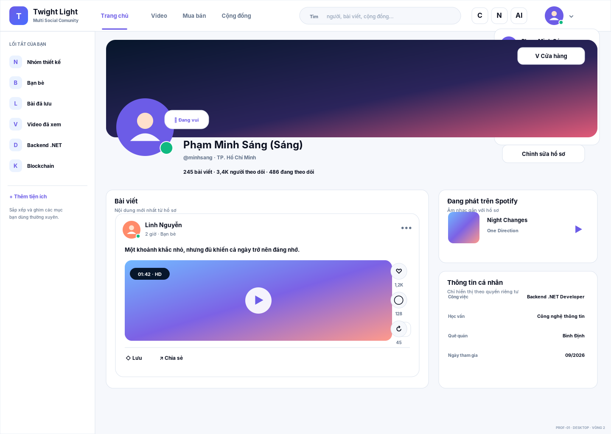

Nguồn SVG: `design/assets/editable/svg/desktop/prof-01-ho-so-cua-toi.svg`

##### Mobile

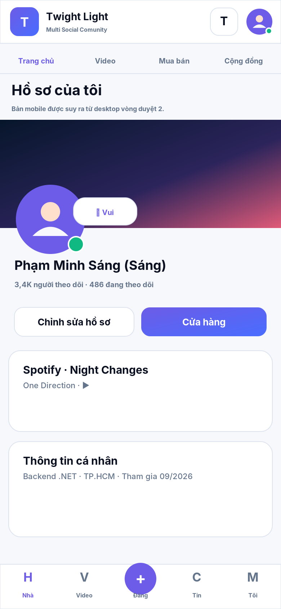

Nguồn SVG: `design/assets/editable/svg/mobile/prof-01-ho-so-cua-toi.svg`

#### Quyết định cuối

- Trạng thái: **Đã duyệt để triển khai Frontend**.
- Phiên bản thiết kế: **1.2 Final**.
- Desktop và Mobile đã được đối chiếu về thứ tự ưu tiên, trạng thái, quyền và khả năng thao tác.
- SVG là nguồn hình chỉnh sửa; PNG chỉ dùng để duyệt.
- Các yêu cầu chưa có hợp đồng Backend phải tuân theo `design/sources/18-backend-contract-gaps.md`; không tự tạo API.

---

> **Trạng thái duyệt PROF-02:** Đã duyệt

### PROF-02 - Hồ sơ người dùng

#### Mục tiêu

Xem hồ sơ theo quyền riêng tư, theo dõi hoặc chặn và duyệt bài viết hiển thị được.

#### Vai trò và ưu tiên

- Vai trò: Người xem
- Mức ưu tiên: **P0**
- Mã chức năng: `ACC-05`, `SOC-01`, `SOC-02`, `SOC-06`
- Route dự kiến: `/nguoi-dung/:id`

#### Bố cục

- Giống hồ sơ của tôi nhưng CTA phụ thuộc trạng thái follow/block/privacy.
- Nội dung ẩn dùng một empty state giải thích vừa đủ, không tiết lộ dữ liệu.

#### Hành động

##### Chính

- Theo dõi hoặc bỏ theo dõi

##### Phụ

- Nhắn tin
- Chặn
- Báo cáo

#### Component

- `AppShell`
- `ProfileHeader`
- `FollowButton`
- `BlockDialog`
- `Tabs`
- `PostGridOrList`

#### Dữ liệu và hợp đồng liên quan

- GET /api/v1/users/{id}
- POST/DELETE /api/v1/users/{id}/follow
- POST/DELETE /api/v1/users/{id}/block

Mọi endpoint chưa được khóa trong OpenAPI phải được đánh dấu là **cần khóa hợp đồng**, không tự tạo chỉ vì mockup cần dữ liệu.

#### Trạng thái bắt buộc

- Công khai
- Chỉ người theo dõi
- Đã theo dõi
- Đã chặn
- Hồ sơ không tồn tại

Ngoài các trạng thái trên, áp dụng trạng thái dùng chung trong `design/sources/11-state-matrix.md`.

#### Tương tác và phản hồi

- Hành động có request phải có trạng thái `idle -> submitting -> success/error`.
- Double-click hoặc reconnect không được tạo side effect trùng.
- Dữ liệu nhập phải được giữ khi lỗi có thể thử lại.
- Khi route không còn quyền, điều hướng về vị trí an toàn và không tiết lộ nội dung.
- Mọi toast quan trọng phải có bản inline hoặc lịch sử phù hợp khi người dùng cần hành động.

#### Responsive

- Desktop dùng frame 1440 x 1024 trong mockup.
- Mobile dùng frame 390 x 844.
- Nội dung và hành động giữ cùng ý nghĩa; không chỉ thu nhỏ tỷ lệ.
- Bảng hoặc split view phải chuyển thành danh sách, drawer hoặc route con trên mobile.
- Touch target tối thiểu 44 x 44 px.

#### Accessibility

- Nút Theo dõi dùng aria-pressed.
- Hộp xác nhận chặn nêu rõ hậu quả.

- Focus ring nhìn thấy.
- Icon-only button có tên truy cập.
- Trạng thái không truyền đạt bằng màu duy nhất.

#### Rủi ro cần kiểm soát

- Không tự suy đoán quyền từ trạng thái UI; server là nguồn quyết định.

#### Tiêu chí chấp nhận UI

- Với vai trò Người xem, khi mở `/nguoi-dung/:id`, màn hình hiển thị đúng dữ liệu được phép hoặc trạng thái an toàn.
- Khi thực hiện hành động chính “Theo dõi hoặc bỏ theo dõi”, giao diện khóa gửi lặp không chủ đích và phản ánh kết quả server.
- Khi API trả 401/403/404/409/412/422/429/503 liên quan, giao diện dùng trạng thái đã định nghĩa và không làm mất dữ liệu nhập.
- Desktop và mobile giữ cùng mục tiêu, quyền và thứ tự ưu tiên hành động.
- Luồng bàn phím, focus và nhãn truy cập đạt yêu cầu trong tài liệu accessibility.

#### Hình chỉnh sửa

##### Desktop

Nguồn SVG: `design/assets/editable/svg/desktop/prof-02-ho-so-nguoi-khac.svg`

##### Mobile

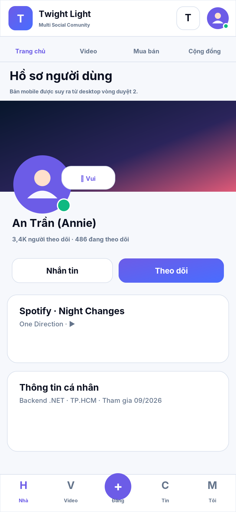

Nguồn SVG: `design/assets/editable/svg/mobile/prof-02-ho-so-nguoi-khac.svg`

#### Quyết định cuối

- Trạng thái: **Đã duyệt để triển khai Frontend**.
- Phiên bản thiết kế: **1.2 Final**.
- Desktop và Mobile đã được đối chiếu về thứ tự ưu tiên, trạng thái, quyền và khả năng thao tác.
- SVG là nguồn hình chỉnh sửa; PNG chỉ dùng để duyệt.
- Các yêu cầu chưa có hợp đồng Backend phải tuân theo `design/sources/18-backend-contract-gaps.md`; không tự tạo API.

---

> **Trạng thái duyệt PROF-03:** Đã duyệt

### PROF-03 - Chỉnh sửa hồ sơ

#### Mục tiêu

Cập nhật tên hiển thị, tiểu sử, tên người dùng và avatar đã sẵn sàng.

#### Vai trò và ưu tiên

- Vai trò: Người dùng
- Mức ưu tiên: **P1**
- Mã chức năng: `ACC-05`, `ACC-06`, `MED-01`
- Route dự kiến: `/toi/chinh-sua`

#### Bố cục

- Form chia nhóm Hồ sơ công khai và Ảnh đại diện.
- Preview avatar cạnh vùng tải lên; tên người dùng có trạng thái kiểm tra.

#### Hành động

##### Chính

- Lưu hồ sơ

##### Phụ

- Đổi ảnh đại diện
- Hủy

#### Component

- `SettingsShell`
- `AvatarPicker`
- `TextField`
- `TextArea`
- `Button`
- `ConflictDialog`

#### Dữ liệu và hợp đồng liên quan

- PATCH /api/v1/users/me với If-Match
- PATCH /api/v1/users/me/avatar
- Luồng Media upload

Mọi endpoint chưa được khóa trong OpenAPI phải được đánh dấu là **cần khóa hợp đồng**, không tự tạo chỉ vì mockup cần dữ liệu.

#### Trạng thái bắt buộc

- Mặc định
- Tên người dùng đang kiểm tra
- Phương tiện chưa sẵn sàng
- Xung đột phiên bản
- Thành công

Ngoài các trạng thái trên, áp dụng trạng thái dùng chung trong `design/sources/11-state-matrix.md`.

#### Tương tác và phản hồi

- Hành động có request phải có trạng thái `idle -> submitting -> success/error`.
- Double-click hoặc reconnect không được tạo side effect trùng.
- Dữ liệu nhập phải được giữ khi lỗi có thể thử lại.
- Khi route không còn quyền, điều hướng về vị trí an toàn và không tiết lộ nội dung.
- Mọi toast quan trọng phải có bản inline hoặc lịch sử phù hợp khi người dùng cần hành động.

#### Responsive

- Desktop dùng frame 1440 x 1024 trong mockup.
- Mobile dùng frame 390 x 844.
- Nội dung và hành động giữ cùng ý nghĩa; không chỉ thu nhỏ tỷ lệ.
- Bảng hoặc split view phải chuyển thành danh sách, drawer hoặc route con trên mobile.
- Touch target tối thiểu 44 x 44 px.

#### Accessibility

- Crop ảnh nếu có phải hỗ trợ bàn phím; nếu chưa hỗ trợ thì cho tải ảnh gốc và mô tả giới hạn.

- Focus ring nhìn thấy.
- Icon-only button có tên truy cập.
- Trạng thái không truyền đạt bằng màu duy nhất.

#### Rủi ro cần kiểm soát

- Không tự suy đoán quyền từ trạng thái UI; server là nguồn quyết định.

#### Tiêu chí chấp nhận UI

- Với vai trò Người dùng, khi mở `/toi/chinh-sua`, màn hình hiển thị đúng dữ liệu được phép hoặc trạng thái an toàn.
- Khi thực hiện hành động chính “Lưu hồ sơ”, giao diện khóa gửi lặp không chủ đích và phản ánh kết quả server.
- Khi API trả 401/403/404/409/412/422/429/503 liên quan, giao diện dùng trạng thái đã định nghĩa và không làm mất dữ liệu nhập.
- Desktop và mobile giữ cùng mục tiêu, quyền và thứ tự ưu tiên hành động.
- Luồng bàn phím, focus và nhãn truy cập đạt yêu cầu trong tài liệu accessibility.

#### Hình chỉnh sửa

##### Desktop

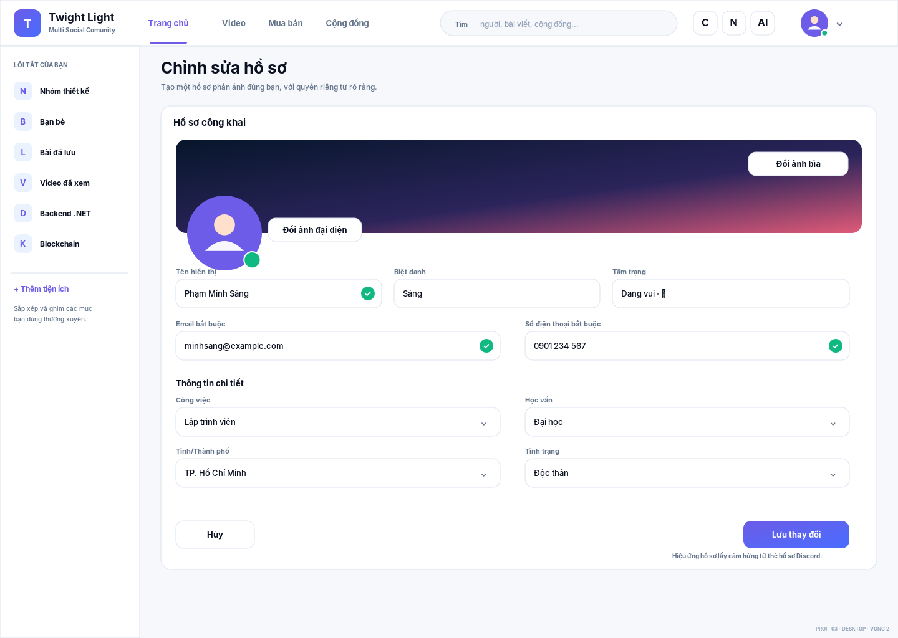

Nguồn SVG: `design/assets/editable/svg/desktop/prof-03-chinh-sua-ho-so.svg`

##### Mobile

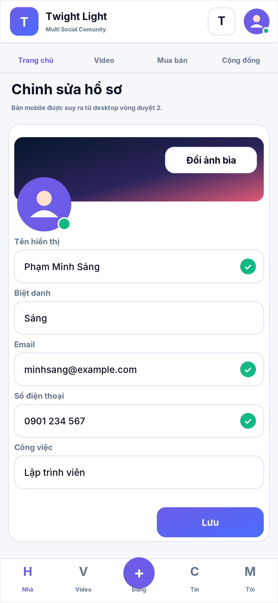

Nguồn SVG: `design/assets/editable/svg/mobile/prof-03-chinh-sua-ho-so.svg`

#### Quyết định cuối

- Trạng thái: **Đã duyệt để triển khai Frontend**.
- Phiên bản thiết kế: **1.2 Final**.
- Desktop và Mobile đã được đối chiếu về thứ tự ưu tiên, trạng thái, quyền và khả năng thao tác.
- SVG là nguồn hình chỉnh sửa; PNG chỉ dùng để duyệt.
- Các yêu cầu chưa có hợp đồng Backend phải tuân theo `design/sources/18-backend-contract-gaps.md`; không tự tạo API.

---

> **Trạng thái duyệt PROF-04:** Đã duyệt

### PROF-04 - Người theo dõi và đang theo dõi

#### Mục tiêu

Duyệt người theo dõi hoặc đang theo dõi, tìm nhanh và thay đổi quan hệ.

#### Vai trò và ưu tiên

- Vai trò: Người dùng
- Mức ưu tiên: **P0**
- Mã chức năng: `SOC-01`, `SOC-02`
- Route dự kiến: `/nguoi-dung/:id/ket-noi`

#### Bố cục

- Tabs Người theo dõi/Đang theo dõi; mỗi hàng có avatar, tên và CTA.
- Tìm kiếm cục bộ hoặc server tùy số lượng.

#### Hành động

##### Chính

- Theo dõi hoặc bỏ theo dõi

##### Phụ

- Tìm người dùng
- Chặn

#### Component

- `AppShell`
- `Tabs`
- `SearchField`
- `UserRow`
- `FollowButton`

#### Dữ liệu và hợp đồng liên quan

- GET danh sách quan hệ theo API thực tế khi triển khai
- POST/DELETE follow/block

Mọi endpoint chưa được khóa trong OpenAPI phải được đánh dấu là **cần khóa hợp đồng**, không tự tạo chỉ vì mockup cần dữ liệu.

#### Trạng thái bắt buộc

- Có dữ liệu
- Rỗng
- Đang tìm
- Bị giới hạn quyền

Ngoài các trạng thái trên, áp dụng trạng thái dùng chung trong `design/sources/11-state-matrix.md`.

#### Tương tác và phản hồi

- Hành động có request phải có trạng thái `idle -> submitting -> success/error`.
- Double-click hoặc reconnect không được tạo side effect trùng.
- Dữ liệu nhập phải được giữ khi lỗi có thể thử lại.
- Khi route không còn quyền, điều hướng về vị trí an toàn và không tiết lộ nội dung.
- Mọi toast quan trọng phải có bản inline hoặc lịch sử phù hợp khi người dùng cần hành động.

#### Responsive

- Desktop dùng frame 1440 x 1024 trong mockup.
- Mobile dùng frame 390 x 844.
- Nội dung và hành động giữ cùng ý nghĩa; không chỉ thu nhỏ tỷ lệ.
- Bảng hoặc split view phải chuyển thành danh sách, drawer hoặc route con trên mobile.
- Touch target tối thiểu 44 x 44 px.

#### Accessibility

- Danh sách có tên; trạng thái tải thêm được thông báo.

- Focus ring nhìn thấy.
- Icon-only button có tên truy cập.
- Trạng thái không truyền đạt bằng màu duy nhất.

#### Rủi ro cần kiểm soát

- Không tự suy đoán quyền từ trạng thái UI; server là nguồn quyết định.

#### Tiêu chí chấp nhận UI

- Với vai trò Người dùng, khi mở `/nguoi-dung/:id/ket-noi`, màn hình hiển thị đúng dữ liệu được phép hoặc trạng thái an toàn.
- Khi thực hiện hành động chính “Theo dõi hoặc bỏ theo dõi”, giao diện khóa gửi lặp không chủ đích và phản ánh kết quả server.
- Khi API trả 401/403/404/409/412/422/429/503 liên quan, giao diện dùng trạng thái đã định nghĩa và không làm mất dữ liệu nhập.
- Desktop và mobile giữ cùng mục tiêu, quyền và thứ tự ưu tiên hành động.
- Luồng bàn phím, focus và nhãn truy cập đạt yêu cầu trong tài liệu accessibility.

#### Hình chỉnh sửa

##### Desktop

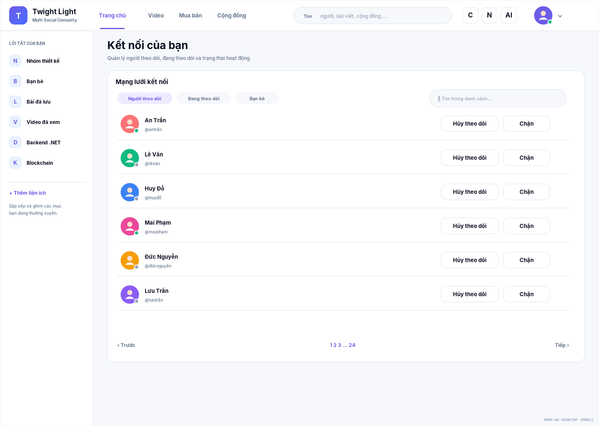

Nguồn SVG: `design/assets/editable/svg/desktop/prof-04-quan-he-xa-hoi.svg`

##### Mobile

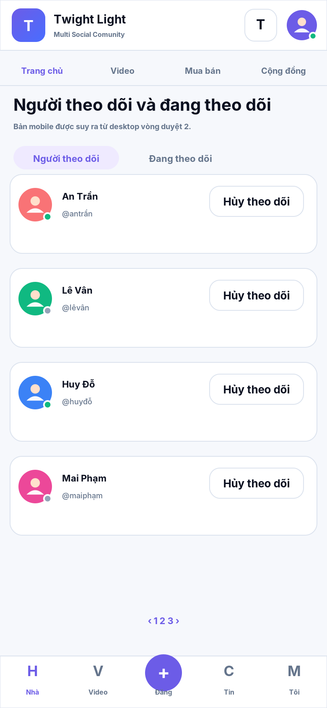

Nguồn SVG: `design/assets/editable/svg/mobile/prof-04-quan-he-xa-hoi.svg`

#### Quyết định cuối

- Trạng thái: **Đã duyệt để triển khai Frontend**.
- Phiên bản thiết kế: **1.2 Final**.
- Desktop và Mobile đã được đối chiếu về thứ tự ưu tiên, trạng thái, quyền và khả năng thao tác.
- SVG là nguồn hình chỉnh sửa; PNG chỉ dùng để duyệt.
- Các yêu cầu chưa có hợp đồng Backend phải tuân theo `design/sources/18-backend-contract-gaps.md`; không tự tạo API.

---

> **Trạng thái duyệt SET-01:** Đã duyệt

### SET-01 - Quyền riêng tư

#### Mục tiêu

Thiết lập mức hiển thị hồ sơ, bài viết, trạng thái hiện diện và lời mời nhắn tin.

#### Vai trò và ưu tiên

- Vai trò: Người dùng
- Mức ưu tiên: **P0**
- Mã chức năng: `ACC-07`
- Route dự kiến: `/thiet-lap/quyen-rieng-tu`

#### Bố cục

- Trang thiết lập có sidebar desktop và nhóm trường theo chủ đề.
- Mobile dùng danh sách điều hướng cấp một rồi vào trang con.

#### Hành động

##### Chính

- Lưu thiết lập

##### Phụ

- Khôi phục mặc định

#### Component

- `SettingsShell`
- `Select`
- `Switch`
- `RadioGroup`
- `SaveBar`

#### Dữ liệu và hợp đồng liên quan

- GET/PATCH /api/v1/users/me/settings

Mọi endpoint chưa được khóa trong OpenAPI phải được đánh dấu là **cần khóa hợp đồng**, không tự tạo chỉ vì mockup cần dữ liệu.

#### Trạng thái bắt buộc

- Đã lưu
- Có thay đổi chưa lưu
- Dữ liệu không hợp lệ
- Mất kết nối

Ngoài các trạng thái trên, áp dụng trạng thái dùng chung trong `design/sources/11-state-matrix.md`.

#### Tương tác và phản hồi

- Hành động có request phải có trạng thái `idle -> submitting -> success/error`.
- Double-click hoặc reconnect không được tạo side effect trùng.
- Dữ liệu nhập phải được giữ khi lỗi có thể thử lại.
- Khi route không còn quyền, điều hướng về vị trí an toàn và không tiết lộ nội dung.
- Mọi toast quan trọng phải có bản inline hoặc lịch sử phù hợp khi người dùng cần hành động.

#### Responsive

- Desktop dùng frame 1440 x 1024 trong mockup.
- Mobile dùng frame 390 x 844.
- Nội dung và hành động giữ cùng ý nghĩa; không chỉ thu nhỏ tỷ lệ.
- Bảng hoặc split view phải chuyển thành danh sách, drawer hoặc route con trên mobile.
- Touch target tối thiểu 44 x 44 px.

#### Accessibility

- Switch phải có label và mô tả hậu quả.
- Không lưu tự động các thay đổi nhạy cảm nếu người dùng chưa xác nhận.

- Focus ring nhìn thấy.
- Icon-only button có tên truy cập.
- Trạng thái không truyền đạt bằng màu duy nhất.

#### Rủi ro cần kiểm soát

- Không tự suy đoán quyền từ trạng thái UI; server là nguồn quyết định.

#### Tiêu chí chấp nhận UI

- Với vai trò Người dùng, khi mở `/thiet-lap/quyen-rieng-tu`, màn hình hiển thị đúng dữ liệu được phép hoặc trạng thái an toàn.
- Khi thực hiện hành động chính “Lưu thiết lập”, giao diện khóa gửi lặp không chủ đích và phản ánh kết quả server.
- Khi API trả 401/403/404/409/412/422/429/503 liên quan, giao diện dùng trạng thái đã định nghĩa và không làm mất dữ liệu nhập.
- Desktop và mobile giữ cùng mục tiêu, quyền và thứ tự ưu tiên hành động.
- Luồng bàn phím, focus và nhãn truy cập đạt yêu cầu trong tài liệu accessibility.

#### Hình chỉnh sửa

##### Desktop

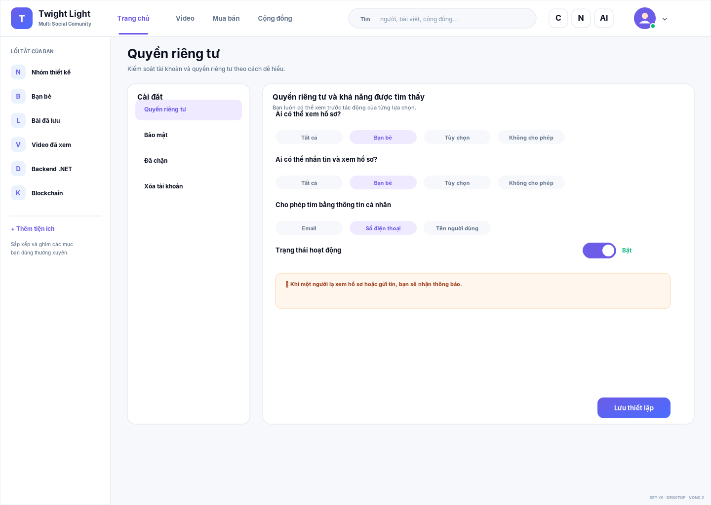

Nguồn SVG: `design/assets/editable/svg/desktop/set-01-quyen-rieng-tu.svg`

##### Mobile

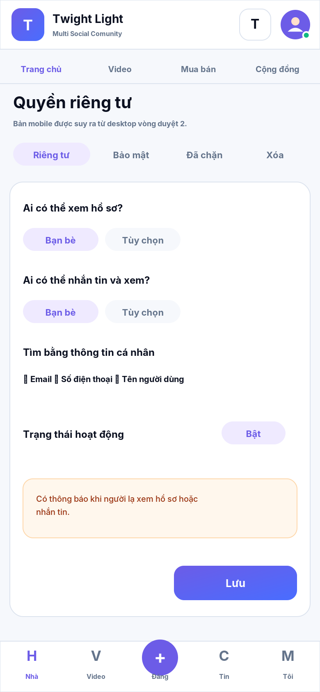

Nguồn SVG: `design/assets/editable/svg/mobile/set-01-quyen-rieng-tu.svg`

#### Quyết định cuối

- Trạng thái: **Đã duyệt để triển khai Frontend**.
- Phiên bản thiết kế: **1.2 Final**.
- Desktop và Mobile đã được đối chiếu về thứ tự ưu tiên, trạng thái, quyền và khả năng thao tác.
- SVG là nguồn hình chỉnh sửa; PNG chỉ dùng để duyệt.
- Các yêu cầu chưa có hợp đồng Backend phải tuân theo `design/sources/18-backend-contract-gaps.md`; không tự tạo API.

---

> **Trạng thái duyệt SET-02:** Đã duyệt

### SET-02 - Bảo mật tài khoản

#### Mục tiêu

Đổi mật khẩu, đăng xuất phiên hiện tại hoặc mọi phiên và xem thông tin bảo mật cơ bản.

#### Vai trò và ưu tiên

- Vai trò: Người dùng
- Mức ưu tiên: **P0**
- Mã chức năng: `ACC-03`, `ACC-04`, `ACC-09`
- Route dự kiến: `/thiet-lap/bao-mat`

#### Bố cục

- Nhóm đổi mật khẩu, phiên hiện tại và đăng xuất mọi phiên.
- Hành động phá hủy dùng vùng nguy hiểm tách biệt.

#### Hành động

##### Chính

- Đổi mật khẩu
- Đăng xuất mọi phiên

##### Phụ

- Đăng xuất phiên hiện tại

#### Component

- `SettingsShell`
- `PasswordForm`
- `SessionCard`
- `DangerZone`
- `ConfirmDialog`

#### Dữ liệu và hợp đồng liên quan

- POST /api/v1/auth/logout
- Luồng đổi/reset mật khẩu theo hợp đồng được triển khai.

Mọi endpoint chưa được khóa trong OpenAPI phải được đánh dấu là **cần khóa hợp đồng**, không tự tạo chỉ vì mockup cần dữ liệu.

#### Trạng thái bắt buộc

- Mặc định
- Đang xử lý
- Xác thực lại
- Thành công
- Thất bại

Ngoài các trạng thái trên, áp dụng trạng thái dùng chung trong `design/sources/11-state-matrix.md`.

#### Tương tác và phản hồi

- Hành động có request phải có trạng thái `idle -> submitting -> success/error`.
- Double-click hoặc reconnect không được tạo side effect trùng.
- Dữ liệu nhập phải được giữ khi lỗi có thể thử lại.
- Khi route không còn quyền, điều hướng về vị trí an toàn và không tiết lộ nội dung.
- Mọi toast quan trọng phải có bản inline hoặc lịch sử phù hợp khi người dùng cần hành động.

#### Responsive

- Desktop dùng frame 1440 x 1024 trong mockup.
- Mobile dùng frame 390 x 844.
- Nội dung và hành động giữ cùng ý nghĩa; không chỉ thu nhỏ tỷ lệ.
- Bảng hoặc split view phải chuyển thành danh sách, drawer hoặc route con trên mobile.
- Touch target tối thiểu 44 x 44 px.

#### Accessibility

- Yêu cầu xác thực lại được mô tả trước khi mở dialog.
- Thông báo thành công không tự biến mất quá nhanh.

- Focus ring nhìn thấy.
- Icon-only button có tên truy cập.
- Trạng thái không truyền đạt bằng màu duy nhất.

#### Rủi ro cần kiểm soát

- Không tự suy đoán quyền từ trạng thái UI; server là nguồn quyết định.

#### Tiêu chí chấp nhận UI

- Với vai trò Người dùng, khi mở `/thiet-lap/bao-mat`, màn hình hiển thị đúng dữ liệu được phép hoặc trạng thái an toàn.
- Khi thực hiện hành động chính “Đổi mật khẩu”, giao diện khóa gửi lặp không chủ đích và phản ánh kết quả server.
- Khi API trả 401/403/404/409/412/422/429/503 liên quan, giao diện dùng trạng thái đã định nghĩa và không làm mất dữ liệu nhập.
- Desktop và mobile giữ cùng mục tiêu, quyền và thứ tự ưu tiên hành động.
- Luồng bàn phím, focus và nhãn truy cập đạt yêu cầu trong tài liệu accessibility.

#### Hình chỉnh sửa

##### Desktop

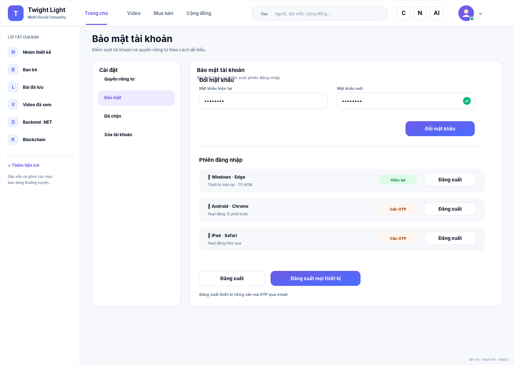

Nguồn SVG: `design/assets/editable/svg/desktop/set-02-bao-mat-tai-khoan.svg`

##### Mobile

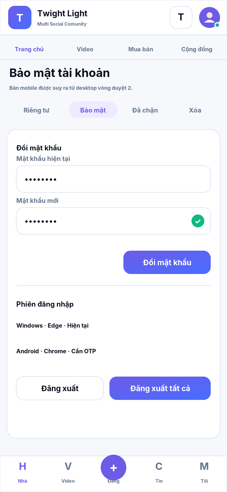

Nguồn SVG: `design/assets/editable/svg/mobile/set-02-bao-mat-tai-khoan.svg`

#### Quyết định cuối

- Trạng thái: **Đã duyệt để triển khai Frontend**.
- Phiên bản thiết kế: **1.2 Final**.
- Desktop và Mobile đã được đối chiếu về thứ tự ưu tiên, trạng thái, quyền và khả năng thao tác.
- SVG là nguồn hình chỉnh sửa; PNG chỉ dùng để duyệt.
- Các yêu cầu chưa có hợp đồng Backend phải tuân theo `design/sources/18-backend-contract-gaps.md`; không tự tạo API.

---

> **Trạng thái duyệt SET-03:** Đã duyệt

### SET-03 - Tài khoản đã chặn

#### Mục tiêu

Quản lý danh sách tài khoản đã chặn và bỏ chặn an toàn.

#### Vai trò và ưu tiên

- Vai trò: Người dùng
- Mức ưu tiên: **P0**
- Mã chức năng: `SOC-02`
- Route dự kiến: `/thiet-lap/da-chan`

#### Bố cục

- Danh sách đơn giản, ưu tiên khả năng bỏ chặn.
- Không hiển thị nội dung hoặc trạng thái hiện diện của tài khoản bị chặn.

#### Hành động

##### Chính

- Bỏ chặn

##### Phụ

- Xem hồ sơ

#### Component

- `SettingsShell`
- `UserRow`
- `ConfirmDialog`
- `EmptyState`

#### Dữ liệu và hợp đồng liên quan

- GET danh sách block theo API bổ sung
- DELETE /api/v1/users/{id}/block

Mọi endpoint chưa được khóa trong OpenAPI phải được đánh dấu là **cần khóa hợp đồng**, không tự tạo chỉ vì mockup cần dữ liệu.

#### Trạng thái bắt buộc

- Có dữ liệu
- Rỗng
- Đang cập nhật
- Thao tác lặp

Ngoài các trạng thái trên, áp dụng trạng thái dùng chung trong `design/sources/11-state-matrix.md`.

#### Tương tác và phản hồi

- Hành động có request phải có trạng thái `idle -> submitting -> success/error`.
- Double-click hoặc reconnect không được tạo side effect trùng.
- Dữ liệu nhập phải được giữ khi lỗi có thể thử lại.
- Khi route không còn quyền, điều hướng về vị trí an toàn và không tiết lộ nội dung.
- Mọi toast quan trọng phải có bản inline hoặc lịch sử phù hợp khi người dùng cần hành động.

#### Responsive

- Desktop dùng frame 1440 x 1024 trong mockup.
- Mobile dùng frame 390 x 844.
- Nội dung và hành động giữ cùng ý nghĩa; không chỉ thu nhỏ tỷ lệ.
- Bảng hoặc split view phải chuyển thành danh sách, drawer hoặc route con trên mobile.
- Touch target tối thiểu 44 x 44 px.

#### Accessibility

- Dialog bỏ chặn xác nhận bằng tên hiển thị và hành động cụ thể.

- Focus ring nhìn thấy.
- Icon-only button có tên truy cập.
- Trạng thái không truyền đạt bằng màu duy nhất.

#### Rủi ro cần kiểm soát

- Không tự suy đoán quyền từ trạng thái UI; server là nguồn quyết định.

#### Tiêu chí chấp nhận UI

- Với vai trò Người dùng, khi mở `/thiet-lap/da-chan`, màn hình hiển thị đúng dữ liệu được phép hoặc trạng thái an toàn.
- Khi thực hiện hành động chính “Bỏ chặn”, giao diện khóa gửi lặp không chủ đích và phản ánh kết quả server.
- Khi API trả 401/403/404/409/412/422/429/503 liên quan, giao diện dùng trạng thái đã định nghĩa và không làm mất dữ liệu nhập.
- Desktop và mobile giữ cùng mục tiêu, quyền và thứ tự ưu tiên hành động.
- Luồng bàn phím, focus và nhãn truy cập đạt yêu cầu trong tài liệu accessibility.

#### Hình chỉnh sửa

##### Desktop

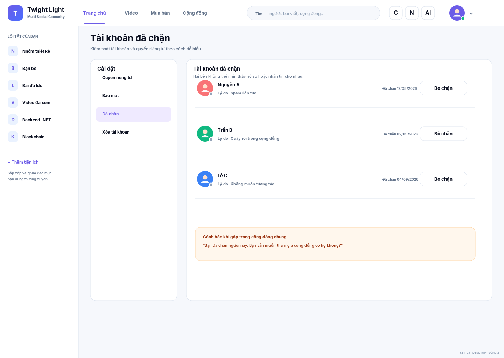

Nguồn SVG: `design/assets/editable/svg/desktop/set-03-tai-khoan-bi-chan.svg`

##### Mobile

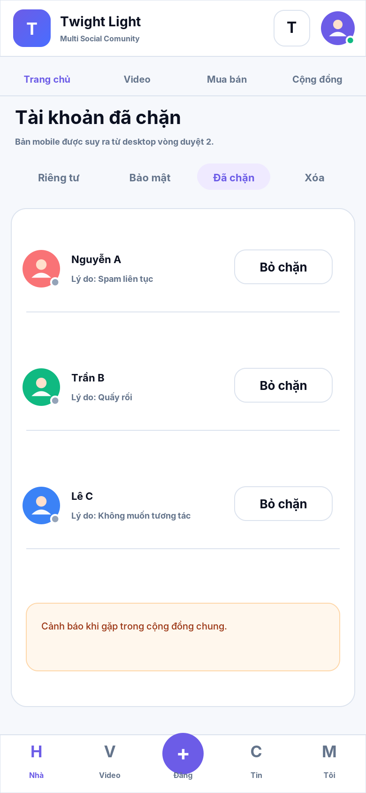

Nguồn SVG: `design/assets/editable/svg/mobile/set-03-tai-khoan-bi-chan.svg`

#### Quyết định cuối

- Trạng thái: **Đã duyệt để triển khai Frontend**.
- Phiên bản thiết kế: **1.2 Final**.
- Desktop và Mobile đã được đối chiếu về thứ tự ưu tiên, trạng thái, quyền và khả năng thao tác.
- SVG là nguồn hình chỉnh sửa; PNG chỉ dùng để duyệt.
- Các yêu cầu chưa có hợp đồng Backend phải tuân theo `design/sources/18-backend-contract-gaps.md`; không tự tạo API.

---

> **Trạng thái duyệt SET-04:** Đã duyệt

### SET-04 - Xóa tài khoản

#### Mục tiêu

Giải thích ảnh hưởng, yêu cầu xác thực lại, tạo thời gian ân hạn và hỗ trợ hủy yêu cầu.

#### Vai trò và ưu tiên

- Vai trò: Người dùng
- Mức ưu tiên: **P1**
- Mã chức năng: `ACC-11`
- Route dự kiến: `/thiet-lap/xoa-tai-khoan`

#### Bố cục

- Vùng nguy hiểm có checklist hậu quả, xác thực lại và thời gian ân hạn.
- Khi đã yêu cầu, thay CTA xóa bằng CTA hủy yêu cầu và mốc thời gian.

#### Hành động

##### Chính

- Yêu cầu xóa tài khoản

##### Phụ

- Hủy yêu cầu xóa
- Tải dữ liệu nếu có

#### Component

- `SettingsShell`
- `DangerZone`
- `ReauthDialog`
- `DeletionTimeline`
- `Button`

#### Dữ liệu và hợp đồng liên quan

- DELETE /api/v1/users/me
- POST endpoint hủy theo hợp đồng triển khai
- Hiển thị trạng thái AccountDeletionRequest

Mọi endpoint chưa được khóa trong OpenAPI phải được đánh dấu là **cần khóa hợp đồng**, không tự tạo chỉ vì mockup cần dữ liệu.

#### Trạng thái bắt buộc

- Chưa yêu cầu
- Xác thực lại
- Đang trong thời gian ân hạn
- Đang đối soát xóa
- Đã hoàn tất

Ngoài các trạng thái trên, áp dụng trạng thái dùng chung trong `design/sources/11-state-matrix.md`.

#### Tương tác và phản hồi

- Hành động có request phải có trạng thái `idle -> submitting -> success/error`.
- Double-click hoặc reconnect không được tạo side effect trùng.
- Dữ liệu nhập phải được giữ khi lỗi có thể thử lại.
- Khi route không còn quyền, điều hướng về vị trí an toàn và không tiết lộ nội dung.
- Mọi toast quan trọng phải có bản inline hoặc lịch sử phù hợp khi người dùng cần hành động.

#### Responsive

- Desktop dùng frame 1440 x 1024 trong mockup.
- Mobile dùng frame 390 x 844.
- Nội dung và hành động giữ cùng ý nghĩa; không chỉ thu nhỏ tỷ lệ.
- Bảng hoặc split view phải chuyển thành danh sách, drawer hoặc route con trên mobile.
- Touch target tối thiểu 44 x 44 px.

#### Accessibility

- Không dùng dark pattern; CTA phá hủy không là lựa chọn mặc định.
- Yêu cầu nhập xác nhận chỉ khi thật sự cần và có label.

- Focus ring nhìn thấy.
- Icon-only button có tên truy cập.
- Trạng thái không truyền đạt bằng màu duy nhất.

#### Rủi ro cần kiểm soát

- Không tự suy đoán quyền từ trạng thái UI; server là nguồn quyết định.
- Hành động có hậu quả lớn không dùng cập nhật lạc quan và phải có xác nhận rõ.

#### Tiêu chí chấp nhận UI

- Với vai trò Người dùng, khi mở `/thiet-lap/xoa-tai-khoan`, màn hình hiển thị đúng dữ liệu được phép hoặc trạng thái an toàn.
- Khi thực hiện hành động chính “Yêu cầu xóa tài khoản”, giao diện khóa gửi lặp không chủ đích và phản ánh kết quả server.
- Khi API trả 401/403/404/409/412/422/429/503 liên quan, giao diện dùng trạng thái đã định nghĩa và không làm mất dữ liệu nhập.
- Desktop và mobile giữ cùng mục tiêu, quyền và thứ tự ưu tiên hành động.
- Luồng bàn phím, focus và nhãn truy cập đạt yêu cầu trong tài liệu accessibility.

#### Hình chỉnh sửa

##### Desktop

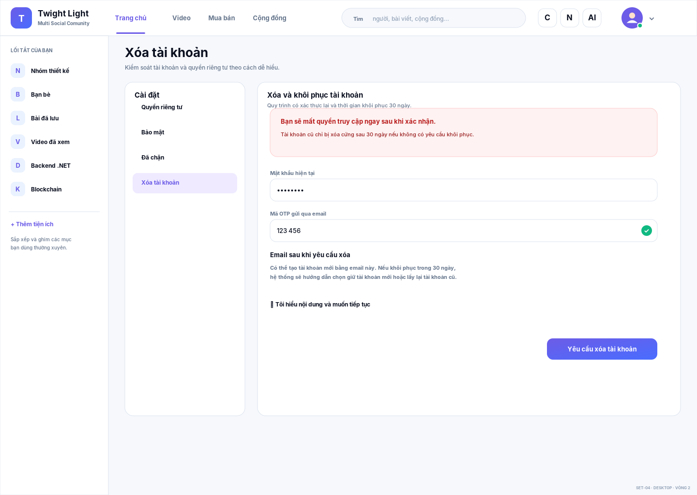

Nguồn SVG: `design/assets/editable/svg/desktop/set-04-xoa-tai-khoan.svg`

##### Mobile

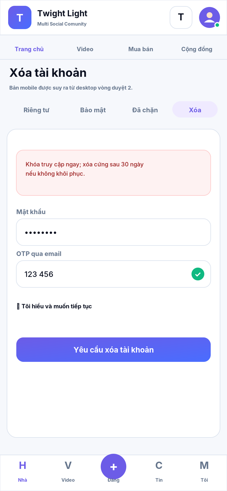

Nguồn SVG: `design/assets/editable/svg/mobile/set-04-xoa-tai-khoan.svg`

#### Quyết định cuối

- Trạng thái: **Đã duyệt để triển khai Frontend**.
- Phiên bản thiết kế: **1.2 Final**.
- Desktop và Mobile đã được đối chiếu về thứ tự ưu tiên, trạng thái, quyền và khả năng thao tác.
- SVG là nguồn hình chỉnh sửa; PNG chỉ dùng để duyệt.
- Các yêu cầu chưa có hợp đồng Backend phải tuân theo `design/sources/18-backend-contract-gaps.md`; không tự tạo API.

---

> **Trạng thái duyệt DISC-01:** Đã duyệt

### DISC-01 - Tìm kiếm

#### Mục tiêu

Tìm người dùng, bài viết, cộng đồng và tin đăng; ưu tiên FTS và nâng cấp sang tìm kiếm ngữ nghĩa khi khả dụng.

#### Vai trò và ưu tiên

- Vai trò: Người dùng
- Mức ưu tiên: **P2**
- Mã chức năng: `AI-02`, `MKT-02`, `SOC-06`
- Route dự kiến: `/tim-kiem`

#### Bố cục

- Ô tìm kiếm nổi bật; tabs Người dùng/Bài viết/Cộng đồng/Tin đăng.
- Kết quả có nhóm và snippet; lọc responsive bằng drawer.

#### Hành động

##### Chính

- Tìm kiếm

##### Phụ

- Lọc loại kết quả
- Sắp xếp

#### Component

- `AppShell`
- `SearchField`
- `Tabs`
- `FilterDrawer`
- `SearchResultCard`
- `EmptyState`

#### Dữ liệu và hợp đồng liên quan

- GET /api/v1/search/semantic
- Fallback PostgreSQL FTS hoặc endpoint tìm kiếm miền.

Mọi endpoint chưa được khóa trong OpenAPI phải được đánh dấu là **cần khóa hợp đồng**, không tự tạo chỉ vì mockup cần dữ liệu.

#### Trạng thái bắt buộc

- Gợi ý ban đầu
- Đang tìm
- Có kết quả
- Không có kết quả
- AI không khả dụng và dùng tìm kiếm thường

Ngoài các trạng thái trên, áp dụng trạng thái dùng chung trong `design/sources/11-state-matrix.md`.

#### Tương tác và phản hồi

- Hành động có request phải có trạng thái `idle -> submitting -> success/error`.
- Double-click hoặc reconnect không được tạo side effect trùng.
- Dữ liệu nhập phải được giữ khi lỗi có thể thử lại.
- Khi route không còn quyền, điều hướng về vị trí an toàn và không tiết lộ nội dung.
- Mọi toast quan trọng phải có bản inline hoặc lịch sử phù hợp khi người dùng cần hành động.

#### Responsive

- Desktop dùng frame 1440 x 1024 trong mockup.
- Mobile dùng frame 390 x 844.
- Nội dung và hành động giữ cùng ý nghĩa; không chỉ thu nhỏ tỷ lệ.
- Bảng hoặc split view phải chuyển thành danh sách, drawer hoặc route con trên mobile.
- Touch target tối thiểu 44 x 44 px.

#### Accessibility

- Kết quả dùng region có heading.
- Thông báo số kết quả bằng live region sau khi người dùng dừng gõ.

- Focus ring nhìn thấy.
- Icon-only button có tên truy cập.
- Trạng thái không truyền đạt bằng màu duy nhất.

#### Rủi ro cần kiểm soát

- Không tự suy đoán quyền từ trạng thái UI; server là nguồn quyết định.
- Mô-đun có thể bị tắt bằng feature flag; không để điều hướng chết.

#### Tiêu chí chấp nhận UI

- Với vai trò Người dùng, khi mở `/tim-kiem`, màn hình hiển thị đúng dữ liệu được phép hoặc trạng thái an toàn.
- Khi thực hiện hành động chính “Tìm kiếm”, giao diện khóa gửi lặp không chủ đích và phản ánh kết quả server.
- Khi API trả 401/403/404/409/412/422/429/503 liên quan, giao diện dùng trạng thái đã định nghĩa và không làm mất dữ liệu nhập.
- Desktop và mobile giữ cùng mục tiêu, quyền và thứ tự ưu tiên hành động.
- Luồng bàn phím, focus và nhãn truy cập đạt yêu cầu trong tài liệu accessibility.

#### Hình chỉnh sửa

##### Desktop

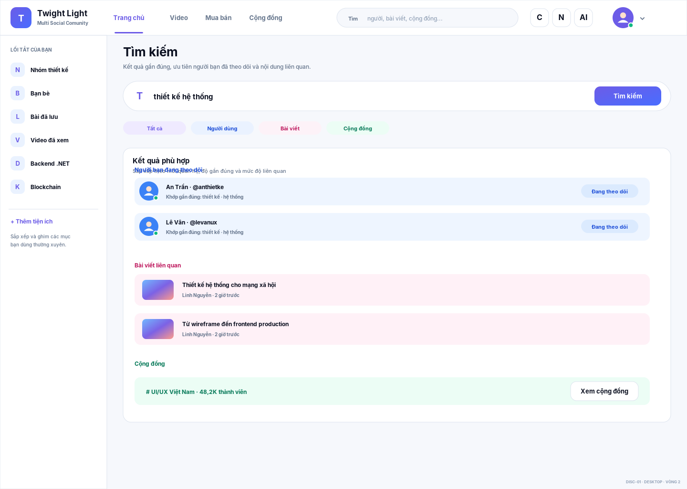

Nguồn SVG: `design/assets/editable/svg/desktop/disc-01-tim-kiem.svg`

##### Mobile

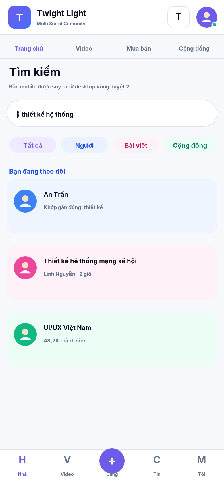

Nguồn SVG: `design/assets/editable/svg/mobile/disc-01-tim-kiem.svg`

#### Quyết định cuối

- Trạng thái: **Đã duyệt để triển khai Frontend**.
- Phiên bản thiết kế: **1.2 Final**.
- Desktop và Mobile đã được đối chiếu về thứ tự ưu tiên, trạng thái, quyền và khả năng thao tác.
- SVG là nguồn hình chỉnh sửa; PNG chỉ dùng để duyệt.
- Các yêu cầu chưa có hợp đồng Backend phải tuân theo `design/sources/18-backend-contract-gaps.md`; không tự tạo API.

---

> **Trạng thái duyệt NOTI-01:** Đã duyệt

### NOTI-01 - Thông báo

#### Mục tiêu

Hiển thị hộp thông báo theo con trỏ, đánh dấu đã đọc và điều hướng đến đối tượng liên quan.

#### Vai trò và ưu tiên

- Vai trò: Người dùng
- Mức ưu tiên: **P0**
- Mã chức năng: `CHT-08`
- Route dự kiến: `/thong-bao`

#### Bố cục

- Bộ lọc Tất cả/Chưa đọc và danh sách theo ngày.
- Mỗi item có loại, actor, nội dung rút gọn, thời gian và trạng thái đọc.

#### Hành động

##### Chính

- Mở thông báo

##### Phụ

- Đánh dấu tất cả đã đọc
- Lọc chưa đọc

#### Component

- `AppShell`
- `FilterChips`
- `NotificationItem`
- `UnreadBadge`
- `EmptyState`

#### Dữ liệu và hợp đồng liên quan

- GET /api/v1/notifications
- PATCH/POST đánh dấu đọc theo hợp đồng triển khai
- SignalR NotificationCreated

Mọi endpoint chưa được khóa trong OpenAPI phải được đánh dấu là **cần khóa hợp đồng**, không tự tạo chỉ vì mockup cần dữ liệu.

#### Trạng thái bắt buộc

- Có thông báo mới
- Rỗng
- Đang tải
- Ngoại tuyến
- Đối tượng đích đã bị xóa

Ngoài các trạng thái trên, áp dụng trạng thái dùng chung trong `design/sources/11-state-matrix.md`.

#### Tương tác và phản hồi

- Hành động có request phải có trạng thái `idle -> submitting -> success/error`.
- Double-click hoặc reconnect không được tạo side effect trùng.
- Dữ liệu nhập phải được giữ khi lỗi có thể thử lại.
- Khi route không còn quyền, điều hướng về vị trí an toàn và không tiết lộ nội dung.
- Mọi toast quan trọng phải có bản inline hoặc lịch sử phù hợp khi người dùng cần hành động.

#### Responsive

- Desktop dùng frame 1440 x 1024 trong mockup.
- Mobile dùng frame 390 x 844.
- Nội dung và hành động giữ cùng ý nghĩa; không chỉ thu nhỏ tỷ lệ.
- Bảng hoặc split view phải chuyển thành danh sách, drawer hoặc route con trên mobile.
- Touch target tối thiểu 44 x 44 px.

#### Accessibility

- Item chưa đọc không chỉ khác màu; có nhãn 'Chưa đọc' ẩn/hiển thị.
- Không tự di chuyển item đang focus khi có thông báo mới.

- Focus ring nhìn thấy.
- Icon-only button có tên truy cập.
- Trạng thái không truyền đạt bằng màu duy nhất.

#### Rủi ro cần kiểm soát

- Không tự suy đoán quyền từ trạng thái UI; server là nguồn quyết định.

#### Tiêu chí chấp nhận UI

- Với vai trò Người dùng, khi mở `/thong-bao`, màn hình hiển thị đúng dữ liệu được phép hoặc trạng thái an toàn.
- Khi thực hiện hành động chính “Mở thông báo”, giao diện khóa gửi lặp không chủ đích và phản ánh kết quả server.
- Khi API trả 401/403/404/409/412/422/429/503 liên quan, giao diện dùng trạng thái đã định nghĩa và không làm mất dữ liệu nhập.
- Desktop và mobile giữ cùng mục tiêu, quyền và thứ tự ưu tiên hành động.
- Luồng bàn phím, focus và nhãn truy cập đạt yêu cầu trong tài liệu accessibility.

#### Hình chỉnh sửa

##### Desktop

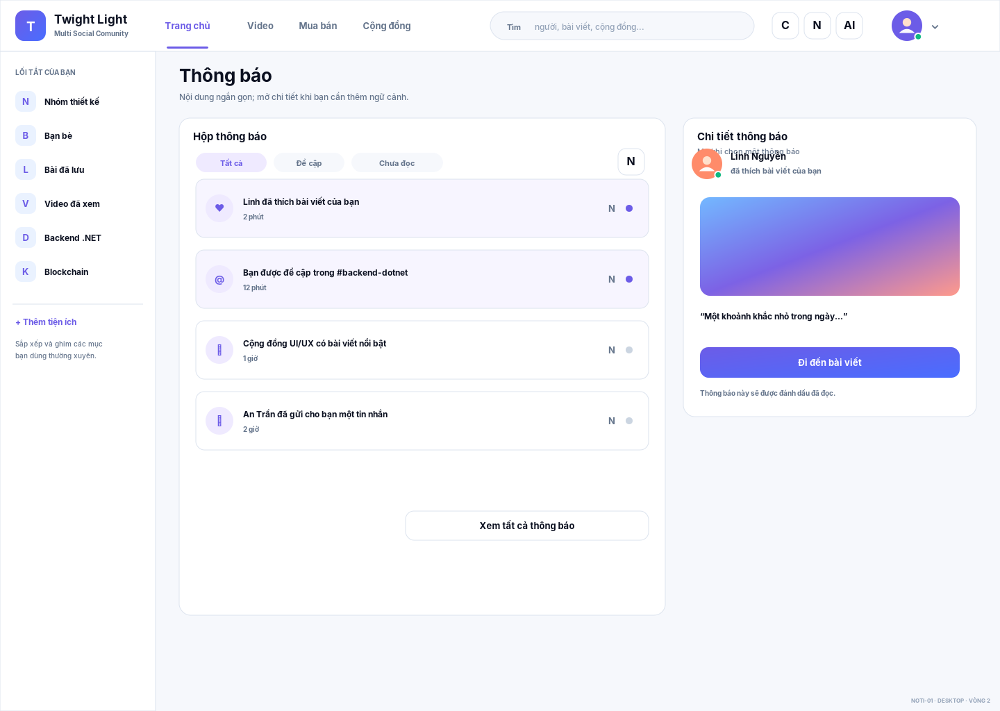

Nguồn SVG: `design/assets/editable/svg/desktop/noti-01-thong-bao.svg`

##### Mobile

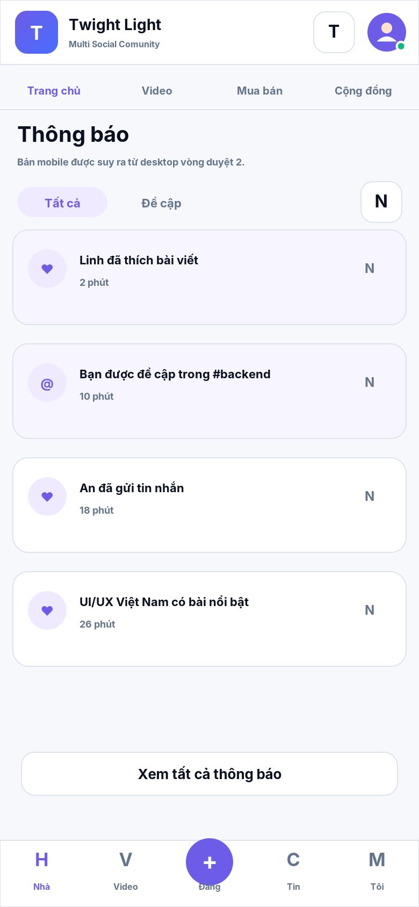

Nguồn SVG: `design/assets/editable/svg/mobile/noti-01-thong-bao.svg`

#### Quyết định cuối

- Trạng thái: **Đã duyệt để triển khai Frontend**.
- Phiên bản thiết kế: **1.2 Final**.
- Desktop và Mobile đã được đối chiếu về thứ tự ưu tiên, trạng thái, quyền và khả năng thao tác.
- SVG là nguồn hình chỉnh sửa; PNG chỉ dùng để duyệt.
- Các yêu cầu chưa có hợp đồng Backend phải tuân theo `design/sources/18-backend-contract-gaps.md`; không tự tạo API.

---

> **Trạng thái duyệt COMM-01:** Đã duyệt

### COMM-01 - Khám phá cộng đồng

#### Mục tiêu

Tìm cộng đồng công khai, xem gợi ý và tạo cộng đồng mới.

#### Vai trò và ưu tiên

- Vai trò: Người dùng
- Mức ưu tiên: **P1**
- Mã chức năng: `COM-01`, `COM-02`
- Route dự kiến: `/cong-dong`

#### Bố cục

- Hero tìm kiếm nhỏ, lưới community card và danh mục.
- Mobile chuyển lưới thành danh sách.

#### Hành động

##### Chính

- Tham gia cộng đồng

##### Phụ

- Tạo cộng đồng
- Tìm kiếm

#### Component

- `AppShell`
- `SearchField`
- `CommunityCard`
- `CategoryChips`
- `CreateCommunityDialog`

#### Dữ liệu và hợp đồng liên quan

- GET danh sách cộng đồng theo API triển khai
- POST /api/v1/communities/{id}/join
- POST /api/v1/communities

Mọi endpoint chưa được khóa trong OpenAPI phải được đánh dấu là **cần khóa hợp đồng**, không tự tạo chỉ vì mockup cần dữ liệu.

#### Trạng thái bắt buộc

- Có gợi ý
- Không có kết quả
- Đang tham gia
- Bị cấm tham gia

Ngoài các trạng thái trên, áp dụng trạng thái dùng chung trong `design/sources/11-state-matrix.md`.

#### Tương tác và phản hồi

- Hành động có request phải có trạng thái `idle -> submitting -> success/error`.
- Double-click hoặc reconnect không được tạo side effect trùng.
- Dữ liệu nhập phải được giữ khi lỗi có thể thử lại.
- Khi route không còn quyền, điều hướng về vị trí an toàn và không tiết lộ nội dung.
- Mọi toast quan trọng phải có bản inline hoặc lịch sử phù hợp khi người dùng cần hành động.

#### Responsive

- Desktop dùng frame 1440 x 1024 trong mockup.
- Mobile dùng frame 390 x 844.
- Nội dung và hành động giữ cùng ý nghĩa; không chỉ thu nhỏ tỷ lệ.
- Bảng hoặc split view phải chuyển thành danh sách, drawer hoặc route con trên mobile.
- Touch target tối thiểu 44 x 44 px.

#### Accessibility

- Card không biến toàn bộ nội dung thành một nút lồng nút.
- CTA Tham gia có trạng thái loading riêng.

- Focus ring nhìn thấy.
- Icon-only button có tên truy cập.
- Trạng thái không truyền đạt bằng màu duy nhất.

#### Rủi ro cần kiểm soát

- Không tự suy đoán quyền từ trạng thái UI; server là nguồn quyết định.

#### Tiêu chí chấp nhận UI

- Với vai trò Người dùng, khi mở `/cong-dong`, màn hình hiển thị đúng dữ liệu được phép hoặc trạng thái an toàn.
- Khi thực hiện hành động chính “Tham gia cộng đồng”, giao diện khóa gửi lặp không chủ đích và phản ánh kết quả server.
- Khi API trả 401/403/404/409/412/422/429/503 liên quan, giao diện dùng trạng thái đã định nghĩa và không làm mất dữ liệu nhập.
- Desktop và mobile giữ cùng mục tiêu, quyền và thứ tự ưu tiên hành động.
- Luồng bàn phím, focus và nhãn truy cập đạt yêu cầu trong tài liệu accessibility.

#### Hình chỉnh sửa

##### Desktop

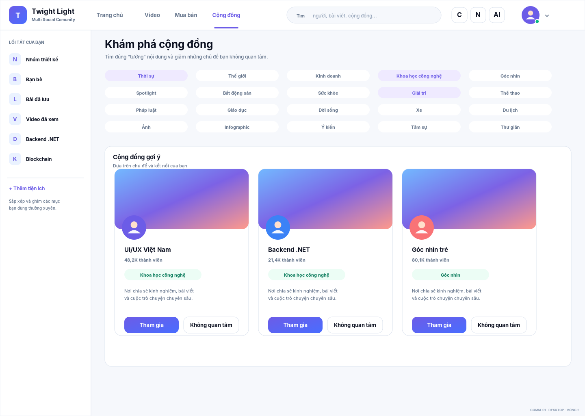

Nguồn SVG: `design/assets/editable/svg/desktop/comm-01-kham-pha-cong-dong.svg`

##### Mobile

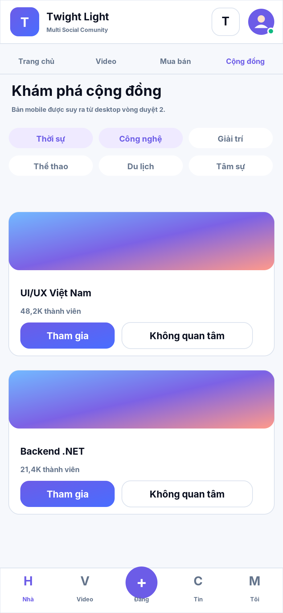

Nguồn SVG: `design/assets/editable/svg/mobile/comm-01-kham-pha-cong-dong.svg`

#### Quyết định cuối

- Trạng thái: **Đã duyệt để triển khai Frontend**.
- Phiên bản thiết kế: **1.2 Final**.
- Desktop và Mobile đã được đối chiếu về thứ tự ưu tiên, trạng thái, quyền và khả năng thao tác.
- SVG là nguồn hình chỉnh sửa; PNG chỉ dùng để duyệt.
- Các yêu cầu chưa có hợp đồng Backend phải tuân theo `design/sources/18-backend-contract-gaps.md`; không tự tạo API.

---

> **Trạng thái duyệt COMM-02:** Đã duyệt

### COMM-02 - Tổng quan cộng đồng

#### Mục tiêu

Hiển thị giới thiệu, quy tắc, kênh, thành viên nổi bật và hành động tham gia/rời.

#### Vai trò và ưu tiên

- Vai trò: Thành viên, Khách theo chính sách
- Mức ưu tiên: **P1**
- Mã chức năng: `COM-01`, `COM-02`, `COM-04`
- Route dự kiến: `/cong-dong/:id`

#### Bố cục

- Banner, thông tin cộng đồng, danh sách kênh và card thành viên.
- Khi đã tham gia, điều hướng kênh xuất hiện rõ.

#### Hành động

##### Chính

- Mở kênh
- Tham gia hoặc rời

##### Phụ

- Mời thành viên
- Mở thiết lập nếu có quyền

#### Component

- `CommunityShell`
- `CommunityHeader`
- `ChannelList`
- `MemberPreview`
- `JoinButton`

#### Dữ liệu và hợp đồng liên quan

- GET community detail
- POST join/leave
- GET channels/members

Mọi endpoint chưa được khóa trong OpenAPI phải được đánh dấu là **cần khóa hợp đồng**, không tự tạo chỉ vì mockup cần dữ liệu.

#### Trạng thái bắt buộc

- Công khai
- Chưa tham gia
- Đã tham gia
- Bị cấm
- Cộng đồng đã đóng

Ngoài các trạng thái trên, áp dụng trạng thái dùng chung trong `design/sources/11-state-matrix.md`.

#### Tương tác và phản hồi

- Hành động có request phải có trạng thái `idle -> submitting -> success/error`.
- Double-click hoặc reconnect không được tạo side effect trùng.
- Dữ liệu nhập phải được giữ khi lỗi có thể thử lại.
- Khi route không còn quyền, điều hướng về vị trí an toàn và không tiết lộ nội dung.
- Mọi toast quan trọng phải có bản inline hoặc lịch sử phù hợp khi người dùng cần hành động.

#### Responsive

- Desktop dùng frame 1440 x 1024 trong mockup.
- Mobile dùng frame 390 x 844.
- Nội dung và hành động giữ cùng ý nghĩa; không chỉ thu nhỏ tỷ lệ.
- Bảng hoặc split view phải chuyển thành danh sách, drawer hoặc route con trên mobile.
- Touch target tối thiểu 44 x 44 px.

#### Accessibility

- Banner chỉ trang trí thì alt rỗng.
- Danh sách kênh có nhóm Văn bản/Thoại.

- Focus ring nhìn thấy.
- Icon-only button có tên truy cập.
- Trạng thái không truyền đạt bằng màu duy nhất.

#### Rủi ro cần kiểm soát

- Không tự suy đoán quyền từ trạng thái UI; server là nguồn quyết định.

#### Tiêu chí chấp nhận UI

- Với vai trò Thành viên, Khách theo chính sách, khi mở `/cong-dong/:id`, màn hình hiển thị đúng dữ liệu được phép hoặc trạng thái an toàn.
- Khi thực hiện hành động chính “Mở kênh”, giao diện khóa gửi lặp không chủ đích và phản ánh kết quả server.
- Khi API trả 401/403/404/409/412/422/429/503 liên quan, giao diện dùng trạng thái đã định nghĩa và không làm mất dữ liệu nhập.
- Desktop và mobile giữ cùng mục tiêu, quyền và thứ tự ưu tiên hành động.
- Luồng bàn phím, focus và nhãn truy cập đạt yêu cầu trong tài liệu accessibility.

#### Hình chỉnh sửa

##### Desktop

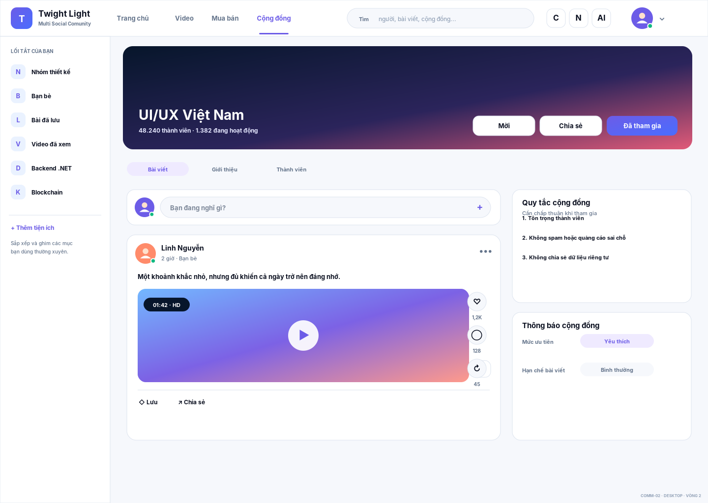

Nguồn SVG: `design/assets/editable/svg/desktop/comm-02-tong-quan-cong-dong.svg`

##### Mobile

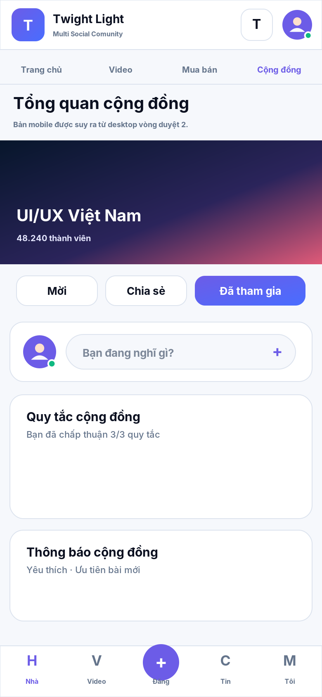

Nguồn SVG: `design/assets/editable/svg/mobile/comm-02-tong-quan-cong-dong.svg`

#### Quyết định cuối

- Trạng thái: **Đã duyệt để triển khai Frontend**.
- Phiên bản thiết kế: **1.2 Final**.
- Desktop và Mobile đã được đối chiếu về thứ tự ưu tiên, trạng thái, quyền và khả năng thao tác.
- SVG là nguồn hình chỉnh sửa; PNG chỉ dùng để duyệt.
- Các yêu cầu chưa có hợp đồng Backend phải tuân theo `design/sources/18-backend-contract-gaps.md`; không tự tạo API.

---

> **Trạng thái duyệt COMM-03:** Đã duyệt

### COMM-03 - Mời và tham gia cộng đồng

#### Mục tiêu

Xác nhận thông tin lời mời, hạn dùng và quyền trước khi tham gia.

#### Vai trò và ưu tiên

- Vai trò: Người dùng
- Mức ưu tiên: **P1**
- Mã chức năng: `COM-02`
- Route dự kiến: `/loi-moi/:code`

#### Bố cục

- Card lời mời tập trung: avatar cộng đồng, người mời, số thành viên, thời hạn.
- Không cho người dùng tham gia khi chưa đăng nhập; giữ mã mời sau login.

#### Hành động

##### Chính

- Tham gia

##### Phụ

- Từ chối

#### Component

- `AuthAwareShell`
- `InviteCard`
- `JoinButton`
- `StatusMessage`

#### Dữ liệu và hợp đồng liên quan

- POST /api/v1/communities/{id}/join với invite code

Mọi endpoint chưa được khóa trong OpenAPI phải được đánh dấu là **cần khóa hợp đồng**, không tự tạo chỉ vì mockup cần dữ liệu.

#### Trạng thái bắt buộc

- Hợp lệ
- Hết hạn
- Hết lượt
- Đã là thành viên
- Bị cấm

Ngoài các trạng thái trên, áp dụng trạng thái dùng chung trong `design/sources/11-state-matrix.md`.

#### Tương tác và phản hồi

- Hành động có request phải có trạng thái `idle -> submitting -> success/error`.
- Double-click hoặc reconnect không được tạo side effect trùng.
- Dữ liệu nhập phải được giữ khi lỗi có thể thử lại.
- Khi route không còn quyền, điều hướng về vị trí an toàn và không tiết lộ nội dung.
- Mọi toast quan trọng phải có bản inline hoặc lịch sử phù hợp khi người dùng cần hành động.

#### Responsive

- Desktop dùng frame 1440 x 1024 trong mockup.
- Mobile dùng frame 390 x 844.
- Nội dung và hành động giữ cùng ý nghĩa; không chỉ thu nhỏ tỷ lệ.
- Bảng hoặc split view phải chuyển thành danh sách, drawer hoặc route con trên mobile.
- Touch target tối thiểu 44 x 44 px.

#### Accessibility

- Trạng thái hết hạn được công bố rõ và CTA bị vô hiệu có lý do.

- Focus ring nhìn thấy.
- Icon-only button có tên truy cập.
- Trạng thái không truyền đạt bằng màu duy nhất.

#### Rủi ro cần kiểm soát

- Không tự suy đoán quyền từ trạng thái UI; server là nguồn quyết định.

#### Tiêu chí chấp nhận UI

- Với vai trò Người dùng, khi mở `/loi-moi/:code`, màn hình hiển thị đúng dữ liệu được phép hoặc trạng thái an toàn.
- Khi thực hiện hành động chính “Tham gia”, giao diện khóa gửi lặp không chủ đích và phản ánh kết quả server.
- Khi API trả 401/403/404/409/412/422/429/503 liên quan, giao diện dùng trạng thái đã định nghĩa và không làm mất dữ liệu nhập.
- Desktop và mobile giữ cùng mục tiêu, quyền và thứ tự ưu tiên hành động.
- Luồng bàn phím, focus và nhãn truy cập đạt yêu cầu trong tài liệu accessibility.

#### Hình chỉnh sửa

##### Desktop

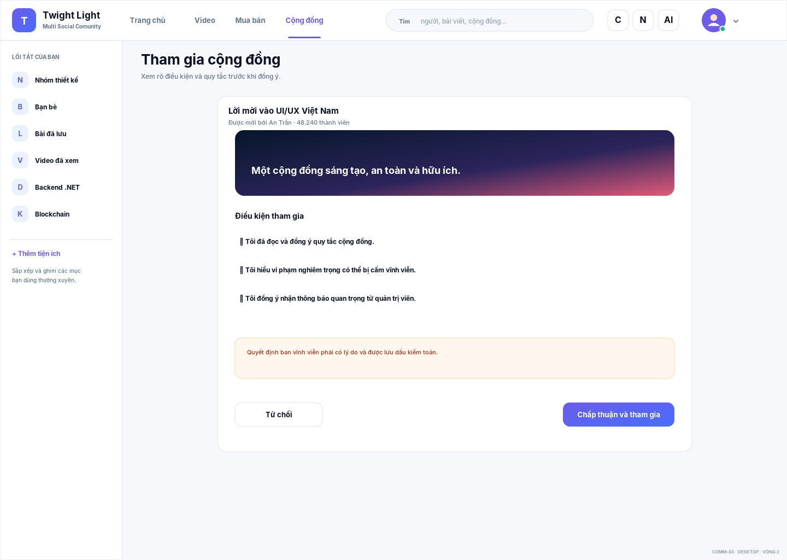

Nguồn SVG: `design/assets/editable/svg/desktop/comm-03-moi-va-tham-gia.svg`

##### Mobile

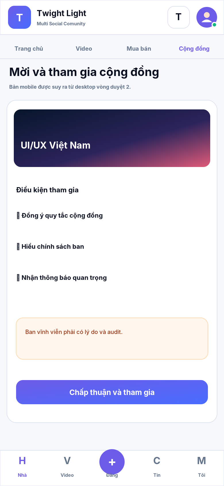

Nguồn SVG: `design/assets/editable/svg/mobile/comm-03-moi-va-tham-gia.svg`

#### Quyết định cuối

- Trạng thái: **Đã duyệt để triển khai Frontend**.
- Phiên bản thiết kế: **1.2 Final**.
- Desktop và Mobile đã được đối chiếu về thứ tự ưu tiên, trạng thái, quyền và khả năng thao tác.
- SVG là nguồn hình chỉnh sửa; PNG chỉ dùng để duyệt.
- Các yêu cầu chưa có hợp đồng Backend phải tuân theo `design/sources/18-backend-contract-gaps.md`; không tự tạo API.

---

> **Trạng thái duyệt COMM-04:** Đã duyệt

### COMM-04 - Vai trò và quyền

#### Mục tiêu

Tạo vai trò, sắp xếp độ ưu tiên, cấp quyền và gán thành viên mà không cho phép leo quyền.

#### Vai trò và ưu tiên

- Vai trò: Chủ sở hữu, Điều hành viên
- Mức ưu tiên: **P1**
- Mã chức năng: `COM-03`
- Route dự kiến: `/cong-dong/:id/vai-tro`

#### Bố cục

- Desktop split view: danh sách vai trò trái, chi tiết quyền phải.
- Mobile dùng danh sách rồi trang chi tiết; cảnh báo quyền nhạy cảm.

#### Hành động

##### Chính

- Tạo hoặc lưu vai trò

##### Phụ

- Gán thành viên
- Sao chép vai trò

#### Component

- `AdminShell`
- `RoleList`
- `PermissionMatrix`
- `MemberPicker`
- `ConflictDialog`

#### Dữ liệu và hợp đồng liên quan

- GET/POST/PATCH roles và member roles theo API triển khai
- If-Match cho tài nguyên có version

Mọi endpoint chưa được khóa trong OpenAPI phải được đánh dấu là **cần khóa hợp đồng**, không tự tạo chỉ vì mockup cần dữ liệu.

#### Trạng thái bắt buộc

- Danh sách vai trò
- Đang chỉnh sửa
- Cố leo quyền bị chặn
- Xung đột phiên bản

Ngoài các trạng thái trên, áp dụng trạng thái dùng chung trong `design/sources/11-state-matrix.md`.

#### Tương tác và phản hồi

- Hành động có request phải có trạng thái `idle -> submitting -> success/error`.
- Double-click hoặc reconnect không được tạo side effect trùng.
- Dữ liệu nhập phải được giữ khi lỗi có thể thử lại.
- Khi route không còn quyền, điều hướng về vị trí an toàn và không tiết lộ nội dung.
- Mọi toast quan trọng phải có bản inline hoặc lịch sử phù hợp khi người dùng cần hành động.

#### Responsive

- Desktop dùng frame 1440 x 1024 trong mockup.
- Mobile dùng frame 390 x 844.
- Nội dung và hành động giữ cùng ý nghĩa; không chỉ thu nhỏ tỷ lệ.
- Bảng hoặc split view phải chuyển thành danh sách, drawer hoặc route con trên mobile.
- Touch target tối thiểu 44 x 44 px.

#### Accessibility

- Nhóm quyền dùng fieldset/legend.
- Drag sort có phương án phím lên/xuống.

- Focus ring nhìn thấy.
- Icon-only button có tên truy cập.
- Trạng thái không truyền đạt bằng màu duy nhất.

#### Rủi ro cần kiểm soát

- Không tự suy đoán quyền từ trạng thái UI; server là nguồn quyết định.

#### Tiêu chí chấp nhận UI

- Với vai trò Chủ sở hữu, Điều hành viên, khi mở `/cong-dong/:id/vai-tro`, màn hình hiển thị đúng dữ liệu được phép hoặc trạng thái an toàn.
- Khi thực hiện hành động chính “Tạo hoặc lưu vai trò”, giao diện khóa gửi lặp không chủ đích và phản ánh kết quả server.
- Khi API trả 401/403/404/409/412/422/429/503 liên quan, giao diện dùng trạng thái đã định nghĩa và không làm mất dữ liệu nhập.
- Desktop và mobile giữ cùng mục tiêu, quyền và thứ tự ưu tiên hành động.
- Luồng bàn phím, focus và nhãn truy cập đạt yêu cầu trong tài liệu accessibility.

#### Hình chỉnh sửa

##### Desktop

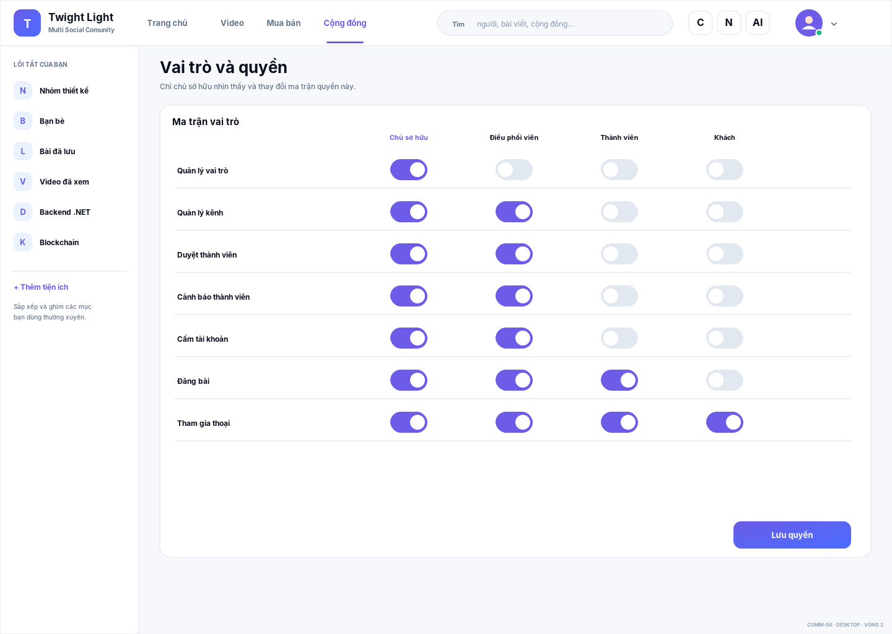

Nguồn SVG: `design/assets/editable/svg/desktop/comm-04-vai-tro-va-quyen.svg`

##### Mobile

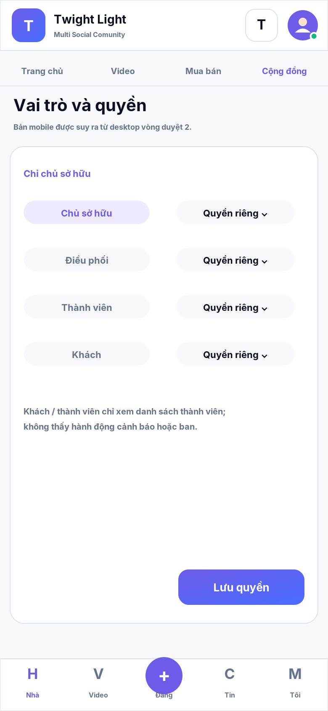

Nguồn SVG: `design/assets/editable/svg/mobile/comm-04-vai-tro-va-quyen.svg`

#### Quyết định cuối

- Trạng thái: **Đã duyệt để triển khai Frontend**.
- Phiên bản thiết kế: **1.2 Final**.
- Desktop và Mobile đã được đối chiếu về thứ tự ưu tiên, trạng thái, quyền và khả năng thao tác.
- SVG là nguồn hình chỉnh sửa; PNG chỉ dùng để duyệt.
- Các yêu cầu chưa có hợp đồng Backend phải tuân theo `design/sources/18-backend-contract-gaps.md`; không tự tạo API.

---

> **Trạng thái duyệt COMM-05:** Đã duyệt

### COMM-05 - Quản lý kênh

#### Mục tiêu

Tạo, sắp xếp và cấu hình kênh văn bản hoặc thoại theo quyền.

#### Vai trò và ưu tiên

- Vai trò: Điều hành viên
- Mức ưu tiên: **P1**
- Mã chức năng: `COM-04`
- Route dự kiến: `/cong-dong/:id/kenh`

#### Bố cục

- Cây kênh có nhóm và khả năng sắp xếp; panel chi tiết loại kênh/quyền.
- Hiển thị badge 'Đang đồng bộ' khi Chat projection chưa sẵn sàng.

#### Hành động

##### Chính

- Tạo kênh

##### Phụ

- Sắp xếp
- Chỉnh quyền kênh

#### Component

- `AdminShell`
- `ChannelTree`
- `ChannelForm`
- `PermissionPanel`
- `SyncBadge`

#### Dữ liệu và hợp đồng liên quan

- POST /api/v1/communities/{id}/channels
- PATCH channel khi API được khóa

Mọi endpoint chưa được khóa trong OpenAPI phải được đánh dấu là **cần khóa hợp đồng**, không tự tạo chỉ vì mockup cần dữ liệu.

#### Trạng thái bắt buộc

- Có kênh
- Rỗng
- Projection trò chuyện đang đồng bộ
- Không đủ quyền

Ngoài các trạng thái trên, áp dụng trạng thái dùng chung trong `design/sources/11-state-matrix.md`.

#### Tương tác và phản hồi

- Hành động có request phải có trạng thái `idle -> submitting -> success/error`.
- Double-click hoặc reconnect không được tạo side effect trùng.
- Dữ liệu nhập phải được giữ khi lỗi có thể thử lại.
- Khi route không còn quyền, điều hướng về vị trí an toàn và không tiết lộ nội dung.
- Mọi toast quan trọng phải có bản inline hoặc lịch sử phù hợp khi người dùng cần hành động.

#### Responsive

- Desktop dùng frame 1440 x 1024 trong mockup.
- Mobile dùng frame 390 x 844.
- Nội dung và hành động giữ cùng ý nghĩa; không chỉ thu nhỏ tỷ lệ.
- Bảng hoặc split view phải chuyển thành danh sách, drawer hoặc route con trên mobile.
- Touch target tối thiểu 44 x 44 px.

#### Accessibility

- Reorder phải có nút bàn phím, không chỉ kéo thả.
- Thông báo kết quả đồng bộ.

- Focus ring nhìn thấy.
- Icon-only button có tên truy cập.
- Trạng thái không truyền đạt bằng màu duy nhất.

#### Rủi ro cần kiểm soát

- Không tự suy đoán quyền từ trạng thái UI; server là nguồn quyết định.

#### Tiêu chí chấp nhận UI

- Với vai trò Điều hành viên, khi mở `/cong-dong/:id/kenh`, màn hình hiển thị đúng dữ liệu được phép hoặc trạng thái an toàn.
- Khi thực hiện hành động chính “Tạo kênh”, giao diện khóa gửi lặp không chủ đích và phản ánh kết quả server.
- Khi API trả 401/403/404/409/412/422/429/503 liên quan, giao diện dùng trạng thái đã định nghĩa và không làm mất dữ liệu nhập.
- Desktop và mobile giữ cùng mục tiêu, quyền và thứ tự ưu tiên hành động.
- Luồng bàn phím, focus và nhãn truy cập đạt yêu cầu trong tài liệu accessibility.

#### Hình chỉnh sửa

##### Desktop

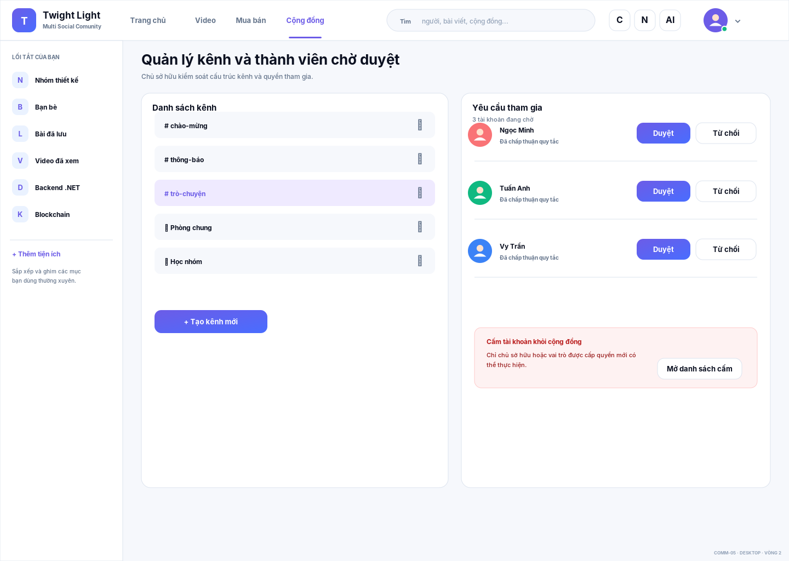

Nguồn SVG: `design/assets/editable/svg/desktop/comm-05-quan-ly-kenh.svg`

##### Mobile

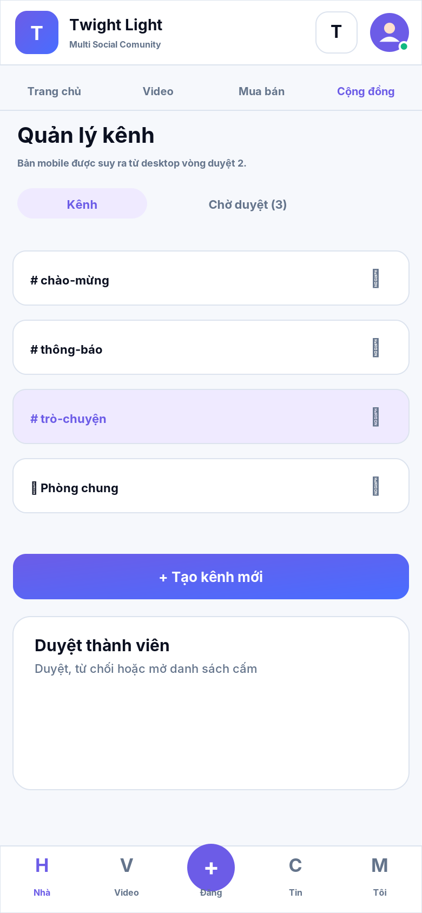

Nguồn SVG: `design/assets/editable/svg/mobile/comm-05-quan-ly-kenh.svg`

#### Quyết định cuối

- Trạng thái: **Đã duyệt để triển khai Frontend**.
- Phiên bản thiết kế: **1.2 Final**.
- Desktop và Mobile đã được đối chiếu về thứ tự ưu tiên, trạng thái, quyền và khả năng thao tác.
- SVG là nguồn hình chỉnh sửa; PNG chỉ dùng để duyệt.
- Các yêu cầu chưa có hợp đồng Backend phải tuân theo `design/sources/18-backend-contract-gaps.md`; không tự tạo API.

---

> **Trạng thái duyệt COMM-06:** Đã duyệt

### COMM-06 - Điều hành thành viên

#### Mục tiêu

Tìm thành viên, xem vai trò và áp dụng mute, kick hoặc ban theo phân cấp.

#### Vai trò và ưu tiên

- Vai trò: Điều hành viên
- Mức ưu tiên: **P1**
- Mã chức năng: `COM-05`
- Route dự kiến: `/cong-dong/:id/thanh-vien`

#### Bố cục

- Bảng/list thành viên với lọc vai trò/trạng thái.
- Action drawer chứa mute/kick/ban và lý do bắt buộc.

#### Hành động

##### Chính

- Áp dụng hành động

##### Phụ

- Đổi vai trò
- Xem nhật ký

#### Component

- `AdminShell`
- `FilterBar`
- `MemberTable`
- `ModerationDrawer`
- `ConfirmDialog`

#### Dữ liệu và hợp đồng liên quan

- GET members
- POST member moderation

Mọi endpoint chưa được khóa trong OpenAPI phải được đánh dấu là **cần khóa hợp đồng**, không tự tạo chỉ vì mockup cần dữ liệu.

#### Trạng thái bắt buộc

- Có dữ liệu
- Đang lọc
- Mục tiêu cao hơn không thể thao tác
- Hành động đang chờ

Ngoài các trạng thái trên, áp dụng trạng thái dùng chung trong `design/sources/11-state-matrix.md`.

#### Tương tác và phản hồi

- Hành động có request phải có trạng thái `idle -> submitting -> success/error`.
- Double-click hoặc reconnect không được tạo side effect trùng.
- Dữ liệu nhập phải được giữ khi lỗi có thể thử lại.
- Khi route không còn quyền, điều hướng về vị trí an toàn và không tiết lộ nội dung.
- Mọi toast quan trọng phải có bản inline hoặc lịch sử phù hợp khi người dùng cần hành động.

#### Responsive

- Desktop dùng frame 1440 x 1024 trong mockup.
- Mobile dùng frame 390 x 844.
- Nội dung và hành động giữ cùng ý nghĩa; không chỉ thu nhỏ tỷ lệ.
- Bảng hoặc split view phải chuyển thành danh sách, drawer hoặc route con trên mobile.
- Touch target tối thiểu 44 x 44 px.

#### Accessibility

- Bảng desktop chuyển thành card mobile nhưng giữ heading và nhãn.
- Hành động nguy hiểm yêu cầu xác nhận.

- Focus ring nhìn thấy.
- Icon-only button có tên truy cập.
- Trạng thái không truyền đạt bằng màu duy nhất.

#### Rủi ro cần kiểm soát

- Không tự suy đoán quyền từ trạng thái UI; server là nguồn quyết định.

#### Tiêu chí chấp nhận UI

- Với vai trò Điều hành viên, khi mở `/cong-dong/:id/thanh-vien`, màn hình hiển thị đúng dữ liệu được phép hoặc trạng thái an toàn.
- Khi thực hiện hành động chính “Áp dụng hành động”, giao diện khóa gửi lặp không chủ đích và phản ánh kết quả server.
- Khi API trả 401/403/404/409/412/422/429/503 liên quan, giao diện dùng trạng thái đã định nghĩa và không làm mất dữ liệu nhập.
- Desktop và mobile giữ cùng mục tiêu, quyền và thứ tự ưu tiên hành động.
- Luồng bàn phím, focus và nhãn truy cập đạt yêu cầu trong tài liệu accessibility.

#### Hình chỉnh sửa

##### Desktop

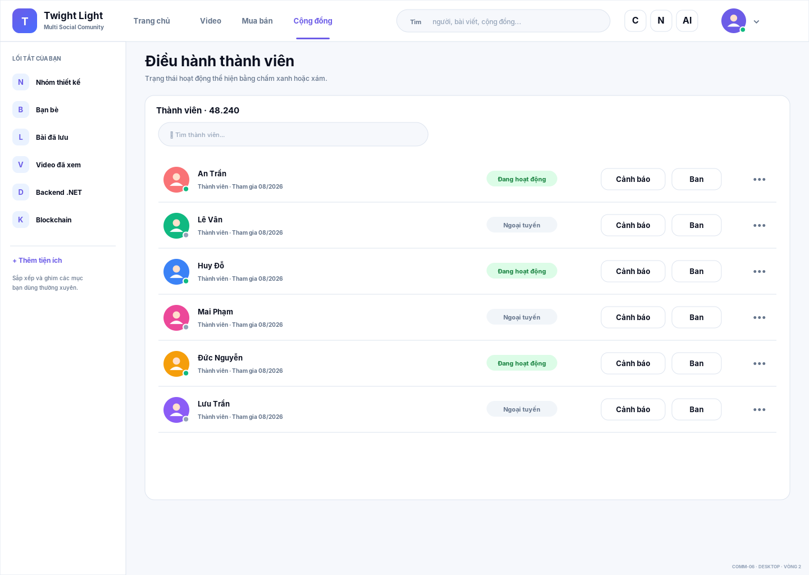

Nguồn SVG: `design/assets/editable/svg/desktop/comm-06-dieu-hanh-thanh-vien.svg`

##### Mobile

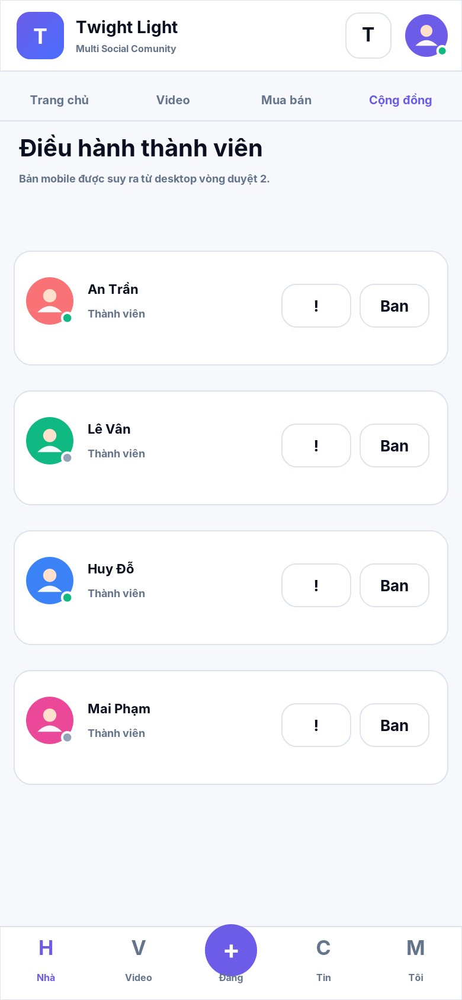

Nguồn SVG: `design/assets/editable/svg/mobile/comm-06-dieu-hanh-thanh-vien.svg`

#### Quyết định cuối

- Trạng thái: **Đã duyệt để triển khai Frontend**.
- Phiên bản thiết kế: **1.2 Final**.
- Desktop và Mobile đã được đối chiếu về thứ tự ưu tiên, trạng thái, quyền và khả năng thao tác.
- SVG là nguồn hình chỉnh sửa; PNG chỉ dùng để duyệt.
- Các yêu cầu chưa có hợp đồng Backend phải tuân theo `design/sources/18-backend-contract-gaps.md`; không tự tạo API.

---

> **Trạng thái duyệt COMM-07:** Đã duyệt

### COMM-07 - Kênh văn bản

#### Mục tiêu

Trò chuyện theo kênh, xem lịch sử bằng con trỏ và nhận cập nhật thời gian thực.

#### Vai trò và ưu tiên

- Vai trò: Thành viên
- Mức ưu tiên: **P1**
- Mã chức năng: `COM-04`, `CHT-02`, `CHT-07`
- Route dự kiến: `/cong-dong/:id/kenh/:channelId`

#### Bố cục

- Sidebar kênh, nội dung tin nhắn, danh sách thành viên tùy rộng.
- Mobile dùng drawer kênh và member; composer cố định dưới.

#### Hành động

##### Chính

- Gửi tin nhắn

##### Phụ

- Trả lời
- Tương tác
- Đánh dấu đã đọc

#### Component

- `CommunityShell`
- `ChannelList`
- `MessageLog`
- `MessageComposer`
- `MemberList`

#### Dữ liệu và hợp đồng liên quan

- GET /api/v1/conversations/{id}/messages
- SignalR SendMessage/MessageCreated/MarkRead/Typing

Mọi endpoint chưa được khóa trong OpenAPI phải được đánh dấu là **cần khóa hợp đồng**, không tự tạo chỉ vì mockup cần dữ liệu.

#### Trạng thái bắt buộc

- Đang kết nối
- Đã kết nối
- Mất kết nối
- Không có quyền
- Kênh đang đồng bộ

Ngoài các trạng thái trên, áp dụng trạng thái dùng chung trong `design/sources/11-state-matrix.md`.

#### Tương tác và phản hồi

- Hành động có request phải có trạng thái `idle -> submitting -> success/error`.
- Double-click hoặc reconnect không được tạo side effect trùng.
- Dữ liệu nhập phải được giữ khi lỗi có thể thử lại.
- Khi route không còn quyền, điều hướng về vị trí an toàn và không tiết lộ nội dung.
- Mọi toast quan trọng phải có bản inline hoặc lịch sử phù hợp khi người dùng cần hành động.

#### Responsive

- Desktop dùng frame 1440 x 1024 trong mockup.
- Mobile dùng frame 390 x 844.
- Nội dung và hành động giữ cùng ý nghĩa; không chỉ thu nhỏ tỷ lệ.
- Bảng hoặc split view phải chuyển thành danh sách, drawer hoặc route con trên mobile.
- Touch target tối thiểu 44 x 44 px.

#### Accessibility

- Vùng tin nhắn là log với aria-live phù hợp, không đọc tràn.
- Phím tắt gửi không phá nhập multiline.

- Focus ring nhìn thấy.
- Icon-only button có tên truy cập.
- Trạng thái không truyền đạt bằng màu duy nhất.

#### Rủi ro cần kiểm soát

- Không tự suy đoán quyền từ trạng thái UI; server là nguồn quyết định.
- Mất kết nối/reconnect không được tạo dữ liệu hoặc phiên trùng.

#### Tiêu chí chấp nhận UI

- Với vai trò Thành viên, khi mở `/cong-dong/:id/kenh/:channelId`, màn hình hiển thị đúng dữ liệu được phép hoặc trạng thái an toàn.
- Khi thực hiện hành động chính “Gửi tin nhắn”, giao diện khóa gửi lặp không chủ đích và phản ánh kết quả server.
- Khi API trả 401/403/404/409/412/422/429/503 liên quan, giao diện dùng trạng thái đã định nghĩa và không làm mất dữ liệu nhập.
- Desktop và mobile giữ cùng mục tiêu, quyền và thứ tự ưu tiên hành động.
- Luồng bàn phím, focus và nhãn truy cập đạt yêu cầu trong tài liệu accessibility.

#### Hình chỉnh sửa

##### Desktop

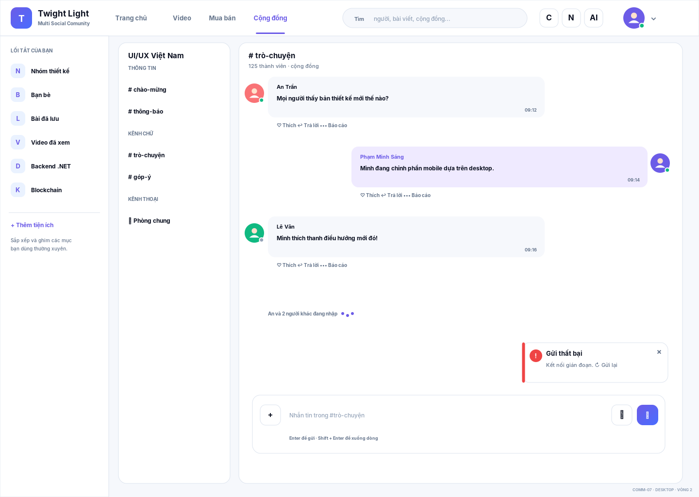

Nguồn SVG: `design/assets/editable/svg/desktop/comm-07-kenh-van-ban.svg`

##### Mobile

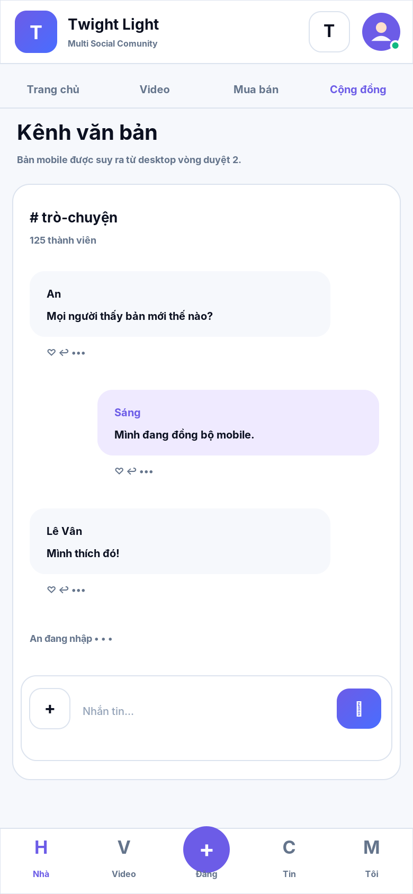

Nguồn SVG: `design/assets/editable/svg/mobile/comm-07-kenh-van-ban.svg`

#### Quyết định cuối

- Trạng thái: **Đã duyệt để triển khai Frontend**.
- Phiên bản thiết kế: **1.2 Final**.
- Desktop và Mobile đã được đối chiếu về thứ tự ưu tiên, trạng thái, quyền và khả năng thao tác.
- SVG là nguồn hình chỉnh sửa; PNG chỉ dùng để duyệt.
- Các yêu cầu chưa có hợp đồng Backend phải tuân theo `design/sources/18-backend-contract-gaps.md`; không tự tạo API.

---

> **Trạng thái duyệt CHAT-01:** Đã duyệt

### CHAT-01 - Danh sách hội thoại

#### Mục tiêu

Hiển thị DM/nhóm theo hoạt động gần nhất, chưa đọc và trạng thái hiện diện.

#### Vai trò và ưu tiên

- Vai trò: Người dùng
- Mức ưu tiên: **P0**
- Mã chức năng: `CHT-01`, `CHT-08`
- Route dự kiến: `/tin-nhan`

#### Bố cục

- Desktop split list + vùng chọn; mobile là danh sách route riêng.
- Sắp theo hoạt động gần nhất, badge chưa đọc và presence.

#### Hành động

##### Chính

- Mở hội thoại

##### Phụ

- Tạo hội thoại
- Tìm hội thoại

#### Component

- `MessagingShell`
- `ConversationRow`
- `SearchField`
- `UnreadBadge`
- `EmptyState`

#### Dữ liệu và hợp đồng liên quan

- GET conversations theo API triển khai
- SignalR updates

Mọi endpoint chưa được khóa trong OpenAPI phải được đánh dấu là **cần khóa hợp đồng**, không tự tạo chỉ vì mockup cần dữ liệu.

#### Trạng thái bắt buộc

- Có dữ liệu
- Rỗng
- Có tin chưa đọc
- Ngoại tuyến

Ngoài các trạng thái trên, áp dụng trạng thái dùng chung trong `design/sources/11-state-matrix.md`.

#### Tương tác và phản hồi

- Hành động có request phải có trạng thái `idle -> submitting -> success/error`.
- Double-click hoặc reconnect không được tạo side effect trùng.
- Dữ liệu nhập phải được giữ khi lỗi có thể thử lại.
- Khi route không còn quyền, điều hướng về vị trí an toàn và không tiết lộ nội dung.
- Mọi toast quan trọng phải có bản inline hoặc lịch sử phù hợp khi người dùng cần hành động.

#### Responsive

- Desktop dùng frame 1440 x 1024 trong mockup.
- Mobile dùng frame 390 x 844.
- Nội dung và hành động giữ cùng ý nghĩa; không chỉ thu nhỏ tỷ lệ.
- Bảng hoặc split view phải chuyển thành danh sách, drawer hoặc route con trên mobile.
- Touch target tối thiểu 44 x 44 px.

#### Accessibility

- Mỗi item có tên hội thoại, snippet, thời gian, số chưa đọc.

- Focus ring nhìn thấy.
- Icon-only button có tên truy cập.
- Trạng thái không truyền đạt bằng màu duy nhất.

#### Rủi ro cần kiểm soát

- Không tự suy đoán quyền từ trạng thái UI; server là nguồn quyết định.

#### Tiêu chí chấp nhận UI

- Với vai trò Người dùng, khi mở `/tin-nhan`, màn hình hiển thị đúng dữ liệu được phép hoặc trạng thái an toàn.
- Khi thực hiện hành động chính “Mở hội thoại”, giao diện khóa gửi lặp không chủ đích và phản ánh kết quả server.
- Khi API trả 401/403/404/409/412/422/429/503 liên quan, giao diện dùng trạng thái đã định nghĩa và không làm mất dữ liệu nhập.
- Desktop và mobile giữ cùng mục tiêu, quyền và thứ tự ưu tiên hành động.
- Luồng bàn phím, focus và nhãn truy cập đạt yêu cầu trong tài liệu accessibility.

#### Hình chỉnh sửa

##### Desktop

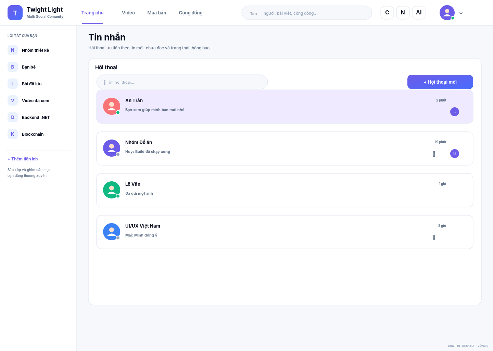

Nguồn SVG: `design/assets/editable/svg/desktop/chat-01-danh-sach-hoi-thoai.svg`

##### Mobile

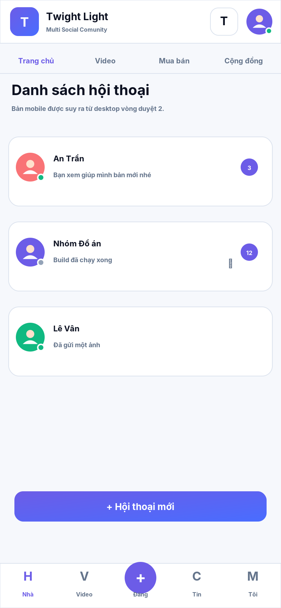

Nguồn SVG: `design/assets/editable/svg/mobile/chat-01-danh-sach-hoi-thoai.svg`

#### Quyết định cuối

- Trạng thái: **Đã duyệt để triển khai Frontend**.
- Phiên bản thiết kế: **1.2 Final**.
- Desktop và Mobile đã được đối chiếu về thứ tự ưu tiên, trạng thái, quyền và khả năng thao tác.
- SVG là nguồn hình chỉnh sửa; PNG chỉ dùng để duyệt.
- Các yêu cầu chưa có hợp đồng Backend phải tuân theo `design/sources/18-backend-contract-gaps.md`; không tự tạo API.

---

> **Trạng thái duyệt CHAT-02:** Đã duyệt

### CHAT-02 - Hội thoại

#### Mục tiêu

Gửi và nhận tin nhắn an toàn, hỗ trợ trạng thái đang nhập, hiện diện, đã đọc và gửi lại khi mất mạng.

#### Vai trò và ưu tiên

- Vai trò: Thành viên hội thoại
- Mức ưu tiên: **P0**
- Mã chức năng: `CHT-02`, `CHT-03`, `CHT-04`, `CHT-05`, `CHT-06`, `CHT-07`
- Route dự kiến: `/tin-nhan/:id`

#### Bố cục

- Header hội thoại, log tin nhắn và composer; desktop có panel thông tin tùy chọn.
- Tin nhắn của mình/phía kia khác vị trí nhưng vẫn có nhãn sender.

#### Hành động

##### Chính

- Gửi tin nhắn

##### Phụ

- Gửi phương tiện
- Tương tác
- Sửa/xóa
- Gọi

#### Component

- `MessagingShell`
- `MessageLog`
- `MessageBubble`
- `MessageComposer`
- `TypingIndicator`
- `ConnectionBanner`

#### Dữ liệu và hợp đồng liên quan

- GET history
- SignalR SendMessage, MessageCreated, MessageUpdated/Deleted, Typing, MarkRead

Mọi endpoint chưa được khóa trong OpenAPI phải được đánh dấu là **cần khóa hợp đồng**, không tự tạo chỉ vì mockup cần dữ liệu.

#### Trạng thái bắt buộc

- Đang kết nối
- Đã kết nối
- Tin đang gửi
- Gửi thất bại
- Đã đọc
- Đang nhập

Ngoài các trạng thái trên, áp dụng trạng thái dùng chung trong `design/sources/11-state-matrix.md`.

#### Tương tác và phản hồi

- Hành động có request phải có trạng thái `idle -> submitting -> success/error`.
- Double-click hoặc reconnect không được tạo side effect trùng.
- Dữ liệu nhập phải được giữ khi lỗi có thể thử lại.
- Khi route không còn quyền, điều hướng về vị trí an toàn và không tiết lộ nội dung.
- Mọi toast quan trọng phải có bản inline hoặc lịch sử phù hợp khi người dùng cần hành động.

#### Responsive

- Desktop dùng frame 1440 x 1024 trong mockup.
- Mobile dùng frame 390 x 844.
- Nội dung và hành động giữ cùng ý nghĩa; không chỉ thu nhỏ tỷ lệ.
- Bảng hoặc split view phải chuyển thành danh sách, drawer hoặc route con trên mobile.
- Touch target tối thiểu 44 x 44 px.

#### Accessibility

- Không dùng vị trí trái/phải làm thông tin duy nhất.
- Tin mới không tự lấy focus; có nút nhảy tới tin mới.

- Focus ring nhìn thấy.
- Icon-only button có tên truy cập.
- Trạng thái không truyền đạt bằng màu duy nhất.

#### Rủi ro cần kiểm soát

- Không tự suy đoán quyền từ trạng thái UI; server là nguồn quyết định.
- Mất kết nối/reconnect không được tạo dữ liệu hoặc phiên trùng.

#### Tiêu chí chấp nhận UI

- Với vai trò Thành viên hội thoại, khi mở `/tin-nhan/:id`, màn hình hiển thị đúng dữ liệu được phép hoặc trạng thái an toàn.
- Khi thực hiện hành động chính “Gửi tin nhắn”, giao diện khóa gửi lặp không chủ đích và phản ánh kết quả server.
- Khi API trả 401/403/404/409/412/422/429/503 liên quan, giao diện dùng trạng thái đã định nghĩa và không làm mất dữ liệu nhập.
- Desktop và mobile giữ cùng mục tiêu, quyền và thứ tự ưu tiên hành động.
- Luồng bàn phím, focus và nhãn truy cập đạt yêu cầu trong tài liệu accessibility.

#### Hình chỉnh sửa

##### Desktop

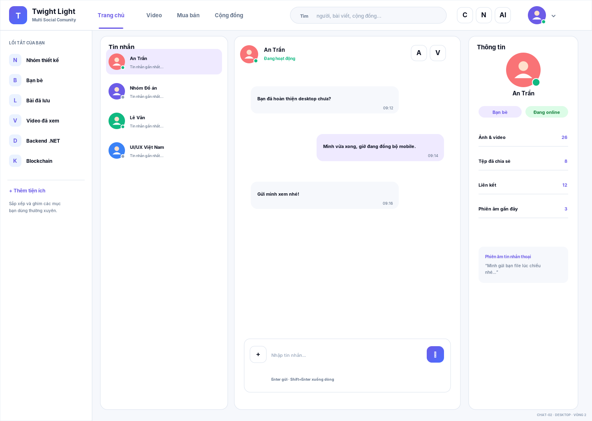

Nguồn SVG: `design/assets/editable/svg/desktop/chat-02-hoi-thoai.svg`

##### Mobile

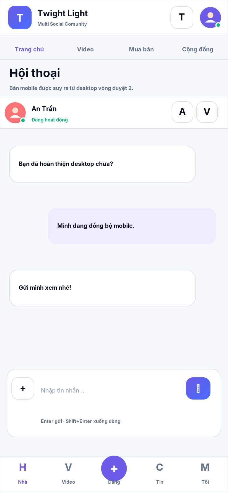

Nguồn SVG: `design/assets/editable/svg/mobile/chat-02-hoi-thoai.svg`

#### Quyết định cuối

- Trạng thái: **Đã duyệt để triển khai Frontend**.
- Phiên bản thiết kế: **1.2 Final**.
- Desktop và Mobile đã được đối chiếu về thứ tự ưu tiên, trạng thái, quyền và khả năng thao tác.
- SVG là nguồn hình chỉnh sửa; PNG chỉ dùng để duyệt.
- Các yêu cầu chưa có hợp đồng Backend phải tuân theo `design/sources/18-backend-contract-gaps.md`; không tự tạo API.

---

> **Trạng thái duyệt CHAT-03:** Đã duyệt

### CHAT-03 - Tạo hội thoại

#### Mục tiêu

Chọn người tham gia, tái sử dụng DM 1:1 đã tồn tại và tạo nhóm mới.

#### Vai trò và ưu tiên

- Vai trò: Người dùng
- Mức ưu tiên: **P0**
- Mã chức năng: `CHT-01`
- Route dự kiến: `/tin-nhan/moi`

#### Bố cục

- Search multi-select người dùng, chip người đã chọn và tên nhóm khi trên hai người.
- Kết quả bị chặn không cho chọn và không tiết lộ thừa.

#### Hành động

##### Chính

- Bắt đầu trò chuyện

##### Phụ

- Tìm người dùng
- Đặt tên nhóm

#### Component

- `MessagingShell`
- `UserCombobox`
- `SelectionChips`
- `TextField`
- `Button`

#### Dữ liệu và hợp đồng liên quan

- POST /api/v1/conversations

Mọi endpoint chưa được khóa trong OpenAPI phải được đánh dấu là **cần khóa hợp đồng**, không tự tạo chỉ vì mockup cần dữ liệu.

#### Trạng thái bắt buộc

- Đang chọn
- Không có kết quả
- Người dùng bị chặn
- DM đã tồn tại

Ngoài các trạng thái trên, áp dụng trạng thái dùng chung trong `design/sources/11-state-matrix.md`.

#### Tương tác và phản hồi

- Hành động có request phải có trạng thái `idle -> submitting -> success/error`.
- Double-click hoặc reconnect không được tạo side effect trùng.
- Dữ liệu nhập phải được giữ khi lỗi có thể thử lại.
- Khi route không còn quyền, điều hướng về vị trí an toàn và không tiết lộ nội dung.
- Mọi toast quan trọng phải có bản inline hoặc lịch sử phù hợp khi người dùng cần hành động.

#### Responsive

- Desktop dùng frame 1440 x 1024 trong mockup.
- Mobile dùng frame 390 x 844.
- Nội dung và hành động giữ cùng ý nghĩa; không chỉ thu nhỏ tỷ lệ.
- Bảng hoặc split view phải chuyển thành danh sách, drawer hoặc route con trên mobile.
- Touch target tối thiểu 44 x 44 px.

#### Accessibility

- Combobox hỗ trợ bàn phím và thông báo số kết quả.

- Focus ring nhìn thấy.
- Icon-only button có tên truy cập.
- Trạng thái không truyền đạt bằng màu duy nhất.

#### Rủi ro cần kiểm soát

- Không tự suy đoán quyền từ trạng thái UI; server là nguồn quyết định.

#### Tiêu chí chấp nhận UI

- Với vai trò Người dùng, khi mở `/tin-nhan/moi`, màn hình hiển thị đúng dữ liệu được phép hoặc trạng thái an toàn.
- Khi thực hiện hành động chính “Bắt đầu trò chuyện”, giao diện khóa gửi lặp không chủ đích và phản ánh kết quả server.
- Khi API trả 401/403/404/409/412/422/429/503 liên quan, giao diện dùng trạng thái đã định nghĩa và không làm mất dữ liệu nhập.
- Desktop và mobile giữ cùng mục tiêu, quyền và thứ tự ưu tiên hành động.
- Luồng bàn phím, focus và nhãn truy cập đạt yêu cầu trong tài liệu accessibility.

#### Hình chỉnh sửa

##### Desktop

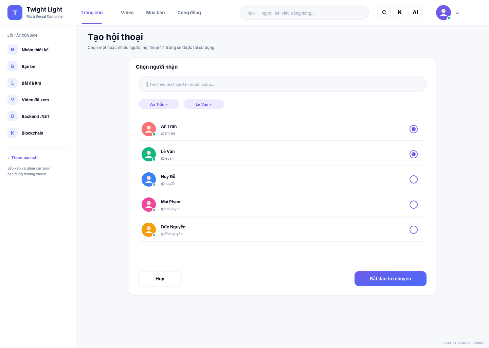

Nguồn SVG: `design/assets/editable/svg/desktop/chat-03-tao-hoi-thoai.svg`

##### Mobile

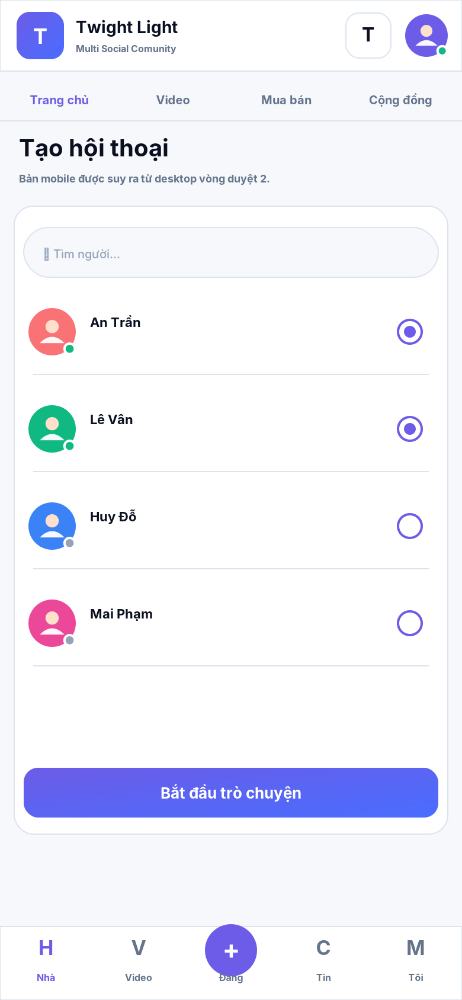

Nguồn SVG: `design/assets/editable/svg/mobile/chat-03-tao-hoi-thoai.svg`

#### Quyết định cuối

- Trạng thái: **Đã duyệt để triển khai Frontend**.
- Phiên bản thiết kế: **1.2 Final**.
- Desktop và Mobile đã được đối chiếu về thứ tự ưu tiên, trạng thái, quyền và khả năng thao tác.
- SVG là nguồn hình chỉnh sửa; PNG chỉ dùng để duyệt.
- Các yêu cầu chưa có hợp đồng Backend phải tuân theo `design/sources/18-backend-contract-gaps.md`; không tự tạo API.

---

> **Trạng thái duyệt CHAT-04:** Đã duyệt

### CHAT-04 - Thiết lập hội thoại

#### Mục tiêu

Quản lý tên nhóm, thành viên, thông báo và rời hội thoại.

#### Vai trò và ưu tiên

- Vai trò: Thành viên, Quản trị nhóm
- Mức ưu tiên: **P0**
- Mã chức năng: `CHT-01`, `CHT-03`
- Route dự kiến: `/tin-nhan/:id/thiet-lap`

#### Bố cục

- Các nhóm Thông tin, Thành viên, Thông báo và Vùng nguy hiểm.
- Quyền quản trị quyết định CTA.

#### Hành động

##### Chính

- Lưu thay đổi

##### Phụ

- Thêm thành viên
- Rời hội thoại

#### Component

- `SettingsShell`
- `MemberList`
- `NotificationSettings`
- `DangerZone`

#### Dữ liệu và hợp đồng liên quan

- PATCH conversation / membership theo API triển khai

Mọi endpoint chưa được khóa trong OpenAPI phải được đánh dấu là **cần khóa hợp đồng**, không tự tạo chỉ vì mockup cần dữ liệu.

#### Trạng thái bắt buộc

- Mặc định
- Không có quyền quản trị
- Đang lưu
- Xung đột

Ngoài các trạng thái trên, áp dụng trạng thái dùng chung trong `design/sources/11-state-matrix.md`.

#### Tương tác và phản hồi

- Hành động có request phải có trạng thái `idle -> submitting -> success/error`.
- Double-click hoặc reconnect không được tạo side effect trùng.
- Dữ liệu nhập phải được giữ khi lỗi có thể thử lại.
- Khi route không còn quyền, điều hướng về vị trí an toàn và không tiết lộ nội dung.
- Mọi toast quan trọng phải có bản inline hoặc lịch sử phù hợp khi người dùng cần hành động.

#### Responsive

- Desktop dùng frame 1440 x 1024 trong mockup.
- Mobile dùng frame 390 x 844.
- Nội dung và hành động giữ cùng ý nghĩa; không chỉ thu nhỏ tỷ lệ.
- Bảng hoặc split view phải chuyển thành danh sách, drawer hoặc route con trên mobile.
- Touch target tối thiểu 44 x 44 px.

#### Accessibility

- Rời nhóm và xóa lịch sử cục bộ là hành động khác nhau, nhãn không mơ hồ.

- Focus ring nhìn thấy.
- Icon-only button có tên truy cập.
- Trạng thái không truyền đạt bằng màu duy nhất.

#### Rủi ro cần kiểm soát

- Không tự suy đoán quyền từ trạng thái UI; server là nguồn quyết định.

#### Tiêu chí chấp nhận UI

- Với vai trò Thành viên, Quản trị nhóm, khi mở `/tin-nhan/:id/thiet-lap`, màn hình hiển thị đúng dữ liệu được phép hoặc trạng thái an toàn.
- Khi thực hiện hành động chính “Lưu thay đổi”, giao diện khóa gửi lặp không chủ đích và phản ánh kết quả server.
- Khi API trả 401/403/404/409/412/422/429/503 liên quan, giao diện dùng trạng thái đã định nghĩa và không làm mất dữ liệu nhập.
- Desktop và mobile giữ cùng mục tiêu, quyền và thứ tự ưu tiên hành động.
- Luồng bàn phím, focus và nhãn truy cập đạt yêu cầu trong tài liệu accessibility.

#### Hình chỉnh sửa

##### Desktop

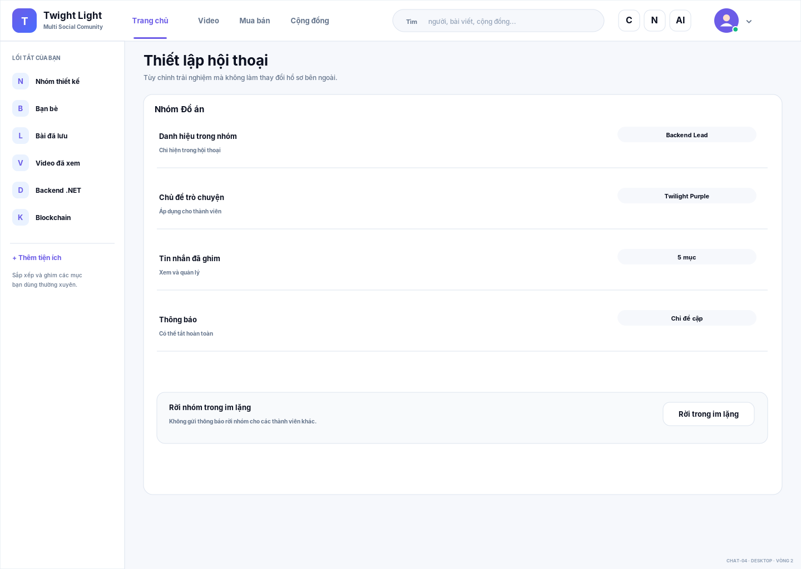

Nguồn SVG: `design/assets/editable/svg/desktop/chat-04-thiet-lap-hoi-thoai.svg`

##### Mobile

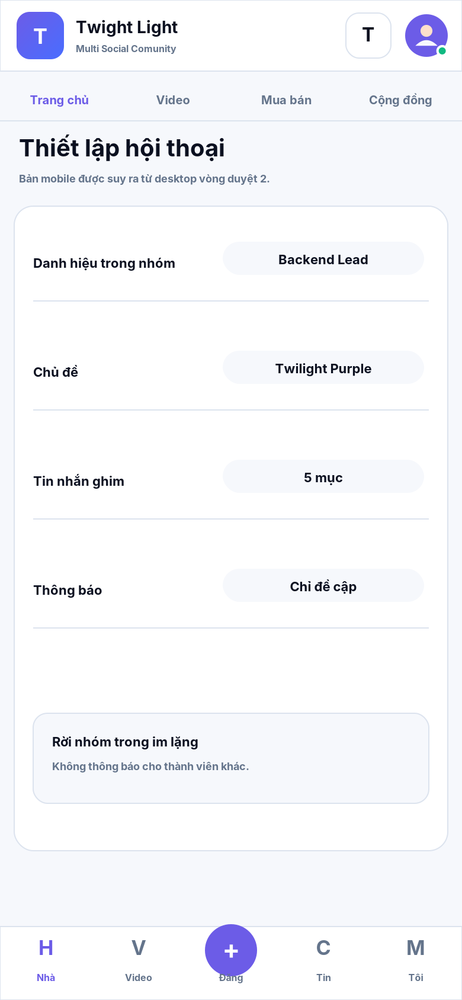

Nguồn SVG: `design/assets/editable/svg/mobile/chat-04-thiet-lap-hoi-thoai.svg`

#### Quyết định cuối

- Trạng thái: **Đã duyệt để triển khai Frontend**.
- Phiên bản thiết kế: **1.2 Final**.
- Desktop và Mobile đã được đối chiếu về thứ tự ưu tiên, trạng thái, quyền và khả năng thao tác.
- SVG là nguồn hình chỉnh sửa; PNG chỉ dùng để duyệt.
- Các yêu cầu chưa có hợp đồng Backend phải tuân theo `design/sources/18-backend-contract-gaps.md`; không tự tạo API.

---

> **Trạng thái duyệt RTC-01:** Đã duyệt

### RTC-01 - Lời mời cuộc gọi

#### Mục tiêu

Hiển thị lời mời thoại/video với thời gian chờ, kiểm tra quyền và điều hướng đến LiveKit.

#### Vai trò và ưu tiên

- Vai trò: Người dùng, Thành viên
- Mức ưu tiên: **P1**
- Mã chức năng: `CHT-09`, `RTC-01`
- Route dự kiến: `/cuoc-goi/:id`

#### Bố cục

- Overlay hoặc full-screen mobile với avatar, loại cuộc gọi, thời gian chờ.
- Nút Tham gia/Từ chối lớn và không đặt quá gần.

#### Hành động

##### Chính

- Tham gia

##### Phụ

- Từ chối

#### Component

- `CallOverlay`
- `AvatarGroup`
- `Timer`
- `PrimaryButton`
- `SecondaryButton`

#### Dữ liệu và hợp đồng liên quan

- SignalR CallInvite/CallStateChanged
- POST /api/v1/channels/{id}/rtc-token khi chấp nhận

Mọi endpoint chưa được khóa trong OpenAPI phải được đánh dấu là **cần khóa hợp đồng**, không tự tạo chỉ vì mockup cần dữ liệu.

#### Trạng thái bắt buộc

- Đang đổ chuông
- Hết thời gian
- Đã từ chối
- Không có quyền
- LiveKit tạm thời không khả dụng

Ngoài các trạng thái trên, áp dụng trạng thái dùng chung trong `design/sources/11-state-matrix.md`.

#### Tương tác và phản hồi

- Hành động có request phải có trạng thái `idle -> submitting -> success/error`.
- Double-click hoặc reconnect không được tạo side effect trùng.
- Dữ liệu nhập phải được giữ khi lỗi có thể thử lại.
- Khi route không còn quyền, điều hướng về vị trí an toàn và không tiết lộ nội dung.
- Mọi toast quan trọng phải có bản inline hoặc lịch sử phù hợp khi người dùng cần hành động.

#### Responsive

- Desktop dùng frame 1440 x 1024 trong mockup.
- Mobile dùng frame 390 x 844.
- Nội dung và hành động giữ cùng ý nghĩa; không chỉ thu nhỏ tỷ lệ.
- Bảng hoặc split view phải chuyển thành danh sách, drawer hoặc route con trên mobile.
- Touch target tối thiểu 44 x 44 px.

#### Accessibility

- Âm thanh rung có tùy chọn tắt; nội dung vẫn hiểu được khi không nghe.
- Focus mặc định không nằm trên nút nguy hiểm.

- Focus ring nhìn thấy.
- Icon-only button có tên truy cập.
- Trạng thái không truyền đạt bằng màu duy nhất.

#### Rủi ro cần kiểm soát

- Không tự suy đoán quyền từ trạng thái UI; server là nguồn quyết định.
- Mất kết nối/reconnect không được tạo dữ liệu hoặc phiên trùng.

#### Tiêu chí chấp nhận UI

- Với vai trò Người dùng, Thành viên, khi mở `/cuoc-goi/:id`, màn hình hiển thị đúng dữ liệu được phép hoặc trạng thái an toàn.
- Khi thực hiện hành động chính “Tham gia”, giao diện khóa gửi lặp không chủ đích và phản ánh kết quả server.
- Khi API trả 401/403/404/409/412/422/429/503 liên quan, giao diện dùng trạng thái đã định nghĩa và không làm mất dữ liệu nhập.
- Desktop và mobile giữ cùng mục tiêu, quyền và thứ tự ưu tiên hành động.
- Luồng bàn phím, focus và nhãn truy cập đạt yêu cầu trong tài liệu accessibility.

#### Hình chỉnh sửa

##### Desktop

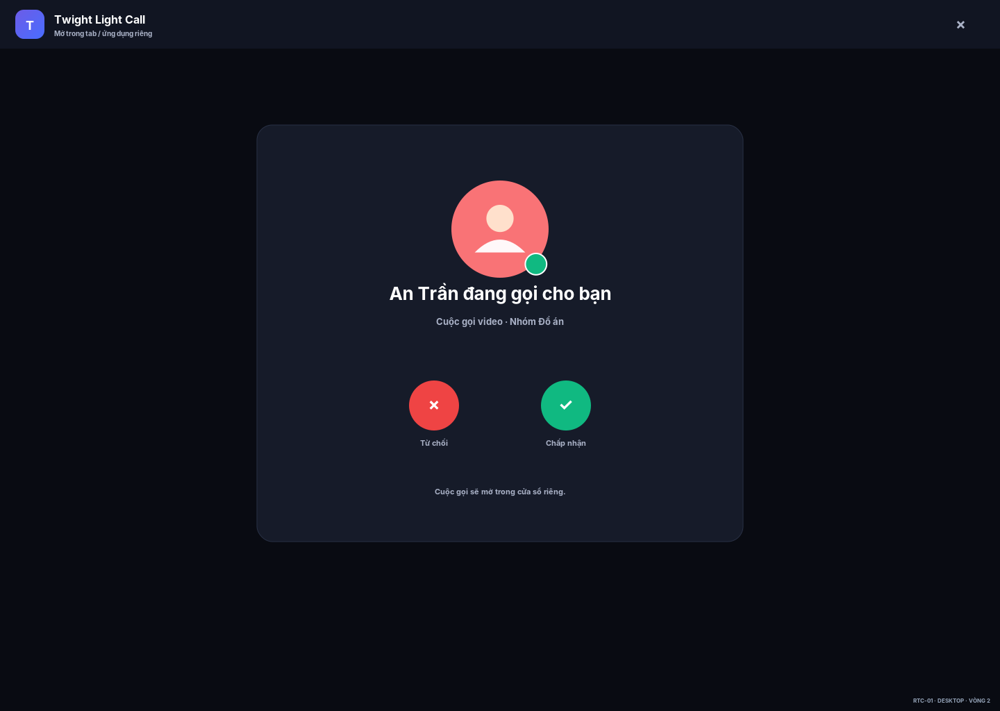

Nguồn SVG: `design/assets/editable/svg/desktop/rtc-01-loi-moi-cuoc-goi.svg`

##### Mobile

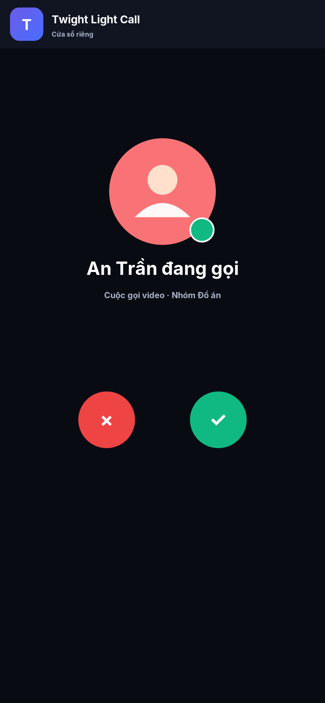

Nguồn SVG: `design/assets/editable/svg/mobile/rtc-01-loi-moi-cuoc-goi.svg`

#### Quyết định cuối

- Trạng thái: **Đã duyệt để triển khai Frontend**.
- Phiên bản thiết kế: **1.2 Final**.
- Desktop và Mobile đã được đối chiếu về thứ tự ưu tiên, trạng thái, quyền và khả năng thao tác.
- SVG là nguồn hình chỉnh sửa; PNG chỉ dùng để duyệt.
- Các yêu cầu chưa có hợp đồng Backend phải tuân theo `design/sources/18-backend-contract-gaps.md`; không tự tạo API.

---

> **Trạng thái duyệt RTC-02:** Đã duyệt

### RTC-02 - Phòng thoại và video

#### Mục tiêu

Hiển thị người tham gia, điều khiển micro/camera, chất lượng kết nối và quyền phát biểu.

#### Vai trò và ưu tiên

- Vai trò: Thành viên
- Mức ưu tiên: **P1**
- Mã chức năng: `RTC-01`, `RTC-02`
- Route dự kiến: `/cong-dong/:id/phong/:roomId`

#### Bố cục

- Lưới người tham gia, vùng chia sẻ chính nếu có, thanh điều khiển dưới.
- Danh sách người tham gia và chất lượng mạng nằm trong drawer trên mobile.

#### Hành động

##### Chính

- Bật/tắt micro
- Rời phòng

##### Phụ

- Bật camera
- Chia sẻ màn hình
- Xem người tham gia

#### Component

- `RTCShell`
- `ParticipantGrid`
- `RTCControlBar`
- `ConnectionQuality`
- `ParticipantsDrawer`

#### Dữ liệu và hợp đồng liên quan

- POST rtc-token
- LiveKit SDK trực tiếp
- Không gửi media qua API/Kafka

Mọi endpoint chưa được khóa trong OpenAPI phải được đánh dấu là **cần khóa hợp đồng**, không tự tạo chỉ vì mockup cần dữ liệu.

#### Trạng thái bắt buộc

- Đang kết nối
- Đã kết nối
- Đang dùng TURN
- Mất quyền phát biểu
- LiveKit lỗi

Ngoài các trạng thái trên, áp dụng trạng thái dùng chung trong `design/sources/11-state-matrix.md`.

#### Tương tác và phản hồi

- Hành động có request phải có trạng thái `idle -> submitting -> success/error`.
- Double-click hoặc reconnect không được tạo side effect trùng.
- Dữ liệu nhập phải được giữ khi lỗi có thể thử lại.
- Khi route không còn quyền, điều hướng về vị trí an toàn và không tiết lộ nội dung.
- Mọi toast quan trọng phải có bản inline hoặc lịch sử phù hợp khi người dùng cần hành động.

#### Responsive

- Desktop dùng frame 1440 x 1024 trong mockup.
- Mobile dùng frame 390 x 844.
- Nội dung và hành động giữ cùng ý nghĩa; không chỉ thu nhỏ tỷ lệ.
- Bảng hoặc split view phải chuyển thành danh sách, drawer hoặc route con trên mobile.
- Touch target tối thiểu 44 x 44 px.

#### Accessibility

- Trạng thái muted/speaking có text/aria-label.
- Nút rời phòng tách xa nút bật micro.

- Focus ring nhìn thấy.
- Icon-only button có tên truy cập.
- Trạng thái không truyền đạt bằng màu duy nhất.

#### Rủi ro cần kiểm soát

- Không tự suy đoán quyền từ trạng thái UI; server là nguồn quyết định.
- Mất kết nối/reconnect không được tạo dữ liệu hoặc phiên trùng.

#### Tiêu chí chấp nhận UI

- Với vai trò Thành viên, khi mở `/cong-dong/:id/phong/:roomId`, màn hình hiển thị đúng dữ liệu được phép hoặc trạng thái an toàn.
- Khi thực hiện hành động chính “Bật/tắt micro”, giao diện khóa gửi lặp không chủ đích và phản ánh kết quả server.
- Khi API trả 401/403/404/409/412/422/429/503 liên quan, giao diện dùng trạng thái đã định nghĩa và không làm mất dữ liệu nhập.
- Desktop và mobile giữ cùng mục tiêu, quyền và thứ tự ưu tiên hành động.
- Luồng bàn phím, focus và nhãn truy cập đạt yêu cầu trong tài liệu accessibility.

#### Hình chỉnh sửa

##### Desktop

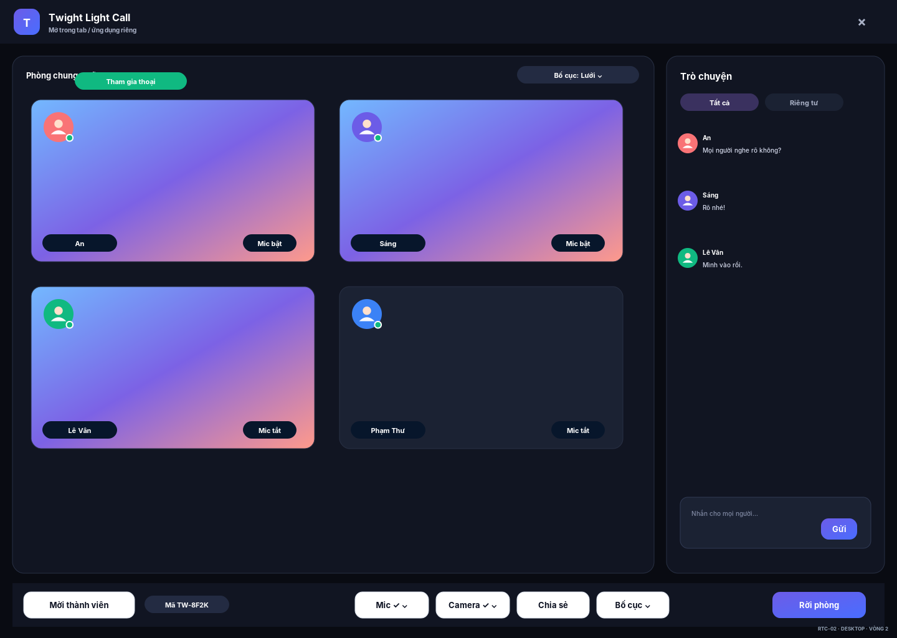

Nguồn SVG: `design/assets/editable/svg/desktop/rtc-02-phong-thoai-video.svg`

##### Mobile

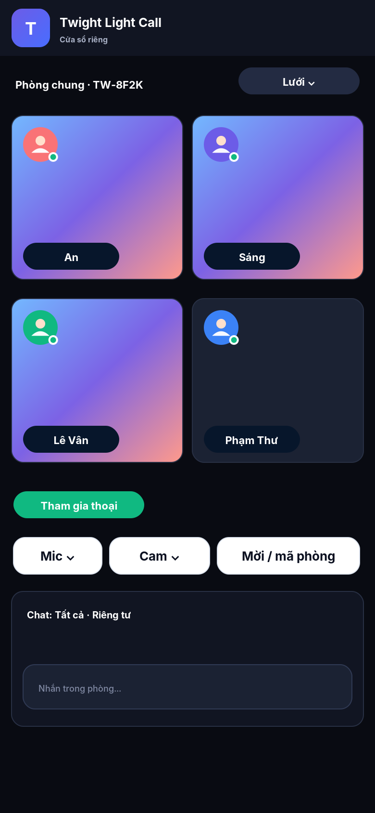

Nguồn SVG: `design/assets/editable/svg/mobile/rtc-02-phong-thoai-video.svg`

#### Quyết định cuối

- Trạng thái: **Đã duyệt để triển khai Frontend**.
- Phiên bản thiết kế: **1.2 Final**.
- Desktop và Mobile đã được đối chiếu về thứ tự ưu tiên, trạng thái, quyền và khả năng thao tác.
- SVG là nguồn hình chỉnh sửa; PNG chỉ dùng để duyệt.
- Các yêu cầu chưa có hợp đồng Backend phải tuân theo `design/sources/18-backend-contract-gaps.md`; không tự tạo API.

---

> **Trạng thái duyệt RTC-03:** Đã duyệt

### RTC-03 - Chia sẻ màn hình

#### Mục tiêu

Chọn nguồn màn hình, xem trước và theo dõi trạng thái phát trong phòng.

#### Vai trò và ưu tiên

- Vai trò: Thành viên có quyền
- Mức ưu tiên: **P1**
- Mã chức năng: `RTC-03`
- Route dự kiến: `/cong-dong/:id/phong/:roomId/chia-se`

#### Bố cục

- Preview nguồn chia sẻ và danh sách cửa sổ/màn hình do trình duyệt cung cấp.
- Khi đang phát, hiển thị chip rõ ràng và nút dừng luôn truy cập được.

#### Hành động

##### Chính

- Bắt đầu chia sẻ

##### Phụ

- Dừng chia sẻ
- Đổi nguồn

#### Component

- `RTCShell`
- `SourcePicker`
- `SharePreview`
- `RTCControlBar`
- `StatusChip`

#### Dữ liệu và hợp đồng liên quan

- LiveKit publish screen track
- Lifecycle metadata tùy chọn

Mọi endpoint chưa được khóa trong OpenAPI phải được đánh dấu là **cần khóa hợp đồng**, không tự tạo chỉ vì mockup cần dữ liệu.

#### Trạng thái bắt buộc

- Chưa chia sẻ
- Đang chọn nguồn
- Đang phát
- Mạng yếu
- Không có quyền

Ngoài các trạng thái trên, áp dụng trạng thái dùng chung trong `design/sources/11-state-matrix.md`.

#### Tương tác và phản hồi

- Hành động có request phải có trạng thái `idle -> submitting -> success/error`.
- Double-click hoặc reconnect không được tạo side effect trùng.
- Dữ liệu nhập phải được giữ khi lỗi có thể thử lại.
- Khi route không còn quyền, điều hướng về vị trí an toàn và không tiết lộ nội dung.
- Mọi toast quan trọng phải có bản inline hoặc lịch sử phù hợp khi người dùng cần hành động.

#### Responsive

- Desktop dùng frame 1440 x 1024 trong mockup.
- Mobile dùng frame 390 x 844.
- Nội dung và hành động giữ cùng ý nghĩa; không chỉ thu nhỏ tỷ lệ.
- Bảng hoặc split view phải chuyển thành danh sách, drawer hoặc route con trên mobile.
- Touch target tối thiểu 44 x 44 px.

#### Accessibility

- Không phụ thuộc viền màu để biết nguồn đang chọn.
- Tôn trọng quyền hệ điều hành/trình duyệt.

- Focus ring nhìn thấy.
- Icon-only button có tên truy cập.
- Trạng thái không truyền đạt bằng màu duy nhất.

#### Rủi ro cần kiểm soát

- Không tự suy đoán quyền từ trạng thái UI; server là nguồn quyết định.

#### Tiêu chí chấp nhận UI

- Với vai trò Thành viên có quyền, khi mở `/cong-dong/:id/phong/:roomId/chia-se`, màn hình hiển thị đúng dữ liệu được phép hoặc trạng thái an toàn.
- Khi thực hiện hành động chính “Bắt đầu chia sẻ”, giao diện khóa gửi lặp không chủ đích và phản ánh kết quả server.
- Khi API trả 401/403/404/409/412/422/429/503 liên quan, giao diện dùng trạng thái đã định nghĩa và không làm mất dữ liệu nhập.
- Desktop và mobile giữ cùng mục tiêu, quyền và thứ tự ưu tiên hành động.
- Luồng bàn phím, focus và nhãn truy cập đạt yêu cầu trong tài liệu accessibility.

#### Hình chỉnh sửa

##### Desktop

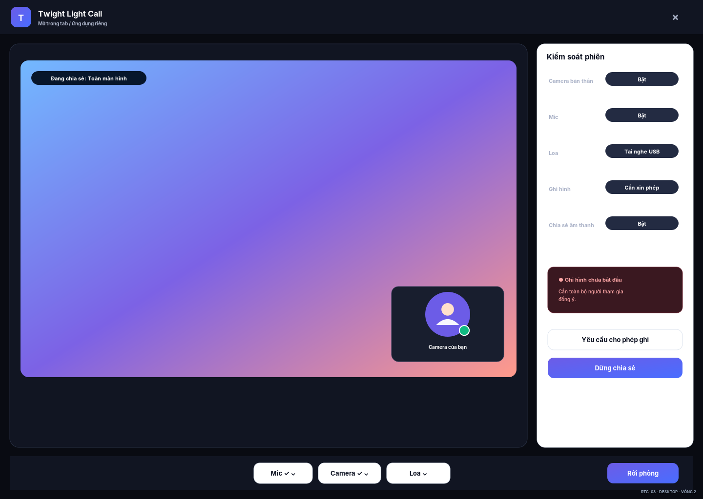

Nguồn SVG: `design/assets/editable/svg/desktop/rtc-03-chia-se-man-hinh.svg`

##### Mobile

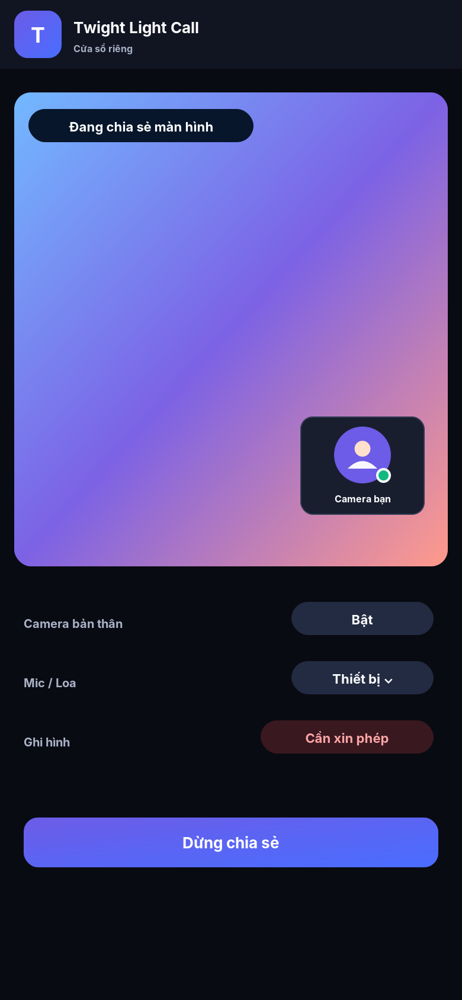

Nguồn SVG: `design/assets/editable/svg/mobile/rtc-03-chia-se-man-hinh.svg`

#### Quyết định cuối

- Trạng thái: **Đã duyệt để triển khai Frontend**.
- Phiên bản thiết kế: **1.2 Final**.
- Desktop và Mobile đã được đối chiếu về thứ tự ưu tiên, trạng thái, quyền và khả năng thao tác.
- SVG là nguồn hình chỉnh sửa; PNG chỉ dùng để duyệt.
- Các yêu cầu chưa có hợp đồng Backend phải tuân theo `design/sources/18-backend-contract-gaps.md`; không tự tạo API.

---

> **Trạng thái duyệt MEDIA-01:** Đã duyệt

### MEDIA-01 - Tải phương tiện

#### Mục tiêu

Tải trực tiếp qua URL ký trước, hiển thị tiến độ và xác minh trước khi tham chiếu.

#### Vai trò và ưu tiên

- Vai trò: Người dùng
- Mức ưu tiên: **P1**
- Mã chức năng: `MED-01`, `MED-02`, `MED-03`, `MED-04`
- Route dự kiến: `/phuong-tien/tai-len`

#### Bố cục

- Dropzone, danh sách file, tiến trình từng bước và CTA gắn vào mục đích sử dụng.
- Không tự coi upload thành công chỉ từ phía client.

#### Hành động

##### Chính

- Chọn tệp
- Tải lên

##### Phụ

- Hủy
- Thử lại

#### Component

- `UploadShell`
- `Dropzone`
- `UploadItem`
- `Progress`
- `InlineAlert`
- `Button`

#### Dữ liệu và hợp đồng liên quan

- POST upload session
- PUT presigned URL
- POST complete
- GET/poll processing state

Mọi endpoint chưa được khóa trong OpenAPI phải được đánh dấu là **cần khóa hợp đồng**, không tự tạo chỉ vì mockup cần dữ liệu.

#### Trạng thái bắt buộc

- Chờ chọn
- Đang tải
- Đang xác minh
- Đang xử lý
- Sẵn sàng
- Thất bại

Ngoài các trạng thái trên, áp dụng trạng thái dùng chung trong `design/sources/11-state-matrix.md`.

#### Tương tác và phản hồi

- Hành động có request phải có trạng thái `idle -> submitting -> success/error`.
- Double-click hoặc reconnect không được tạo side effect trùng.
- Dữ liệu nhập phải được giữ khi lỗi có thể thử lại.
- Khi route không còn quyền, điều hướng về vị trí an toàn và không tiết lộ nội dung.
- Mọi toast quan trọng phải có bản inline hoặc lịch sử phù hợp khi người dùng cần hành động.

#### Responsive

- Desktop dùng frame 1440 x 1024 trong mockup.
- Mobile dùng frame 390 x 844.
- Nội dung và hành động giữ cùng ý nghĩa; không chỉ thu nhỏ tỷ lệ.
- Bảng hoặc split view phải chuyển thành danh sách, drawer hoặc route con trên mobile.
- Touch target tối thiểu 44 x 44 px.

#### Accessibility

- Dropzone có input file tiêu chuẩn.
- Lỗi theo từng file được đọc và không làm mất các file khác.

- Focus ring nhìn thấy.
- Icon-only button có tên truy cập.
- Trạng thái không truyền đạt bằng màu duy nhất.

#### Rủi ro cần kiểm soát

- Không tự suy đoán quyền từ trạng thái UI; server là nguồn quyết định.

#### Tiêu chí chấp nhận UI

- Với vai trò Người dùng, khi mở `/phuong-tien/tai-len`, màn hình hiển thị đúng dữ liệu được phép hoặc trạng thái an toàn.
- Khi thực hiện hành động chính “Chọn tệp”, giao diện khóa gửi lặp không chủ đích và phản ánh kết quả server.
- Khi API trả 401/403/404/409/412/422/429/503 liên quan, giao diện dùng trạng thái đã định nghĩa và không làm mất dữ liệu nhập.
- Desktop và mobile giữ cùng mục tiêu, quyền và thứ tự ưu tiên hành động.
- Luồng bàn phím, focus và nhãn truy cập đạt yêu cầu trong tài liệu accessibility.

#### Hình chỉnh sửa

##### Desktop

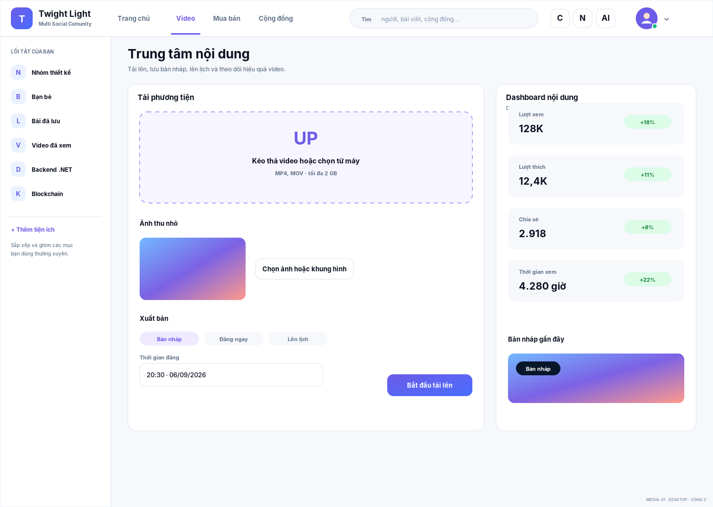

Nguồn SVG: `design/assets/editable/svg/desktop/media-01-tai-phuong-tien.svg`

##### Mobile

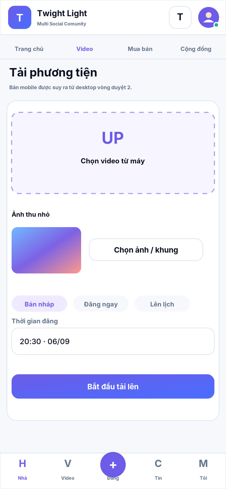

Nguồn SVG: `design/assets/editable/svg/mobile/media-01-tai-phuong-tien.svg`

#### Quyết định cuối

- Trạng thái: **Đã duyệt để triển khai Frontend**.
- Phiên bản thiết kế: **1.2 Final**.
- Desktop và Mobile đã được đối chiếu về thứ tự ưu tiên, trạng thái, quyền và khả năng thao tác.
- SVG là nguồn hình chỉnh sửa; PNG chỉ dùng để duyệt.
- Các yêu cầu chưa có hợp đồng Backend phải tuân theo `design/sources/18-backend-contract-gaps.md`; không tự tạo API.

---

> **Trạng thái duyệt MKT-01:** Đã duyệt

### MKT-01 - Chợ

#### Mục tiêu

Duyệt tin đăng bằng bộ lọc và con trỏ, có đường suy giảm khi tìm kiếm nâng cao không khả dụng.

#### Vai trò và ưu tiên

- Vai trò: Khách theo chính sách, Người dùng
- Mức ưu tiên: **P2**
- Mã chức năng: `MKT-02`
- Route dự kiến: `/cho`

#### Bố cục

- Desktop có sidebar filter và lưới 3 cột; mobile dùng filter bottom sheet và 2 cột.
- Card hiển thị ảnh, tiêu đề, giá, trạng thái hàng và người bán.

#### Hành động

##### Chính

- Mở tin đăng

##### Phụ

- Tìm kiếm
- Lọc
- Tạo tin đăng

#### Component

- `AppShell`
- `FilterSidebar`
- `SearchField`
- `ListingCard`
- `PaginationOrCursor`
- `EmptyState`

#### Dữ liệu và hợp đồng liên quan

- GET /api/v1/listings?cursor=&filter=
- Fallback khi OpenSearch tắt

Mọi endpoint chưa được khóa trong OpenAPI phải được đánh dấu là **cần khóa hợp đồng**, không tự tạo chỉ vì mockup cần dữ liệu.

#### Trạng thái bắt buộc

- Có dữ liệu
- Không có kết quả
- Đang tải thêm
- Tìm kiếm nâng cao không khả dụng

Ngoài các trạng thái trên, áp dụng trạng thái dùng chung trong `design/sources/11-state-matrix.md`.

#### Tương tác và phản hồi

- Hành động có request phải có trạng thái `idle -> submitting -> success/error`.
- Double-click hoặc reconnect không được tạo side effect trùng.
- Dữ liệu nhập phải được giữ khi lỗi có thể thử lại.
- Khi route không còn quyền, điều hướng về vị trí an toàn và không tiết lộ nội dung.
- Mọi toast quan trọng phải có bản inline hoặc lịch sử phù hợp khi người dùng cần hành động.

#### Responsive

- Desktop dùng frame 1440 x 1024 trong mockup.
- Mobile dùng frame 390 x 844.
- Nội dung và hành động giữ cùng ý nghĩa; không chỉ thu nhỏ tỷ lệ.
- Bảng hoặc split view phải chuyển thành danh sách, drawer hoặc route con trên mobile.
- Touch target tối thiểu 44 x 44 px.

#### Accessibility

- Giá đọc đúng đơn vị.
- Ảnh sản phẩm có alt mô tả hoặc alt rỗng nếu chỉ trang trí.

- Focus ring nhìn thấy.
- Icon-only button có tên truy cập.
- Trạng thái không truyền đạt bằng màu duy nhất.

#### Rủi ro cần kiểm soát

- Không tự suy đoán quyền từ trạng thái UI; server là nguồn quyết định.
- Mô-đun có thể bị tắt bằng feature flag; không để điều hướng chết.

#### Tiêu chí chấp nhận UI

- Với vai trò Khách theo chính sách, Người dùng, khi mở `/cho`, màn hình hiển thị đúng dữ liệu được phép hoặc trạng thái an toàn.
- Khi thực hiện hành động chính “Mở tin đăng”, giao diện khóa gửi lặp không chủ đích và phản ánh kết quả server.
- Khi API trả 401/403/404/409/412/422/429/503 liên quan, giao diện dùng trạng thái đã định nghĩa và không làm mất dữ liệu nhập.
- Desktop và mobile giữ cùng mục tiêu, quyền và thứ tự ưu tiên hành động.
- Luồng bàn phím, focus và nhãn truy cập đạt yêu cầu trong tài liệu accessibility.

#### Hình chỉnh sửa

##### Desktop

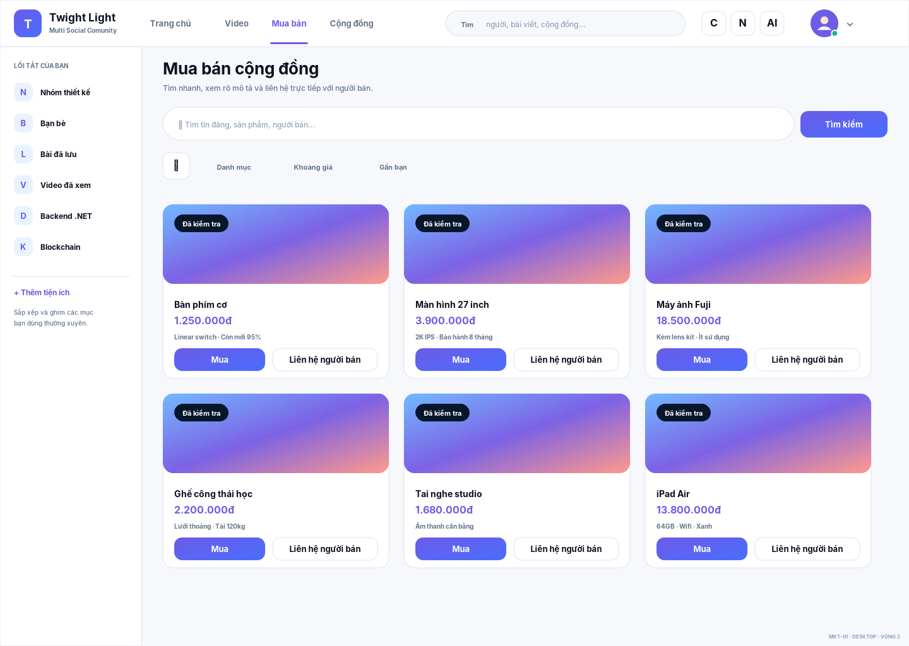

Nguồn SVG: `design/assets/editable/svg/desktop/mkt-01-cho.svg`

##### Mobile

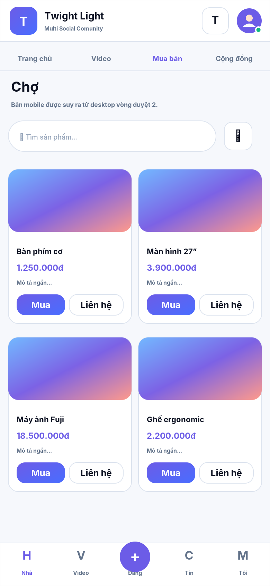

Nguồn SVG: `design/assets/editable/svg/mobile/mkt-01-cho.svg`

#### Quyết định cuối

- Trạng thái: **Đã duyệt để triển khai Frontend**.
- Phiên bản thiết kế: **1.2 Final**.
- Desktop và Mobile đã được đối chiếu về thứ tự ưu tiên, trạng thái, quyền và khả năng thao tác.
- SVG là nguồn hình chỉnh sửa; PNG chỉ dùng để duyệt.
- Các yêu cầu chưa có hợp đồng Backend phải tuân theo `design/sources/18-backend-contract-gaps.md`; không tự tạo API.

---

> **Trạng thái duyệt MKT-02:** Đã duyệt

### MKT-02 - Chi tiết tin đăng

#### Mục tiêu

Hiển thị ảnh, giá, tồn kho, người bán và hành động mua với dữ liệu giá chụp tại thời điểm đặt.

#### Vai trò và ưu tiên

- Vai trò: Người mua, Khách theo chính sách
- Mức ưu tiên: **P2**
- Mã chức năng: `MKT-02`, `MKT-07`
- Route dự kiến: `/cho/tin/:id`

#### Bố cục

- Gallery trái, thông tin mua phải; mobile gallery trước CTA cố định dưới.
- Thông tin tồn kho và trạng thái seller rõ.

#### Hành động

##### Chính

- Mua ngay

##### Phụ

- Nhắn người bán
- Chia sẻ
- Báo cáo

#### Component

- `AppShell`
- `MediaGallery`
- `ListingSummary`
- `InventoryBadge`
- `SellerCard`
- `StickyCTA`

#### Dữ liệu và hợp đồng liên quan

- GET /api/v1/listings/{id}
- POST order khi mua

Mọi endpoint chưa được khóa trong OpenAPI phải được đánh dấu là **cần khóa hợp đồng**, không tự tạo chỉ vì mockup cần dữ liệu.

#### Trạng thái bắt buộc

- Còn hàng
- Hết hàng
- Tin đăng ẩn
- Phương tiện thiếu

Ngoài các trạng thái trên, áp dụng trạng thái dùng chung trong `design/sources/11-state-matrix.md`.

#### Tương tác và phản hồi

- Hành động có request phải có trạng thái `idle -> submitting -> success/error`.
- Double-click hoặc reconnect không được tạo side effect trùng.
- Dữ liệu nhập phải được giữ khi lỗi có thể thử lại.
- Khi route không còn quyền, điều hướng về vị trí an toàn và không tiết lộ nội dung.
- Mọi toast quan trọng phải có bản inline hoặc lịch sử phù hợp khi người dùng cần hành động.

#### Responsive

- Desktop dùng frame 1440 x 1024 trong mockup.
- Mobile dùng frame 390 x 844.
- Nội dung và hành động giữ cùng ý nghĩa; không chỉ thu nhỏ tỷ lệ.
- Bảng hoặc split view phải chuyển thành danh sách, drawer hoặc route con trên mobile.
- Touch target tối thiểu 44 x 44 px.

#### Accessibility

- Gallery có điều khiển bàn phím và số ảnh.
- CTA disabled phải có lý do hết hàng.

- Focus ring nhìn thấy.
- Icon-only button có tên truy cập.
- Trạng thái không truyền đạt bằng màu duy nhất.

#### Rủi ro cần kiểm soát

- Không tự suy đoán quyền từ trạng thái UI; server là nguồn quyết định.
- Mô-đun có thể bị tắt bằng feature flag; không để điều hướng chết.

#### Tiêu chí chấp nhận UI

- Với vai trò Người mua, Khách theo chính sách, khi mở `/cho/tin/:id`, màn hình hiển thị đúng dữ liệu được phép hoặc trạng thái an toàn.
- Khi thực hiện hành động chính “Mua ngay”, giao diện khóa gửi lặp không chủ đích và phản ánh kết quả server.
- Khi API trả 401/403/404/409/412/422/429/503 liên quan, giao diện dùng trạng thái đã định nghĩa và không làm mất dữ liệu nhập.
- Desktop và mobile giữ cùng mục tiêu, quyền và thứ tự ưu tiên hành động.
- Luồng bàn phím, focus và nhãn truy cập đạt yêu cầu trong tài liệu accessibility.

#### Hình chỉnh sửa

##### Desktop

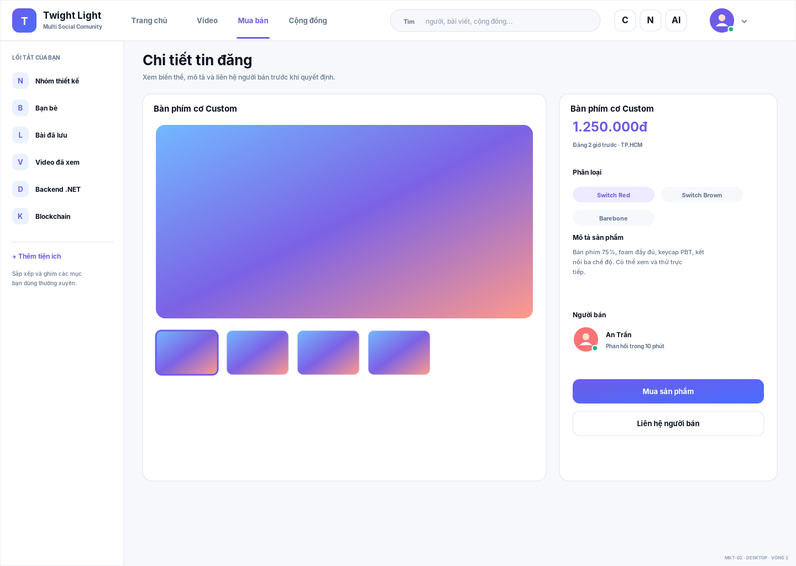

Nguồn SVG: `design/assets/editable/svg/desktop/mkt-02-chi-tiet-tin-dang.svg`

##### Mobile

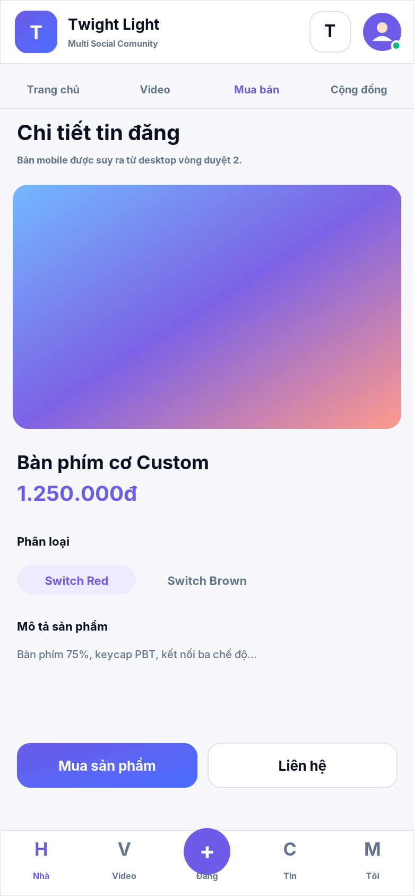

Nguồn SVG: `design/assets/editable/svg/mobile/mkt-02-chi-tiet-tin-dang.svg`

#### Quyết định cuối

- Trạng thái: **Đã duyệt để triển khai Frontend**.
- Phiên bản thiết kế: **1.2 Final**.
- Desktop và Mobile đã được đối chiếu về thứ tự ưu tiên, trạng thái, quyền và khả năng thao tác.
- SVG là nguồn hình chỉnh sửa; PNG chỉ dùng để duyệt.
- Các yêu cầu chưa có hợp đồng Backend phải tuân theo `design/sources/18-backend-contract-gaps.md`; không tự tạo API.

---

> **Trạng thái duyệt MKT-03:** Đã duyệt

### MKT-03 - Tạo hoặc sửa tin đăng

#### Mục tiêu

Soạn tin, gắn phương tiện Ready, đặt giá/tồn kho và lưu bằng If-Match khi chỉnh sửa.

#### Vai trò và ưu tiên

- Vai trò: Người bán
- Mức ưu tiên: **P2**
- Mã chức năng: `MKT-01`, `MKT-03`, `MKT-07`
- Route dự kiến: `/cho/tin/moi`

#### Bố cục

- Form nhóm Thông tin, Giá/tồn kho, Phương tiện, Trạng thái.
- Preview card ở desktop; mobile preview riêng.

#### Hành động

##### Chính

- Đăng tin

##### Phụ

- Lưu nháp
- Thêm phương tiện

#### Component

- `EditorShell`
- `TextField`
- `CurrencyInput`
- `InventoryInput`
- `MediaSorter`
- `PreviewCard`
- `SaveBar`

#### Dữ liệu và hợp đồng liên quan

- POST/PATCH /api/v1/listings
- PUT inventory
- Media Ready refs
- If-Match

Mọi endpoint chưa được khóa trong OpenAPI phải được đánh dấu là **cần khóa hợp đồng**, không tự tạo chỉ vì mockup cần dữ liệu.

#### Trạng thái bắt buộc

- Rỗng
- Dữ liệu sai
- Phương tiện chưa sẵn sàng
- Xung đột phiên bản
- Đã đăng

Ngoài các trạng thái trên, áp dụng trạng thái dùng chung trong `design/sources/11-state-matrix.md`.

#### Tương tác và phản hồi

- Hành động có request phải có trạng thái `idle -> submitting -> success/error`.
- Double-click hoặc reconnect không được tạo side effect trùng.
- Dữ liệu nhập phải được giữ khi lỗi có thể thử lại.
- Khi route không còn quyền, điều hướng về vị trí an toàn và không tiết lộ nội dung.
- Mọi toast quan trọng phải có bản inline hoặc lịch sử phù hợp khi người dùng cần hành động.

#### Responsive

- Desktop dùng frame 1440 x 1024 trong mockup.
- Mobile dùng frame 390 x 844.
- Nội dung và hành động giữ cùng ý nghĩa; không chỉ thu nhỏ tỷ lệ.
- Bảng hoặc split view phải chuyển thành danh sách, drawer hoặc route con trên mobile.
- Touch target tối thiểu 44 x 44 px.

#### Accessibility

- Input giá có label đơn vị.
- Sắp xếp ảnh có phương án phím.

- Focus ring nhìn thấy.
- Icon-only button có tên truy cập.
- Trạng thái không truyền đạt bằng màu duy nhất.

#### Rủi ro cần kiểm soát

- Không tự suy đoán quyền từ trạng thái UI; server là nguồn quyết định.
- Mô-đun có thể bị tắt bằng feature flag; không để điều hướng chết.

#### Tiêu chí chấp nhận UI

- Với vai trò Người bán, khi mở `/cho/tin/moi`, màn hình hiển thị đúng dữ liệu được phép hoặc trạng thái an toàn.
- Khi thực hiện hành động chính “Đăng tin”, giao diện khóa gửi lặp không chủ đích và phản ánh kết quả server.
- Khi API trả 401/403/404/409/412/422/429/503 liên quan, giao diện dùng trạng thái đã định nghĩa và không làm mất dữ liệu nhập.
- Desktop và mobile giữ cùng mục tiêu, quyền và thứ tự ưu tiên hành động.
- Luồng bàn phím, focus và nhãn truy cập đạt yêu cầu trong tài liệu accessibility.

#### Hình chỉnh sửa

##### Desktop

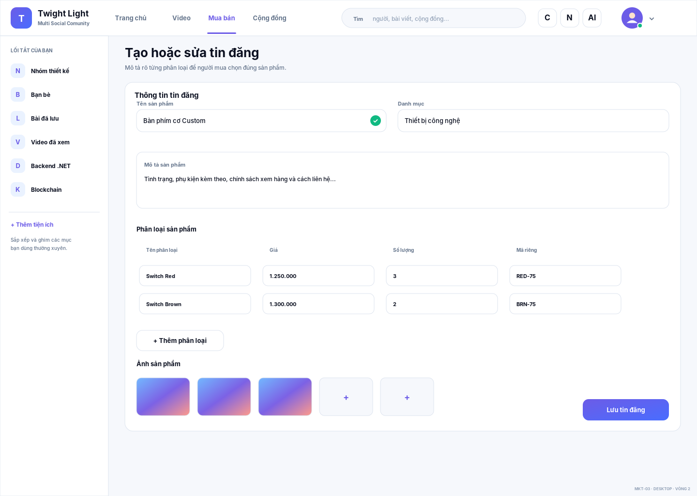

Nguồn SVG: `design/assets/editable/svg/desktop/mkt-03-tao-sua-tin-dang.svg`

##### Mobile

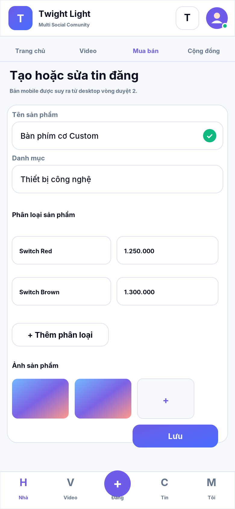

Nguồn SVG: `design/assets/editable/svg/mobile/mkt-03-tao-sua-tin-dang.svg`

#### Quyết định cuối

- Trạng thái: **Đã duyệt để triển khai Frontend**.
- Phiên bản thiết kế: **1.2 Final**.
- Desktop và Mobile đã được đối chiếu về thứ tự ưu tiên, trạng thái, quyền và khả năng thao tác.
- SVG là nguồn hình chỉnh sửa; PNG chỉ dùng để duyệt.
- Các yêu cầu chưa có hợp đồng Backend phải tuân theo `design/sources/18-backend-contract-gaps.md`; không tự tạo API.

---

> **Trạng thái duyệt MKT-04:** Đã duyệt

### MKT-04 - Xác nhận đơn hàng

#### Mục tiêu

Xác nhận mặt hàng, số lượng, giá chụp và giữ tồn kho trước khi thanh toán giả lập.

#### Vai trò và ưu tiên

- Vai trò: Người mua
- Mức ưu tiên: **P2**
- Mã chức năng: `MKT-03`, `MKT-04`
- Route dự kiến: `/cho/thanh-toan`

#### Bố cục

- Tóm tắt đơn hàng, số lượng, giá chụp và tổng tiền; không thu thông tin thẻ thật.
- Xác nhận tồn kho trước khi tạo đơn.

#### Hành động

##### Chính

- Tạo đơn hàng

##### Phụ

- Quay lại
- Thay đổi số lượng

#### Component

- `CheckoutShell`
- `OrderItem`
- `QuantityControl`
- `PriceSummary`
- `InlineAlert`
- `Button`

#### Dữ liệu và hợp đồng liên quan

- POST /api/v1/orders với Idempotency-Key

Mọi endpoint chưa được khóa trong OpenAPI phải được đánh dấu là **cần khóa hợp đồng**, không tự tạo chỉ vì mockup cần dữ liệu.

#### Trạng thái bắt buộc

- Hợp lệ
- Tồn kho thay đổi
- Hết hàng
- Đơn hàng đã tồn tại do gửi lại

Ngoài các trạng thái trên, áp dụng trạng thái dùng chung trong `design/sources/11-state-matrix.md`.

#### Tương tác và phản hồi

- Hành động có request phải có trạng thái `idle -> submitting -> success/error`.
- Double-click hoặc reconnect không được tạo side effect trùng.
- Dữ liệu nhập phải được giữ khi lỗi có thể thử lại.
- Khi route không còn quyền, điều hướng về vị trí an toàn và không tiết lộ nội dung.
- Mọi toast quan trọng phải có bản inline hoặc lịch sử phù hợp khi người dùng cần hành động.

#### Responsive

- Desktop dùng frame 1440 x 1024 trong mockup.
- Mobile dùng frame 390 x 844.
- Nội dung và hành động giữ cùng ý nghĩa; không chỉ thu nhỏ tỷ lệ.
- Bảng hoặc split view phải chuyển thành danh sách, drawer hoặc route con trên mobile.
- Touch target tối thiểu 44 x 44 px.

#### Accessibility

- Tổng tiền là heading/summary rõ.
- Thông báo thay đổi giá/tồn kho yêu cầu xác nhận lại.

- Focus ring nhìn thấy.
- Icon-only button có tên truy cập.
- Trạng thái không truyền đạt bằng màu duy nhất.

#### Rủi ro cần kiểm soát

- Không tự suy đoán quyền từ trạng thái UI; server là nguồn quyết định.
- Mô-đun có thể bị tắt bằng feature flag; không để điều hướng chết.

#### Tiêu chí chấp nhận UI

- Với vai trò Người mua, khi mở `/cho/thanh-toan`, màn hình hiển thị đúng dữ liệu được phép hoặc trạng thái an toàn.
- Khi thực hiện hành động chính “Tạo đơn hàng”, giao diện khóa gửi lặp không chủ đích và phản ánh kết quả server.
- Khi API trả 401/403/404/409/412/422/429/503 liên quan, giao diện dùng trạng thái đã định nghĩa và không làm mất dữ liệu nhập.
- Desktop và mobile giữ cùng mục tiêu, quyền và thứ tự ưu tiên hành động.
- Luồng bàn phím, focus và nhãn truy cập đạt yêu cầu trong tài liệu accessibility.

#### Hình chỉnh sửa

##### Desktop

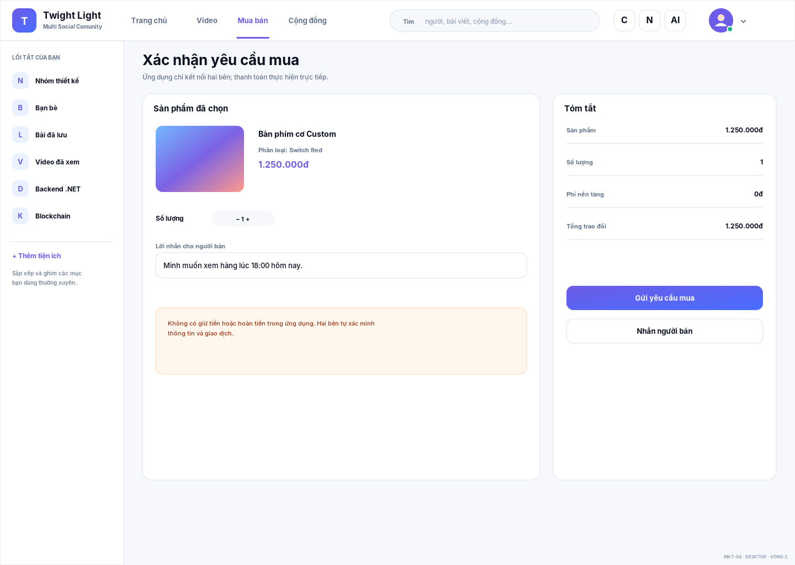

Nguồn SVG: `design/assets/editable/svg/desktop/mkt-04-thanh-toan.svg`

##### Mobile

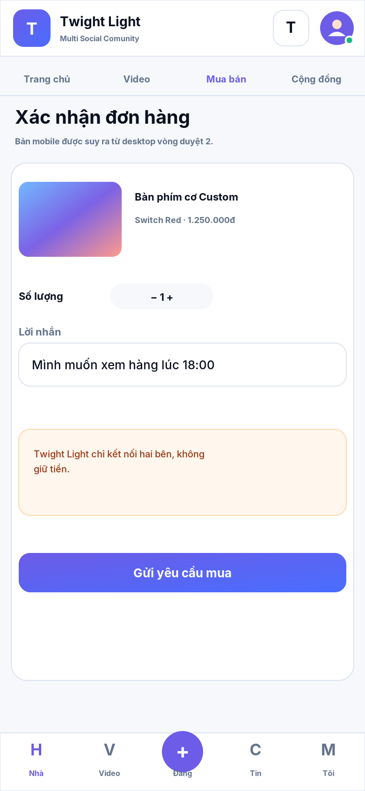

Nguồn SVG: `design/assets/editable/svg/mobile/mkt-04-thanh-toan.svg`

#### Quyết định cuối

- Trạng thái: **Đã duyệt để triển khai Frontend**.
- Phiên bản thiết kế: **1.2 Final**.
- Desktop và Mobile đã được đối chiếu về thứ tự ưu tiên, trạng thái, quyền và khả năng thao tác.
- SVG là nguồn hình chỉnh sửa; PNG chỉ dùng để duyệt.
- Các yêu cầu chưa có hợp đồng Backend phải tuân theo `design/sources/18-backend-contract-gaps.md`; không tự tạo API.

---

> **Trạng thái duyệt MKT-05:** Đã duyệt

### MKT-05 - Thanh toán trực tiếp với người bán

#### Mục tiêu

Thực hiện thanh toán giả lập lặp an toàn và hiển thị kết quả mà không gửi trùng.

#### Vai trò và ưu tiên

- Vai trò: Người mua
- Mức ưu tiên: **P2**
- Mã chức năng: `MKT-05`
- Route dự kiến: `/cho/don/:id/thanh-toan`

#### Bố cục

- Màn hình thanh toán giả lập nêu rõ là mô phỏng; trạng thái xử lý không cho gửi nút lần hai.
- Kết quả có mã tham chiếu và CTA đến đơn hàng.

#### Hành động

##### Chính

- Thanh toán

##### Phụ

- Thử lại an toàn
- Hủy đơn

#### Component

- `CheckoutShell`
- `PaymentSimulationCard`
- `Progress`
- `ResultState`
- `Button`

#### Dữ liệu và hợp đồng liên quan

- POST /api/v1/orders/{id}/pay với Idempotency-Key

Mọi endpoint chưa được khóa trong OpenAPI phải được đánh dấu là **cần khóa hợp đồng**, không tự tạo chỉ vì mockup cần dữ liệu.

#### Trạng thái bắt buộc

- Chờ thanh toán
- Đang xử lý
- Thành công
- Thất bại
- Kết quả cũ được trả lại

Ngoài các trạng thái trên, áp dụng trạng thái dùng chung trong `design/sources/11-state-matrix.md`.

#### Tương tác và phản hồi

- Hành động có request phải có trạng thái `idle -> submitting -> success/error`.
- Double-click hoặc reconnect không được tạo side effect trùng.
- Dữ liệu nhập phải được giữ khi lỗi có thể thử lại.
- Khi route không còn quyền, điều hướng về vị trí an toàn và không tiết lộ nội dung.
- Mọi toast quan trọng phải có bản inline hoặc lịch sử phù hợp khi người dùng cần hành động.

#### Responsive

- Desktop dùng frame 1440 x 1024 trong mockup.
- Mobile dùng frame 390 x 844.
- Nội dung và hành động giữ cùng ý nghĩa; không chỉ thu nhỏ tỷ lệ.
- Bảng hoặc split view phải chuyển thành danh sách, drawer hoặc route con trên mobile.
- Touch target tối thiểu 44 x 44 px.

#### Accessibility

- Spinner đi kèm text.
- Thành công/thất bại dùng heading và live region.

- Focus ring nhìn thấy.
- Icon-only button có tên truy cập.
- Trạng thái không truyền đạt bằng màu duy nhất.

#### Rủi ro cần kiểm soát

- Không tự suy đoán quyền từ trạng thái UI; server là nguồn quyết định.
- Mô-đun có thể bị tắt bằng feature flag; không để điều hướng chết.
- Hành động có hậu quả lớn không dùng cập nhật lạc quan và phải có xác nhận rõ.

#### Tiêu chí chấp nhận UI

- Với vai trò Người mua, khi mở `/cho/don/:id/thanh-toan`, màn hình hiển thị đúng dữ liệu được phép hoặc trạng thái an toàn.
- Khi thực hiện hành động chính “Thanh toán”, giao diện khóa gửi lặp không chủ đích và phản ánh kết quả server.
- Khi API trả 401/403/404/409/412/422/429/503 liên quan, giao diện dùng trạng thái đã định nghĩa và không làm mất dữ liệu nhập.
- Desktop và mobile giữ cùng mục tiêu, quyền và thứ tự ưu tiên hành động.
- Luồng bàn phím, focus và nhãn truy cập đạt yêu cầu trong tài liệu accessibility.

#### Hình chỉnh sửa

##### Desktop

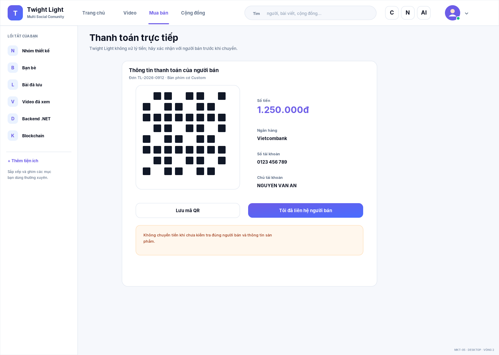

Nguồn SVG: `design/assets/editable/svg/desktop/mkt-05-thanh-toan-truc-tiep.svg`

##### Mobile

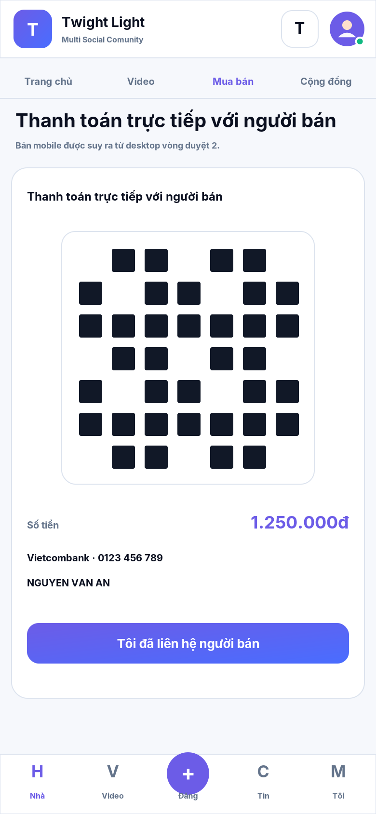

Nguồn SVG: `design/assets/editable/svg/mobile/mkt-05-thanh-toan-truc-tiep.svg`

#### Quyết định cuối

- Trạng thái: **Đã duyệt để triển khai Frontend**.
- Phiên bản thiết kế: **1.2 Final**.
- Desktop và Mobile đã được đối chiếu về thứ tự ưu tiên, trạng thái, quyền và khả năng thao tác.
- SVG là nguồn hình chỉnh sửa; PNG chỉ dùng để duyệt.
- Các yêu cầu chưa có hợp đồng Backend phải tuân theo `design/sources/18-backend-contract-gaps.md`; không tự tạo API.

---

> **Trạng thái duyệt MKT-06:** Đã duyệt

### MKT-06 - Đơn hàng

#### Mục tiêu

Theo dõi danh sách và chi tiết trạng thái đơn hàng theo máy trạng thái được phép.

#### Vai trò và ưu tiên

- Vai trò: Người mua, Người bán
- Mức ưu tiên: **P2**
- Mã chức năng: `MKT-06`
- Route dự kiến: `/cho/don-hang`

#### Bố cục

- Tabs vai trò mua/bán nếu cần; lọc trạng thái và timeline đơn hàng.
- Chi tiết có lịch sử trạng thái append-only.

#### Hành động

##### Chính

- Mở đơn hàng

##### Phụ

- Lọc trạng thái
- Hủy khi được phép

#### Component

- `AppShell`
- `OrderFilter`
- `OrderCard`
- `OrderTimeline`
- `EmptyState`

#### Dữ liệu và hợp đồng liên quan

- GET orders/detail theo API triển khai
- POST cancel/state transition khi được phép

Mọi endpoint chưa được khóa trong OpenAPI phải được đánh dấu là **cần khóa hợp đồng**, không tự tạo chỉ vì mockup cần dữ liệu.

#### Trạng thái bắt buộc

- Rỗng
- Đang chờ thanh toán
- Đã thanh toán
- Đang xử lý
- Hoàn tất
- Đã hủy

Ngoài các trạng thái trên, áp dụng trạng thái dùng chung trong `design/sources/11-state-matrix.md`.

#### Tương tác và phản hồi

- Hành động có request phải có trạng thái `idle -> submitting -> success/error`.
- Double-click hoặc reconnect không được tạo side effect trùng.
- Dữ liệu nhập phải được giữ khi lỗi có thể thử lại.
- Khi route không còn quyền, điều hướng về vị trí an toàn và không tiết lộ nội dung.
- Mọi toast quan trọng phải có bản inline hoặc lịch sử phù hợp khi người dùng cần hành động.

#### Responsive

- Desktop dùng frame 1440 x 1024 trong mockup.
- Mobile dùng frame 390 x 844.
- Nội dung và hành động giữ cùng ý nghĩa; không chỉ thu nhỏ tỷ lệ.
- Bảng hoặc split view phải chuyển thành danh sách, drawer hoặc route con trên mobile.
- Touch target tối thiểu 44 x 44 px.

#### Accessibility

- Timeline có thứ tự thời gian rõ và không chỉ dùng biểu tượng.

- Focus ring nhìn thấy.
- Icon-only button có tên truy cập.
- Trạng thái không truyền đạt bằng màu duy nhất.

#### Rủi ro cần kiểm soát

- Không tự suy đoán quyền từ trạng thái UI; server là nguồn quyết định.
- Mô-đun có thể bị tắt bằng feature flag; không để điều hướng chết.

#### Tiêu chí chấp nhận UI

- Với vai trò Người mua, Người bán, khi mở `/cho/don-hang`, màn hình hiển thị đúng dữ liệu được phép hoặc trạng thái an toàn.
- Khi thực hiện hành động chính “Mở đơn hàng”, giao diện khóa gửi lặp không chủ đích và phản ánh kết quả server.
- Khi API trả 401/403/404/409/412/422/429/503 liên quan, giao diện dùng trạng thái đã định nghĩa và không làm mất dữ liệu nhập.
- Desktop và mobile giữ cùng mục tiêu, quyền và thứ tự ưu tiên hành động.
- Luồng bàn phím, focus và nhãn truy cập đạt yêu cầu trong tài liệu accessibility.

#### Hình chỉnh sửa

##### Desktop

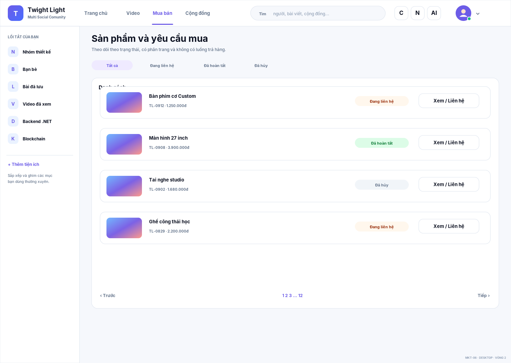

Nguồn SVG: `design/assets/editable/svg/desktop/mkt-06-don-hang.svg`

##### Mobile

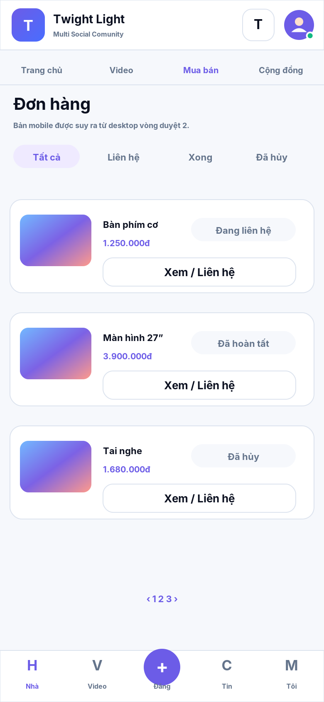

Nguồn SVG: `design/assets/editable/svg/mobile/mkt-06-don-hang.svg`

#### Quyết định cuối

- Trạng thái: **Đã duyệt để triển khai Frontend**.
- Phiên bản thiết kế: **1.2 Final**.
- Desktop và Mobile đã được đối chiếu về thứ tự ưu tiên, trạng thái, quyền và khả năng thao tác.
- SVG là nguồn hình chỉnh sửa; PNG chỉ dùng để duyệt.
- Các yêu cầu chưa có hợp đồng Backend phải tuân theo `design/sources/18-backend-contract-gaps.md`; không tự tạo API.

---

> **Trạng thái duyệt AI-01:** Đã duyệt

### AI-01 - Trợ lý AI

#### Mục tiêu

Hỏi đáp dựa trên nguồn người dùng được phép truy cập, stream câu trả lời và hiển thị nguồn tham chiếu.

#### Vai trò và ưu tiên

- Vai trò: Người dùng
- Mức ưu tiên: **P2**
- Mã chức năng: `AI-03`
- Route dự kiến: `/tro-ly`

#### Bố cục

- Lịch sử câu hỏi, vùng trả lời stream, danh sách nguồn và composer.
- CTA dừng sinh luôn hiển thị khi streaming.

#### Hành động

##### Chính

- Gửi câu hỏi

##### Phụ

- Dừng sinh
- Mở nguồn
- Bắt đầu phiên mới

#### Component

- `AppShell`
- `AIConversation`
- `AIMessage`
- `CitationCard`
- `AIComposer`
- `StreamingIndicator`

#### Dữ liệu và hợp đồng liên quan

- POST /api/v1/ai/ask
- SignalR AiToken/AiCompleted hoặc HTTP stream

Mọi endpoint chưa được khóa trong OpenAPI phải được đánh dấu là **cần khóa hợp đồng**, không tự tạo chỉ vì mockup cần dữ liệu.

#### Trạng thái bắt buộc

- Rỗng
- Đang truy xuất
- Đang stream
- Đã hoàn tất
- AI không khả dụng
- Bị giới hạn tần suất

Ngoài các trạng thái trên, áp dụng trạng thái dùng chung trong `design/sources/11-state-matrix.md`.

#### Tương tác và phản hồi

- Hành động có request phải có trạng thái `idle -> submitting -> success/error`.
- Double-click hoặc reconnect không được tạo side effect trùng.
- Dữ liệu nhập phải được giữ khi lỗi có thể thử lại.
- Khi route không còn quyền, điều hướng về vị trí an toàn và không tiết lộ nội dung.
- Mọi toast quan trọng phải có bản inline hoặc lịch sử phù hợp khi người dùng cần hành động.

#### Responsive

- Desktop dùng frame 1440 x 1024 trong mockup.
- Mobile dùng frame 390 x 844.
- Nội dung và hành động giữ cùng ý nghĩa; không chỉ thu nhỏ tỷ lệ.
- Bảng hoặc split view phải chuyển thành danh sách, drawer hoặc route con trên mobile.
- Touch target tối thiểu 44 x 44 px.

#### Accessibility

- Không công bố mỗi token; gom cập nhật theo đoạn.
- Nguồn có tên tài nguyên và trạng thái quyền.

- Focus ring nhìn thấy.
- Icon-only button có tên truy cập.
- Trạng thái không truyền đạt bằng màu duy nhất.

#### Rủi ro cần kiểm soát

- Không tự suy đoán quyền từ trạng thái UI; server là nguồn quyết định.
- Mô-đun có thể bị tắt bằng feature flag; không để điều hướng chết.

#### Tiêu chí chấp nhận UI

- Với vai trò Người dùng, khi mở `/tro-ly`, màn hình hiển thị đúng dữ liệu được phép hoặc trạng thái an toàn.
- Khi thực hiện hành động chính “Gửi câu hỏi”, giao diện khóa gửi lặp không chủ đích và phản ánh kết quả server.
- Khi API trả 401/403/404/409/412/422/429/503 liên quan, giao diện dùng trạng thái đã định nghĩa và không làm mất dữ liệu nhập.
- Desktop và mobile giữ cùng mục tiêu, quyền và thứ tự ưu tiên hành động.
- Luồng bàn phím, focus và nhãn truy cập đạt yêu cầu trong tài liệu accessibility.

#### Hình chỉnh sửa

##### Desktop

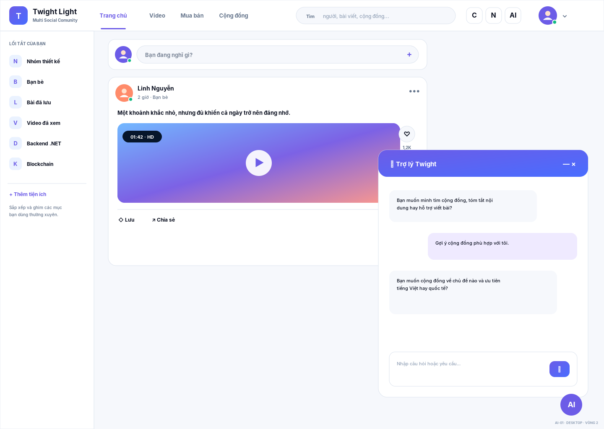

Nguồn SVG: `design/assets/editable/svg/desktop/ai-01-tro-ly-ai.svg`

##### Mobile

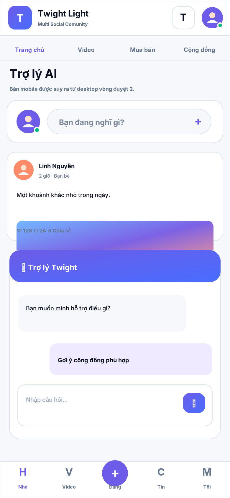

Nguồn SVG: `design/assets/editable/svg/mobile/ai-01-tro-ly-ai.svg`

#### Quyết định cuối

- Trạng thái: **Đã duyệt để triển khai Frontend**.
- Phiên bản thiết kế: **1.2 Final**.
- Desktop và Mobile đã được đối chiếu về thứ tự ưu tiên, trạng thái, quyền và khả năng thao tác.
- SVG là nguồn hình chỉnh sửa; PNG chỉ dùng để duyệt.
- Các yêu cầu chưa có hợp đồng Backend phải tuân theo `design/sources/18-backend-contract-gaps.md`; không tự tạo API.

---

> **Trạng thái duyệt AI-02:** Đã duyệt

### AI-02 - Tóm tắt hội thoại hoặc kênh

#### Mục tiêu

Chọn phạm vi nội dung đã được Trò chuyện cấp quyền và tạo bản tóm tắt có giới hạn.

#### Vai trò và ưu tiên

- Vai trò: Thành viên có quyền
- Mức ưu tiên: **P2**
- Mã chức năng: `AI-04`
- Route dự kiến: `/tro-ly/tom-tat`

#### Bố cục

- Bộ chọn nguồn/phạm vi, khung kết quả và hành động sao chép.
- Cảnh báo nội dung đã xóa/không còn quyền sẽ bị loại.

#### Hành động

##### Chính

- Tạo tóm tắt

##### Phụ

- Chọn khoảng thời gian
- Sao chép

#### Component

- `AppShell`
- `ScopePicker`
- `DateRange`
- `SummaryCard`
- `Button`
- `InlineAlert`

#### Dữ liệu và hợp đồng liên quan

- POST /api/v1/ai/summaries

Mọi endpoint chưa được khóa trong OpenAPI phải được đánh dấu là **cần khóa hợp đồng**, không tự tạo chỉ vì mockup cần dữ liệu.

#### Trạng thái bắt buộc

- Chưa chọn phạm vi
- Đang xử lý
- Hoàn tất
- Nội dung quá lớn
- Mất quyền

Ngoài các trạng thái trên, áp dụng trạng thái dùng chung trong `design/sources/11-state-matrix.md`.

#### Tương tác và phản hồi

- Hành động có request phải có trạng thái `idle -> submitting -> success/error`.
- Double-click hoặc reconnect không được tạo side effect trùng.
- Dữ liệu nhập phải được giữ khi lỗi có thể thử lại.
- Khi route không còn quyền, điều hướng về vị trí an toàn và không tiết lộ nội dung.
- Mọi toast quan trọng phải có bản inline hoặc lịch sử phù hợp khi người dùng cần hành động.

#### Responsive

- Desktop dùng frame 1440 x 1024 trong mockup.
- Mobile dùng frame 390 x 844.
- Nội dung và hành động giữ cùng ý nghĩa; không chỉ thu nhỏ tỷ lệ.
- Bảng hoặc split view phải chuyển thành danh sách, drawer hoặc route con trên mobile.
- Touch target tối thiểu 44 x 44 px.

#### Accessibility

- Kết quả có cấu trúc heading/list, không chỉ một khối văn bản.

- Focus ring nhìn thấy.
- Icon-only button có tên truy cập.
- Trạng thái không truyền đạt bằng màu duy nhất.

#### Rủi ro cần kiểm soát

- Không tự suy đoán quyền từ trạng thái UI; server là nguồn quyết định.
- Mô-đun có thể bị tắt bằng feature flag; không để điều hướng chết.

#### Tiêu chí chấp nhận UI

- Với vai trò Thành viên có quyền, khi mở `/tro-ly/tom-tat`, màn hình hiển thị đúng dữ liệu được phép hoặc trạng thái an toàn.
- Khi thực hiện hành động chính “Tạo tóm tắt”, giao diện khóa gửi lặp không chủ đích và phản ánh kết quả server.
- Khi API trả 401/403/404/409/412/422/429/503 liên quan, giao diện dùng trạng thái đã định nghĩa và không làm mất dữ liệu nhập.
- Desktop và mobile giữ cùng mục tiêu, quyền và thứ tự ưu tiên hành động.
- Luồng bàn phím, focus và nhãn truy cập đạt yêu cầu trong tài liệu accessibility.

#### Hình chỉnh sửa

##### Desktop

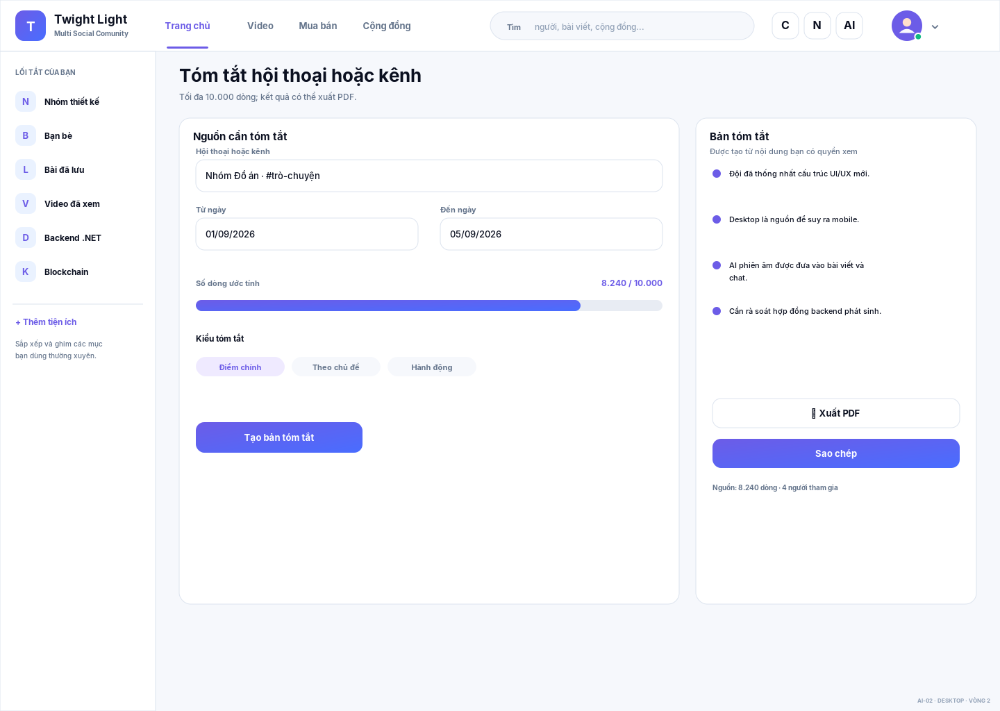

Nguồn SVG: `design/assets/editable/svg/desktop/ai-02-tom-tat.svg`

##### Mobile

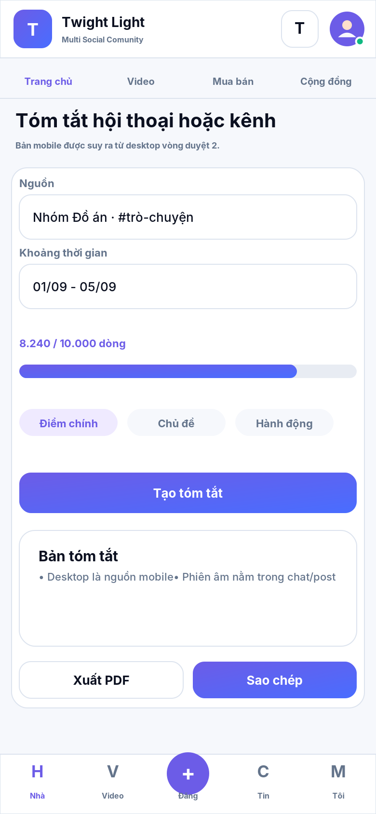

Nguồn SVG: `design/assets/editable/svg/mobile/ai-02-tom-tat.svg`

#### Quyết định cuối

- Trạng thái: **Đã duyệt để triển khai Frontend**.
- Phiên bản thiết kế: **1.2 Final**.
- Desktop và Mobile đã được đối chiếu về thứ tự ưu tiên, trạng thái, quyền và khả năng thao tác.
- SVG là nguồn hình chỉnh sửa; PNG chỉ dùng để duyệt.
- Các yêu cầu chưa có hợp đồng Backend phải tuân theo `design/sources/18-backend-contract-gaps.md`; không tự tạo API.

---

> **Trạng thái duyệt MOD-01:** Đã duyệt

### MOD-01 - Báo cáo nội dung

#### Mục tiêu

Thu thập lý do, mô tả tối thiểu và bằng chứng cần thiết mà không làm lộ dữ liệu điều hành.

#### Vai trò và ưu tiên

- Vai trò: Người dùng
- Mức ưu tiên: **P1**
- Mã chức năng: `MOD-01`
- Route dự kiến: `hộp thoại`

#### Bố cục

- Dialog chọn reason code, mô tả tùy chọn, xác nhận và thông tin an toàn.
- Không hiển thị bằng chứng nội bộ hoặc trạng thái xử lý chi tiết.

#### Hành động

##### Chính

- Gửi báo cáo

##### Phụ

- Hủy

#### Component

- `Dialog`
- `RadioGroup`
- `TextArea`
- `PrivacyNote`
- `Button`
- `StatusMessage`

#### Dữ liệu và hợp đồng liên quan

- POST /api/v1/reports

Mọi endpoint chưa được khóa trong OpenAPI phải được đánh dấu là **cần khóa hợp đồng**, không tự tạo chỉ vì mockup cần dữ liệu.

#### Trạng thái bắt buộc

- Chọn lý do
- Nhập mô tả
- Gửi thành công
- Báo cáo trùng
- Giới hạn tần suất

Ngoài các trạng thái trên, áp dụng trạng thái dùng chung trong `design/sources/11-state-matrix.md`.

#### Tương tác và phản hồi

- Hành động có request phải có trạng thái `idle -> submitting -> success/error`.
- Double-click hoặc reconnect không được tạo side effect trùng.
- Dữ liệu nhập phải được giữ khi lỗi có thể thử lại.
- Khi route không còn quyền, điều hướng về vị trí an toàn và không tiết lộ nội dung.
- Mọi toast quan trọng phải có bản inline hoặc lịch sử phù hợp khi người dùng cần hành động.

#### Responsive

- Desktop dùng frame 1440 x 1024 trong mockup.
- Mobile dùng frame 390 x 844.
- Nội dung và hành động giữ cùng ý nghĩa; không chỉ thu nhỏ tỷ lệ.
- Bảng hoặc split view phải chuyển thành danh sách, drawer hoặc route con trên mobile.
- Touch target tối thiểu 44 x 44 px.

#### Accessibility

- Reason dùng radio/combobox có label.
- Sau thành công, focus trả đúng vị trí và thông báo.

- Focus ring nhìn thấy.
- Icon-only button có tên truy cập.
- Trạng thái không truyền đạt bằng màu duy nhất.

#### Rủi ro cần kiểm soát

- Không tự suy đoán quyền từ trạng thái UI; server là nguồn quyết định.

#### Tiêu chí chấp nhận UI

- Với vai trò Người dùng, khi mở `hộp thoại`, màn hình hiển thị đúng dữ liệu được phép hoặc trạng thái an toàn.
- Khi thực hiện hành động chính “Gửi báo cáo”, giao diện khóa gửi lặp không chủ đích và phản ánh kết quả server.
- Khi API trả 401/403/404/409/412/422/429/503 liên quan, giao diện dùng trạng thái đã định nghĩa và không làm mất dữ liệu nhập.
- Desktop và mobile giữ cùng mục tiêu, quyền và thứ tự ưu tiên hành động.
- Luồng bàn phím, focus và nhãn truy cập đạt yêu cầu trong tài liệu accessibility.

#### Hình chỉnh sửa

##### Desktop

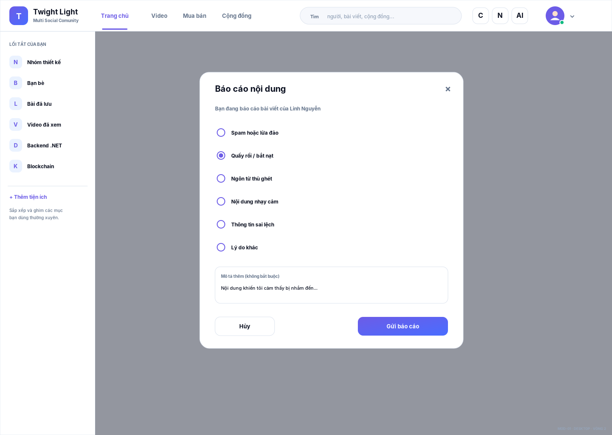

Nguồn SVG: `design/assets/editable/svg/desktop/mod-01-bao-cao-noi-dung.svg`

##### Mobile

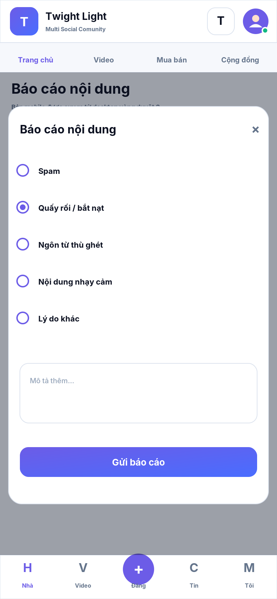

Nguồn SVG: `design/assets/editable/svg/mobile/mod-01-bao-cao-noi-dung.svg`

#### Quyết định cuối

- Trạng thái: **Đã duyệt để triển khai Frontend**.
- Phiên bản thiết kế: **1.2 Final**.
- Desktop và Mobile đã được đối chiếu về thứ tự ưu tiên, trạng thái, quyền và khả năng thao tác.
- SVG là nguồn hình chỉnh sửa; PNG chỉ dùng để duyệt.
- Các yêu cầu chưa có hợp đồng Backend phải tuân theo `design/sources/18-backend-contract-gaps.md`; không tự tạo API.

---

> **Trạng thái duyệt MOD-02:** Đã duyệt

### MOD-02 - Hàng đợi điều hành

#### Mục tiêu

Duyệt báo cáo theo ưu tiên, trạng thái, loại nội dung và người được phân công.

#### Vai trò và ưu tiên

- Vai trò: Điều hành viên, Quản trị viên
- Mức ưu tiên: **P1**
- Mã chức năng: `MOD-02`
- Route dự kiến: `/dieu-hanh/bao-cao`

#### Bố cục

- Bảng desktop với filter bar; card list mobile.
- Cột chính: ưu tiên, loại, lý do, trạng thái, thời gian, người xử lý.

#### Hành động

##### Chính

- Mở hồ sơ báo cáo

##### Phụ

- Lọc
- Nhận xử lý
- Sắp xếp

#### Component

- `ModerationShell`
- `FilterBar`
- `ModerationTable`
- `PriorityBadge`
- `PaginationOrCursor`

#### Dữ liệu và hợp đồng liên quan

- GET /api/v1/moderation/reports

Mọi endpoint chưa được khóa trong OpenAPI phải được đánh dấu là **cần khóa hợp đồng**, không tự tạo chỉ vì mockup cần dữ liệu.

#### Trạng thái bắt buộc

- Có dữ liệu
- Rỗng
- Đang lọc
- Không đủ quyền
- Dữ liệu nhạy cảm đã che

Ngoài các trạng thái trên, áp dụng trạng thái dùng chung trong `design/sources/11-state-matrix.md`.

#### Tương tác và phản hồi

- Hành động có request phải có trạng thái `idle -> submitting -> success/error`.
- Double-click hoặc reconnect không được tạo side effect trùng.
- Dữ liệu nhập phải được giữ khi lỗi có thể thử lại.
- Khi route không còn quyền, điều hướng về vị trí an toàn và không tiết lộ nội dung.
- Mọi toast quan trọng phải có bản inline hoặc lịch sử phù hợp khi người dùng cần hành động.

#### Responsive

- Desktop dùng frame 1440 x 1024 trong mockup.
- Mobile dùng frame 390 x 844.
- Nội dung và hành động giữ cùng ý nghĩa; không chỉ thu nhỏ tỷ lệ.
- Bảng hoặc split view phải chuyển thành danh sách, drawer hoặc route con trên mobile.
- Touch target tối thiểu 44 x 44 px.

#### Accessibility

- Header bảng có scope.
- PII đã che vẫn có nhãn không gây hiểu lầm.

- Focus ring nhìn thấy.
- Icon-only button có tên truy cập.
- Trạng thái không truyền đạt bằng màu duy nhất.

#### Rủi ro cần kiểm soát

- Không tự suy đoán quyền từ trạng thái UI; server là nguồn quyết định.

#### Tiêu chí chấp nhận UI

- Với vai trò Điều hành viên, Quản trị viên, khi mở `/dieu-hanh/bao-cao`, màn hình hiển thị đúng dữ liệu được phép hoặc trạng thái an toàn.
- Khi thực hiện hành động chính “Mở hồ sơ báo cáo”, giao diện khóa gửi lặp không chủ đích và phản ánh kết quả server.
- Khi API trả 401/403/404/409/412/422/429/503 liên quan, giao diện dùng trạng thái đã định nghĩa và không làm mất dữ liệu nhập.
- Desktop và mobile giữ cùng mục tiêu, quyền và thứ tự ưu tiên hành động.
- Luồng bàn phím, focus và nhãn truy cập đạt yêu cầu trong tài liệu accessibility.

#### Hình chỉnh sửa

##### Desktop

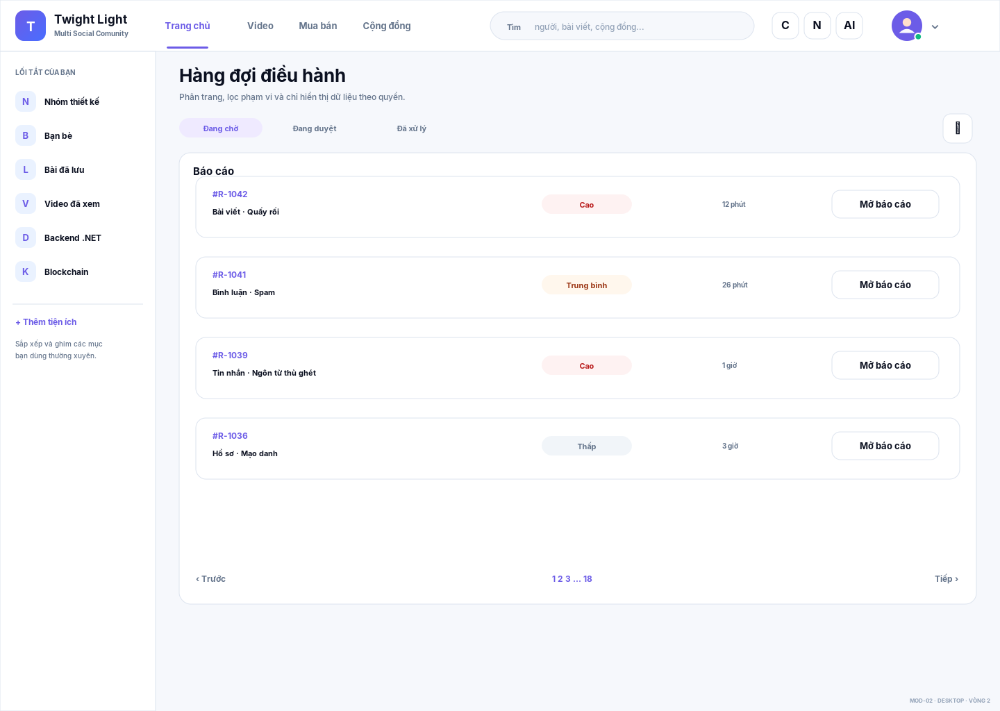

Nguồn SVG: `design/assets/editable/svg/desktop/mod-02-hang-doi-dieu-hanh.svg`

##### Mobile

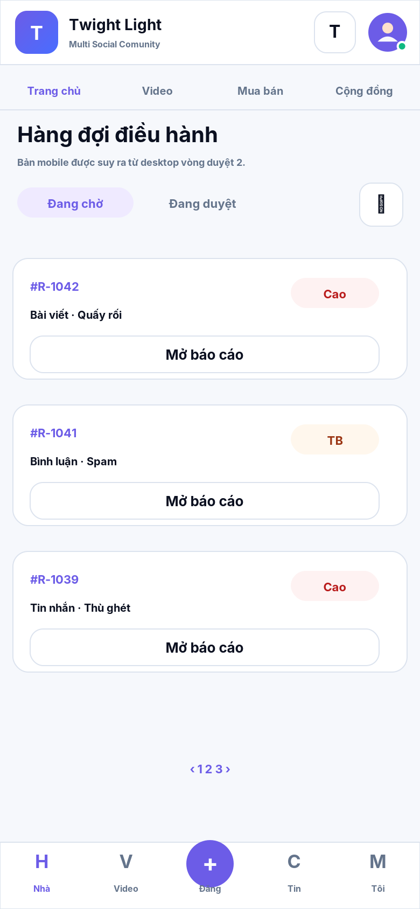

Nguồn SVG: `design/assets/editable/svg/mobile/mod-02-hang-doi-dieu-hanh.svg`

#### Quyết định cuối

- Trạng thái: **Đã duyệt để triển khai Frontend**.
- Phiên bản thiết kế: **1.2 Final**.
- Desktop và Mobile đã được đối chiếu về thứ tự ưu tiên, trạng thái, quyền và khả năng thao tác.
- SVG là nguồn hình chỉnh sửa; PNG chỉ dùng để duyệt.
- Các yêu cầu chưa có hợp đồng Backend phải tuân theo `design/sources/18-backend-contract-gaps.md`; không tự tạo API.

---

> **Trạng thái duyệt MOD-03:** Đã duyệt

### MOD-03 - Chi tiết điều hành

#### Mục tiêu

Xem bằng chứng được phép, ghi lý do, yêu cầu hành động và đóng hồ sơ với nhật ký bất biến.

#### Vai trò và ưu tiên

- Vai trò: Điều hành viên, Quản trị viên
- Mức ưu tiên: **P1**
- Mã chức năng: `MOD-03`, `MOD-04`
- Route dự kiến: `/dieu-hanh/bao-cao/:id`

#### Bố cục

- Hai cột: bằng chứng/nội dung và panel quyết định; timeline audit dưới.
- Hành động có reason bắt buộc và xác nhận.

#### Hành động

##### Chính

- Áp dụng hành động
- Đóng báo cáo

##### Phụ

- Từ chối
- Chuyển người xử lý

#### Component

- `ModerationShell`
- `EvidenceCard`
- `ActionPanel`
- `AuditTimeline`
- `ConflictDialog`

#### Dữ liệu và hợp đồng liên quan

- POST /api/v1/reports/{id}/actions
- POST /api/v1/reports/{id}/close
- If-Match

Mọi endpoint chưa được khóa trong OpenAPI phải được đánh dấu là **cần khóa hợp đồng**, không tự tạo chỉ vì mockup cần dữ liệu.

#### Trạng thái bắt buộc

- Pending
- InReview
- ActionPending
- Actioned
- Rejected
- Closed
- Xung đột phiên bản

Ngoài các trạng thái trên, áp dụng trạng thái dùng chung trong `design/sources/11-state-matrix.md`.

#### Tương tác và phản hồi

- Hành động có request phải có trạng thái `idle -> submitting -> success/error`.
- Double-click hoặc reconnect không được tạo side effect trùng.
- Dữ liệu nhập phải được giữ khi lỗi có thể thử lại.
- Khi route không còn quyền, điều hướng về vị trí an toàn và không tiết lộ nội dung.
- Mọi toast quan trọng phải có bản inline hoặc lịch sử phù hợp khi người dùng cần hành động.

#### Responsive

- Desktop dùng frame 1440 x 1024 trong mockup.
- Mobile dùng frame 390 x 844.
- Nội dung và hành động giữ cùng ý nghĩa; không chỉ thu nhỏ tỷ lệ.
- Bảng hoặc split view phải chuyển thành danh sách, drawer hoặc route con trên mobile.
- Touch target tối thiểu 44 x 44 px.

#### Accessibility

- Bằng chứng nhạy cảm có cảnh báo trước.
- Không tự phát media nhạy cảm.

- Focus ring nhìn thấy.
- Icon-only button có tên truy cập.
- Trạng thái không truyền đạt bằng màu duy nhất.

#### Rủi ro cần kiểm soát

- Không tự suy đoán quyền từ trạng thái UI; server là nguồn quyết định.
- Hành động có hậu quả lớn không dùng cập nhật lạc quan và phải có xác nhận rõ.

#### Tiêu chí chấp nhận UI

- Với vai trò Điều hành viên, Quản trị viên, khi mở `/dieu-hanh/bao-cao/:id`, màn hình hiển thị đúng dữ liệu được phép hoặc trạng thái an toàn.
- Khi thực hiện hành động chính “Áp dụng hành động”, giao diện khóa gửi lặp không chủ đích và phản ánh kết quả server.
- Khi API trả 401/403/404/409/412/422/429/503 liên quan, giao diện dùng trạng thái đã định nghĩa và không làm mất dữ liệu nhập.
- Desktop và mobile giữ cùng mục tiêu, quyền và thứ tự ưu tiên hành động.
- Luồng bàn phím, focus và nhãn truy cập đạt yêu cầu trong tài liệu accessibility.

#### Hình chỉnh sửa

##### Desktop

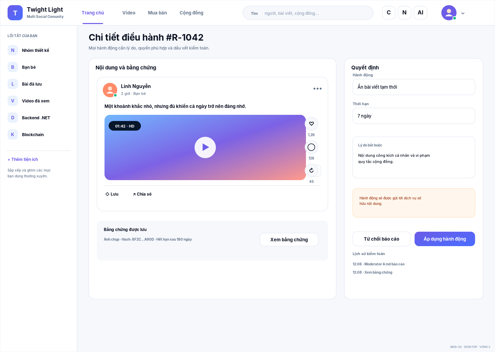

Nguồn SVG: `design/assets/editable/svg/desktop/mod-03-chi-tiet-dieu-hanh.svg`

##### Mobile

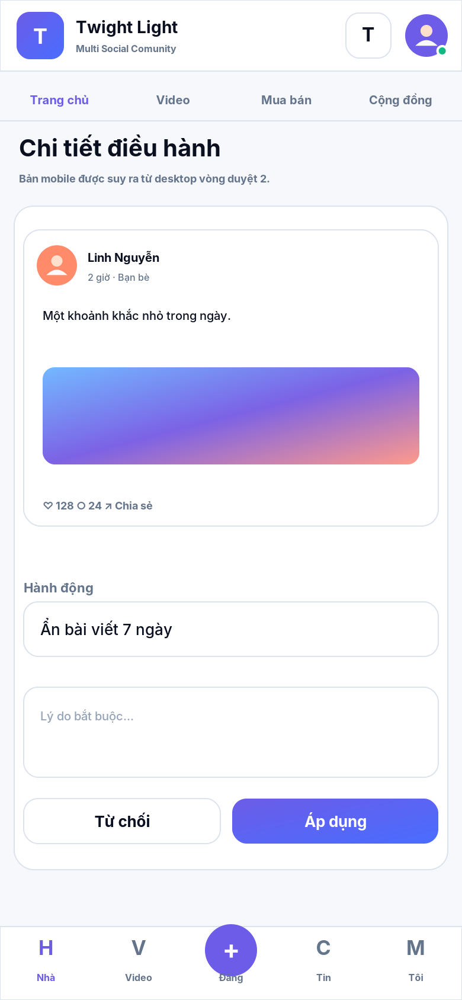

Nguồn SVG: `design/assets/editable/svg/mobile/mod-03-chi-tiet-dieu-hanh.svg`

#### Quyết định cuối

- Trạng thái: **Đã duyệt để triển khai Frontend**.
- Phiên bản thiết kế: **1.2 Final**.
- Desktop và Mobile đã được đối chiếu về thứ tự ưu tiên, trạng thái, quyền và khả năng thao tác.
- SVG là nguồn hình chỉnh sửa; PNG chỉ dùng để duyệt.
- Các yêu cầu chưa có hợp đồng Backend phải tuân theo `design/sources/18-backend-contract-gaps.md`; không tự tạo API.

---

> **Trạng thái duyệt SYS-01:** Đã duyệt

### SYS-01 - Trạng thái tải, rỗng, lỗi và ngoại tuyến

#### Mục tiêu

Chuẩn hóa skeleton, empty state, lỗi có thể thử lại, lỗi quyền, ngoại tuyến và reconnect.

#### Vai trò và ưu tiên

- Vai trò: Mọi vai trò
- Mức ưu tiên: **P0**
- Mã chức năng: `NFR`, `FAILURE`
- Route dự kiến: `toàn ứng dụng`

#### Bố cục

- Bộ mẫu dùng chung cho skeleton, rỗng, lỗi, cấm, không tìm thấy, ngoại tuyến và rate limit.
- Mỗi trạng thái có tiêu đề, mô tả, CTA chính/phụ và vùng chi tiết kỹ thuật có thể thu gọn.

#### Hành động

##### Chính

- Thử lại
- Quay lại

##### Phụ

- Xem chi tiết hỗ trợ

#### Component

- `StateBoard`
- `Skeleton`
- `EmptyState`
- `ErrorState`
- `OfflineBanner`
- `RateLimitState`

#### Dữ liệu và hợp đồng liên quan

- Problem Details
- Retry-After
- traceId để hỗ trợ nhưng không hiển thị mặc định quá nổi bật.

Mọi endpoint chưa được khóa trong OpenAPI phải được đánh dấu là **cần khóa hợp đồng**, không tự tạo chỉ vì mockup cần dữ liệu.

#### Trạng thái bắt buộc

- Loading
- Empty
- Error
- Forbidden
- Not found
- Offline
- Reconnecting
- Rate limited
- Service unavailable

Ngoài các trạng thái trên, áp dụng trạng thái dùng chung trong `design/sources/11-state-matrix.md`.

#### Tương tác và phản hồi

- Hành động có request phải có trạng thái `idle -> submitting -> success/error`.
- Double-click hoặc reconnect không được tạo side effect trùng.
- Dữ liệu nhập phải được giữ khi lỗi có thể thử lại.
- Khi route không còn quyền, điều hướng về vị trí an toàn và không tiết lộ nội dung.
- Mọi toast quan trọng phải có bản inline hoặc lịch sử phù hợp khi người dùng cần hành động.

#### Responsive

- Desktop dùng frame 1440 x 1024 trong mockup.
- Mobile dùng frame 390 x 844.
- Nội dung và hành động giữ cùng ý nghĩa; không chỉ thu nhỏ tỷ lệ.
- Bảng hoặc split view phải chuyển thành danh sách, drawer hoặc route con trên mobile.
- Touch target tối thiểu 44 x 44 px.

#### Accessibility

- Lỗi form dùng role=alert hợp lý; lỗi trang dùng heading và focus.
- Skeleton ẩn khỏi accessibility tree hoặc có label tải.

- Focus ring nhìn thấy.
- Icon-only button có tên truy cập.
- Trạng thái không truyền đạt bằng màu duy nhất.

#### Rủi ro cần kiểm soát

- Giữ microcopy và trạng thái đồng nhất với các màn hình cùng miền.

#### Tiêu chí chấp nhận UI

- Với vai trò Mọi vai trò, khi mở `toàn ứng dụng`, màn hình hiển thị đúng dữ liệu được phép hoặc trạng thái an toàn.
- Khi thực hiện hành động chính “Thử lại”, giao diện khóa gửi lặp không chủ đích và phản ánh kết quả server.
- Khi API trả 401/403/404/409/412/422/429/503 liên quan, giao diện dùng trạng thái đã định nghĩa và không làm mất dữ liệu nhập.
- Desktop và mobile giữ cùng mục tiêu, quyền và thứ tự ưu tiên hành động.
- Luồng bàn phím, focus và nhãn truy cập đạt yêu cầu trong tài liệu accessibility.

#### Hình chỉnh sửa

##### Desktop

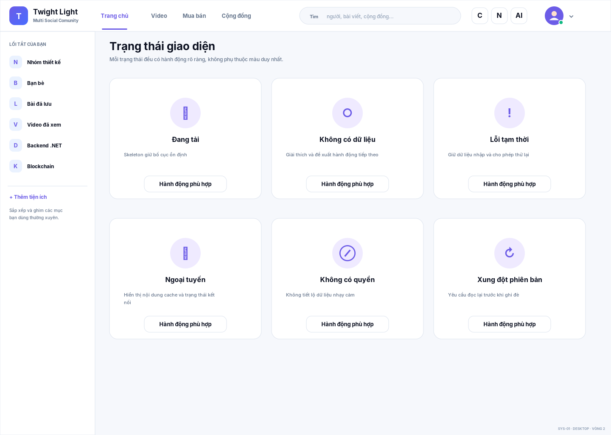

Nguồn SVG: `design/assets/editable/svg/desktop/sys-01-trang-thai-he-thong.svg`

##### Mobile

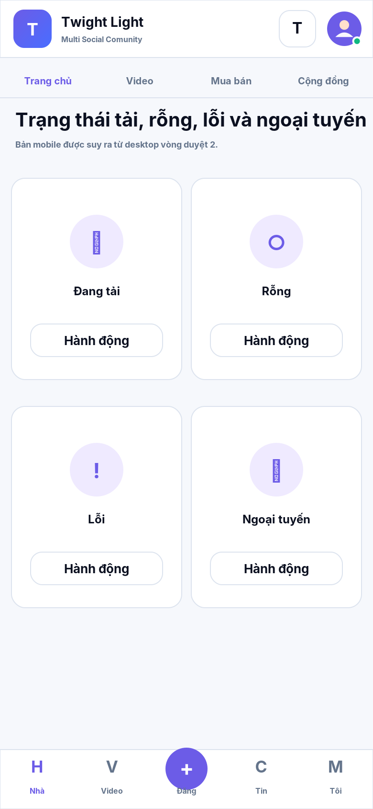

Nguồn SVG: `design/assets/editable/svg/mobile/sys-01-trang-thai-he-thong.svg`

#### Quyết định cuối

- Trạng thái: **Đã duyệt để triển khai Frontend**.
- Phiên bản thiết kế: **1.2 Final**.
- Desktop và Mobile đã được đối chiếu về thứ tự ưu tiên, trạng thái, quyền và khả năng thao tác.
- SVG là nguồn hình chỉnh sửa; PNG chỉ dùng để duyệt.
- Các yêu cầu chưa có hợp đồng Backend phải tuân theo `design/sources/18-backend-contract-gaps.md`; không tự tạo API.

## Phần III - Kế hoạch triển khai Frontend

### Kế hoạch triển khai Frontend

#### Giai đoạn 0 - Nền tảng giao diện

- App shell, route guard, error boundary, token, typography, icon và accessibility primitives.
- HTTP client, Problem Details mapper, auth refresh coordinator, SignalR adapter và feature flag.

#### Giai đoạn 1 - P0

1. Xác thực cơ sở: AUTH-01 đến AUTH-03.
2. Bảng tin và bài viết: FEED-01 đến FEED-04.
3. Hồ sơ và thiết lập cơ sở.
4. Chat, notification và trạng thái hệ thống.

#### Giai đoạn 2 - P1

- Khôi phục mật khẩu, xóa tài khoản, cộng đồng, RTC, media, video và điều hành nội dung.

#### Giai đoạn 3 - P2

- Marketplace, AI, tóm tắt và các chức năng chỉ được bật khi hợp đồng Backend tương ứng đã khóa.

#### Cổng hoàn thành mỗi màn hình

- Route và quyền đúng.
- Desktop + mobile đúng thứ tự ưu tiên.
- Loading/empty/error/offline/forbidden được xử lý.
- Keyboard, focus, aria và độ tương phản đạt.
- Test tối thiểu cho happy path, validation, authorization và retry/idempotency khi liên quan.
- Không còn dữ liệu giả nằm trên đường chạy production.

## Phần IV - Checklist chuyển thiết kế thành mã

### Checklist chuyển thiết kế thành mã

- [ ] Đã đọc `design.md` và đặc tả màn hình liên quan.
- [ ] Đã kiểm tra OpenAPI/AsyncAPI, không suy đoán endpoint.
- [ ] Đã tái sử dụng token và component hiện có.
- [ ] Đã triển khai desktop và mobile theo thiết kế, không scale cơ học.
- [ ] Đã có loading, empty, error, offline và unauthorized khi liên quan.
- [ ] Toast top-end không che UI; lỗi cần xử lý có bản inline/bền vững.
- [ ] Focus, keyboard, aria-label, aria-live và reduced-motion đạt.
- [ ] Đã xử lý hủy request, reconnect và gửi lặp khi liên quan.
- [ ] Đã chạy format/lint/build/test thật.
- [ ] Đã đối chiếu screenshot với SVG/PNG nguồn và ghi lại sai khác có chủ đích.

## Phần V - Prompt bàn giao Frontend

### Prompt triển khai Frontend từ design.md

Bạn là Senior Frontend Engineer phụ trách triển khai giao diện **Twight Light**.

#### Nguồn chuẩn

1. `design.md`: kiến trúc thông tin, bố cục, component, trạng thái, responsive, accessibility và tiêu chí chấp nhận UI.
2. OpenAPI/AsyncAPI trong repository: request, response, quyền, mã lỗi và sự kiện.
3. `AGENTS.md`, `RULES.md` và quy ước repository: cách thay đổi mã nguồn.
4. `design/sources/18-backend-contract-gaps.md`: danh sách thiết kế chưa có hợp đồng Backend; không tự tạo endpoint.

#### Cách triển khai

- Xác minh framework, phiên bản Angular, cấu trúc thư mục và pattern hiện có trước khi sửa mã.
- Triển khai theo thứ tự P0 -> P1 -> P2; mỗi task là một vertical slice có route, component, state, adapter API, test và accessibility.
- Sinh design token từ `design/tokens/design-tokens.json`; không hard-code màu hoặc spacing đã có token.
- Desktop dùng mockup 1440 px làm cấu trúc; mobile 390 px là thiết kế responsive độc lập, không chỉ scale nhỏ.
- Giữ PostCard với media rộng tối đa và action bar nằm dưới media.
- Toast dùng top-end có safe-area; lỗi cần hành động phải có nội dung bền vững ngoài toast.
- Mọi form có trạng thái idle, validating, submitting, success, error; khóa gửi lặp và giữ dữ liệu khi lỗi có thể thử lại.
- Không tin quyền từ UI; xử lý 401/403/404/409/412/422/429/503 theo design.md.
- Không báo build/test đạt nếu chưa chạy lệnh thật.

#### Kết quả mỗi task

- Danh sách route/component/file thay đổi.
- Hành vi desktop/mobile và trạng thái đã triển khai.
- Test component/integration/E2E phù hợp.
- Lệnh format, lint, build, test và kết quả chính xác.
- Các gap Backend hoặc quyết định còn chặn.
