# Chỉ mục hình ảnh Twight Light — 1.2 Final

## Desktop

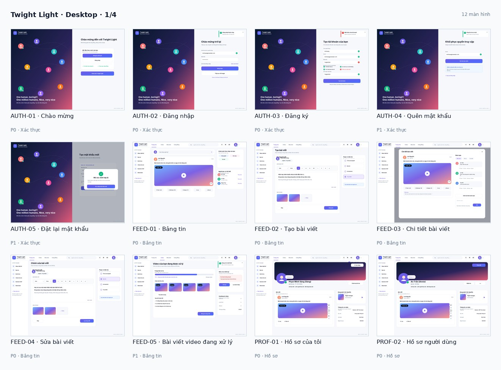

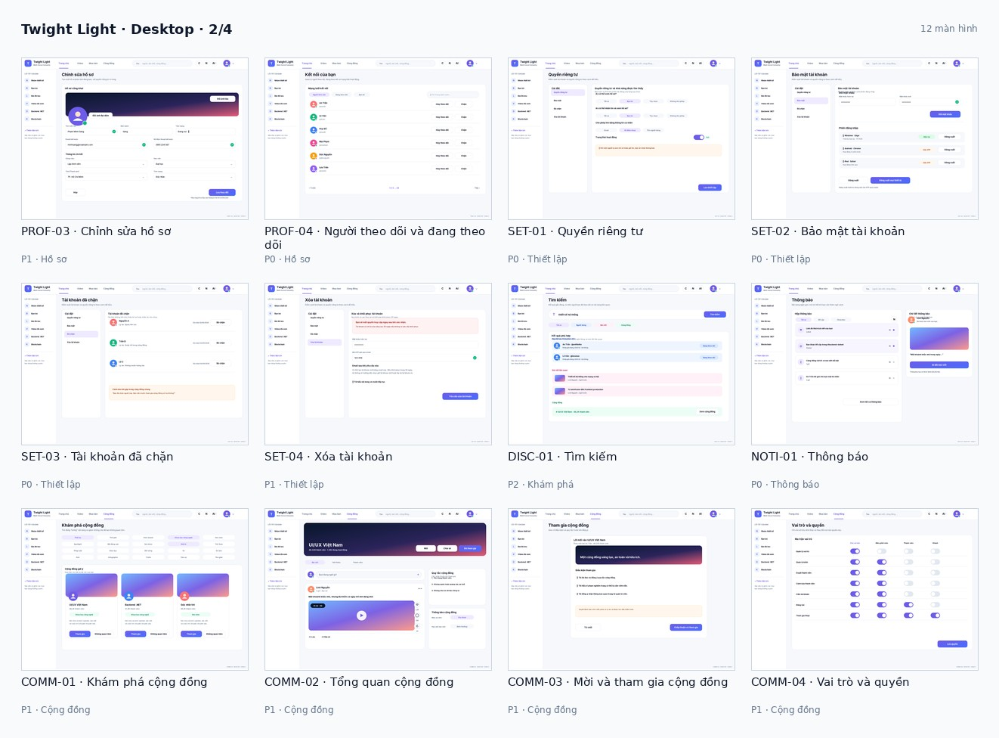

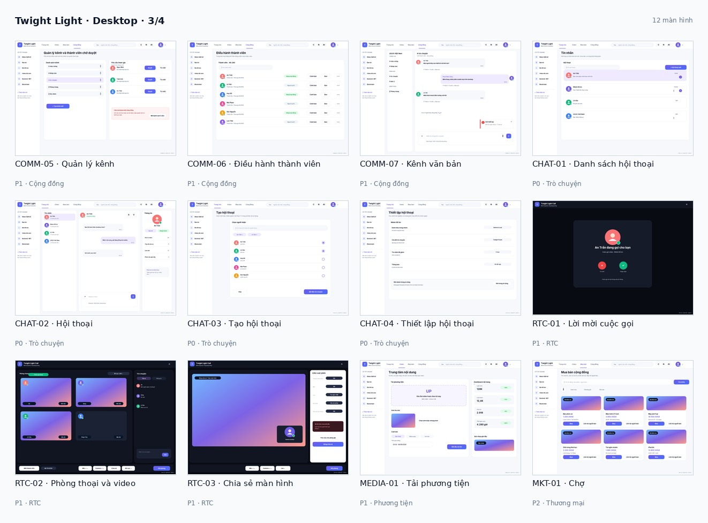

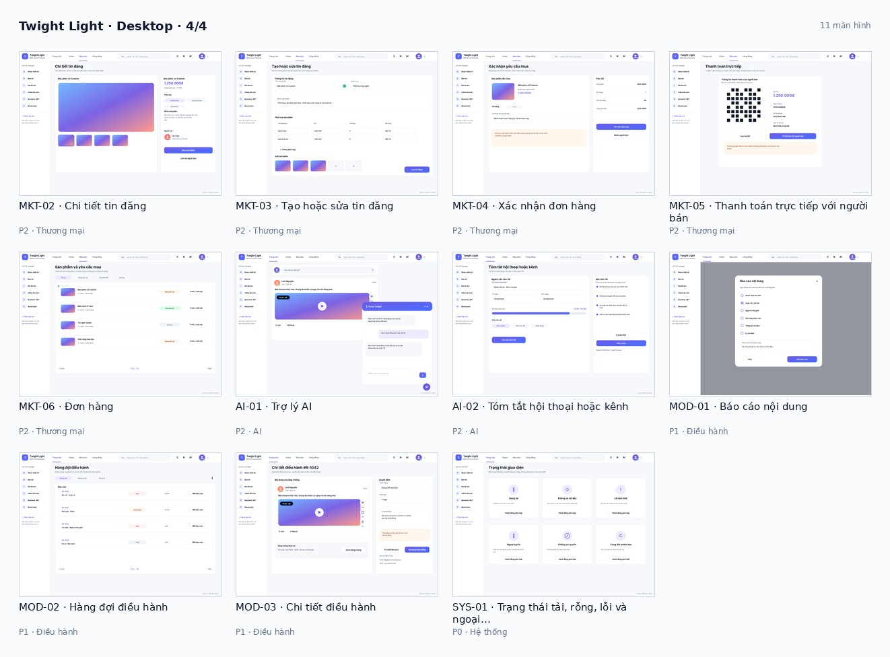

## Mobile

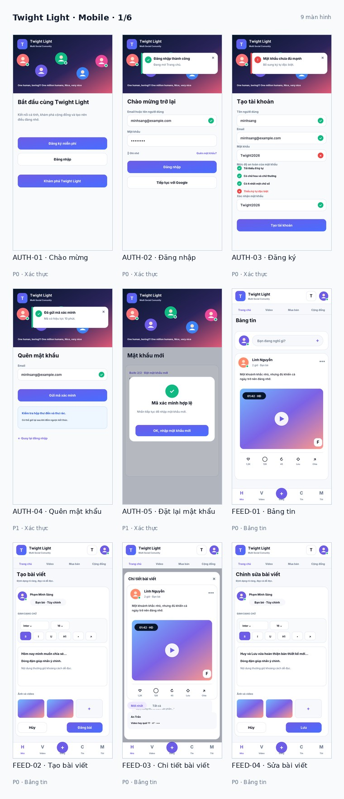

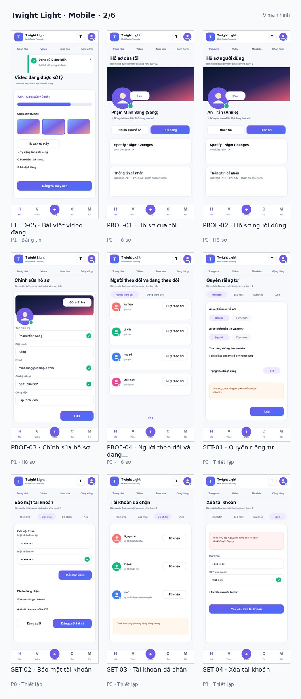

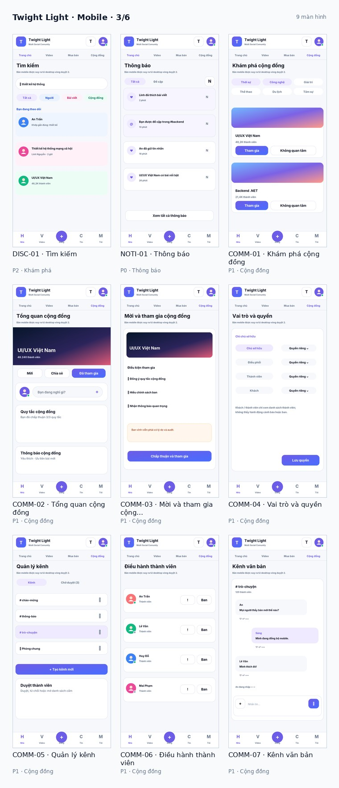

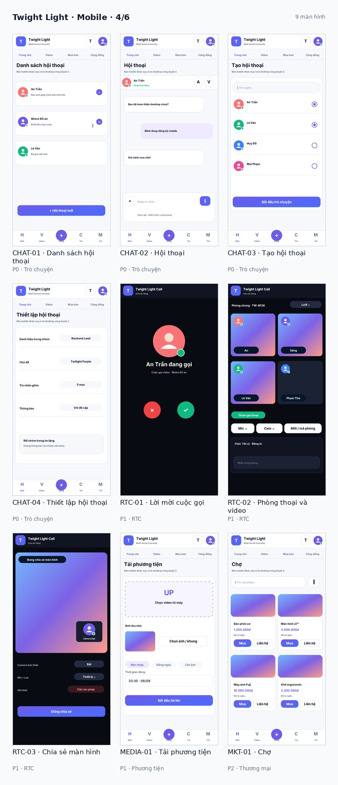

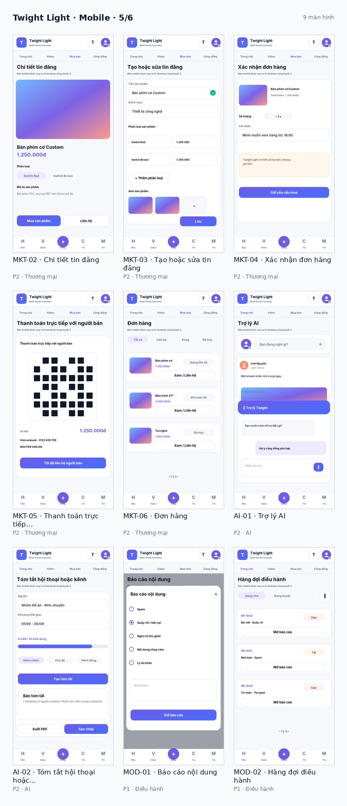

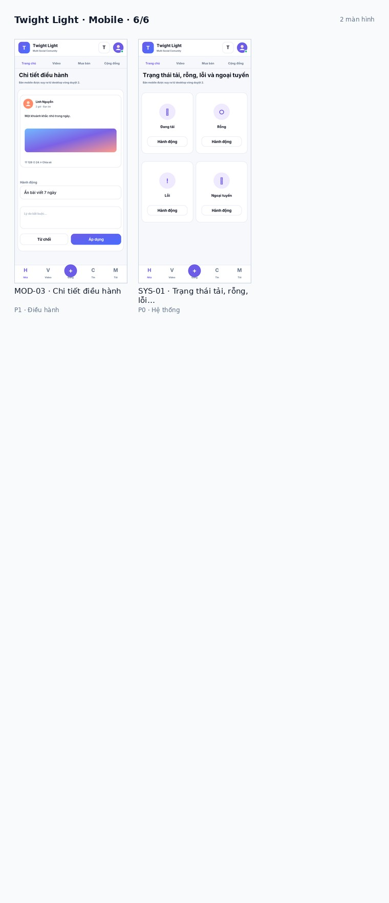

## Hệ thống thiết kế và luồng

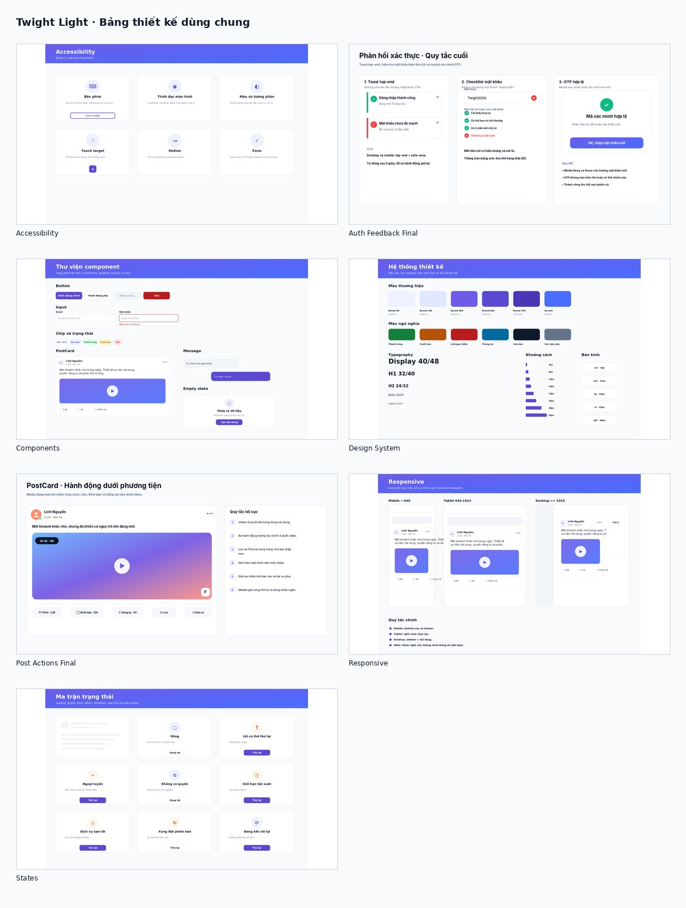

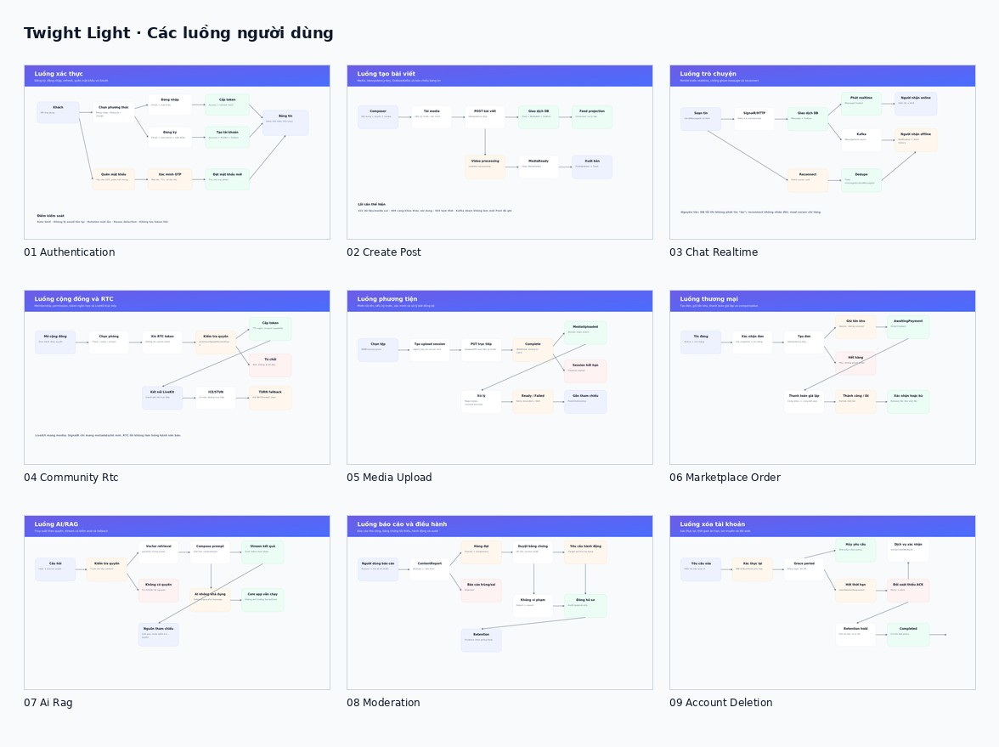

SVG là nguồn chỉnh sửa; PNG và contact sheet chỉ dùng để đối chiếu. Gallery đầy đủ nằm tại `review/FINAL_REVIEW_GALLERY_STANDALONE.html`.
