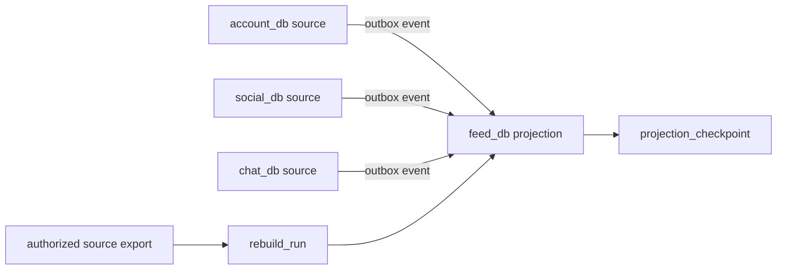

# P0 data blueprint

ADR-0012 accepts this directory as the P0 data implementation input. It describes
logical service databases, not databases that already exist.

`data-blueprint.json` lists every table with one owner, aggregate, primary key,
internal foreign keys, external references, version/uniqueness invariants and
indexes tied to access patterns. A table can only refer across services through an
opaque identifier or a local projection; its `foreignKeys` must point into the same
logical database.

`migration-and-recovery.md` specifies empty and upgrade paths, seed rules, backup
and restore evidence, projection export/checkpoint/rebuild, ownership, and the P0
RPO/RTO targets. It deliberately separates commands that must be verified in the
real runtime from commands run during this planning task.

The arrows are contracts/events, never cross-database foreign keys or SQL joins.

