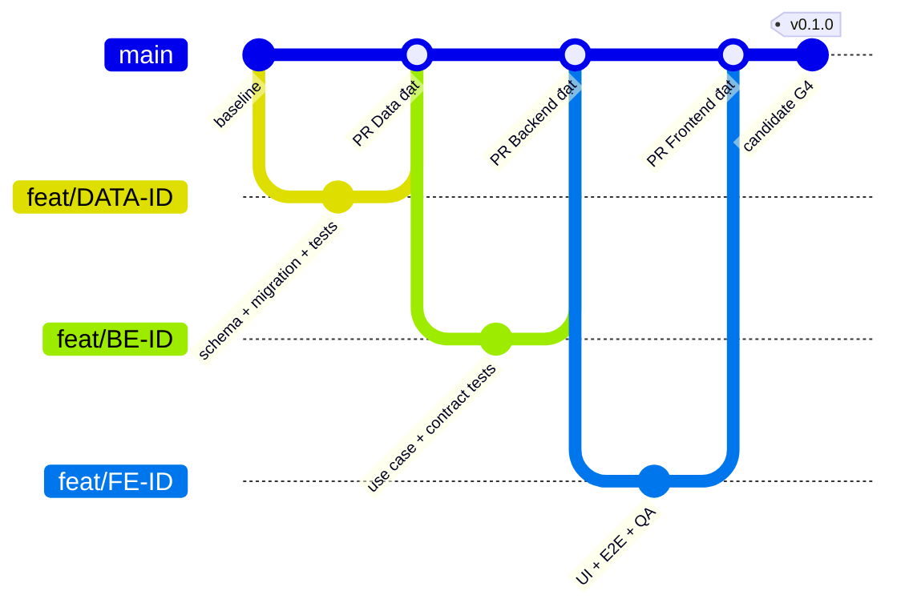

# Git flow chi tiết cho Twight Light

## 1. Mô hình áp dụng và phạm vi

Giữ mô hình đã chọn trong [GIT_FLOW.md](../GIT_FLOW.md): **main có thể phát hành + nhánh ngắn hạn**, phù hợp một lập trình viên. Các nhóm Backend/Data/Frontend dùng chung main; không tạo ba main riêng, không duy trì develop dài hạn. Tách công việc bằng ID, phạm vi tệp, PR và dependency trong execution plan.

Tài liệu này hướng dẫn các thao tác; **chưa khởi tạo Git, chưa tạo remote/branch/commit/tag và chưa push** trong lần lập kế hoạch. Trợ lý chỉ chạy thao tác ghi Git/publish/deploy khi người dùng đã yêu cầu rõ. Với người dùng tự chạy, thực hiện từng khối theo điều kiện của khối; không dán toàn bộ playbook vào terminal.



Sơ đồ minh họa quan hệ tích hợp; thao tác merge trên hosting mặc định là **squash**, nên lịch sử thực tế trên main thường có một commit cho mỗi PR.

## 2. Quy ước ID, nhánh và commit

| Đối tượng | Quy ước | Ví dụ |
|---|---|---|
| Phase | PH00…PH08 | PH03: P0 Social/Chat/Feed |
| Task | PHxx-TRACK-CODE | PH03-BE-SOC-03 |
| Subtask | Task + số bước hai chữ số | PH03-BE-SOC-03-01 |
| Feature branch | feat/SUBTASK-ID hoặc feat/TASK-ID-slug | feat/PH03-BE-SOC-03-01 |
| Data branch | feat/ID hoặc chore/ID cho hạ tầng | feat/PH03-DATA-SOC-P0-02 |
| Fix branch | fix/issue-or-ID-slug | fix/CHT-02-duplicate-message |
| Docs/plan branch | docs/ID-or-slug | docs/execution-plan |
| Hạ tầng/CI | chore/ID hoặc ci/ID | chore/PH01-BE-CI-01 |
| Refactor | refactor/scope-slug | refactor/social-post-query |
| Hotfix | hotfix/issue-slug | hotfix/SEC-17-token-reuse |
| Release tag | vMAJOR.MINOR.PATCH | v0.1.0, v0.1.1 |
| Candidate tag | vMAJOR.MINOR.PATCH-rc.N | v0.1.0-rc.1 |
| Checkpoint tùy chọn | checkpoint/gate-SHA | checkpoint/g1-a1b2c3d |

`v0.1.0` chỉ là ví dụ phiên bản **phần mềm**. Thiết kế hệ thống 3.0 và UI 1.2 không bắt buộc phần mềm mang tag v3.0.0 hoặc v1.2.0. Checkpoint không phải release, không tự kích hoạt deploy. Không gắn release tag cho task chưa đạt G4.

Một nhánh có thể gom hai subtask cùng task cha (implement + nghiệm thu) nếu cùng mục tiêu và không vượt phạm vi. Ghi cả ID trong PR; gate vẫn quản lý riêng từng subtask. Khi chia nhánh theo subtask, đầu ra tiền nhiệm phải đã được tích hợp hoặc baseline phụ thuộc được ghi/kiểm rõ.

Commit dùng `<type>(<scope>): <mô tả>` với scope chữ thường. ID task đặt trong mô tả/body, không dùng ID chữ hoa làm scope vì commit hook hiện chỉ chấp nhận scope chữ thường.

```text
feat(social): thêm tạo bài viết SOC-03
test(social): kiểm Kafka gián đoạn và yêu cầu lặp
docs(docs): thêm kế hoạch PH03-BE-SOC-03
fix(chat): ngăn tạo trùng clientMessageId
ci(deploy): yêu cầu kiểm tra sản phẩm bắt buộc
```

Description hiện được hook kiểm 5–72 ký tự. Breaking change cần `!`, `BREAKING CHANGE:` trong body và ADR/version/migration đã duyệt; dấu `!` không phải giấy phép bỏ tương thích.

## 3. Chuẩn bị Git lần đầu

Kiểm tra trước, không khởi tạo lồng trong một repository khác:

```powershell
git --version
git rev-parse --show-toplevel
```

Nếu đã là repository: dùng đường dẫn root vừa trả, kiểm remote và bỏ qua `git init`. Nếu xác nhận thư mục hiện tại chưa có Git và muốn khởi tạo:

```powershell
git init -b main
if ($LASTEXITCODE -ne 0) { throw 'Không khởi tạo được Git' }
git config --local user.name 'Tên tác giả thật'
git config --local user.email 'Email tác giả hoặc email noreply đã xác minh'
git config --local core.hooksPath .githooks
git config --local commit.template .gitmessage
git config --local pull.ff only
git config --local fetch.prune true
git config --local push.default simple
git status --short
```

Thay tên/email mẫu trước khi chạy. Không ghi token/PAT/password vào URL hoặc config có thể bị in ra. Dùng credential manager/SSH theo tài khoản thật; không đưa private key vào thư mục dự án.

Trước commit đầu:

1. Xử lý BL-01 để AGENTS canonical và alias có hành vi đúng Windows/Linux. Bộ kit hiện có dấu hiệu mất bản quy tắc đầy đủ; chưa thể xem Linux CI đã sẵn sàng chỉ vì Windows đọc được shim.
2. Kiểm `design/data/` được track, còn runtime root `/data/`, `.env`, secrets, volumes/build/cache không được track.
3. Chạy checks, kiểm danh sách files và secret; không stage file không thuộc bản bàn giao.

```powershell
git check-ignore -v design/data/screen-inventory.json
git status --short --untracked-files=all
python -X utf8 scripts/refresh_kit_inventory.py
python -X utf8 scripts/validate_all.py
if ($LASTEXITCODE -ne 0) { throw 'Bộ kit chưa đạt kiểm tra' }
```

`git check-ignore` trả 1 khi file **không** bị ignore; đây là kết quả mong muốn cho screen inventory, không phải lỗi build. Kiểm cả `.env`/secrets bằng tên file giả, không tạo secret thật để test.

Chỉ stage các đường dẫn đã rà soát. Ví dụ baseline tài liệu phải bổ sung đủ những file thực sự muốn đưa vào kho, không dùng danh sách này như lời khẳng định mọi file đều an toàn công khai:

```powershell
git add -- README.md RULES.md docs prompts templates scripts
git diff --cached --stat
git diff --cached --check
git diff --cached
git commit
```

Commit đầu là trường hợp thiết lập repository chưa có lịch sử/main trên remote nên chưa thể theo PR thông thường. Chỉ push baseline một lần sau khi chủ dự án xác nhận phạm vi; bật protection ngay sau đó. Không dùng ngoại lệ bootstrap cho các thay đổi tiếp theo.

## 4. Remote mới hoặc remote đã có lịch sử

Chủ dự án tạo repository với visibility phù hợp và xác nhận được phép đưa DOCX/PDF/thiết kế lên đó. Remote chưa có nên URL dưới đây là placeholder phải thay; **không chạy với giá trị mẫu**.

```powershell
$repoUrl = 'THAY_BANG_REMOTE_DA_XAC_NHAN'
if ($repoUrl -eq 'THAY_BANG_REMOTE_DA_XAC_NHAN') { throw 'Chưa có remote thật' }
git remote add origin $repoUrl
git remote -v
git ls-remote --heads origin
```

Nếu origin đã tồn tại, xem URL; chỉ `git remote set-url origin $repoUrl` khi đã xác minh cần đổi. Nếu remote đã có commit, ưu tiên clone remote vào thư mục làm việc riêng rồi đưa bộ kit vào bằng nhánh/PR; không force push, không tự merge unrelated histories.

Nếu remote thật sự rỗng và baseline đã review:

```powershell
git push --dry-run origin main
if ($LASTEXITCODE -ne 0) { throw 'Remote chưa nhận baseline' }
git push -u origin main
```

`-u` thiết lập upstream cho nhánh; `--dry-run` giúp xem thao tác dự kiến nhưng không thay kiểm quyền/nội dung cần công khai. Sau bootstrap, push các nhánh task và đưa vào main qua PR. Tham chiếu [git-push](https://git-scm.com/docs/git-push).

## 5. Bắt đầu mỗi task/subtask

Điều kiện: main sạch, remote đúng, tiền nhiệm DONE có evidence, DoR task hiện tại READY, không có việc chưa lưu của người khác. Ví dụ sau dùng ID đã tồn tại; không được chạy tạo nhánh nếu gate chưa đạt.

```powershell
$taskId = 'PH03-BE-SOC-03-01'
$taskBranch = "feat/$taskId"
python -X utf8 scripts/task_gate.py check $taskId
if ($LASTEXITCODE -ne 0) { throw 'NOT_READY' }
git status --short
git fetch --prune origin
if ($LASTEXITCODE -ne 0) { throw 'Fetch thất bại' }
git switch main
if ($LASTEXITCODE -ne 0) { throw 'Không đổi được nhánh' }
git pull --ff-only origin main
if ($LASTEXITCODE -ne 0) { throw 'Main lệch; cần điều tra' }
git switch -c $taskBranch
if ($LASTEXITCODE -ne 0) { throw 'Không tạo được nhánh' }
python -X utf8 scripts/task_gate.py start $taskId
if ($LASTEXITCODE -ne 0) { throw 'Task không được bắt đầu' }
```

`git status` là thao tác xem; người chạy phải kiểm đầu ra trống trước đổi nhánh. Có thể dùng chặn tự động:

```powershell
$pendingChanges = git status --porcelain
if ($LASTEXITCODE -ne 0) { throw 'Không đọc được Git status' }
if ($pendingChanges) { throw 'Worktree chưa sạch; lưu hoặc tách công việc trước' }
```

Hồ sơ prepare làm thay đổi state/evidence. Hãy commit hồ sơ chuẩn bị trên nhánh kế hoạch và tích hợp trước, hoặc tạo nhánh task từ baseline sạch **trước** prepare và ghi đúng baseline vào evidence. Khi đã ở nhánh task đúng ID, bỏ bước tạo lại nhánh và chỉ check/start. Tạo nhánh trống để chuẩn bị không phải triển khai task; READY vẫn bắt buộc trước sửa sản phẩm.

## 6. Trong lúc làm và trước commit

```powershell
git branch --show-current
git status --short
git diff --stat
git diff --check
git diff
python -X utf8 scripts/build_execution_plan.py --check
python -X utf8 scripts/task_gate.py validate
```

Chạy build/test của service/frontend thực tế theo LOCAL_DEVELOPMENT và AC. Chưa có solution/app thì không ghi “dotnet test pass” hoặc “npm build pass”. Thêm evidence artifact và cập nhật task đúng vòng đời. Với subtask chưa xong, commit nhỏ vẫn được nếu đã được ủy quyền và commit không nói task DONE; không tự cho downstream chạy.

Stage từng file đã xem:

```powershell
git add -- path/to/reviewed-file path/to/reviewed-test
git diff --cached --check
if ($LASTEXITCODE -ne 0) { throw 'Diff staged có lỗi' }
git diff --cached
git commit
```

Thay đường dẫn mẫu bằng file thật. Không `git add .` khi có thay đổi lẫn scope. Kiểm cả diff staged và unstaged: file đã stage rồi sửa tiếp có thể khiến commit không chứa bản đã test. `.githooks/commit-msg` kiểm format; `.githooks/pre-commit` kiểm kit. Hooks có thể bị bỏ qua nên CI/PR vẫn bắt buộc.

## 7. Push nhánh và cập nhật từ main

Trước push: đúng nhánh task, commit có bằng chứng, không secret, không thay đổi ngoài scope. Lần đầu:

```powershell
git push --dry-run origin $taskBranch
if ($LASTEXITCODE -ne 0) { throw 'Dry-run push thất bại' }
git push -u origin $taskBranch
```

Các lần tiếp theo:

```powershell
git push origin $taskBranch
```

Nếu bị từ chối non-fast-forward: fetch và xem ai đã thêm commit; không dùng force để giải quyết mù.

```powershell
git fetch origin
git log --oneline --graph --decorate --all -20
git log --oneline "HEAD..origin/$taskBranch"
git log --oneline "origin/$taskBranch..HEAD"
```

Nhánh riêng **chưa chia sẻ** có thể rebase lên main. Khi conflict, sửa từng file hiểu được, stage file đã resolve rồi continue; `--abort` quay về trước thao tác. Rebase viết lại commit nên phải chạy lại tests. Tham chiếu [git-rebase](https://git-scm.com/docs/git-rebase).

```powershell
git rebase origin/main
# Nếu có conflict: kiểm status/diff, sửa file thật rồi git add -- file...
git rebase --continue
# Nếu chưa thể giải quyết và muốn hủy phiên rebase:
git rebase --abort
```

Các dòng continue/abort là **hai lựa chọn theo tình huống**, không chạy lần lượt. Với nhánh đã push/có người dùng, mặc định merge main vào nhánh để giữ lịch sử:

```powershell
git merge --no-edit origin/main
# Giải quyết conflict, chạy test, commit merge rồi push nhánh task.
```

Không dùng `--ours`/`--theirs` cho cả migration hoặc contract để bỏ xung đột. Phải đọc cả hành vi phía producer/consumer/schema, kiểm DAG và acceptance. `git merge --abort` dùng khi cần dừng phiên merge chưa hoàn tất; xem [git-merge](https://git-scm.com/docs/git-merge).

Nếu đã thống nhất cần viết lại nhánh riêng trên remote, ghi lại SHA remote mong đợi trước rebase và dùng lease có SHA cụ thể sau khi test. Không dùng cho main hoặc tag:

```powershell
$expectedRemoteSha = git rev-parse "origin/$taskBranch"
if ($LASTEXITCODE -ne 0) { throw 'Không xác định được remote SHA' }
# Chỉ rebase sau khi đã ghi SHA và có ủy quyền; chạy lại checks.
git push "--force-with-lease=refs/heads/${taskBranch}:$expectedRemoteSha" origin "HEAD:refs/heads/$taskBranch"
```

Nếu lease bị từ chối, remote đã đổi: dừng và đọc lại, không thay bằng `--force`.

## 8. Pull request có thể review

PR title mang ID và hành vi; body dùng template của repo, nêu:

- Mục tiêu, task/subtask và phạm vi; ví dụ trước/sau có thể tái hiện.
- Dependency PR/commit và hợp đồng đã chấp thuận.
- Thay đổi API/event/schema/feature flag/quyền; migration/rollout/rollback khi có.
- Từng AC → test/artifact, command + exit code, môi trường và SHA ứng viên.
- Screen IDs + Desktop/Mobile/a11y evidence khi là FE.
- Blocker/known limitation còn lại; không đặt READY/DONE cho kết quả chưa xác minh.

Dùng giao diện hosting, hoặc GitHub CLI nếu đã cài và xác thực đúng repo. Viết body Markdown vào file thật, không ghép newline qua một chuỗi shell dài:

```powershell
$prBody = 'docs/execution/evidence/PH03-BE-SOC-03-pr.md'
gh pr create --base main --head $taskBranch --title 'PH03-BE-SOC-03: tạo bài viết có Outbox' --body-file $prBody
```

`--body-file` đọc nội dung file để giữ nguyên định dạng; lệnh tạo PR ghi lên GitHub nên chỉ chạy khi đã được yêu cầu. Có thể thêm `--draft` cho PR đang làm; PR draft không có nghĩa đã đạt nghiệm thu. Tham chiếu [gh pr create](https://cli.github.com/manual/gh_pr_create).

## 9. Bảo vệ main, checks và merge

Thiết lập qua Branch protection/Rulesets trên repository thật:

| Luật | Thiết lập dự án |
|---|---|
| Pull request | Bắt buộc, trừ bootstrap lần đầu đã duyệt |
| Status checks | Đúng job/context CI đang phát ra; gate tổng hợp luôn chạy trên mọi PR, không chỉ path-filter |
| Đồng bộ base | Kiểm với main hiện tại/merge candidate trước merge |
| Conversations | Resolve mọi thảo luận chặn |
| Force push/delete main | Tắt |
| Bypass | Hạn chế admin/bot; không dùng bỏ cổng nghiệp vụ |
| Reviews | Dự án một người ghi review checklist; nếu bật bắt buộc 1 approval thì cần một reviewer khác có quyền |
| Tags v* | Chặn update/delete; chỉ tài khoản/workflow release được tạo theo quy trình |
| Deploy environments | Staging/prod-demo riêng, secrets riêng và người duyệt phù hợp |

GitHub cho phép bắt buộc PR/status checks và hạn chế force push qua protected branches; khả năng áp dụng còn phụ thuộc loại repository/quyền/gói của tài khoản. Chưa có remote nên bảng trên là cấu hình cần triển khai, không phải trạng thái đã bật. Tham chiếu [protected branches](https://docs.github.com/en/repositories/configuring-branches-and-merges-in-your-repository/managing-protected-branches/about-protected-branches).

Workflow mới `execution-plan.yml` kiểm bộ sinh, DAG/state và tests của gate trên Windows. Workflow cũ còn giới hạn BL-01/BL-18; PH01-BE-CI phải xử lý trước nghiệm thu sản phẩm. Job bị skipped hoặc `npm --if-present` im lặng không chứng minh build/test đã chạy. Không cấu hình required check với tên chưa tồn tại hoặc workflow bị path-filter mãi không chạy.

Mặc định squash merge sau review/checks. Nếu dùng CLI, gắn đúng head đã review để tránh merge nhầm commit mới:

```powershell
$prNumber = 123 # thay bằng PR thật
$reviewedHead = git rev-parse HEAD
gh pr checks $prNumber
if ($LASTEXITCODE -ne 0) { throw 'Checks chưa đạt' }
gh pr merge $prNumber --squash --match-head-commit $reviewedHead
```

Trước merge phải xác nhận HEAD local đúng branch của PR và evidence/checks chính là SHA này. Không `--admin` để vượt ruleset. `--match-head-commit` yêu cầu head còn đúng SHA; xem [gh pr merge](https://cli.github.com/manual/gh_pr_merge).

## 10. Sau merge và dọn nhánh

```powershell
git switch main
git pull --ff-only origin main
if ($LASTEXITCODE -ne 0) { throw 'Chưa đồng bộ main' }
git log -5 --oneline
python -X utf8 scripts/task_gate.py validate
```

Chạy smoke/checks trên kết quả tích hợp. Cập nhật hồ sơ baseline cho tiền nhiệm/task mới; squash tạo SHA khác branch head, nên lưu cả head đã test và squash/merge SHA, kiểm post-merge CI thay vì giả định chúng là cùng commit.

Khi đã xác nhận PR merged, nhánh không còn công việc và worktree sạch:

```powershell
git branch -d $taskBranch
git push origin --delete $taskBranch
git fetch --prune origin
```

Với squash merge, `branch -d` có thể từ chối vì lịch sử không phải ancestor dù nội dung đã tích hợp. Đừng lập tức `-D`: xác minh PR/SHA/diff và nếu chưa chắc cứ giữ nhánh. Chỉ xóa cưỡng bức nhánh local khi chủ sở hữu xác nhận không mất công việc. Remote deletion là thao tác riêng, không tự chạy khi PR còn mở.

## 11. Tag và release bất biến

Release checklist ở [RELEASE_CHECKLIST.md](../RELEASE_CHECKLIST.md) và G4 phải đạt trên **một candidate SHA cố định**. G4 evidence ghi SHA đó; việc commit hồ sơ G4 sau đó không cho phép tự chuyển release sang HEAD mới. Candidate có thể chưa có version tag; tag tạo sau nghiệm thu nên không có vòng phụ thuộc “G4 cần tag, tag cần G4”.

```powershell
git fetch origin --tags
$releaseVersion = 'v0.1.0' # ví dụ, thay phiên bản đã chốt
$candidateSha = 'THAY_BANG_FULL_SHA_DA_QUA_G4'
if ($candidateSha -eq 'THAY_BANG_FULL_SHA_DA_QUA_G4') { throw 'Chưa có candidate đã nghiệm thu' }
git cat-file -e "${candidateSha}^{commit}"
if ($LASTEXITCODE -ne 0) { throw 'Commit không tồn tại' }
git merge-base --is-ancestor $candidateSha origin/main
if ($LASTEXITCODE -ne 0) { throw 'Candidate chưa nằm trên main' }
python -X utf8 scripts/task_gate.py validate
if ($LASTEXITCODE -ne 0) { throw 'Hồ sơ gate không nhất quán' }
```

Reviewer còn phải kiểm trạng thái **G4-01 là DONE**, nội dung baseline đúng candidate và CI/scans/restore của candidate. `validate` một mình chỉ kiểm tính nhất quán, không cấp phép release. Không dùng `check G4-01` để chứng minh G4 đã hoàn thành: check dùng để xét có được bắt đầu task, khác DONE.

Kiểm tag chưa tồn tại local/remote; nếu đã tồn tại thì đối chiếu, không overwrite:

```powershell
git tag --list $releaseVersion
git ls-remote --tags origin "refs/tags/$releaseVersion" "refs/tags/$releaseVersion^{}"
```

Chỉ khi tên chưa dùng, phiên bản/commit đã chốt và có ủy quyền:

```powershell
git tag -a $releaseVersion $candidateSha -m "Twight Light $releaseVersion; G4 evidence reviewed"
git show --no-patch $releaseVersion
git rev-parse "${releaseVersion}^{commit}"
git push --dry-run origin "refs/tags/$releaseVersion"
if ($LASTEXITCODE -ne 0) { throw 'Không thể push tag' }
git push origin "refs/tags/$releaseVersion"
```

Dùng annotated tag; nếu đã có hệ thống ký và khóa hợp lệ, dùng `git tag -s` và `git tag -v`. Không bịa cấu hình ký. Không push `--tags` vì có thể đưa cả tag thử nghiệm không liên quan lên remote. Annotated tag giữ thông tin người tạo/thời gian/thông điệp; tag công bố không được di chuyển. Tham chiếu [git-tag](https://git-scm.com/docs/git-tag).

Release notes ghi scope/function IDs, migration, feature flags, artifact digests/SBOM, tests, known limitations, backup/rollback và candidate SHA. Image tag có SHA để truy vết, deployment pin digest. Không dùng `latest` làm nguồn duy nhất; tạo Git tag không tự đồng nghĩa đã deploy.

Candidate `-rc.N` chỉ dùng khi chủ dự án chọn quy trình RC: prerelease test/diễn tập, không coi là G4 final. Mỗi RC mới có tag mới; nếu sửa code sau RC phải chạy checks lại. Release final phải trỏ commit đạt G4; không tạo lại cùng tag cho bản sửa.

## 12. Hotfix

Theo flow cơ sở, tạo hotfix từ main mới nhất; giữ phạm vi lỗi và thêm regression test. Nếu bản đang chạy là tag cũ trong khi main có thay đổi chưa muốn phát hành, ghi quyết định maintenance branch riêng từ tag được hỗ trợ; chốt cả đường đưa bản sửa về main. Không tùy tiện deploy toàn main để sửa một lỗi nhỏ.

```powershell
git fetch origin --tags
git switch main
git pull --ff-only origin main
git switch -c hotfix/SEC-17-token-reuse
```

Tái hiện → regression test thất bại → sửa root cause → test/scan/contract/smoke → PR → merge → G4 bản vá theo phạm vi → tag patch mới, ví dụ v0.1.1 → rollout có ủy quyền. Không đổi tag v0.1.0. Nếu maintenance branch được chấp thuận, cherry-pick commit sửa về main qua PR, giải conflict và chạy lại test; ghi hai SHA để truy vết.

## 13. Rollback và revert

Phân biệt ba việc:

- **Rollback deployment:** chuyển về image digest trước đã xác minh schema còn tương thích; không thay Git history.
- **Revert code:** tạo commit đảo ngược qua nhánh/PR; chạy tests và phát hành bản vá mới.
- **Khôi phục database:** thao tác dữ liệu có thể mất ghi mới, cần backup/restore plan và ủy quyền môi trường; không phải `git revert migration`.

Ví dụ đảo một squash commit lỗi trên nhánh sửa:

```powershell
git switch -c fix/revert-bad-change origin/main
git revert FULL_SHA_CUA_SQUASH_COMMIT_LOI
```

Đổi placeholder thành commit đã xác minh. Với merge commit thật, phải chọn parent đúng (`git revert -m`); không áp dụng máy móc ví dụ squash. Schema đã contract/xóa cột có thể buộc roll-forward. Không dùng `reset --hard`, force push main, xóa volume hay reset DB làm rollback mặc định.

## 14. Lưu tạm, sửa commit và khôi phục thao tác

```powershell
# Bỏ stage, giữ nội dung làm việc:
git restore --staged -- path/to/file

# Xem stash; chỉ tạo stash cho các file đã chọn, không gồm secret:
git stash push -m 'WIP task trước khi chuyển ngữ cảnh' -- path/to/file
git stash list
git stash show --stat 'stash@{0}'
git stash apply 'stash@{0}'
```

Ưu tiên `apply` rồi xác minh trước `drop`, tránh làm mất bản sao khi conflict. File untracked không tự nằm trong stash mặc định. Không dùng `-u` trước khi rà soát toàn bộ file untracked vì có thể chứa dữ liệu nhạy cảm. Commit amend/rebase chỉ cho commit chưa chia sẻ hoặc đã được thống nhất; nhánh đã có người dùng thì tạo commit mới.

Nếu thao tác sai, dừng ghi, xem `git reflog`, `git log --all --graph` và tạo nhánh cứu hộ tại SHA xác minh được; không `git clean -fd`/reset bừa để làm worktree sạch. Git không thay backup cho file chưa từng được track/commit.

## 15. Worktree và nhiều luồng công việc

Mặc định một subtask; chỉ dùng song song khi có ủy quyền và contract ổn định theo [PARALLEL_AGENT_WORKFLOW.md](../PARALLEL_AGENT_WORKFLOW.md). Mỗi worktree có branch, build/test database và credential dev riêng. Không nhiều người cùng tạo migration của một service.

```powershell
git worktree list
# Ví dụ khi đã chốt đường dẫn writable và task độc lập:
git worktree add ../twight-social -b feat/PH03-BE-SOC-03-01 origin/main
```

Trong môi trường hiện tại, thư mục ngoài workspace có thể cần quyền riêng; ví dụ không phải thao tác đã thực hiện. Gate/state local trong từng worktree không phải lock phân tán; coordinator phải kiểm baseline/PR và quản lý WIP chung. Khi merge state.json có conflict, giữ history hai phía có nguồn rõ và chạy validator; không chọn nguyên file bằng ours/theirs.

Chỉ `git worktree remove` khi sạch, branch đã tích hợp và người phụ trách xác nhận. Không dùng shell recursive delete cho worktree; xem danh sách và đường dẫn thực tế trước dọn.

## 16. Checklist trước từng thao tác

| Thao tác | Phải có trước | Nếu thiếu |
|---|---|---|
| Branch chuẩn bị | ID/phạm vi, baseline sạch, quyền tạo branch | Giữ ở bước planning |
| Viết mã | READY, start thành công, contract/migration đầu vào đủ | NOT_READY/BLOCKED |
| Commit | Diff stage đúng scope, kiểm thử phù hợp, quyền commit | Chưa commit |
| Push nhánh | Remote/visibility đúng, secret check, commit đã review, quyền push | Chưa push |
| Merge | PR, checks đúng head/base, review/DoD, evidence đầy đủ | Chặn main |
| Mở phase sau | Tiền nhiệm DONE và gate G1/G2 tương ứng | Không chạy tiếp |
| Tag release | Candidate SHA trên main, G4 DONE, version chưa dùng, quyền tag/push | Chưa tag |
| Deploy | Image digest, backup/migration/rollback, environment/secret và quyền deploy | Chưa triển khai |

Mỗi lần ghi Git hoặc phát hành cần ghi kết quả thật: branch, before/after SHA, PR/tag, checks và môi trường. Không biến các lệnh mẫu trong tài liệu thành lịch sử đã thực hiện.
