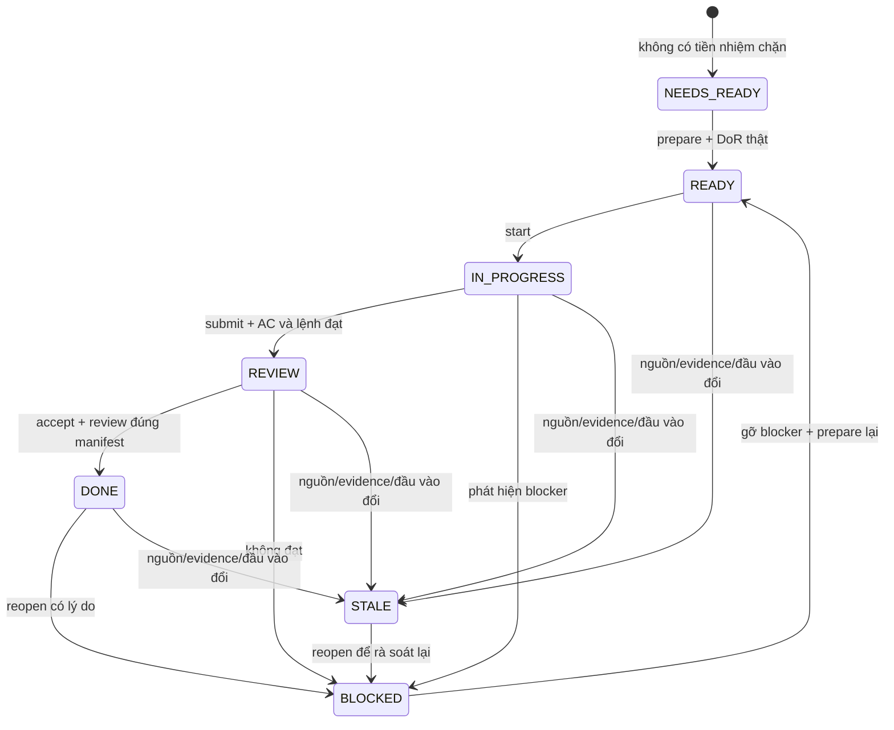

# Cổng READY và điều phối subtask

## “Không ready thì không chạy task tiếp” được thực thi thế nào?

`task_gate.py` là entrypoint thực thi của kế hoạch. `check`, `start`, `prompt` không cho thực thi khi thiếu điều kiện. Các tệp prompt có sẵn để xem/review, nhưng luôn yêu cầu kiểm gate trước làm. Không có `--force`, auto-DONE, auto-approve hay bỏ qua dependencies.

Để một subtask được READY, phải đồng thời có:

1. ID tồn tại trong `plan.json`; đồ thị không có ID trùng, tham chiếu thiếu hoặc chu kỳ.
2. Nguồn của task còn đúng fingerprint đã dùng lập kế hoạch.
3. **Tất cả tiền nhiệm DONE hợp lệ**, gồm evidence và review còn nguyên hash; kiểm đệ quy toàn chuỗi.
4. Hồ sơ Definition of Ready có đủ DOR01…DOR07, mỗi mục passed=true, giải thích và artifact thật.
5. Hợp đồng/ADR/quyết định xử lý blocker liên quan đã được reviewer xác nhận. Với task planning, điều chưa biết có thể là đối tượng cần khảo sát; DoR chỉ cho phép khảo sát/quyết định, không cho phép triển khai nghiệp vụ chưa khóa.
6. Bàn giao các tiền nhiệm đã có trên baseline mà người thực hiện dùng. Cross-branch: merge về main trước, hoặc ghi rõ commit/worktree phụ thuộc và kiểm lại sau tích hợp; không chỉ dựa checkbox từ máy khác.

## State machine



`PREPARED` là giá trị lưu nội bộ, chỉ hiển thị READY khi kiểm lại đều đạt. `NEEDS_READY`, `READY`, `STALE` được tính lúc chạy. Không được sửa state.json để biến một trạng thái thành DONE.

Một subtask `DONE` không đồng nghĩa đã push/merge/release. Đó là nghiệm thu đầu ra trên baseline ghi trong evidence. Việc dùng đầu ra ở nhánh khác phải kiểm baseline và chạy checks sau tích hợp. Gate G4 gắn **candidate SHA đã test**; tag/release phải trỏ đúng SHA đó, không phải mặc nhiên HEAD mới nhất.

## Danh mục lệnh

| Lệnh | Ý nghĩa | Có chỉnh sản phẩm / gọi Git không? |
|---|---|---|
| `next` | Liệt kê READY, NEEDS_READY, task đang làm/review | Không |
| `status --phase PH03` | Xem trạng thái của phase | Không |
| `check ID` | Trả 0 khi READY hoặc tiếp tục đúng task IN_PROGRESS hợp lệ | Không |
| `prompt ID` | In prompt khi READY/IN_PROGRESS | Không chạy AI/shell từ prompt |
| `prompt ID --preview` | Xem tài liệu với nhãn PREVIEW; không cho thực thi | Không |
| `template ID readiness --output ...` | Tạo mẫu chưa đạt; không ghi đè | Chỉ tạo file evidence |
| `prepare ID --evidence ...` | Kiểm DoR/dependencies, lưu PREPARED | Chỉ sửa state |
| `start ID` | Chỉ từ READY; khóa WIP một task | Chỉ sửa state |
| `submit ID --evidence ...` | Chỉ từ IN_PROGRESS; kiểm mọi AC/command/artifact → REVIEW | Chỉ sửa state |
| `accept ID --evidence ...` | Chỉ từ REVIEW; kiểm kết luận review → DONE | Chỉ sửa state |
| `block ID --reason ...` | Chặn công việc và ghi lý do | Chỉ sửa state |
| `reopen ID --reason ...` | Mở lại hồ sơ đã có, giữ bản trước trong history | Chỉ sửa state |
| `validate` | Kiểm schema, DAG, nguồn và bằng chứng đang lưu | Không; plan hợp lệ không đồng nghĩa READY |

Exit code: `0` lệnh kiểm/thao tác hợp lệ; `1` NOT_READY khi check/prompt; `2` lỗi schema/ID/evidence hoặc chuyển trạng thái bị từ chối. Trong PowerShell phải kiểm `$LASTEXITCODE`; `$ErrorActionPreference='Stop'` một mình không đảm bảo dừng mọi native command thất bại ở Windows PowerShell.

## Ví dụ hoàn chỉnh một subtask

Dùng `PH00-GOV-AUDIT-01` cho task đầu. Các đường dẫn rút gọn dưới đây là ví dụ cho **hồ sơ phải tự chuẩn bị**, không phải evidence đã tồn tại.

### 1. Xem và tạo mẫu DoR

```powershell
python -X utf8 scripts/task_gate.py prompt PH00-GOV-AUDIT-01 --preview
python -X utf8 scripts/task_gate.py template PH00-GOV-AUDIT-01 readiness --output docs/execution/evidence/audit-ready-01.json
```

Mẫu sinh có `passed: false`, các trường TODO và danh sách artifact rỗng. Không được đổi sang true chỉ để chạy. Tạo report khảo sát/đầu vào thực tế trong thư mục evidence, rồi ghi hash:

```powershell
Get-FileHash -Algorithm SHA256 -LiteralPath docs/execution/evidence/audit-input-01.md
```

### 2. Cấu trúc một hồ sơ

```json
{
  "version": 1,
  "kind": "readiness",
  "task_id": "PH00-GOV-AUDIT-01",
  "task_fingerprint": "giá trị do template sinh; không tự đoán",
  "actor": "người chịu trách nhiệm thật",
  "recorded_at": "thời gian ISO 8601 có timezone khi kiểm thực tế",
  "environment": "môi trường khảo sát hoặc test thật",
  "baseline": "commit/branch hoặc snapshot tài liệu trước Git",
  "checks": {
    "DOR01": {
      "passed": false,
      "detail": "mục tiêu/phạm vi/acceptance và bằng chứng kết luận",
      "artifacts": ["docs/execution/evidence/audit-input-01.md"]
    }
  },
  "artifacts": [
    {
      "path": "docs/execution/evidence/audit-input-01.md",
      "sha256": "sha256 hex chữ thường của file thật"
    }
  ]
}
```

Đoạn trên chỉ minh họa một mục; mẫu thực tế bắt buộc đủ **DOR01…DOR07**. Mỗi check tham chiếu ít nhất một artifact có mặt trong manifest; file không được rỗng hoặc nằm ngoài repository. `recorded_at` không được là thời điểm tương lai. SHA-256 dùng chữ thường; `(Get-FileHash ...).Hash.ToLowerInvariant()` cho dạng phù hợp.

`completion` thay checks bằng đúng các AC của subtask và có `commands`:

```json
{
  "commands": [
    {
      "command": "lệnh thực tế đã chạy",
      "exit_code": 0,
      "artifact": "docs/execution/evidence/run-report-01.md"
    }
  ]
}
```

Lệnh là dữ liệu kiểm toán, gate **không tự chạy câu lệnh trong evidence**. Report cần ghi stdout/result, môi trường, thời gian, phiên bản và test cases. Ghi chỉ `exit_code: 0` mà không chạy thật là bằng chứng sai; reviewer phải kiểm report và CI. Mẫu `review` có `decision: approved`, `completion_sha256` đúng manifest vừa submit và check `REVIEW01` với artifact review thật.

### 3. Chuẩn bị và bắt đầu

```powershell
python -X utf8 scripts/task_gate.py prepare PH00-GOV-AUDIT-01 --evidence docs/execution/evidence/audit-ready-01.json
if ($LASTEXITCODE -ne 0) { throw 'DoR chưa đạt' }
python -X utf8 scripts/task_gate.py check PH00-GOV-AUDIT-01
if ($LASTEXITCODE -ne 0) { throw 'NOT_READY' }
python -X utf8 scripts/task_gate.py start PH00-GOV-AUDIT-01
if ($LASTEXITCODE -ne 0) { throw 'Start bị chặn' }
python -X utf8 scripts/task_gate.py prompt PH00-GOV-AUDIT-01
```

`start` không tạo branch và không gọi trợ lý; sau đó mới giao prompt cho công cụ đang dùng. Task IN_PROGRESS có thể tiếp tục bằng cùng ID khi gate vẫn hợp lệ. Không được bắt đầu ID khác nếu còn IN_PROGRESS/REVIEW; muốn chuyển sang task độc lập, ghi blocker trước.

### 4. Submit và nghiệm thu

```powershell
python -X utf8 scripts/task_gate.py template PH00-GOV-AUDIT-01 completion --output docs/execution/evidence/audit-completion-01.json
```

Điền report, đủ AC, artifact/hash và lệnh thật. Sau đó:

```powershell
python -X utf8 scripts/task_gate.py submit PH00-GOV-AUDIT-01 --evidence docs/execution/evidence/audit-completion-01.json
if ($LASTEXITCODE -ne 0) { throw 'Chưa đủ bằng chứng hoàn thành' }
python -X utf8 scripts/task_gate.py template PH00-GOV-AUDIT-01 review --output docs/execution/evidence/audit-review-01.json
```

Reviewer đối chiếu đủ AC, artifact gốc, mức độ lỗi, scope và nguồn. Chủ dự án một người có thể thực hiện review checklist riêng; script không giả rằng có reviewer thứ hai. Chỉ sau kết luận hợp lệ:

```powershell
python -X utf8 scripts/task_gate.py accept PH00-GOV-AUDIT-01 --evidence docs/execution/evidence/audit-review-01.json
if ($LASTEXITCODE -ne 0) { throw 'Review chưa đạt' }
python -X utf8 scripts/task_gate.py next
```

Task kế tiếp thường là `NEEDS_READY`, **không tự READY** chỉ vì tiền nhiệm DONE. Chuẩn bị DoR của ID đó rồi lặp chu kỳ.

## Khi thất bại, sửa và chạy lại

- Test fail hoặc không thể chứng minh AC: giữ IN_PROGRESS để sửa trong phạm vi; không submit report giả đạt.
- Nguồn mâu thuẫn/thiếu quyết định: `block ID --reason 'BL-xx: ...'`, tạo báo cáo/ADR đề xuất; chỉ chuẩn bị lại khi đầu vào đã rõ.
- REVIEW bị từ chối: block/reopen có lý do, tạo evidence revision mới, prepare/start rồi sửa/test/submit/review lại.
- Task DONE phát hiện lỗi: reopen ID và sửa theo quy trình. Task downstream tự bị chặn vì phụ thuộc không còn DONE hợp lệ.
- Artifact bị sửa/xóa/hash khác: trạng thái thành STALE. Không cập nhật hash manifest cũ cho qua; tạo report mới và review lại.
- Nguồn văn bản dùng hash chuẩn hóa LF để checkout Windows/Linux không làm STALE chỉ vì xuống dòng. Evidence/receipt dùng hash bytes thật; `.gitattributes` giữ nguyên bytes trong `docs/execution/evidence/`. Ưu tiên lưu report ở đó. Với artifact ngoài thư mục này, chuẩn hóa theo Git attributes trước khi băm và kiểm lại sau checkout.
- Đổi nguồn thiết kế/hợp đồng: review quyết định, sinh lại plan, reopen các receipt bị STALE và đánh giá ảnh hưởng. Không tái dùng bằng chứng của phiên bản hợp đồng cũ.
- WIP state dùng lock file và atomic replace. Nếu tiến trình crash để lại `state.json.lock`, kiểm chắc không còn process giữ lock trước khi xóa **riêng file lock**; không xóa state/evidence.

## Mức bảo vệ và giới hạn

Cổng local chặn luồng công cụ này và phát hiện thiếu/stale evidence, không có quyền ngăn người có quyền sửa file tự chạy editor/shell, sửa script hoặc làm giả nội dung report. Chuỗi hash bảo vệ tính nhất quán, **không xác thực danh tính reviewer** và không chứng minh lệnh đã chạy. Không tuyên bố đây là hệ thống chữ ký số hay security boundary.

Để chặn trên kho chung: yêu cầu PR, bảo vệ main/tags, CI bắt buộc, review evidence và khóa quyền bypass tại remote. Workflow `execution-plan.yml` kiểm plan/gate/tests; product CI/ruleset được hoàn thiện tại PH01-BE-CI. Remote hiện chưa có nên chưa thể xác nhận việc bảo vệ đã bật.

Các prompt chung và `generate_prompt_pack.py` trong kit có thể dùng để chuẩn bị bối cảnh. Với ID của kế hoạch này, **thực thi vẫn bắt buộc qua task_gate.py**; sinh tệp prompt không phải chuyển READY. Không dùng generic prompt để né dependency của một subtask đã đăng ký.

`validate` cho phép backlog BLOCKED/NEEDS_READY hợp lệ, vì kế hoạch mới luôn chứa công việc chưa làm. Nó thất bại khi graph/schema/receipt đang lưu không nhất quán. Kết quả validator xanh không thể thay G0/G1/G2/G3/G4.

## Bàn giao snapshot và thay đổi tiếp nối

Khi submit và accept, gate kiểm SHA-256 của mọi artifact. Sau khi task `DONE`, completion/review manifest là snapshot bất biến: file evidence phải còn nguyên hash và artifact phải còn tồn tại, nhưng nội dung artifact được phép tiến hóa trong một task sau đã được nghiệm thu. Thay đổi contract hoặc đầu vào được khai báo qua `source_hashes`; thay đổi đầu ra được phân luồng bằng metadata `impact` và `dependency_scopes`. Vì vậy, một task thêm adapter vào cùng workspace không buộc task foundation trước đó chạy lại chỉ vì `package.json` đã có thêm script.