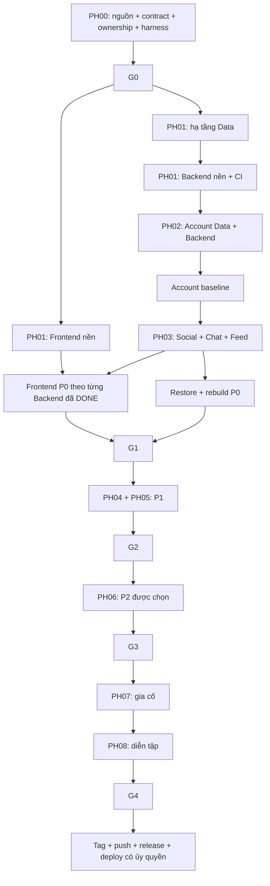

# Roadmap theo phase và ba nhóm triển khai

## Nguyên tắc phân chia

Backend (BE) sở hữu use case/API/event/adapters và phân quyền. Data (DATA) sở hữu công việc thiết kế/lưu trữ/migration/rebuild, nhưng **dữ liệu vẫn do dịch vụ nghiệp vụ sở hữu**; không tạo một “Data Service” chung. Frontend (FE) sở hữu route/component/state/API client/accessibility.

Mỗi task BE là một kết quả nghiệp vụ quan sát được, không chia riêng controller/service/repository. Mỗi nhóm migration có một owner, rồi Backend dùng schema đã kiểm chứng. Mỗi màn hình FE được nối với đúng chức năng đã hoàn thành. Kiểm thử nằm ngay trong bước triển khai; subtask nghiệm thu bổ sung kiểm chứng và bàn giao, không đẩy toàn bộ test về cuối dự án.

## Tổng quan 24 tuần

| Phase | Khung thời gian định hướng | Backend | Data | Frontend | Điều kiện rời phase |
|---|---|---|---|---|---|
| PH00 | Tuần 1 | Khóa API/event/error P0, quyết định mâu thuẫn, harness kiến trúc/toolchain | Ownership, ERD P0, migration rỗng, chiến lược recovery | Phân loại capability P0/P1/P2/gap theo UI final | **G0** có ADR/schema/contract/harness được review |
| PH01 | Tuần 1–2 | BuildingBlocks, Outbox/Inbox, Gateway, auth biên/nội bộ, observability, CI | Compose core, DB/credential riêng, volumes, runner độc quyền | Angular, shell, tokens, guards, HTTP/refresh/SignalR adapters, flags | Mỗi nền tảng có build/test thật và bàn giao |
| PH02 | Tuần 2 | ACC-01/02/03/04/05/07; đăng ký/login/rotation/logout/profile/settings | Account P0, unique/hash/family/version, migration/fixture/race | AUTH-01/02/03 chỉ phần P0 | Account NFR/test cơ sở đạt trước Social |
| PH03 | Tuần 3–8 | SOC-01…08, FED-01…03, CHT-01…08 | Social/Chat/Feed, cursor/projection/replay/cache, restore P0 | Feed/post/profile/settings/chat/noti/system P0 | **G1**, 100% P0 acceptance; lỗi broker/DB, privacy, restore và UI thật |
| PH04 | Tuần 9–12 | Khóa P1; OTP/OAuth/avatar, COM/RTC, MED, video/share/call | Các schema P1 riêng; media metadata/object, membership projection, TTL | Recovery/media/community/RTC/video và phần P1 của màn P0 | Các task P1 có quyền/retry/fallback và evidence |
| PH05 | Tuần 13–14 | ACC-11 và từng downstream; MOD-01…04, owner áp dụng action | Deletion/ack/retention, audit/evidence và restore P1 | Deletion/moderation, tích hợp mở rộng | **G2**; ẩn dữ liệu, purge/cancel, threat cases và khôi phục đạt |
| PH06 | Tuần 15–18 | MKT-01…07, AI-01…06, FED-04/05 theo năng lực | Inventory/payment/history, pgvector/ACL/job, rebuild và xóa P2 | Marketplace/search/AI, transcript inline; chỉ khi contract thống nhất | **G3** cho phạm vi được chọn; fallback/resource/cost đạt |
| PH07 | Tuần 19–22 | Hiệu năng/bảo mật, sửa lỗi, chuẩn hóa hợp đồng/runbook | Empty/upgrade migration, restore/checkpoint/rollback, retention | Regression/a11y/responsive/E2E; đóng gap hoặc giữ flag tắt | Candidate có evidence đủ, không Critical/High |
| PH08 | Tuần 23–24 | Diễn tập từ môi trường sạch, release notes/SBOM/demo | Backup/recovery trước release, kiểm schema/objects | Smoke các luồng và điều hướng trên candidate | **G4**; sau đó thao tác release riêng được ủy quyền |

Các tuần là khung nguồn cho một lập trình viên, không phải cam kết hoàn thành toàn bộ 318 subtask trong 24 tuần. Số subtask gồm kiểm chứng, quyết định và nhiệm vụ có điều kiện. Mỗi tuần cập nhật năng lực thực; khi chậm, cắt P2 theo ADR-010 trước khi giảm kiểm thử, bảo mật, backup hoặc tài liệu.

## Thứ tự bắt buộc

Sơ đồ là cấp phase; `plan.json.depends_on` mới là đồ thị chi tiết. Đứng sau trong file không đồng nghĩa có thể chạy; gate kiểm phụ thuộc chứ không dựa số dòng.

## Lát cắt chuẩn trong một nhóm

1. Khóa hợp đồng/ownership của mức ưu tiên hiện tại.
2. DATA-…-01: ERD, mapping, constraint/index và kế hoạch migration.
3. DATA-…-02: migration, fixture và tương thích từ rỗng/nâng cấp.
4. DATA-…-03: race/query/permission/recovery evidence; bàn giao schema.
5. BE-…-01: triển khai use case đầy đủ cùng kiểm thử phù hợp.
6. BE-…-02: nghiệm thu contract/failure/security và handoff.
7. FE-…-01: route/component/state/adapter/test cho khả năng có contract.
8. FE-…-02: E2E thật + Desktop/Mobile + accessibility, bàn giao.
9. Gate phase: tổng hợp bằng chứng liên dịch vụ và vận hành. Một chuỗi task DONE không tự động làm G1/G2 đạt; vẫn phải chạy test xuyên suốt.

## Ví dụ chuỗi tạo bài viết P0

`PH00-GOV-AUDIT` → hợp đồng/ERD/toolchain → `G0` → DATA-INFRA → BE-PLATFORM/CI → Account baseline → `PH03-DATA-SOC-P0` → SOC-02/SOC-01 → SOC-03 → FED-01/FED-03/FED-02 → FEED → recovery → `G1`.

Ghi bài và Outbox cùng transaction; Kafka ngừng vẫn giữ event. Feed dùng Inbox, version và lọc quyền. UI P0 gửi bài văn bản; media upload/video chỉ mở P1. Quyết định này cần được ghi rõ ở nhiệm vụ khóa contract, không được diễn giải “P0” thành quyền bỏ xác minh MediaReady cho media thực tế.

## Tránh deadlock ưu tiên

- AUTH-03 chứa đăng ký P0 và Google OAuth P1: hoàn thành đăng ký trước, OAuth tắt; mở phần P1 sau G1.
- FEED-02 chứa tạo bài P0 và upload P1: P0 text-only, P1 nối luồng Media khi Ready.
- FEED-03 chứa comment/reaction P0, share/report P1 và transcription P2: các phần có task riêng.
- CHAT-02 giữ chat văn bản P0; lời mời gọi/audio P1; transcript P2.
- SET-02 P0 xử lý phiên/logout, P1 thêm reset mật khẩu. Không yêu cầu OTP P1 để nghiệm thu logout P0.
- ACC-11 P1 phải chốt participant xóa theo release đang bật; dịch vụ Commerce/AI chưa triển khai không làm P1 chờ P2. Khi mở P2 phải backfill deletion ledger và đăng ký participant.
- Chức năng Backend AI-03 là RAG; màn hình AI-03 độc lập đã bị bỏ. Không loại nhầm chức năng RAG khỏi kế hoạch.

## NFR và bằng chứng bắt buộc

| Hạng mục | Ngưỡng nguồn | Nơi chứng minh |
|---|---|---|
| API đọc/ghi | p95 <300ms / <500ms | Account baseline, PH07 load; dataset/cấu hình/tải phải ghi rõ |
| SignalR / RTC | <200ms cùng vùng / join <2s theo điều kiện nguồn | Chat/RTC integration và load |
| Tải cơ sở | 50–100 user mô phỏng | k6 + resource metrics; không suy thành SLA production |
| Khôi phục P0 | RPO <=24h; RTO <=4h | PH03-DATA-RECOVERY, PH07, G4 |
| Media / Commerce | RPO <=24h; RTO <=8h | PH05-DATA-RESTORE, PH06-DATA-LIFECYCLE |
| AI/Search | Dẫn xuất dựng lại; <=24h | PH06 lifecycle/rebuild |
| Xóa tài khoản | Ẩn <=5 phút; grace 30 ngày; PII <=45 ngày nếu không có hold hợp lệ | ACC-11 + tám subtask downstream/đối soát |
| Chất lượng | Acceptance bắt buộc đạt, không Critical/High | Từng subtask nghiệm thu và G0–G4 |

Nguồn định lượng: [NFR](../reference/NFR.md), [OPERATIONS_BASELINE](../reference/OPERATIONS_BASELINE.md), [QUALITY_GATES](../reference/QUALITY_GATES.md). Mọi thay đổi ngưỡng cần quyết định, không sửa để che test thất bại.

## WIP, ước lượng và chia thêm

Mặc định gate local chỉ cho **một subtask IN_PROGRESS/REVIEW**. Khi gặp blocker, ghi lý do, block task rồi chọn một task độc lập đã đủ DoR; không nhảy qua tiền nhiệm của task bị chặn. Việc thực hiện song song sau này phải tuân thủ PARALLEL_AGENT_WORKFLOW và có cơ chế lock/merge thích hợp.

Trước mỗi task, ước lượng theo số kết quả quan sát được. Nếu một subtask cần hơn 1–2 ngày tập trung hoặc có nhiều migration/owner không thể review chung, chia thêm ID mới trước `prepare`; giữ liên kết parent/dependency/acceptance, cập nhật bộ sinh và review đồ thị. Các task nền tảng/hợp đồng thường cần chia theo phát hiện thực tế; không ép thành vài giờ chỉ vì mang tên subtask.

## Khi phải cắt P2

Không sửa state thành DONE và không dùng “skip test” để qua G3. Nhiệm vụ `PH06-BE-CONTRACT-01` ghi quyết định scope: mã nào triển khai, mã nào hoãn, lý do/thời hạn/feature flag và người quyết định. Nếu cắt:

1. Tạo PR tài liệu/kế hoạch sửa danh sách task và dependencies G3/PH07, giữ danh mục chức năng hoãn riêng để truy vết.
2. Nếu task từng có state, giữ hồ sơ lịch sử bằng kế hoạch phiên bản mới; không xóa evidence nhằm che công việc dở dang. Tool hiện từ chối state có ID bị xóa, nên cần di trú state có review hoặc giữ ID đó ngoài dependency release.
3. G3 lúc đó là nghiệm thu phạm vi đã chọn; nếu không có P2, ghi G3 không áp dụng theo quyết định phạm vi, không tuyên bố P2 đã hoàn thành.
4. G4 vẫn yêu cầu P0/P1, recovery/security/docs/demo đủ. Không có cờ `--force` hoặc `--skip-gates` trong gate.

Kế hoạch mặc định hiện liệt kê toàn bộ P2 mong muốn, kể cả OpenSearch tùy chọn; chưa ghi quyết định hoãn thay cho chủ dự án.
